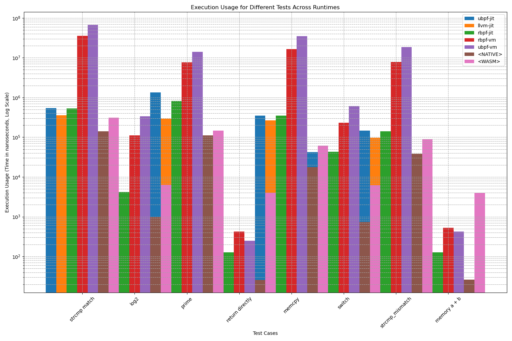
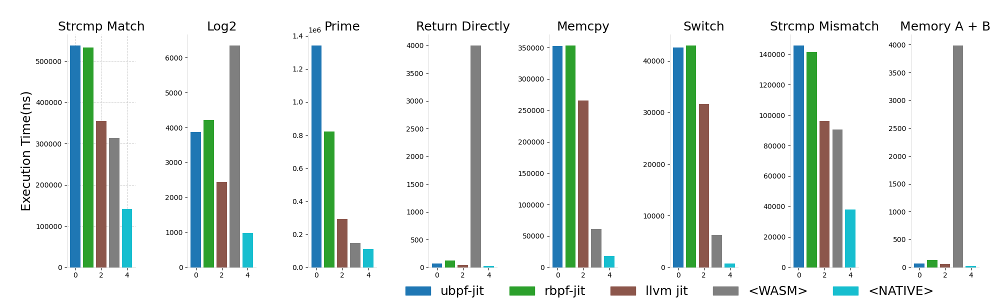

# BPF Benchmark

A comprehensive collection of eBPF benchmarking tools, test suites, and analysis — covering both **userspace eBPF runtimes** and **kernel-side BPF subsystems**.

## Results at a Glance

Execution results for all userspace runtimes (x86_64, log scale):



Execution results for each test with JIT:



Across all tests, the LLVM JIT for [bpftime](https://github.com/eunomia-bpf/bpftime) consistently showcased superior performance, demonstrating high efficiency in integer computations (`log2`), complex mathematical operations (`prime`), and memory operations (`memcpy`, `strcmp`).

## Repository Structure

```
bpf-benchmark/
├── user_bpf_benchmark/       # Userspace eBPF runtime benchmark suite
│   ├── run_benchmark.py      # Main benchmark runner
│   ├── bpf_progs/            # 8 BPF test programs (.bpf.c, .bpf.bin, .native, .wasm)
│   ├── example-output/       # Pre-generated results (JSON + PNG charts)
│   ├── bpftime-cli-rbpf/     # Rust CLI wrapper for rbpf
│   ├── wasm-wasmtime/        # Rust CLI wrapper for Wasmtime
│   ├── llvm-jit              # bpftime LLVM JIT runtime binary
│   ├── ubpf-jit / ubpf-jit-vm
│   ├── rbpf-jit / rbpf-jit-vm
│   └── README.md             # Detailed usage & test results
├── third-party/              # Related external benchmark projects
│   ├── bpf_performance/      # Microsoft: cross-platform BPF helper perf (60+ tests)
│   ├── tail-call-bench/      # Tail call chain cost measurement (0-33 depth)
│   └── bpf-bench/            # Hash function & hashmap perf (cycle-precise)
├── docs/                     # Analysis documents
│   ├── linux-bench-framework-analysis.md   # Linux kernel bench framework & BPF infra
│   └── third-party-analysis.md             # Third-party project analysis
└── README.md                 # This file
```

## Userspace Runtime Benchmark

Compares 7 eBPF runtime implementations across 8 test programs:

| Runtime | Description |
|---------|-------------|
| `llvm-jit` | [bpftime](https://github.com/eunomia-bpf/bpftime) LLVM JIT — consistently fastest |
| `ubpf-jit` / `ubpf-jit-vm` | [ubpf](https://github.com/iovisor/ubpf) with JIT / interpreter |
| `rbpf-jit` / `rbpf-jit-vm` | [rbpf](https://github.com/qmonnet/rbpf) with JIT / interpreter |
| `<NATIVE>` | Compiled C baseline |
| `<WASM>` | Wasmtime WebAssembly |

**Test programs**: simple (baseline), memory_a_plus_b, log2_int, prime, memcpy, strcmp_fail, strcmp_full, switch

See [user_bpf_benchmark/README.md](user_bpf_benchmark/README.md) for full usage and detailed results.

## Linux Kernel BPF Bench Framework

The Linux kernel (`tools/testing/selftests/bpf/`) includes a production-grade benchmark framework with **70+ tests** across 17 benchmark files:

- **Trigger overhead**: kprobe, fentry, uprobe, rawtp (~40 variants)
- **Data structures**: hashmap, bloom filter, LPM trie, local storage
- **Event delivery**: ring buffer, perf buffer
- **Helpers**: bpf_loop, bpf_strncmp
- **Crypto**: AES encrypt/decrypt
- **Network**: sockmap redirection

See [docs/linux-bench-framework-analysis.md](docs/linux-bench-framework-analysis.md) for full architecture analysis.

## Third-Party Projects

| Project | Focus |
|---------|-------|
| [microsoft/bpf_performance](https://github.com/microsoft/bpf_performance) | Cross-platform (Linux+Windows) BPF helper perf, YAML-driven, Grafana |
| [pchaigno/tail-call-bench](https://github.com/pchaigno/tail-call-bench) | BPF tail call chain cost, multi-kernel Ansible+Docker |
| [aspsk/bpf-bench](https://github.com/aspsk/bpf-bench) | Hash function CPU cycles & hashmap lookup, kernel module |

See [docs/third-party-analysis.md](docs/third-party-analysis.md) for detailed analysis.

## Cross-Project Comparison

| Feature | Linux kernel bench | bpf_performance | tail-call-bench | bpf-bench | user_bpf_benchmark |
|---------|-------------------|-----------------|-----------------|-----------|-------------------|
| Platform | Linux | Linux+Windows | Linux | Linux | Linux |
| Config | C code | YAML | Ansible | Shell | Python |
| Focus | All BPF subsystems | BPF helpers & maps | Tail call cost | Hash/hashmap | Userspace runtimes |
| Output | Stdout (ops/sec) | CSV+Grafana | JSON | Text+PNG | JSON+PNG |
| Test count | 70+ | 60+ | 34 depths | ~10 | 8 x 7 runtimes |
