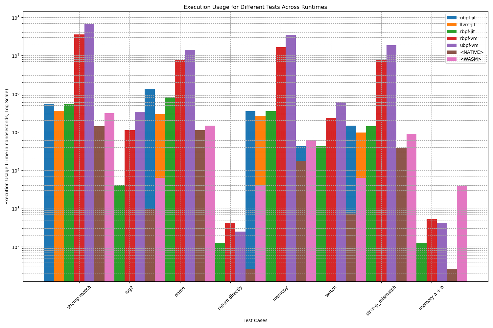
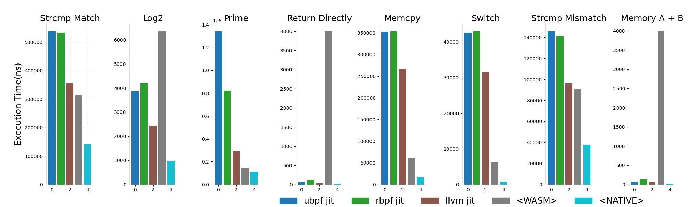
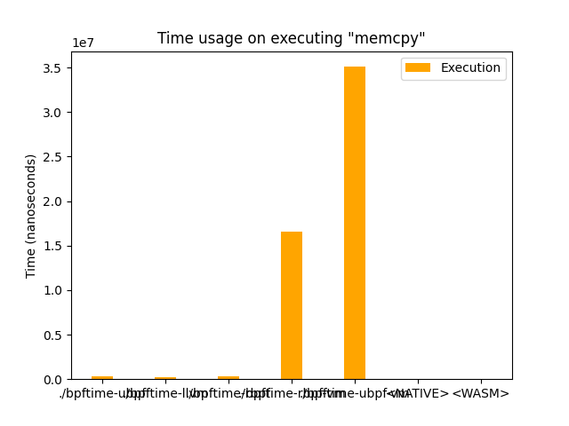

# bpf-benchmark: Userspace eBPF Runtime Benchmarking Test Suite and Results

bpf-benchmark is a return directly test suite designed to benchmark the performance of eBPF runtimes in userspace, and the results of the benchmarking process. The test suite is designed to be easily extensible, allowing users to add their own tests to the suite.

We have compared the performance of the following eBPF runtimes and `native`, `wasmtime`:

- [bpftime](https://github.com/eunomia-bpf/bpftime): a new eBPF runtime with interpreter and JIT support based on LLVM
- [ubpf](https://github.com/iovisor/ubpf): an eBPF runtime in C with JIT support in x86 and amr64
- [rbpf](https://github.com/qmonnet/rbpf): Rust virtual machine and JIT compiler for eBPF programs

The results of the benchmarking process are included in this repository. See this README for details:

1. execution results for all in x86_64, using log scale

    

2. execution results for each test with JIT

    

Across all tests, the LLVM JIT for [bpftime](https://github.com/eunomia-bpf/bpftime) consistently showcased superior performance. Both demonstrated high efficiency in integer computations (as seen in `log2`), complex mathematical operations (as observed in `prime`), and memory operations (evident in `memcpy` and `strcmp`). While they lead in performance across the board, each runtime exhibits unique strengths and weaknesses. These insights can be invaluable for users when choosing the most appropriate runtime for their specific use-cases.

For more details, please refer to [Summary](#summary).

## Usage

To effectively utilize BPF-Benchmark, follow these steps:

1. **Install Dependencies**: Ensure that `clang` and `llvm` are installed on your system. If you are using `Debian` or `Ubuntu`, you can easily install these packages by executing the command: `sudo apt install clang llvm`.
2. **Acquire Runtimes**: BPF-Benchmark includes three pre-packaged runtimes: `llvm-jit`, `ebpf`, and `ubpf`. If the provided executables are incompatible with your system, you have the option to manually build these runtimes.
3. **Install Required Dependencies**: The toolkit relies on various dependencies, all of which are listed in the `requirements.txt` file. Install these dependencies to ensure smooth functionality.
4. **Compile BPF Programs**: Execute the command `make -C bpf_progs` to compile the BPF programs.
5. **Run Benchmark**: Launch the benchmarking process by running the `run_benchmark.py` script.
6. **View Results**: The results of the benchmark can be observed directly in the console, or you can find graphical representations in the `output` folder. Additionally, raw data in JSON format is stored in `output/data.json`.

## Adding a New Test

To include a new test within BPF-Benchmark, adhere to these guidelines:

1. **Create BPF Program**: Craft an eBPF program and name it as `XXX.bpf.c`, placing it in the `bpf_progs` directory. The program should contain a function named `unsigned long long bpf_main(void* mem)` as its entry point. Any other functions must be inlined using the `__always_inline` attribute.
2. **Optional Memory File**: You have the choice to create a file named `XXX.mem` if your eBPF program requires specific memory input during execution.

## Included Test Cases

BPF-Benchmark currently incorporates the following BPF code test cases:

- `log2.bpf.c`
- `memcpy.bpf.c`
- `native_wrapper.c`
- `prime.bpf.c`
- `return directly.bpf.c`
- `strcmp_mismatch.bpf.c`
- `strcmp match.bpf.c`
- `switch.bpf.c`

Select and execute the tests ending with the `.bpf` extension.

## Supported Runtimes

BPF-Benchmark facilitates performance comparison across the following runtimes:

- `bpftime-llvm`
- `bpftime-rbpf`
- `bpftime-ubpf`

These runtimes are involved in the benchmarking process to evaluate their relative efficiencies.

Enhance your BPF runtime evaluation experience using BPF-Benchmark! If you encounter any issues or need further assistance, feel free to reach out to us. Your feedback is invaluable in refining this toolkit.

## Test Results

Date: 2023.9.10

For the raw data of tests, please refer to: [example-output/data.json](example-output/data.json)

### Test Environment

- Linux mnfe-pve 6.2.16-12-pve #1 SMP PREEMPT_DYNAMIC PMX 6.2.16-12 (2023-09-04T13:21Z) x86_64 GNU/Linux
- Intel Xeon E5-2697 v2 (48) @ 3.500GH
- Debian GNU/Linux 12 (bookworm)

## Runtimes Used

- bpftime-llvm: eBPF runtime based on LLVM JIT included in bpftime
- bpftime-ubpf: eBPF runtime with JIT support based on ubpf
- bpftime-rbpf: eBPF runtime with JIT support based on rbpf
- Native program

## Test Details

### log2

- Calculated the logarithm to the base 2 for 8,192 64-bit integers. This primarily tests the integer computation performance of the runtime. This algorithm is used in some examples provided by bcc.

In this test, the efficiencies of LLVM JIT, ubpf, and native are close, with both being faster than ubpf.

### memcpy

- Implemented a naive memory copy, copying 1MB of memory from one location to another within eBPF memory. This is to test the runtime's memory read and write performance.

### prime

- A return directly brute force prime number sieve, counting the number of prime numbers between 1 and \(10^4\). This tests the runtime's conditional branching and complex operations (division) performance.

In this test, the speed of LLVM JIT and native are comparable, both significantly faster than ubpf and rbpf.

### strcmp_{fail, full}

- A return directly implementation of strcmp, representing scenarios where the comparison fails midway and where the two strings are an exact match. This tests the runtime's memory read and conditional branching performance.

As can be observed, the efficiencies of LLVM JIT, native, and ubpf are close, and all are significantly faster than rbpf.

### switch

- A basic implementation of complex conditional jumps, testing the runtime's complex switch jumps and memory access performance. The program reads values from memory and uses a switch for redirection.

From the results, it's evident that the efficiency of llvm jit is superior to ubpf. However, the native's efficiency is far superior to LLVM JIT, possibly related to the ability to generate jump tables in native. rbpf has the lowest efficiency.

## Summary

The benchmark tests were designed to evaluate different eBPF runtimes against native programs across a variety of computational challenges.

1. **Performance Leaders**: Across all tests, the LLVM JIT and native runtimes consistently showcased superior performance. Both demonstrated high efficiency in integer computations (as seen in `log2`), complex mathematical operations (as observed in `prime`), and memory operations (evident in `memcpy` and `strcmp`).
2. **Close Competitors**: The ubpf runtime, while not as efficient as LLVM JIT or native, often came close, especially in tests like `log2` and `strcmp`. This suggests that for certain use-cases, ubpf could be a viable alternative.
3. **Room for Improvement**: rbpf, unfortunately, lagged behind in most tests, showing the need for optimizations and improvements. Its performance was notably lower in tests like `strcmp`, `prime`, and `switch`.
4. **Complex Operations Insight**: The `prime` test revealed that when dealing with complex operations like divisions and conditional branching, both LLVM JIT and native runtimes are significantly more efficient than ubpf and rbpf.
5. **Memory Access & Branching**: The tests `strcmp` and `switch` highlighted the strengths of LLVM JIT, native, and ubpf in memory access and conditional branching. rbpf's performance in these areas, however, was found wanting.
6. **Switching Mechanisms**: The `switch` test provided insights into the efficiencies of different jump mechanisms. Native's ability to generate jump tables might account for its superior performance in this test.

In conclusion, while LLVM JIT and native runtimes lead in performance across the board, each runtime exhibits unique strengths and weaknesses. These insights can be invaluable for users when choosing the most appropriate runtime for their specific use-cases.
