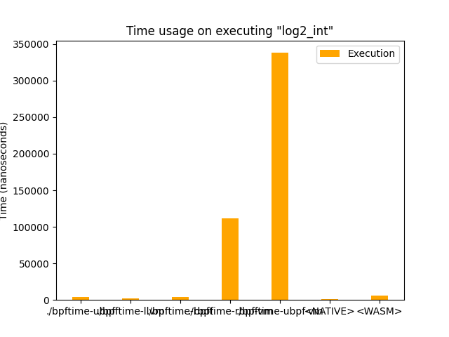
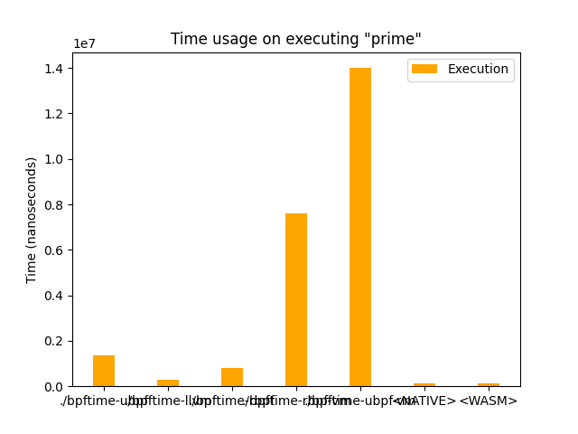
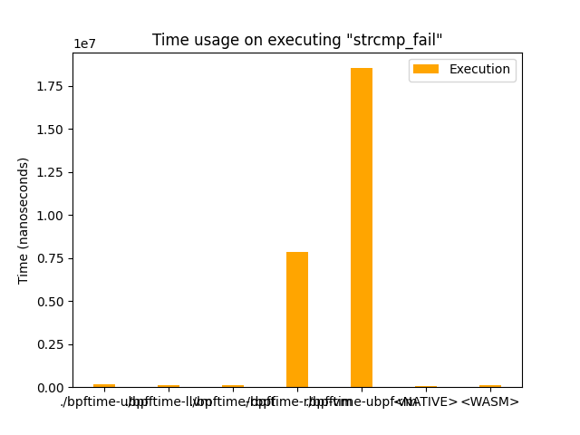
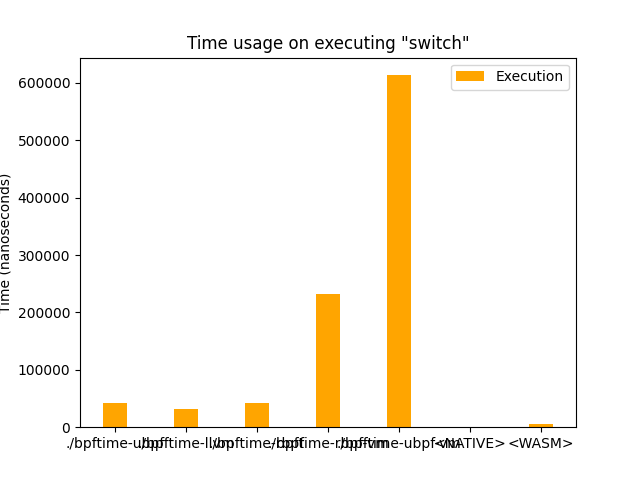

# 测试结果
## 测试环境
- Linux mnfe-pve 6.2.16-12-pve #1 SMP PREEMPT_DYNAMIC PMX 6.2.16-12 (2023-09-04T13:21Z) x86_64 GNU/Linux
- Intel Xeon E5-2697 v2 (48) @ 3.500GH
- Debian GNU/Linux 12 (bookworm)
## 所使用的运行时
- bpftime-llvm，bpftime中所包含的基于LLVM JIT的ebpf运行时
- bpftime-ubpf，基于ubpf的支持JIT的ebpf运行时
- bpftime-rbpf，基于rbpf的支持JIT的ebpf运行时
- native程序
## 测试内容

### log2_int

- 对8192个64位整数计算以2为底的对数。主要用于测试运行时的整数计算性能。此算法在一些bcc提供的例子中用到。

在这个测试中，LLVM JIT、ubpf、native效率接近，且都比ubpf要快。

### memcpy
- 实现朴素的内存拷贝，在eBPF内存中从一处拷贝1MB的内存到另一处，用以测试运行时的内存读写性能。

### prime
- 一个简单的暴力知数筛法，统计1到$10^4$之间的素数个数，用以测试运行时的条件分支和复杂运算（除法）性能。

- 在这个测试上，LLVM JIT和native速度相当，都远比ubpf和rbpf快。

### strcmp_{fail, full}

- 简单实现的strcmp，分别对应中途比较失败和两个字符串完全匹配的情况。用以测试运行时的内存读取和条件分支的性能。

- 可以看到，LLVM JIT、native、ubpf效率接近，且远快于rbpf。

### switch

- 简单实现的复杂条件跳转，用以测试运行时的复杂switch跳转和内存访问性能。程序会从内存中读取数值并使用switch进行跳转。

- 可以看到，llvm jit效率优于ubpf。但native效率远优于LLVM JIT。可能与native下可以生成跳转表有关。rbpf效率最低。
