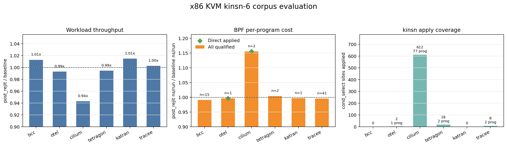

# Kinsn Corpus Evaluation

Last updated: 2026-05-31

This is the paper-facing evaluation note for kinsn-based ReJIT on the x86 KVM
corpus. The benchmark framework records raw counters and workload payloads
only; all ratios, tables, figures, and interpretation below are post-hoc
analysis.

## Paper Framing

Kinsn replaces selected BPF instruction patterns with calls to in-kernel
kfunc-like instruction modules. The current x86 KVM corpus run evaluates three
questions:

- **RQ1 Correctness:** can the kinsn-enabled runtime load and run all six real
  corpus apps through their normal app startup paths?
- **RQ2 Apply coverage:** which kinsn-class passes actually produce real kinsn
  calls on the x86 corpus?
- **RQ3 Performance:** what happens to workload throughput and BPF per-program
  `ns/run` after kinsn ReJIT?

Headline result: **the x86 KVM `kinsn-6` corpus completed all six apps with
status `ok`, but performance is neutral/slightly negative overall.** The
workload post/baseline geomean is `0.993x`, the all-qualified BPF per-program
geomean is `0.999x`, and the directly self-applied qualified rows are `1.099x`
post/baseline cost because Cilium's measured direct rows regressed.

The narrow claim supported by this run is correctness and real apply on x86:
`cond_select` applied `640` sites across `82` programs with zero loadtime report
errors. The run does **not** support claiming an x86 kinsn speedup yet.

## Experimental Setup

The authoritative run used the repository `make` entrypoint on x86 KVM:

```sh
BPFREJIT_BENCH_PASSES=kinsn-6 SAMPLES=3 WORKLOAD_DURATION=180 TIMEOUT=7200 make corpus
```

Artifact:
`corpus/results/x86_kvm_corpus_20260531_093716_580979`

The enabled pass list was `rotate, cond_select, extract, endian_fusion,
bulk_memory, prefetch`. The corpus covers the same six apps as
`docs/eval_native.md`: `bcc/set`, `otelcol-ebpf-profiler/profiling`,
`cilium/agent`, `tetragon/observer`, `katran`, and `tracee/monitor`. Each app
records three baseline workload samples and three post-ReJIT workload samples,
each with `WORKLOAD_DURATION=180`.

The x86 wiring tested here is the real runtime path: app-level loaders start
the upstream apps, the shim probes kinsn targets into `/tmp/target.json`, and
`bpfopt --pass <name> --target ${TARGET}` emits real
`BPF_PSEUDO_KINSN_CALL` relocations when a pass applies. No app is loaded by
the framework via direct `.bpf.o` loading.

## Methodology

Workload throughput is computed from raw per-app workload payloads using the
same parser style as `docs/eval_native.md`: `stress-ng` real-time bogo ops/s,
OTEL worker `ops / elapsed_s`, and kernel `pktgen` pps. Units are app-local, so
only post/baseline ratios within the same app are meaningful.

BPF per-program cost uses the kinsn paper-grade method:

```text
baseline_avg_ns_per_run = baseline_run_time_ns_delta / baseline_run_cnt_delta
post_avg_ns_per_run = post_run_time_ns_delta / post_run_cnt_delta
ratio = post_avg_ns_per_run / baseline_avg_ns_per_run
```

Rows with `min(baseline_runs, post_runs) < 100` are dropped. Programs are
paired by `(name, type, occurrence index)` after sorting each phase by program
id. The reported BPF metric is the per-program geomean of retained ratios;
lower than `1.0x` is faster after kinsn.

The "direct applied" BPF subset is a conservative automated subset: retained
counter rows whose truncated `bpftool` name matches a program with
`sites_applied > 0`. It does not fully implement the affected-population rule
for tail-call descendants. Tail-called programs can report zero own
`run_cnt_delta`; their cost is charged to the directly attached caller.

## Main Results



*Figure 1: x86 KVM `kinsn-6` corpus result. Workload throughput uses
post/baseline ratios, higher is better. BPF cost uses per-program geomean
post/baseline `ns/run`, lower is better. Apply coverage shows real
`cond_select` kinsn sites; the other five enabled kinsn-class passes had zero
sites on this corpus.*

Correctness and apply coverage:

| App | status | loadtime report errors | `cond_select` applied programs | `cond_select` sites |
| --- | --- | ---: | ---: | ---: |
| `bcc` | `ok` | 0 | 0 | 0 |
| `otel` | `ok` | 0 | 1 | 2 |
| `cilium` | `ok` | 0 | 77 | 612 |
| `tetragon` | `ok` | 0 | 2 | 18 |
| `katran` | `ok` | 0 | 0 | 0 |
| `tracee` | `ok` | 0 | 2 | 8 |

Workload throughput:

| App | baseline throughput | post-ReJIT throughput | post/baseline | sample ratios |
| --- | ---: | ---: | ---: | --- |
| `bcc` | 547005.59 | 553949.02 | 1.013x | 1.013x, 1.014x, 1.000x |
| `otel` | 109398699.38 | 108633164.55 | 0.993x | 0.997x, 0.998x, 0.990x |
| `cilium` | 1571092.00 | 1481554.00 | 0.943x | 0.969x, 0.922x, 0.943x |
| `tetragon` | 336432.36 | 334562.69 | 0.994x | 0.994x, 0.994x, 0.988x |
| `katran` | 2486420.00 | 2523198.00 | 1.015x | 0.995x, 1.022x, 1.015x |
| `tracee` | 393437.00 | 394469.94 | 1.003x | 1.002x, 0.997x, 1.010x |

The unweighted geomean across the six per-app workload ratios is `0.993x`.

BPF per-program counters:

| App | retained rows | all-qualified geomean | wins/losses/ties | direct applied rows | direct applied geomean |
| --- | ---: | ---: | ---: | ---: | ---: |
| `bcc` | 15 | 0.991x | 12/3/0 | 0 | n/a |
| `otel` | 1 | 0.996x | 1/0/0 | 1 | 0.996x |
| `cilium` | 2 | 1.155x | 0/2/0 | 2 | 1.155x |
| `tetragon` | 2 | 1.004x | 1/1/0 | 0 | n/a |
| `katran` | 1 | 0.997x | 1/0/0 | 0 | n/a |
| `tracee` | 41 | 0.995x | 23/18/0 | 0 | n/a |

Direct self-applied retained rows:

| App | program | type | baseline ns/run | post ns/run | post/baseline |
| --- | --- | --- | ---: | ---: | ---: |
| `otel` | `native_tracer_e` | `perf_event` | 4068.92 | 4052.18 | 0.996x |
| `cilium` | `cil_from_contai` | `sched_cls` | 475.45 | 542.71 | 1.141x |
| `cilium` | `cil_from_contai` | `sched_cls` | 471.22 | 550.71 | 1.169x |

The global all-qualified BPF per-program geomean is `0.999x` over `62`
retained rows. The direct self-applied geomean is `1.099x` over `3` retained
rows.

## RQ Answers

**RQ1 Correctness.** The x86 KVM `kinsn-6` corpus completed all six apps with
`status=ok`, empty app error strings, three measured baseline samples, and
three measured post-ReJIT samples. A final artifact scan found no
`loadtime optimization failed`, verifier probe failure, BPF load failure,
panic, phase error, or invalid-memory verifier signature in `details/`.

**RQ2 Apply coverage.** Only `cond_select` produced real x86 kinsn calls in
this corpus. It applied in OTEL, Cilium, Tetragon, and Tracee. The enabled
`rotate`, `extract`, `endian_fusion`, `bulk_memory`, and `prefetch` passes all
completed as valid no-ops on this corpus. This is important: older smoke data
before the target relocation fix counted generic LLVM round-trip changes as
apply; this run counts only actual kinsn calls.

**RQ3 Performance.** The current x86 kinsn result is effectively neutral on
BPF counters and slightly negative at workload level. The main workload loss is
Cilium (`0.943x`), matching the only app with many directly measured applied
rows (`1.155x` BPF cost). OTEL's directly applied `native_tracer_e` row is
neutral/slightly faster (`0.996x`). BCC and Katran are no-apply contexts and
serve mainly as no-op stability checks.

## Discussion

The x86 connection is now mechanically real: `target.json` is consumed by
`bpfopt`, external `bpf_x86_*` symbols are lowered to
`BPF_PSEUDO_KINSN_CALL`, and the post-ReJIT apps run to completion. The result
is good enough to say "x86 kinsn can run on KVM corpus apps", but not good
enough to claim a speedup.

The performance result points at Cilium first. Cilium has `612` applied
`cond_select` sites, but the two retained directly attached `cil_from_contai`
rows are slower after ReJIT and workload throughput drops to `0.943x`. The
next investigation should inspect the generated x86 kinsn call sequences for
those two programs, compare code size and branch/uop structure against the
baseline JIT, and decide whether x86 `cond_select` should be policy-disabled or
made more selective.

Tetragon and Tracee apply sites exist but do not show up in the conservative
direct-self-applied retained set. This is expected for tail-call and low-run
programs: target programs may report zero own `run_cnt_delta`, and their cost
can be charged to the caller. The current document therefore reports both the
all-qualified corpus context and the direct-self-applied subset, without
claiming that either is the complete affected population.

The x86 `lea` selector is not part of this `kinsn-6` policy and remains
disabled on x86 because the current proof/selector path produced verifier
pointer-semantics failures during smoke testing. Arm64 has additional kinsn
coverage, including `ccmp`; this note only evaluates x86 KVM.

## Appendix

Post-hoc analysis script:
`docs/tmp/kinsn_eval_20260531.py`

Generated summary:
`docs/tmp/kinsn_eval_20260531_summary.md`

Generated figure:
`docs/figures/eval-kinsn-corpus-20260531.png`

Authoritative artifact:
`corpus/results/x86_kvm_corpus_20260531_093716_580979`

Reproduction command:

```sh
BPFREJIT_BENCH_PASSES=kinsn-6 SAMPLES=3 WORKLOAD_DURATION=180 TIMEOUT=7200 make corpus
python3 docs/tmp/kinsn_eval_20260531.py
```
