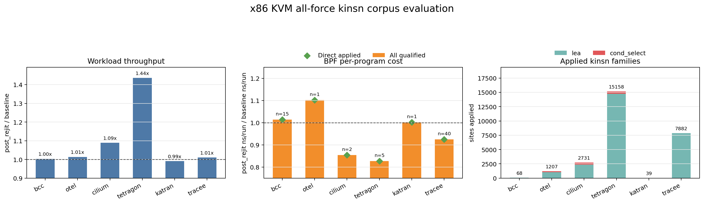
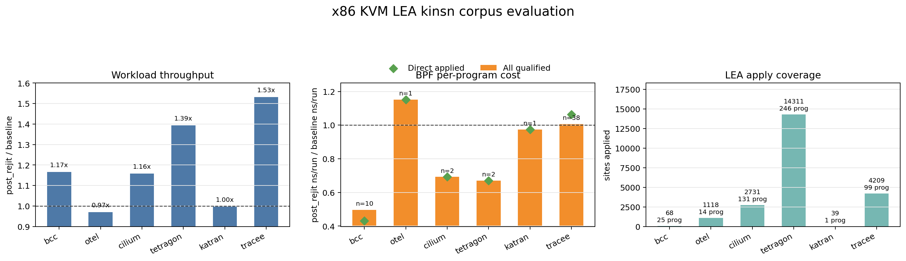

# Kinsn Corpus Evaluation

Last updated: 2026-06-03

This is the paper-facing evaluation note for kinsn-based ReJIT on the x86 KVM
corpus. The benchmark framework records raw counters and workload payloads
only; all ratios, tables, figures, and interpretation below are post-hoc
analysis.

## Current All-Force Result

The current authoritative x86 KVM kinsn corpus result is the all-force run
collected after making the backend default apply every currently enabled x86
kinsn candidate. This SAMPLES=3 artifact was collected before the neutral
`kinsn` pass alias existed, so its metadata shows `rotate` as the single
bpfopt pass entrypoint; the backend default was already `all=force`, so the
loadtime reports count all-force kinsn sites, not rotate-only sites. The
current equivalent entrypoint is `BPFREJIT_BENCH_PASSES=kinsn`, verified by
the smoke artifact below with identical apply coverage. No workload override,
app disable, program filter, or YAML disable was used.

Collection command for the authoritative artifact:

```sh
JOBS=12 IMAGE_BUILD_JOBS=12 BPFREJIT_BENCH_PASSES=rotate SAMPLES=3 WORKLOAD_DURATION=30 KEEP_WORKDIRS=1 TIMEOUT=7200 make corpus
```

Current equivalent command after adding the neutral `kinsn` pass alias:

```sh
JOBS=12 IMAGE_BUILD_JOBS=12 BPFREJIT_BENCH_PASSES=kinsn SAMPLES=3 WORKLOAD_DURATION=30 KEEP_WORKDIRS=1 TIMEOUT=7200 make corpus
```

Artifact:
`corpus/results/x86_kvm_corpus_20260603_175429_964295`

Smoke artifact using the `kinsn` alias:
`corpus/results/x86_kvm_corpus_20260603_185015_116803`

Post-hoc script:
`docs/tmp/kinsn_all_force_eval_20260603.py`

Headline result: **the x86 KVM all-force kinsn corpus completed all six apps
with `status=ok`, applied `27,085` kinsn sites across `631` applied loadtime
rows, and improved both workload throughput and BPF counters in this
SAMPLES=3 run.** The workload post/baseline geomean is `1.081x`, the
all-qualified BPF per-program cost geomean is `0.938x`, and the direct
self-applied cost geomean is `0.933x`. This supersedes the earlier same-day
all-force run at `corpus/results/x86_kvm_corpus_20260603_162736_632388`
(`0.965x` all-qualified, `0.963x` direct) after tightening x86 JIT
callee-saved register accounting around kinsn calls.



*Figure 1: x86 KVM all-force kinsn corpus result. Workload throughput uses
post/baseline ratios, higher is better. BPF cost uses per-program geomean
post/baseline `ns/run`, lower is better. Apply coverage is decoded post-hoc
from retained loadtime workdir bytecode and split by kinsn family.*

Correctness and apply coverage:

| App | status | reports | applied programs | sites | skipped | errors |
| --- | --- | ---: | ---: | ---: | ---: | ---: |
| `bcc` | `ok` | 77 | 25 | 68 | 0 | 0 |
| `otel` | `ok` | 17 | 15 | 1207 | 0 | 0 |
| `cilium` | `ok` | 169 | 131 | 2731 | 0 | 0 |
| `tetragon` | `ok` | 308 | 290 | 15158 | 0 | 0 |
| `katran` | `ok` | 6 | 1 | 39 | 0 | 0 |
| `tracee` | `ok` | 182 | 169 | 7882 | 0 | 0 |
| `total` | `ok` | 759 | 631 | 27085 | 0 | 0 |

Applied kinsn families:

| App | LEA | cond_select | rotate | extract | endian_fusion | bulk_memory | prefetch | other | total |
| --- | ---: | ---: | ---: | ---: | ---: | ---: | ---: | ---: | ---: |
| `bcc` | 68 | 0 | 0 | 0 | 0 | 0 | 0 | 0 | 68 |
| `otel` | 1041 | 166 | 0 | 0 | 0 | 0 | 0 | 0 | 1207 |
| `cilium` | 2346 | 385 | 0 | 0 | 0 | 0 | 0 | 0 | 2731 |
| `tetragon` | 14744 | 414 | 0 | 0 | 0 | 0 | 0 | 0 | 15158 |
| `katran` | 39 | 0 | 0 | 0 | 0 | 0 | 0 | 0 | 39 |
| `tracee` | 7859 | 23 | 0 | 0 | 0 | 0 | 0 | 0 | 7882 |
| `total` | 26097 | 988 | 0 | 0 | 0 | 0 | 0 | 0 | 27085 |

The family table is decoded from the final `input.bin` retained by each
applied loadtime workdir. The decoded kinsn call count is required to match
the loadtime report's `sites_applied` count. The current all-force corpus
therefore proves broad LEA coverage plus real cond_select coverage, while
rotate/extract/endian_fusion/bulk_memory/prefetch had zero final applied sites
in this workload corpus.

Workload throughput:

| App | baseline throughput | post-ReJIT throughput | post/baseline | sample ratios |
| --- | ---: | ---: | ---: | --- |
| `bcc` | 550764.13 | 552568.13 | 1.003x | 1.001x, 1.027x, 0.998x |
| `otel` | 106252302.38 | 107717477.91 | 1.014x | 1.018x, 0.991x, 0.993x |
| `cilium` | 1431915.00 | 1559427.00 | 1.089x | 1.001x, 1.089x, 1.100x |
| `tetragon` | 333005.80 | 478208.91 | 1.436x | 2.217x, 1.452x, 1.321x |
| `katran` | 2490402.00 | 2468118.00 | 0.991x | 0.980x, 0.991x, 1.000x |
| `tracee` | 387374.92 | 391424.61 | 1.010x | 1.013x, 1.007x, 1.017x |

BPF per-program counters:

| App | retained rows | all-qualified geomean | wins/losses/ties | direct applied rows | direct applied geomean |
| --- | ---: | ---: | ---: | ---: | ---: |
| `bcc` | 15 | 1.014x | 8/7/0 | 11 | 1.014x |
| `otel` | 1 | 1.102x | 0/1/0 | 1 | 1.102x |
| `cilium` | 2 | 0.854x | 2/0/0 | 2 | 0.854x |
| `tetragon` | 5 | 0.827x | 5/0/0 | 5 | 0.827x |
| `katran` | 1 | 1.002x | 0/1/0 | 1 | 1.002x |
| `tracee` | 40 | 0.925x | 35/5/0 | 40 | 0.925x |

The global all-qualified BPF per-program geomean is `0.938x` over `64`
retained rows. The direct self-applied geomean is `0.933x` over `60` retained
rows. The full generated direct-row table is preserved in
`docs/tmp/kinsn_all_force_eval_20260603_summary.md`.

Interpretation caveats:

- Raw bpfopt loadtime reports only provide total matched/applied site counts;
  the family table and Figure 1 split families by decoding retained final
  bytecode post-hoc. Under this corpus, all-force actual apply coverage is LEA
  plus cond_select only.
- OTEL still regresses in the retained direct BPF counter subset (`1.102x`
  cost). BCC is now close to neutral (`1.014x`) after avoiding unconditional
  x86 callee-saved BPF register saves around every kinsn call. Remaining costs
  are the kfunc/call path, normal BPF prologue accounting, and native-body
  clobbers visible through proof/shadow-slot usage.
- Katran reports large raw pktgen `errors:` counts in workload payloads, as in
  earlier kinsn runs; the app and ReJIT path still completed with `status=ok`.
- Tetragon's workload samples are noisy (`2.217x`, `1.452x`, `1.321x`) but all
  three post/baseline pairs are positive.

## Current RQ Answers

**RQ1 Correctness.** The all-force run completed all six x86 KVM corpus apps
with `status=ok`, empty app error strings, three measured baseline workloads,
and three measured post-ReJIT workloads per app. A verifier-log grep over
retained loadtime workdirs found no invalid/unbounded/out-of-range verifier
failure signatures.

**RQ2 Apply coverage.** All-force kinsn applies broadly on x86: `27,085`
sites across `631` applied loadtime rows. The largest site populations are
Tetragon (`15,158`), Tracee (`7,882`), Cilium (`2,731`), and OTEL (`1,207`).
No site was skipped in the loadtime reports. Post-hoc decoded family coverage
is `26,097` LEA sites and `988` cond_select sites; rotate, extract,
endian_fusion, bulk_memory, and prefetch have zero final applied sites in this
corpus artifact.

**RQ3 Performance.** In this run, workload throughput improves by `1.081x`
unweighted geomean across the six app workloads. BPF-counter cost improves by
per-program geomean (`0.938x` all-qualified, `0.933x` direct self-applied),
driven by Cilium, Tetragon, and Tracee. OTEL remains the clear retained
counter regression; BCC and Katran are near neutral and are secondary
optimization targets.

## Previous LEA Result, 2026-06-02

The previous x86 KVM kinsn corpus result was the LEA run collected
after enabling x86 LEA in the bpfopt policy path and removing the wrapper-side
LLVM selector gate. It uses the same fixed corpus workloads as the smoke runs;
only the pass list is narrowed to `lea`.

Command:

```sh
BPFREJIT_BENCH_PASSES=lea SAMPLES=1 WORKLOAD_DURATION=30 TIMEOUT=7200 make corpus
```

Artifact:
`corpus/results/x86_kvm_corpus_20260602_141656_778399`

Post-hoc script:
`docs/tmp/kinsn_eval_20260602.py`

Headline result: **the x86 KVM LEA corpus completed all six apps with
`status=ok`, applied `22,476` LEA sites across `516` loadtime rows, and
showed positive workload and BPF-counter results in this SAMPLES=1 run.** The
workload post/baseline geomean is `1.187x`, the all-qualified BPF
per-program cost geomean is `0.860x`, and the direct self-applied cost
geomean is `0.873x`.



*Figure 2: x86 KVM LEA corpus result. Workload throughput uses
post/baseline ratios, higher is better. BPF cost uses per-program geomean
post/baseline `ns/run`, lower is better. Direct-applied points are a
conservative self-applied subset, not the full tail-call affected population.*

Correctness and apply coverage:

| App | status | reports | applied programs | LEA sites | errors |
| --- | --- | ---: | ---: | ---: | ---: |
| `bcc` | `ok` | 77 | 25 | 68 | 0 |
| `otel` | `ok` | 17 | 14 | 1118 | 0 |
| `cilium` | `ok` | 169 | 131 | 2731 | 0 |
| `tetragon` | `ok` | 309 | 246 | 14311 | 0 |
| `katran` | `ok` | 6 | 1 | 39 | 0 |
| `tracee` | `ok` | 182 | 99 | 4209 | 0 |

Workload throughput:

| App | baseline throughput | post-ReJIT throughput | post/baseline |
| --- | ---: | ---: | ---: |
| `bcc` | 548511.86 | 639990.43 | 1.167x |
| `otel` | 110111743.37 | 106790809.15 | 0.970x |
| `cilium` | 1397943.00 | 1620095.00 | 1.159x |
| `tetragon` | 350879.10 | 489226.32 | 1.394x |
| `katran` | 2458849.00 | 2452553.00 | 0.997x |
| `tracee` | 397762.79 | 609160.97 | 1.531x |

BPF per-program counters:

| App | retained rows | all-qualified geomean | wins/losses/ties | direct applied rows | direct applied geomean |
| --- | ---: | ---: | ---: | ---: | ---: |
| `bcc` | 10 | 0.497x | 9/1/0 | 7 | 0.432x |
| `otel` | 1 | 1.152x | 0/1/0 | 1 | 1.152x |
| `cilium` | 2 | 0.692x | 2/0/0 | 2 | 0.692x |
| `tetragon` | 2 | 0.670x | 2/0/0 | 2 | 0.670x |
| `katran` | 1 | 0.973x | 1/0/0 | 1 | 0.973x |
| `tracee` | 38 | 1.007x | 19/19/0 | 28 | 1.064x |

The global all-qualified BPF per-program geomean is `0.860x` over `54`
retained rows. The direct self-applied geomean is `0.873x` over `41` retained
rows. The full generated direct-row table is preserved in
`docs/tmp/kinsn_eval_20260602_summary.md`.

Interpretation caveats:

- This is `SAMPLES=1`, which is acceptable for paper-grade BPF counters after
  the `min_runs >= 100` filter, but workload ratios should still be treated as
  a one-pass measurement rather than a variance study.
- Direct self-applied rows are a lower bound. Tail-called programs can report
  zero own `run_cnt_delta`; their savings are charged to the directly attached
  caller.
- Tracee has one raw BPF counter caveat: one `vfs_write_magic` row reports
  `36.27 ns/run -> 1.1855e12 ns/run`. The headline geomean above does not
  drop it; the value is recorded in the generated summary rather than silently
  filtered.
- Katran reports large raw pktgen `errors:` counts in the workload payloads,
  but the app completed with `status=ok`; these are workload-side raw fields,
  not loadtime or ReJIT errors.

## LEA RQ Answers

**RQ1 Correctness.** The LEA run completed all six x86 KVM corpus apps with
`status=ok`, empty app error strings, one measured baseline workload and one
measured post-ReJIT workload per app. Loadtime reports show zero bpfopt/report
errors for every app.

**RQ2 Apply coverage.** LEA now applies broadly on x86: `22,476` sites across
six apps. The largest site populations are Tetragon (`14,311`), Tracee
(`4,209`), Cilium (`2,731`), and OTEL (`1,118`). This is no longer a policy
no-op; the enabled LEA path reaches real corpus programs.

**RQ3 Performance.** In this run, workload throughput is positive on four apps
and neutral/slightly negative on two, with `1.187x` unweighted geomean.
BPF-counter cost is positive in five of six app populations by per-program
geomean; OTEL is the clear counter regression (`1.152x`) and Tracee is near
neutral all-qualified (`1.007x`) despite many direct self-applied wins.

## Methodology

Workload throughput is computed from raw per-app workload payloads using the
same parser style as `docs/eval_native.md`: `stress-ng` real-time bogo ops/s,
OTEL worker `ops / elapsed_s`, and kernel `pktgen` pps. Units are app-local,
so only post/baseline ratios within the same app are meaningful.

BPF per-program cost uses the kinsn paper-grade method:

```text
baseline_avg_ns_per_run = baseline_run_time_ns_delta / baseline_run_cnt_delta
post_avg_ns_per_run = post_run_time_ns_delta / post_run_cnt_delta
ratio = post_avg_ns_per_run / baseline_avg_ns_per_run
```

Rows with `min(baseline_runs, post_runs) < 100` are dropped. Programs are
paired by `(name, type, occurrence index)` after grouping each phase by BPF
program name and type. The reported BPF metric is the per-program geomean of
retained ratios; lower than `1.0x` is faster after kinsn.

The "direct applied" BPF subset is a conservative automated subset: retained
counter rows whose truncated `bpftool` name matches a program with
`sites_applied > 0`. It does not fully implement the affected-population rule
for tail-call descendants.

## Previous kinsn-6 Result, 2026-05-31

Kinsn replaces selected BPF instruction patterns with calls to in-kernel
kfunc-like instruction modules. The previous x86 KVM `kinsn-6` corpus run
evaluated three questions:

- **RQ1 Correctness:** can the kinsn-enabled runtime load and run all six real
  corpus apps through their normal app startup paths?
- **RQ2 Apply coverage:** which kinsn-class passes actually produce real kinsn
  calls on the x86 corpus?
- **RQ3 Performance:** what happens to workload throughput and BPF per-program
  `ns/run` after kinsn ReJIT?

Headline result: **the x86 KVM `kinsn-6` corpus completed all six apps with
status `ok`, and the fused x86 `cond_select` kinsn implementation improves the
directly measured applied rows.** The workload post/baseline geomean is
`1.006x`, the all-qualified BPF per-program geomean is `1.010x`, and the
directly self-applied qualified rows are `0.944x` post/baseline cost.

The narrow claim supported by this run is correctness, real apply on x86, and
a direct-applied-row speedup after fusing compare+cmov into one kinsn call:
`cond_select` applied `320` fused sites across `82` programs with zero loadtime
report errors. The run does **not** yet support claiming a broad corpus-wide
BPF speedup because the all-qualified population is still `1.010x`.

### Experimental Setup

The previous authoritative `kinsn-6` run used the repository `make` entrypoint
on x86 KVM:

```sh
BPFREJIT_BENCH_PASSES=kinsn-6 SAMPLES=3 WORKLOAD_DURATION=180 TIMEOUT=7200 make corpus
```

Artifact:
`corpus/results/x86_kvm_corpus_20260531_233035_656739`

The enabled pass list was `rotate, cond_select, extract, endian_fusion,
bulk_memory, prefetch`. The corpus covers the same six apps as
`docs/eval_native.md`: `bcc/set`, `otelcol-ebpf-profiler/profiling`,
`cilium/agent`, `tetragon/observer`, `katran`, and `tracee/monitor`. Each app
records three baseline workload samples and three post-ReJIT workload samples,
each with `WORKLOAD_DURATION=180`.

The x86 wiring tested here is the real runtime path: app-level loaders start
the upstream apps, the shim probes kinsn targets into `/tmp/target.json`, and
`bpfopt --pass <name> --target ${TARGET}` emits real
`BPF_PSEUDO_KINSN_CALL` relocations when a pass applies. No app is loaded by
the framework via direct `.bpf.o` loading.

### Methodology

Workload throughput is computed from raw per-app workload payloads using the
same parser style as `docs/eval_native.md`: `stress-ng` real-time bogo ops/s,
OTEL worker `ops / elapsed_s`, and kernel `pktgen` pps. Units are app-local, so
only post/baseline ratios within the same app are meaningful.

BPF per-program cost uses the kinsn paper-grade method:

```text
baseline_avg_ns_per_run = baseline_run_time_ns_delta / baseline_run_cnt_delta
post_avg_ns_per_run = post_run_time_ns_delta / post_run_cnt_delta
ratio = post_avg_ns_per_run / baseline_avg_ns_per_run
```

Rows with `min(baseline_runs, post_runs) < 100` are dropped. Programs are
paired by `(name, type, occurrence index)` after sorting each phase by program
id. The reported BPF metric is the per-program geomean of retained ratios;
lower than `1.0x` is faster after kinsn.

The "direct applied" BPF subset is a conservative automated subset: retained
counter rows whose truncated `bpftool` name matches a program with
`sites_applied > 0`. It does not fully implement the affected-population rule
for tail-call descendants. Tail-called programs can report zero own
`run_cnt_delta`; their cost is charged to the directly attached caller.

### Main Results


*Figure 3: x86 KVM `kinsn-6` corpus result. Workload throughput uses
post/baseline ratios, higher is better. BPF cost uses per-program geomean
post/baseline `ns/run`, lower is better. Apply coverage shows real
`cond_select` kinsn sites; the other five enabled kinsn-class passes had zero
sites on this corpus.*

Correctness and apply coverage:

| App | status | loadtime report errors | `cond_select` applied programs | `cond_select` sites |
| --- | --- | ---: | ---: | ---: |
| `bcc` | `ok` | 0 | 0 | 0 |
| `otel` | `ok` | 0 | 1 | 1 |
| `cilium` | `ok` | 0 | 77 | 306 |
| `tetragon` | `ok` | 0 | 2 | 9 |
| `katran` | `ok` | 0 | 0 | 0 |
| `tracee` | `ok` | 0 | 2 | 4 |

Workload throughput:

| App | baseline throughput | post-ReJIT throughput | post/baseline | sample ratios |
| --- | ---: | ---: | ---: | --- |
| `bcc` | 545935.74 | 552855.42 | 1.013x | 1.009x, 1.020x, 1.010x |
| `otel` | 108803590.99 | 108904184.67 | 1.001x | 0.984x, 1.019x, 1.001x |
| `cilium` | 1663188.00 | 1707687.00 | 1.027x | 1.030x, 1.026x, 1.025x |
| `tetragon` | 338697.10 | 332908.48 | 0.983x | 0.996x, 0.993x, 0.983x |
| `katran` | 2429182.00 | 2473447.00 | 1.018x | 1.027x, 1.010x, 1.023x |
| `tracee` | 393337.39 | 391466.66 | 0.995x | 0.993x, 0.987x, 1.004x |

The unweighted geomean across the six per-app workload ratios is `1.006x`.

BPF per-program counters:

| App | retained rows | all-qualified geomean | wins/losses/ties | direct applied rows | direct applied geomean |
| --- | ---: | ---: | ---: | ---: | ---: |
| `bcc` | 15 | 0.997x | 9/6/0 | 0 | n/a |
| `otel` | 1 | 0.981x | 1/0/0 | 1 | 0.981x |
| `cilium` | 2 | 0.926x | 2/0/0 | 2 | 0.926x |
| `tetragon` | 3 | 1.011x | 0/3/0 | 0 | n/a |
| `katran` | 1 | 0.978x | 1/0/0 | 0 | n/a |
| `tracee` | 41 | 1.021x | 14/27/0 | 0 | n/a |

Direct self-applied retained rows:

| App | program | type | baseline ns/run | post ns/run | post/baseline |
| --- | --- | --- | ---: | ---: | ---: |
| `otel` | `native_tracer_e` | `perf_event` | 3998.74 | 3924.35 | 0.981x |
| `cilium` | `cil_from_contai` | `sched_cls` | 434.55 | 404.61 | 0.931x |
| `cilium` | `cil_from_contai` | `sched_cls` | 376.35 | 346.81 | 0.922x |

The global all-qualified BPF per-program geomean is `1.010x` over `63`
retained rows. The direct self-applied geomean is `0.944x` over `3` retained
rows.

### RQ Answers

**RQ1 Correctness.** The x86 KVM `kinsn-6` corpus completed all six apps with
`status=ok`, empty app error strings, three measured baseline samples, and
three measured post-ReJIT samples. A final artifact scan found no
`loadtime optimization failed`, verifier probe failure, BPF load failure,
panic, phase error, or invalid-memory verifier signature in `details/`.

**RQ2 Apply coverage.** Only `cond_select` produced real x86 kinsn calls in
this corpus. It applied in OTEL, Cilium, Tetragon, and Tracee. The enabled
`rotate`, `extract`, `endian_fusion`, `bulk_memory`, and `prefetch` passes all
completed as valid no-ops on this corpus. This is important: older smoke data
before the target relocation fix counted generic LLVM round-trip changes as
apply; this run counts only actual kinsn calls.

**RQ3 Performance.** The fused x86 `cond_select` run improves the directly
measured applied BPF rows (`0.944x` geomean), including Cilium's two retained
`cil_from_contai` rows (`0.931x` and `0.922x`). Workload throughput is also
slightly positive overall (`1.006x` geomean), led by Cilium (`1.027x`) and
Katran (`1.018x`). The all-qualified BPF population remains slightly negative
(`1.010x`), mostly because Tracee's retained non-direct context is `1.021x`.

### Discussion

The x86 connection is now mechanically real: `target.json` is consumed by
`bpfopt`, external `bpf_x86_*` symbols are lowered to
`BPF_PSEUDO_KINSN_CALL`, and the post-ReJIT apps run to completion. The x86
`cond_select` implementation now emits one fused compare+cmov kinsn call per
selected site instead of separate compare and cmov calls. This removed the
previous Cilium direct-row regression without adding a profitability gate or
changing workload selection.

The remaining performance risk is not Cilium direct execution anymore. Cilium
has `306` fused `cond_select` sites and its two retained directly attached
`cil_from_contai` rows are faster after ReJIT. The broader all-qualified metric
is still not a clean speedup because unrelated or indirectly affected retained
rows, especially Tracee, can move against the run. The next investigation should
inspect Tracee's affected call tree and separate direct, tail-called, and no-op
context more precisely before making a paper-level speedup claim.

Tetragon and Tracee apply sites exist but do not show up in the conservative
direct-self-applied retained set. This is expected for tail-call and low-run
programs: target programs may report zero own `run_cnt_delta`, and their cost
can be charged to the caller. That previous section therefore reports both the
all-qualified corpus context and the direct-self-applied subset, without
claiming that either is the complete affected population.

At the time of that `kinsn-6` run, x86 `lea` was not part of the policy and
was disabled after verifier pointer-semantics failures during smoke testing.
That limitation is superseded by the 2026-06-02 LEA result above. Arm64 has
additional kinsn coverage, including `ccmp`; this note only evaluates x86 KVM.

#### Superseded Pre-Fusion Run

The earlier x86 KVM artifact
`corpus/results/x86_kvm_corpus_20260531_093716_580979` used the same
`kinsn-6`, `SAMPLES=3`, `WORKLOAD_DURATION=180` methodology before x86
compare+cmov fusion. It completed all six apps with status `ok`, but reported
workload geomean `0.993x`, all-qualified BPF geomean `0.999x`, and
direct-self-applied BPF geomean `1.099x`. Its Cilium direct rows regressed
(`1.141x` and `1.169x`) because each selected conditional move expanded into
separate compare and cmov kinsn calls. The current fused run above supersedes
that performance result while preserving it as a regression baseline.

## Appendix

Current all-force post-hoc analysis script:
`docs/tmp/kinsn_all_force_eval_20260603.py`

Current all-force generated summary:
`docs/tmp/kinsn_all_force_eval_20260603_summary.md`

Current all-force generated figure:
`docs/figures/eval-kinsn-all-force-corpus-20260603.png`

Current all-force authoritative artifact:
`corpus/results/x86_kvm_corpus_20260603_175429_964295`

Current all-force smoke artifact:
`corpus/results/x86_kvm_corpus_20260603_185015_116803`

Current all-force reproduction command:

```sh
JOBS=12 IMAGE_BUILD_JOBS=12 BPFREJIT_BENCH_PASSES=kinsn SAMPLES=3 WORKLOAD_DURATION=30 KEEP_WORKDIRS=1 TIMEOUT=7200 make corpus
python3 docs/tmp/kinsn_all_force_eval_20260603.py
```

Previous LEA post-hoc analysis script:
`docs/tmp/kinsn_eval_20260602.py`

Previous LEA generated summary:
`docs/tmp/kinsn_eval_20260602_summary.md`

Previous LEA generated figure:
`docs/figures/eval-kinsn-lea-corpus-20260602.png`

Previous LEA authoritative artifact:
`corpus/results/x86_kvm_corpus_20260602_141656_778399`

Previous LEA reproduction command:

```sh
BPFREJIT_BENCH_PASSES=lea SAMPLES=1 WORKLOAD_DURATION=30 TIMEOUT=7200 make corpus
python3 docs/tmp/kinsn_eval_20260602.py
```

Previous `kinsn-6` post-hoc analysis script:
`docs/tmp/kinsn_eval_20260531.py`

Previous `kinsn-6` generated summary:
`docs/tmp/kinsn_eval_20260531_summary.md`

Previous `kinsn-6` generated figure:
`docs/figures/eval-kinsn-corpus-20260531.png`

Previous `kinsn-6` authoritative artifact:
`corpus/results/x86_kvm_corpus_20260531_233035_656739`

Superseded pre-fusion artifact:
`corpus/results/x86_kvm_corpus_20260531_093716_580979`

Previous `kinsn-6` reproduction command:

```sh
BPFREJIT_BENCH_PASSES=kinsn-6 SAMPLES=3 WORKLOAD_DURATION=180 TIMEOUT=7200 make corpus
python3 docs/tmp/kinsn_eval_20260531.py
```
