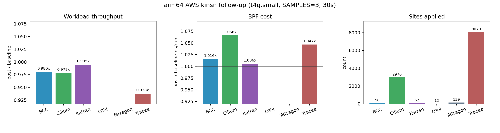

# Kinsn ReJIT Corpus Evaluation

Last updated: 2026-06-07

This is the paper-facing evaluation note for kinsn-based ReJIT on the x86 KVM
corpus. The benchmark framework records raw counters and workload payloads
only; all ratios, tables, figures, and interpretation below are post-hoc
analysis. Detailed commands, artifact paths, debugging history, and caveats
are preserved in the appendices.

## Paper Framing

Kinsn ReJIT replaces selected BPF bytecode patterns with calls to in-kernel
kfunc-like instruction modules. The evaluation is narrower than the native
execution evaluation: it asks whether the LLVM/bytecode selector can find real
corpus patterns, whether the transformed programs still pass ReJIT and run
the application workloads, and whether the extra kfunc call path pays for
itself in measured BPF and workload costs.

The current research questions are:

- **RQ1 Correctness:** does the kinsn umbrella pass preserve real corpus app
  startup, loadtime ReJIT, and measured workload execution?
- **RQ2 Apply coverage:** which kinsn families are actually applied on the
  x86 corpus, and are rotate/extract/endian/bulk-memory patterns still missing?
- **RQ3 BPF per-program cost:** among retained BPF counter rows, does kinsn
  reduce per-program `ns/run` relative to the baseline eBPF JIT?
- **RQ4 End-to-end workload impact:** does kinsn improve application workload
  throughput after BPF stats overhead is removed?

Headline result: **on x86 KVM, the expanded kinsn selector applies `39,327`
sites across all six corpus apps with zero loadtime skips or errors.**
Coverage now includes the previously missing families: rotate (`64` sites),
extract (`92`), endian_fusion (`1,112`), and bulk_memory (`11,343`). Workload
throughput is slightly positive (`1.019x` post/baseline geomean), while BPF
per-program cost is essentially neutral/slightly negative (`1.009x`
post/baseline all-qualified geomean; lower is faster).

The narrow claim supported by the current x86 KVM data is: the policy is not
filtering these kinsn families out, and the selector now reaches real corpus
bytecode shapes for rotate, extract, endian fusion, and bulk memory. The
current data does **not** support claiming a broad BPF-counter speedup from
all-force kinsn; the coverage fix is real, but the kfunc call path and selected
site mix are near neutral overall.

## Experimental Setup

All runs in this note use the repository `make` entrypoints on x86 KVM. The
kernel/runtime image is the repository default build used by `make corpus`.

Corpus runs cover six real applications: `bcc/set`,
`otelcol-ebpf-profiler/profiling`, `cilium/agent`, `tetragon/observer`,
`katran`, and `tracee/monitor`. Each corpus workload uses `SAMPLES=3`,
`WORKLOAD_DURATION=180`, and `WARMUPS=1`. The corpus apps were collected one
at a time to preserve app-specific artifacts and avoid a single long run
masking which app failed.

Two corpus datasets are used:

- **BPF stats on:** `BPFREJIT_CORPUS_BPF_STATS=1`, used for BPF per-program
  `ns/run` counters and loadtime kinsn apply reports.
- **BPF stats off:** `BPFREJIT_CORPUS_BPF_STATS=0`, used for workload
  throughput without BPF stats overhead.

The kinsn command template was:

```sh
BPFREJIT_CORPUS_APPS='<app>' \
BPFREJIT_BENCH_PASSES=kinsn \
BPFREJIT_CORPUS_BPF_STATS='<0-or-1>' \
SAMPLES=3 WORKLOAD_DURATION=180 WARMUPS=1 \
BPFREJIT_CORPUS_APP_TIMEOUT=3600 \
BPFREJIT_CORPUS_REJIT_TIMEOUT=1200 \
TIMEOUT=7200 KEEP_WORKDIRS=1 \
make corpus
```

Policy/gate status:

- `corpus/config/benchmark_config.yaml` maps `kinsn` to the single kinsn
  umbrella pass and keeps the kinsn-class pass names in the `full-x86` list.
- `runner/config/passes/kinsn/default.yaml` is the default kinsn entrypoint.
  The authoritative x86 artifacts in this note used the then-current umbrella
  default and did not use app-specific kinsn YAML disables or per-program
  overrides. Later follow-up YAMLs make the pass-local policy explicit.
- `bpfopt/llvm/src/main.cpp` treats `kinsn`, `rotate`, `cond_select`,
  `extract`, `endian_fusion`, `bulk_memory`, `lea`, `prefetch`, and `ccmp` as
  kinsn passes. The `kinsn` umbrella default is
  `all=force,movbe-load=disable` for LLVM selector mode, while bytecode
  recovery is enabled for the umbrella bytecode families
  (`rotate`, `extract`, `endian_fusion`, `bulk_memory`, and `prefetch`). This
  is a selector-mode default, not a corpus/app filter. The remaining explicit
  x86 exception, `movbe-load=disable`, does not disable the observed endian
  `movbe-be` path; Katran still produced `bpf_x86_movbe32` sites.
- `ccmp` is arm64-only in this target set, so the x86 corpus is not expected
  to report ccmp sites. `prefetch` is enabled in the target list but had zero
  x86 corpus hits in this run.
- Current post-evaluation tooling also supports a pass-local
  `--bytecode-kinsn-mode` override for controlled ablations, and new
  per-program kinsn reports include a `kinsn_policy` provenance block with the
  effective LLVM selector arguments and bytecode-family enables. The older
  authoritative artifacts above predate `kinsn_policy`, so their effective
  policy is reconstructed from `loadtime-plans/*.json` plus the bpfopt default
  described here.
- The current runner YAML is now explicitly policy-bearing for follow-up
  experiments. On x86, `prefetch` is disabled in the default `kinsn` command
  after the prefetch smoke regressions, and Cilium/Katran/Tracee keep their
  app-specific no-bulk/no-prefetch overrides. On arm64, the default and the
  Cilium/Katran/Tracee app overrides disable `bulk_memory`, `endian_fusion`,
  and `prefetch`, preserving the rotate/extract path that produced the best
  current arm64 app signal. This is benchmark policy, not an LLVM selector
  gate.

## Methodology

Corpus workload throughput is computed from raw per-app workload payloads.
For `stress-ng`, the analysis sums real-time `bogo ops/s` across configured
stressors in each sample. For kernel `pktgen`, it sums `pps` across
components or threads. For the OTEL mixed workload, it sums each worker's
`ops / elapsed_s` and includes the `stress-ng cpu` component's real-time
`bogo ops/s`. These units are app-local, so only ratios within the same app
are meaningful.

Corpus BPF per-program cost uses the kinsn paper-grade paired-row method:

```text
baseline_avg_ns_per_run = baseline_run_time_ns_delta / baseline_run_cnt_delta
post_avg_ns_per_run = post_run_time_ns_delta / post_run_cnt_delta
ratio = post_avg_ns_per_run / baseline_avg_ns_per_run
```

Rows with `min(baseline_runs, post_runs) < 100` are dropped. Programs are
paired by `(name, type, occurrence index)` after grouping each phase by BPF
program name and type. The reported BPF aggregate is the per-program geomean
of retained ratios; lower than `1.0x` means lower BPF cost after kinsn.

The "direct applied" BPF subset is a conservative automated subset: retained
counter rows whose truncated `bpftool` name matches a program with
`sites_applied > 0`. It does not fully implement the affected-population rule
for tail-call descendants. Tail-called programs can report zero own
`run_cnt_delta`; their work is charged to the directly attached caller.

Loadtime apply coverage is read from raw loadtime reports. The report's
`sites_applied`, `sites_matched`, `sites_skipped`,
`kinsn_calls_by_family`, and `kinsn_calls_by_name` fields are checked
post-hoc for consistency. Newer reports also include `kinsn_policy`, which is
used only to audit which selector policy produced a program's transformed
bytecode. No framework code computes these summaries.

## Main Results

Latest authoritative datasets are complete: six corpus apps with BPF stats
enabled and six corpus apps with BPF stats disabled. All app artifacts
completed with `status=ok` and empty app error strings.


*Figure 1: x86 KVM kinsn corpus result. Workload throughput uses
post/baseline ratios from stats-off artifacts, higher is better. BPF cost uses
per-program geomean post/baseline `ns/run` from stats-on artifacts, lower is
better. Apply coverage is decoded from loadtime reports and split by kinsn
family.*

Workload throughput. The `post/baseline` headline is the unweighted geomean
across the six app ratios (`1.019x`):

| App | baseline throughput | post-ReJIT throughput | post/baseline | sample ratios |
| --- | ---: | ---: | ---: | --- |
| `bcc` | 700402.34 | 706534.72 | 1.009x | 1.007x, 1.008x, 1.012x |
| `otel` | 107111792.00 | 106520721.92 | 0.994x | 0.994x, 0.995x, 1.002x |
| `cilium` | 1417663.00 | 1522942.00 | 1.074x | 1.074x, 1.053x, 1.163x |
| `tetragon` | 353658.27 | 354430.46 | 1.002x | 1.012x, 1.000x, 1.017x |
| `katran` | 2929650.00 | 3018390.00 | 1.030x | 1.041x, 1.032x, 1.016x |
| `tracee` | 453239.03 | 454716.87 | 1.003x | 1.002x, 1.006x, 1.002x |

Corpus BPF per-program counters. The global all-qualified BPF per-program
geomean is `1.009x` over `65` retained rows. The direct self-applied geomean
is `1.010x` over `61` retained rows:

| App | retained rows | all-qualified geomean | wins/losses/ties | direct applied rows | direct applied geomean |
| --- | ---: | ---: | ---: | ---: | ---: |
| `bcc` | 15 | 0.961x | 11/4/0 | 11 | 0.950x |
| `otel` | 1 | 1.065x | 0/1/0 | 1 | 1.065x |
| `cilium` | 2 | 1.009x | 1/1/0 | 2 | 1.009x |
| `tetragon` | 5 | 1.007x | 2/3/0 | 5 | 1.007x |
| `katran` | 1 | 0.940x | 1/0/0 | 1 | 0.940x |
| `tracee` | 41 | 1.028x | 14/27/0 | 41 | 1.028x |
| `total` | 65 | 1.009x | 29/36/0 | 61 | 1.010x |

Loadtime apply coverage:

| App | reports | applied programs | sites applied | sites matched | skipped | errors |
| --- | ---: | ---: | ---: | ---: | ---: | ---: |
| `bcc` | 77 | 25 | 77 | 77 | 0 | 0 |
| `otel` | 17 | 15 | 1475 | 1475 | 0 | 0 |
| `cilium` | 169 | 131 | 4086 | 4086 | 0 | 0 |
| `tetragon` | 308 | 290 | 18766 | 18766 | 0 | 0 |
| `katran` | 6 | 1 | 90 | 90 | 0 | 0 |
| `tracee` | 182 | 169 | 14833 | 14833 | 0 | 0 |
| `total` | 759 | 631 | 39327 | 39327 | 0 | 0 |

Applied kinsn families:

| App | LEA | cond_select | rotate | extract | endian_fusion | bulk_memory | prefetch | total |
| --- | ---: | ---: | ---: | ---: | ---: | ---: | ---: | ---: |
| `bcc` | 66 | 0 | 0 | 0 | 0 | 11 | 0 | 77 |
| `otel` | 983 | 166 | 0 | 45 | 99 | 182 | 0 | 1475 |
| `cilium` | 2346 | 385 | 0 | 2 | 766 | 587 | 0 | 4086 |
| `tetragon` | 14453 | 414 | 44 | 44 | 220 | 3591 | 0 | 18766 |
| `katran` | 39 | 0 | 20 | 1 | 11 | 19 | 0 | 90 |
| `tracee` | 7841 | 23 | 0 | 0 | 16 | 6953 | 0 | 14833 |
| `total` | 25728 | 988 | 64 | 92 | 1112 | 11343 | 0 | 39327 |

Representative x86 kinsn names by family:

| Family | Sites | Representative emitted kinsns |
| --- | ---: | --- |
| `lea` | 25728 | `bpf_x86_leaq`, `bpf_x86_leal` |
| `cond_select` | 988 | `bpf_x86_cmp_cmovb`, `bpf_x86_cmp_cmove`, `bpf_x86_cmp_cmovne` |
| `rotate` | 64 | `bpf_x86_rorxl` |
| `extract` | 92 | `bpf_x86_bextrq`, `bpf_x86_shrdq` |
| `endian_fusion` | 1112 | `bpf_x86_rolw`, `bpf_x86_bswapl`, `bpf_x86_bswapq`, `bpf_x86_movbe32` |
| `bulk_memory` | 11343 | `bpf_x86_movq`, `bpf_x86_movl`, `bpf_x86_movzbl`, `bpf_x86_movb`, `bpf_x86_movzwl` |
| `prefetch` | 0 | no x86 corpus hit |

## RQ Answers

**RQ1 Correctness.** The authoritative kinsn corpus completed all six x86 KVM
apps in both stats-on and stats-off modes with `status=ok`, empty app error
strings, and three measured workload samples per phase. Loadtime reports show
`39,327` matched/applied sites, `0` skipped sites, and `0` report errors.
Katran still records large raw `pktgen` workload-side `errors:` counts, as in
earlier corpus runs; these are preserved raw payload fields and did not
surface as app, loadtime, or ReJIT failures.

**RQ2 Apply coverage.** Rotate, extract, endian_fusion, and bulk_memory are no
longer zero in the real x86 corpus. Katran alone proves real rotate and endian
sites with `20` `bpf_x86_rorxl` sites plus `bpf_x86_movbe32`/`bswap` sites in
`balancer_ingres`. Tetragon contributes `44` more rotate sites and large bulk
memory coverage. OTEL, Cilium, Tetragon, Katran, and Tracee all contribute
non-LEA/non-cond-select coverage. `ccmp` remains arm64-only, and `prefetch`
had no x86 corpus hit in this run.

**RQ3 BPF per-program cost.** Kinsn is near neutral/slightly slower on the
current retained BPF counter population: `1.009x` all-qualified cost and
`1.010x` direct-self-applied cost. BCC and Katran improve (`0.961x`,
`0.940x` all-qualified), Cilium and Tetragon are neutral (`1.009x`,
`1.007x`), and OTEL/Tracee regress in the retained rows (`1.065x`,
`1.028x`). The coverage expansion therefore should not be represented as a
finished performance win; it exposes the next optimization targets.

**RQ4 End-to-end workload impact.** Workload throughput is slightly positive:
`1.019x` post/baseline geomean across six app workloads. Cilium (`1.074x`) and
Katran (`1.030x`) are the clear positive apps; BCC, Tetragon, and Tracee are
near neutral; OTEL is slightly lower (`0.994x`). The workload result is more
positive than the retained BPF counter geomean because application-level noise,
tail-call accounting, and non-BPF work can dominate small per-program counter
differences.

## Per-App Tuned Result

After the full-kinsn corpus run, the best workload-oriented policy among the
tested full versus no-bulk configurations kept the umbrella `kinsn` pass but
disabled `bulk_memory` for Cilium, Katran, and Tracee only:

```sh
bpfopt --pass kinsn ... -- \
  --kinsn-mode all=force,wide-load=disable,indexed-load=disable,movbe-load=disable \
  --bytecode-kinsn-mode bulk_memory=disable
```

This is implemented as app-specific pass config under
`runner/config/passes/kinsn/{cilium,katran,tracee}.yaml`; the default
`runner/config/passes/kinsn/default.yaml` is not changed into no-bulk.

The tuned run used the same setup as the authoritative corpus runs:
`SAMPLES=3`, `WORKLOAD_DURATION=180`, `WARMUPS=1`,
`BPFREJIT_BENCH_PASSES=kinsn`, and the app subset
`tracee/monitor,cilium/agent,katran`. The stats-on artifact is
`corpus/results/x86_kvm_corpus_20260604_232313_992341`; the stats-off artifact
is `corpus/results/x86_kvm_corpus_20260605_004607_636479`.


*Figure 2: per-app tuned kinsn result for Cilium, Katran, and Tracee.
Workload ratios use stats-off artifacts, higher is better. BPF cost ratios use
stats-on artifacts, lower is better. This figure is not a full-corpus result;
it isolates the three app-specific no-bulk overrides.*

Workload throughput improved on all three tuned apps, with a `1.061x`
three-app geomean:

| App | full-kinsn workload ratio | tuned workload ratio | tuned sample ratios | workload note |
| --- | ---: | ---: | --- | --- |
| `cilium` | 1.074x | 1.114x | 1.102x, 1.128x, 1.112x | strongest tuned workload win, no pktgen errors |
| `katran` | 1.030x | 1.052x | 1.070x, 1.041x, 1.044x | stable packet-path win; raw pktgen errors remain workload payload fields |
| `tracee` | 1.003x | 1.019x | 1.016x, 1.023x, 1.017x | smaller but consistent stress-ng throughput win |

The same run confirms that all three overrides really disabled bulk-memory
while keeping the other families enabled:

| App | sites applied | LEA | cond_select | rotate | extract | endian_fusion | bulk_memory |
| --- | ---: | ---: | ---: | ---: | ---: | ---: | ---: |
| `cilium` | 3512 | 2359 | 385 | 0 | 2 | 766 | 0 |
| `katran` | 71 | 39 | 0 | 20 | 1 | 11 | 0 |
| `tracee` | 7898 | 7859 | 23 | 0 | 0 | 16 | 0 |

BPF counters do not support the same three-app claim. Katran remains a clear
BPF-counter win (`0.942x`, one retained hot XDP row), but Cilium and Tracee
were slower in the 2026-06-04 stats-on rerun (`1.062x` and `1.064x`). Tracee's
hash-based pairing confirms this is not an occurrence-index pairing artifact.
The useful claim from the tuned dataset is therefore workload-level for
Cilium/Katran/Tracee, plus a BPF-counter win for Katran.

A later Cilium LLVM-only follow-up was diagnostic, not better. It disabled
bytecode recovery for Cilium while keeping the narrow LLVM bulk selector, then
reran Cilium/Katran/Tracee with `SAMPLES=3 WORKLOAD_DURATION=30` in
`corpus/results/x86_kvm_corpus_20260605_032129_844272`. That result was lower
than the no-bulk tuned run: Cilium `1.027x` workload / `0.941x` BPF, Katran
`1.036x` / `0.953x`, and Tracee `1.001x` / `1.005x`. It should be treated as
a failed selector-tuning attempt and not used as the reported tuned policy.

## 2026-06-05 Selector Follow-Up

This follow-up is narrower than the main x86 KVM result above. It was run to
answer two implementation questions: whether any additional x86 kinsn names can
be reached by real corpus bytecode, and whether the arm64 target can apply
real corpus kinsn sites before spending AWS time. These runs used
`SAMPLES=1` or `WORKLOAD_DURATION=30` smoke settings except for the AWS arm64
performance run, so they do not replace the authoritative x86 tables above.

### x86 movbe16 recovery

The x86 selector follow-up added a bytecode recovery shape for 16-bit endian
loads that appear as low-16 load plus `rolw 8`. The recovery emits
`bpf_x86_movbe16` after zero-initializing the destination, preserving the
existing x86 no-bulk app overrides for Cilium, Katran, and Tracee.

Artifact:
`corpus/results/x86_kvm_corpus_20260605_040502_276228`
(`SAMPLES=1`, `WORKLOAD_DURATION=30`, all six apps).

Result: all six apps completed `status=ok`. The new `bpf_x86_movbe16` selector
applied `268` sites: Cilium `44`, Tetragon `220`, and Tracee `4`. Total kinsn
coverage in this smoke run was `31,799` sites:

| App | sites applied | Notable families/names |
| --- | ---: | --- |
| `bcc/set` | 77 | LEA `66`, bulk_memory `11` |
| `cilium/agent` | 3512 | LEA `2359`, cond_select `385`, endian_fusion `766`, extract `2`, including `44` `bpf_x86_movbe16` |
| `katran` | 71 | rotate `20`, endian_fusion `11`, extract `1`, LEA `39` |
| `otelcol-ebpf-profiler/profiling` | 1475 | LEA `983`, cond_select `166`, endian_fusion `99`, bulk_memory `182`, extract `45` |
| `tetragon/observer` | 18766 | LEA `14453`, bulk_memory `3591`, cond_select `414`, endian_fusion `220`, extract `44`, rotate `44`, including `220` `bpf_x86_movbe16` |
| `tracee/monitor` | 7898 | LEA `7859`, cond_select `23`, endian_fusion `16`, including `4` `bpf_x86_movbe16` |

The remaining enabled-but-zero x86 names in this smoke artifact are still
selector/proof gaps or absent corpus shapes: `bpf_x86_blsiq`,
`bpf_x86_blsrq`, `bpf_x86_andl`, `bpf_x86_movbe64`, `bpf_x86_rolq`,
`bpf_x86_popcntq`, `bpf_x86_prefetcht0`, `bpf_x86_shldl`,
`bpf_x86_shldq`, `bpf_x86_shrdl`, and `bpf_x86_shrq`.

### x86 prefetch, roll, and SHD recovery

A later x86 smoke expanded bytecode recovery again: map-lookup fallthrough
prefetch emits `bpf_x86_prefetcht0`; 32-bit rotate can emit destructive
`bpf_x86_roll`; and split-copy funnel-shift forms can emit `bpf_x86_shrdq`.

Artifact:
`corpus/results/x86_kvm_corpus_20260605_070536_784629`
(`SAMPLES=1`, `WORKLOAD_DURATION=10`, all six apps).

Result: all six apps completed `status=ok`. Total coverage was `38,823`
sites, including the newly reached `prefetch` family:

| Family | sites |
| --- | ---: |
| `lea` | 25759 |
| `bulk_memory` | 3784 |
| `prefetch` | 3024 |
| `endian_fusion` | 1112 |
| `cond_select` | 988 |
| `extract` | 92 |
| `rotate` | 64 |

The new notable names were `bpf_x86_prefetcht0` (`3024`) and `bpf_x86_shrdq`
(`3`). A subsequent smoke after enabling `bpf_x86_roll` reached `20`
`bpf_x86_roll` Katran sites in
`corpus/results/x86_kvm_corpus_20260605_082448_492730`, but that run also
recorded a natural Tetragon `generic_kprobe_filter_arg` `EINVAL`; it is
therefore retained as selector coverage evidence, not as a clean six-app
performance artifact. A Tetragon-only repeat
(`corpus/results/x86_kvm_corpus_20260605_084211_375649`) reproduced the same
Tetragon load failure while showing only the existing Tetragon LEA/prefetch/
bulk/cond_select mix before failure, so the new `roll`/`shrdq`/BMI1 recovery
is not the obvious cause.

After these 2026-06-05 smokes, and before the 2026-06-07 popcnt/BMI2 follow-up
below, the remaining enabled-but-zero x86 names were `bpf_x86_blsiq`,
`bpf_x86_blsrq`, `bpf_x86_andl`, `bpf_x86_movbe64`, `bpf_x86_rolq`,
`bpf_x86_popcntq`, `bpf_x86_shldl`, `bpf_x86_shldq`, `bpf_x86_shrdl`, and
`bpf_x86_shrq`. The low-risk missed opportunity is mostly proof quality: the
corpus has many ordinary ALU/load/store operations, but converting scalar
one-instruction BPF operations into kfunc calls is not a useful performance
default without a stronger cost model.

### x86 BMI2 variable-shift, BZHI, and popcnt follow-up

The 2026-06-07 follow-up keeps the synthetic x86 `popcntq` bytecode recovery
selector and adds new BMI2 bit-operation module coverage. The first addition is
the variable-shift selector:
`bpf_x86_shlxl`, `bpf_x86_shlxq`, `bpf_x86_shrxl`, and `bpf_x86_shrxq`.
These are enabled under the existing `bitops` bytecode family rather than as a
new benchmark policy gate.

The retained `bitmap_popcount_scan` micro case proves the `popcntq` selector is
live: `micro/results/x86_kvm_micro_20260607_065311_731192` reports median
`kernel=1113 ns`, `kernel_rejit=497 ns`, or `2.24x`, with
`bpf_x86_popcntq=1`, `bpf_x86_leaq=3`, and `bpf_x86_movl=2` applied on the hot
program in every sample. This is micro coverage evidence, not a Cilium/Katran
app win, because the selected Cilium/Katran BPF objects did not contain the
matching SWAR popcount constants.

The new BMI2 shift selector was then checked on three focused x86 KVM micro
cases:

Artifact:
`micro/results/x86_kvm_micro_20260607_072937_370032`
(`SAMPLES=3`, `INNER_REPEAT=100000`, `kernel` vs `kernel_rejit`).

| Micro case | kernel median ns | ReJIT median ns | speedup | BMI2 shift sites/sample |
| --- | ---: | ---: | ---: | ---: |
| `packet_toeplitz_rss_hash` | 257 | 209 | `1.230x` | 5 |
| `bpftrace_comm_key_fnv_hash` | 435 | 441 | `0.986x` | 4 |
| `packed_header_bitfield_decode` | 277 | 242 | `1.145x` | 4 |

The three-case geomean is `1.116x`; all samples matched. This proves the new
kinsn names and selector path apply. It is still not pure machine-code novelty:
the stock kernel JIT already emits BMI2 `shlx`/`shrx` for some variable-shift
BPF operations, so this result is selector/kfunc coverage evidence first.

A current Cilium/Katran x86 KVM smoke with the same code also completed:
`corpus/results/x86_kvm_corpus_20260607_073922_108307`
(`SAMPLES=1`, `WORKLOAD_DURATION=10`, `BPFREJIT_BENCH_PASSES=kinsn`,
`BPFREJIT_CORPUS_APPS="cilium/agent,katran"`). Both apps finished `status=ok`.
Cilium applied `102` new BMI2 shift sites (`bpf_x86_shlxl=84`,
`bpf_x86_shrxl=18`) on top of the existing LEA/endian/cond-select/extract mix,
mostly in `sched_cls` paths such as `tail_handle_ipv`, `cil_to_container`,
`cil_to_host`, and `cil_to_netdev`. Katran did not hit the new BMI2 selector in
that smoke and kept its existing LEA/rotate/endian/extract mix. The raw
workload pps ratio was `1.110x` for Cilium and `1.049x` for Katran in this
10-second smoke, so it is useful coverage/performance signal but not a
replacement for the authoritative SAMPLES=3 runs.

The next x86 native-backed candidate was `bzhi`: the Cilium native census had
`26` `bzhi` instructions, and the BPF round-trip contains bounded mask-build
forms. The follow-up adds `bpf_x86_bzhil`/`bpf_x86_bzhiq` to the same BMI2
module and keeps the selector narrow: it only replaces all-ones mask builders
where the count is proven below the operand width by an exact constant or an
`AND` bound. This avoids app-wide gates or unsafe range assumptions.

The code was checked in a Cilium/Katran app smoke:
`corpus/results/x86_kvm_corpus_20260607_210624_356236`
(`SAMPLES=1`, `WORKLOAD_DURATION=10`). Both apps finished `status=ok`.
Cilium applied `8` `bpf_x86_bzhil` sites on real `sched_cls` programs
(`cil_to_netdev`, `tail_handle_ipv`, and `cil_to_containe*`) in addition to
the existing LEA/endian/cond-select/extract/BMI2-shift mix. Katran had no BZHI
hits and kept its existing rotate/endian/extract/LEA mix. The short-run raw
workload ratios were `1.156x` for Cilium and `1.028x` for Katran; retained BPF
counter geomeans were `0.696x` over two Cilium rows and `0.948x` over the one
Katran row. These are follow-up smoke numbers, not replacements for the
SAMPLES=3 authoritative corpus, but they prove BZHI is no longer micro-only.

### arm64 QEMU smoke

The arm64 target initially exposed a real policy/selector bug: the LLVM
selector was still allowed to emit x86 pseudo-kinsns such as `bpf_x86_leaq`
when the target JSON contained only arm64 kinsns. The fix disables LLVM kinsn
selection for arm64-only targets and uses arm64 bytecode recovery for rotate,
extract, and endian operations. The x86 per-app no-bulk overrides are also
guarded by `RUN_TARGET_ARCH`, so arm64 does not inherit the x86 no-bulk
overrides and instead uses the target-specific default command.

QEMU smoke command:

```sh
PLATFORM=qemu ARCH=arm64 SAMPLES=1 WORKLOAD_DURATION=30 \
  BPFREJIT_BENCH_PASSES=kinsn \
  BPFREJIT_CORPUS_APPS="katran,cilium/agent,tracee/monitor" \
  make corpus
```

Artifact:
`corpus/results/arm64_qemu_corpus_19700101_000005_560691`.

Result: Cilium and Katran completed `status=ok`; Tracee reached loadtime
reports but failed post startup under QEMU. The smoke confirmed real arm64
apply:

| App | status | sites applied | arm64 kinsns |
| --- | --- | ---: | --- |
| `cilium/agent` | ok | 364 | `bpf_arm64_rev16_w` 318, `bpf_arm64_rev_w` 22, `bpf_arm64_rev_x` 22, `bpf_arm64_ubfm_x` 2 |
| `katran` | ok | 30 | `bpf_arm64_extr_w` 20, `bpf_arm64_rev16_w` 5, `bpf_arm64_rev_w` 4, `bpf_arm64_ubfm_x` 1 |
| `tracee/monitor` | error | 1 | `bpf_arm64_rev16_w` 1 |

### arm64 AWS performance run

AWS arm64 was run only after QEMU confirmed non-zero arm64 apply.

Command:

```sh
PLATFORM=aws ARCH=arm64 SAMPLES=3 WORKLOAD_DURATION=30 \
  BPFREJIT_BENCH_PASSES=kinsn \
  make corpus
```

Artifact:
`corpus/results/aws_arm64_corpus_20260605_053223_453376`
(`t4g.small`, all six corpus apps).

The suite status is `error` because three apps failed naturally during
post-ReJIT startup or event handling. No app was filtered out:

| App | status | sites applied | Notes |
| --- | --- | ---: | --- |
| `bcc/set` | ok | 0 | no arm64 kinsn coverage in this run |
| `cilium/agent` | ok | 768 | endian_fusion `766`, extract `2` |
| `katran` | ok | 30 | rotate `20`, endian_fusion `9`, extract `1` |
| `otelcol-ebpf-profiler/profiling` | error | 0 | post failed loading `perf_unwind_native` |
| `tetragon/observer` | error | 0 | post failed loading `generic_kprobe_filter_arg` |
| `tracee/monitor` | error | 16 | Tracee buffer decode/event-loss failure after post startup |

For the three apps that completed, workload and BPF-counter results were mixed:

| App | workload ratio | BPF cost ratio | Interpretation |
| --- | ---: | ---: | --- |
| `bcc/set` | 0.979x | 0.942x | no kinsn applied, so this is noise/control rather than kinsn evidence |
| `cilium/agent` | 0.974x | 1.003x over 2 retained rows | high arm64 endian coverage, but no performance win in this run |
| `katran` | 1.020x | 0.987x over 1 retained row | positive arm64 signal on the hot XDP program |

The useful arm64 conclusion is therefore coverage plus a Katran signal, not a
broad arm64 performance claim. Cilium proves that real arm64 endian/extract
sites are reachable in a large corpus app, but the current call overhead/site
mix was not profitable at the workload level. Tracee also proves arm64 endian
coverage, but the app did not produce a valid post-ReJIT measurement.

### 2026-06-07 arm64 policy follow-up

The arm64 follow-up separates two claims that should not be mixed. Full arm64
selector coverage is useful for microbenchmarks, but the best current
application policy is conservative: disable `bulk_memory`, `endian_fusion`,
and `prefetch`, while keeping rotate/extract enabled.

The AWS arm64 policy evidence is:

| Artifact | Policy shape | Cilium workload | Katran workload | Applied families | Interpretation |
| --- | --- | ---: | ---: | --- | --- |
| `corpus/results/aws_arm64_corpus_20260605_053223_453376` | prefetch disabled only | `0.974x` | `1.020x` | endian `791`, extract `3`, rotate `20` | coverage, weak Katran win, Cilium regression |
| `corpus/results/aws_arm64_corpus_20260605_080836_924256` | no bulk/endian/prefetch | `0.983x` | `1.073x` | extract `4`, rotate `20` | best arm64 app result so far |
| `corpus/results/aws_arm64_corpus_20260605_094729_221231` | coverage-max with bulk/prefetch/endian | `0.978x` | `0.995x` | bulk `8685`, prefetch `1810`, endian `791`, extract `3`, rotate `20` | more coverage but worse performance |

That comparison is why the current arm64 runner config explicitly passes
`--bytecode-kinsn-mode bulk_memory=disable,endian_fusion=disable,prefetch=disable`
for the default `kinsn` command and for the Cilium/Katran/Tracee app configs.
The choice is per-benchmark policy: the selectors remain available for micro
coverage and explicit ablations, but they are not used in the arm64 app
performance policy.

The full arm64 micro result remains positive and should be reported as a
separate selector-capability result. Artifact
`micro/results/aws_arm64_micro_20260606_001225_821028` has all-29 geomean
`1.208x` and kinsn-bearing geomean `1.222x` over 27 benchmarks. It applied
`bpf_arm64_extr_x=387`, `bpf_arm64_ldr_w=198`, `bpf_arm64_ubfm_x=144`,
`bpf_arm64_ldrh=114`, `bpf_arm64_rev16_w=39`, `bpf_arm64_stp_x=21`,
`bpf_arm64_rev_w=15`, and `bpf_arm64_ldp_x=6`. The negative micro cases also
explain the app policy: `bpftrace_comm_key_fnv_hash` regressed to `0.862x`
with `ldr_w/stp_x` sites, and `bitmap_popcount_scan` was `0.966x` with
`ldr_w` sites, so high-count load/store lowering is not yet a safe arm64 app
default.

A 2026-06-07 local arm64 QEMU smoke was run to check the validation path:
`corpus/results/arm64_qemu_corpus_19700101_000005_357787`
(`SAMPLES=1`, `WORKLOAD_DURATION=10`, Cilium/Katran). Both apps completed
`status=ok`, with raw workload ratios `1.003x` for Cilium and `1.017x` for
Katran. The loadtime reports show this smoke used a stale extracted QEMU
rootfs/runtime image: `kinsn_policy.pass_args` was empty and only `prefetch`
was disabled, so it is not counted as validation of the new conservative
arm64 YAML. The result is retained only as a QEMU smoke/path check; the arm64
performance conclusion above remains based on the AWS artifacts.

### arm64 selector expansion and AWS coverage-max

The final arm64 follow-up added bytecode recovery for adjacent pair
loads/stores (`bpf_arm64_ldp_x`, `bpf_arm64_stp_x`), map-lookup fallthrough
prefetch (`bpf_arm64_prfm_pldl1keep`), wider `ubfm` extract shapes, and a
strict boolean-chain `ccmp` recovery. The kinsn target/prober YAMLs were also
updated so the arm64 pair-memory names and x86 `bpf_x86_roll` are visible to
the runner.

The current arm64 `kinsn` umbrella default is conservative: it keeps the
coverage-safe rotate/extract path and does not force the high-overhead
endian/bulk/prefetch families under the default umbrella policy. A conservative
AWS rerun completed BCC, Cilium, Katran, OTEL, and Tracee, with Tetragon
failing naturally:

Artifact:
`corpus/results/aws_arm64_corpus_20260605_080836_924256`
(`PLATFORM=aws ARCH=arm64 SAMPLES=3 WORKLOAD_DURATION=30
BPFREJIT_BENCH_PASSES=kinsn make corpus`).

| App | status | sites applied | workload ratio | BPF cost ratio |
| --- | --- | ---: | ---: | ---: |
| `bcc/set` | ok | 0 | 1.002x | 0.954x |
| `cilium/agent` | ok | 2 | 0.983x | 0.997x |
| `katran` | ok | 21 | 1.073x | 0.941x |
| `otelcol-ebpf-profiler/profiling` | ok | 0 | 0.985x | 1.048x |
| `tetragon/observer` | error | 1 | n/a | n/a |
| `tracee/monitor` | ok | 0 | 1.009x | 1.012x |

Coverage-max arm64 was then run by forcing every implemented arm64 bytecode
family through the pass list:

```sh
PLATFORM=aws ARCH=arm64 SAMPLES=3 WORKLOAD_DURATION=30 \
  BPFREJIT_BENCH_PASSES=rotate,extract,endian_fusion,bulk_memory,prefetch,cond_select,ccmp \
  make corpus
```

Artifact:
`corpus/results/aws_arm64_corpus_20260605_094729_221231`.
The reference coverage-max artifact without `ccmp` is
`corpus/results/aws_arm64_corpus_20260605_085337_334187`.



*Figure 3: arm64 AWS coverage-max follow-up. OTel and Tetragon are shown as
`n/a` for workload/BPF ratios because they failed naturally during startup or
post-ReJIT loading. Sites applied are still shown from loadtime reports.*

The with-`ccmp` run applied `11,309` sites. `ccmp` was enabled and exercised by
the full pass list, but matched `0` real corpus sites; the current strict
matcher only recognizes compact boolean-materialization chains, and the real
corpus does not expose that shape after BPF round-trip.

| Family | sites |
| --- | ---: |
| `bulk_memory` | 8685 |
| `prefetch` | 1810 |
| `endian_fusion` | 791 |
| `rotate` | 20 |
| `extract` | 3 |

| Kinsn | sites |
| --- | ---: |
| `bpf_arm64_stp_x` | 6656 |
| `bpf_arm64_ldp_x` | 2029 |
| `bpf_arm64_prfm_pldl1keep` | 1810 |
| `bpf_arm64_rev16_w` | 699 |
| `bpf_arm64_rev_w` | 46 |
| `bpf_arm64_rev_x` | 46 |
| `bpf_arm64_extr_w` | 20 |
| `bpf_arm64_ubfm_x` | 3 |

Performance was worse than the conservative run:

| App | status | sites applied | workload ratio | BPF cost ratio | retained rows |
| --- | --- | ---: | ---: | ---: | ---: |
| `bcc/set` | ok | 50 | 0.980x | 1.016x | 14 |
| `cilium/agent` | ok | 2976 | 0.978x | 1.066x | 2 |
| `katran` | ok | 62 | 0.995x | 1.006x | 1 |
| `otelcol-ebpf-profiler/profiling` | error | 12 | n/a | n/a | 0 |
| `tetragon/observer` | error | 139 | n/a | n/a | 0 |
| `tracee/monitor` | ok | 8070 | 0.938x | 1.047x | 60 |

So the arm64 conclusion is now split: the selector can apply many more real
arm64 sites when forced, but the high-count pair-memory and prefetch coverage
is not a performance policy. The best arm64 performance signal remains the
conservative Katran result (`1.073x` workload, `0.941x` BPF cost). The scalar
`ldr`/`str`/`mov` names remain target-visible but unselected; forcing ordinary
single-instruction BPF memory operations through kfunc calls would increase
site count without a defensible cost model.

## Discussion

The important corrective result is coverage, not headline speedup. Earlier
corpus artifacts reported zero rotate/extract/endian/bulk-memory sites because
the selector was too narrow for real BPF bytecode after round-trip through the
corpus loader path. The current run uses the kinsn umbrella pass plus bytecode
recovery, so patterns that do not survive as the narrow original MachineInstr
tree can still be recovered from final BPF bytecode. This is why Katran and
Tetragon now expose `rorxl`, why OTEL/Tetragon/Katran expose `bextrq`/`shrdq`,
why Cilium and Katran expose endian-fusion patterns, and why bulk-memory
`mov*` kinsns appear broadly.

This run also clarifies policy versus selector behavior. There is no
benchmark-level policy filter preventing these pass names from running under
`kinsn`. On x86, the current default is still not a no-bulk policy, but it
does disable `prefetch` after the prefetch smoke regressions; Cilium, Katran,
and Tracee additionally use app-specific no-bulk/no-prefetch overrides. On
arm64, the umbrella runner policy is deliberately more conservative after the
follow-up because forced endian/bulk/prefetch coverage was not profitable. The
remaining explicit x86 selector default is `movbe-load=disable` in the
umbrella mode; this does not disable the observed endian `movbe-be` path. The
main authoritative x86 run had `prefetch=0`; the later selector follow-up
reached `3024` `bpf_x86_prefetcht0` sites, so the old zero was a
selector/dataflow gap, not a corpus gate.

A default-name coverage audit gives the same answer. The default target YAML
now contains `61` kinsn names after the BMI2 shift and BZHI follow-ups; the
authoritative x86 full-corpus reports applied `17` x86 names because it predates
those follow-ups. The x86 names that are enabled but still zero in the
authoritative corpus are `bpf_x86_blsiq`, `bpf_x86_blsrq`, `bpf_x86_andl`,
`bpf_x86_movbe64`, `bpf_x86_rolq`, `bpf_x86_popcntq`,
`bpf_x86_shldl`, `bpf_x86_shldq`, `bpf_x86_shrdl`, and
`bpf_x86_shrq`. In the authoritative run, `bpf_x86_movbe16` and
`bpf_x86_prefetcht0` were also zero; the 2026-06-05 selector follow-ups above
added those recovery shapes and observed `268` and `3024` real corpus sites.
The later `roll` follow-up observed `20` `bpf_x86_roll` sites, and the
2026-06-07 BMI2 shift follow-up observed `102` Cilium app sites plus focused
micro coverage for `bpf_x86_shlxl`, `bpf_x86_shlxq`, `bpf_x86_shrxl`, and
`bpf_x86_shrxq`. The BZHI follow-up observed `8` Cilium app
`bpf_x86_bzhil` sites. The retained popcnt selector observed `1` hot-site
`bpf_x86_popcntq` in the existing `bitmap_popcount_scan` micro case. The
remaining zero names are not disabled by benchmark policy; the current corpus
either has no profitable matched shape for them or needs a new selector/dataflow
proof before they are worth forcing.

A follow-up no-bulk ablation was used only to guide selector tuning. It added
a controlled way to disable `bulk_memory` while keeping the single umbrella
kinsn pass, and it confirmed that `bulk_memory` can dominate regressions in
some apps. On the five apps that completed under that ablation, BPF
per-program geomean improved from `1.009x` full-kinsn to `0.966x` no-bulk
over the matched retained rows; Tracee improved from `1.028x` to `0.920x`,
Cilium from `1.009x` to `0.935x`, and Katran from `0.940x` to `0.936x`.
However, Tetragon failed under no-bulk with a load-time `EINVAL`, and BCC/OTEL
regressed. This is not a replacement default policy; it motivates per-app or
per-program tuning with full-kinsn as the fallback.

The later per-app tuned rerun above keeps that fallback model: the default
stays broader than no-bulk, while Cilium, Katran, and Tracee use app-specific
no-bulk overrides because that is the best workload policy among the tested
full, no-bulk, LLVM-only, and scalar-only configurations. The BPF-counter
repeatability is weaker than the workload signal for Cilium and Tracee, so
those apps should be reported as workload wins, not BPF-counter wins. The
LLVM-only follow-up is retained only as a negative tuning result.

The BPF counter result should be read with the tail-call accounting caveat from
`AGENTS.md`: many tail-called programs report zero own runtime counters, so
savings or regressions in tail-call descendants are charged to the directly
attached caller. The direct-self-applied subset here is conservative and does
not fully reconstruct call-tree affected populations.

The next performance work is therefore site selection and cost modeling, not
more benchmark policy. The selector can now find real corpus sites; the
question is which site families should be forced by default, which should be
profile- or cost-gated, and which kfunc bodies need lower call/setup overhead.
The next native-backed opcode candidates are x86 `bzhi` and arm64
`bfi`/`bfxil`: a focused Cilium/Katran native census found `26` Cilium x86
`bzhi` sites, plus arm64 `bfi/bfxil` hits in Cilium (`49`/`19`) and Katran
(`1`/`0`). By contrast, the previously considered x86 bit-scan
`tzcnt/lzcnt/bsf/bsr` and arm64 `rbit/clz/ctz` shapes still have no
Cilium/Katran native evidence.

## Artifacts

Post-hoc script and generated data:

- Script: `docs/tmp/kinsn_eval_20260604.py`
- Summary: `docs/tmp/kinsn_eval_20260604_summary.md`
- Figure: `docs/figures/eval-kinsn-corpus-20260604.png`
- Tuned 3-app figure:
  `docs/figures/eval-kinsn-tuned-3app-20260605.png`
- arm64 follow-up script: `docs/tmp/kinsn_arm64_eval_20260605.py`
- arm64 follow-up summary:
  `docs/tmp/kinsn_arm64_eval_20260605_summary.md`
- arm64 follow-up figure:
  `docs/figures/eval-kinsn-arm64-aws-20260605.png`

Authoritative stats-on/stats-off artifacts:

| App | stats-on artifact | stats-off artifact |
| --- | --- | --- |
| `bcc` | `corpus/results/x86_kvm_corpus_20260604_060059_192193` | `corpus/results/x86_kvm_corpus_20260604_090456_427289` |
| `otel` | `corpus/results/x86_kvm_corpus_20260604_063237_481303` | `corpus/results/x86_kvm_corpus_20260604_093627_878868` |
| `cilium` | `corpus/results/x86_kvm_corpus_20260604_070210_639497` | `corpus/results/x86_kvm_corpus_20260604_100557_313063` |
| `tetragon` | `corpus/results/x86_kvm_corpus_20260604_073221_306100` | `corpus/results/x86_kvm_corpus_20260604_103609_366182` |
| `katran` | `corpus/results/x86_kvm_corpus_20260604_080246_742228` | `corpus/results/x86_kvm_corpus_20260604_110614_563901` |
| `tracee` | `corpus/results/x86_kvm_corpus_20260604_083301_316989` | `corpus/results/x86_kvm_corpus_20260604_113548_863406` |

Per-app tuned artifacts:

| Scope | stats-on artifact | stats-off artifact |
| --- | --- | --- |
| `cilium,katran,tracee` no-bulk overrides | `corpus/results/x86_kvm_corpus_20260604_232313_992341` | `corpus/results/x86_kvm_corpus_20260605_004607_636479` |

Negative/diagnostic selector-tuning artifacts:

| Scope | artifact | Notes |
| --- | --- | --- |
| `cilium,tracee` LLVM-only exploratory | `corpus/results/x86_kvm_corpus_20260605_030733_001837` | SAMPLES=1, bytecode recovery disabled for both apps |
| `bcc,cilium,katran,tetragon,tracee` scalar-only exploratory | `corpus/results/x86_kvm_corpus_20260605_024544_394150` | SAMPLES=1, Tetragon failed EINVAL |
| `cilium,katran,tracee` LLVM-only Cilium repeat | `corpus/results/x86_kvm_corpus_20260605_032129_844272` | SAMPLES=3, 30s; worse than the no-bulk tuned policy |
| `x86 movbe16 selector smoke` | `corpus/results/x86_kvm_corpus_20260605_040502_276228` | SAMPLES=1, 30s; all six apps ok; `bpf_x86_movbe16` applied 268 sites |
| `x86 prefetch/SHD selector smoke` | `corpus/results/x86_kvm_corpus_20260605_070536_784629` | SAMPLES=1, 10s; all six apps ok; `bpf_x86_prefetcht0` applied 3024 sites and `bpf_x86_shrdq` applied 3 sites |
| `x86 roll selector smoke` | `corpus/results/x86_kvm_corpus_20260605_082448_492730` | SAMPLES=1, 10s; `bpf_x86_roll` applied 20 Katran sites; Tetragon failed naturally |
| `x86 Tetragon roll follow-up` | `corpus/results/x86_kvm_corpus_20260605_084211_375649` | Tetragon-only repeat; reproduced `generic_kprobe_filter_arg` EINVAL before any roll/SHD/BMI1 hit |
| `arm64 QEMU apply smoke` | `corpus/results/arm64_qemu_corpus_19700101_000005_560691` | SAMPLES=1, 30s; Cilium/Katran ok; confirmed arm64 `rev`/`extr`/`ubfm` apply |
| `arm64 AWS corpus follow-up` | `corpus/results/aws_arm64_corpus_20260605_053223_453376` | SAMPLES=3, 30s; BCC/Cilium/Katran ok; OTel/Tetragon/Tracee failed naturally |
| `arm64 AWS conservative follow-up` | `corpus/results/aws_arm64_corpus_20260605_080836_924256` | SAMPLES=3, 30s; BCC/Cilium/Katran/OTel/Tracee ok; Katran positive; Tetragon failed naturally |
| `arm64 AWS coverage-max without ccmp` | `corpus/results/aws_arm64_corpus_20260605_085337_334187` | SAMPLES=3, 30s; forced rotate/extract/endian/bulk/prefetch/cond_select; 11,339 sites |
| `arm64 AWS coverage-max with ccmp` | `corpus/results/aws_arm64_corpus_20260605_094729_221231` | SAMPLES=3, 30s; forced rotate/extract/endian/bulk/prefetch/cond_select/ccmp; 11,309 sites; ccmp matched 0 |
| `x86 BZHI Cilium/Katran smoke` | `corpus/results/x86_kvm_corpus_20260607_210624_356236` | SAMPLES=1, 10s; Cilium `bpf_x86_bzhil=8`; Cilium/Katran status ok |

## Previous Results

These older results are retained for history and for explaining why the
selector expansion mattered. They are not the current authoritative kinsn
result because they predate the full bytecode recovery coverage measured
above.

**2026-06-03 all-force result.** Artifact
`corpus/results/x86_kvm_corpus_20260603_175429_964295`; smoke alias artifact
`corpus/results/x86_kvm_corpus_20260603_185015_116803`; post-hoc script
`docs/tmp/kinsn_all_force_eval_20260603.py`; figure
`docs/figures/eval-kinsn-all-force-corpus-20260603.png`. It completed all six
apps with `status=ok`, applied `27,085` sites across `631` applied loadtime
rows, and reported `1.081x` workload geomean, `0.938x` all-qualified BPF
geomean, and `0.933x` direct-self-applied BPF geomean. Its family split was
LEA plus cond_select only (`26,097` LEA, `988` cond_select); rotate, extract,
endian_fusion, bulk_memory, and prefetch were zero because the selector was
still too narrow for real corpus bytecode shapes.

**2026-06-02 LEA result.** Artifact
`corpus/results/x86_kvm_corpus_20260602_141656_778399`; post-hoc script
`docs/tmp/kinsn_eval_20260602.py`; figure
`docs/figures/eval-kinsn-lea-corpus-20260602.png`. This SAMPLES=1 LEA-only
run completed all six apps with `status=ok`, applied `22,476` LEA sites, and
reported `1.187x` workload geomean, `0.860x` all-qualified BPF geomean, and
`0.873x` direct-self-applied BPF geomean. It proved the x86 LEA policy path
was no longer a no-op, but it did not test the broader selector families.

**2026-05-31 kinsn-6 result.** Command:
`BPFREJIT_BENCH_PASSES=kinsn-6 SAMPLES=3 WORKLOAD_DURATION=180 TIMEOUT=7200 make corpus`.
This run completed all six apps with `status=ok`; its key result was fused
x86 `cond_select` coverage (`320` sites across `82` programs) and a
direct-self-applied BPF geomean of `0.944x`. The all-qualified BPF geomean was
`1.010x`, so it was a correctness and targeted-direct-row result rather than
a broad corpus speedup.

**2026-06-07 per-app native-guided tuning note.** Two Cilium/Katran-only x86
KVM trials (`x86_kvm_corpus_20260607_001205_754492`,
`x86_kvm_corpus_20260607_003024_382618`) did not beat the existing best
configurations; the explicit all-LLVM-selector path failed Cilium verifier
startup, so the per-app YAML was returned to the conservative
no-bulk/no-prefetch form.

**2026-06-07 new-kinsn census note.** Native/codegen census found no support
for adding x86 `tzcnt/lzcnt/bsf/bsr` or arm64 `rbit/clz/ctz` for the current
Cilium/Katran-focused kinsn evaluation. The synthetic `bitmap_popcount_scan`
selector is retained because it applies `bpf_x86_popcntq` and gives `2.24x`
micro speedup, but it remains micro-only evidence because Katran/Cilium BPF
objects did not contain the matching SWAR popcount shape. The same follow-up
added x86 BMI2 variable-shift kinsns; focused micro applies `shlxq/shrxq`, and
the Cilium/Katran smoke applies `102` `shlxl/shrxl` Cilium sites while Katran
continues to use its existing rotate/endian/extract/LEA mix. A later focused
native census made x86 `bzhi` and arm64 `bfi`/`bfxil` the next plausible new
opcode targets. The x86 BZHI path is now implemented and has Cilium app
coverage; arm64 `bfi`/`bfxil` remains a candidate because the native hits are
bitfield pack/unpack shapes that need a new module and a strict insert-mask
proof before they should be enabled.
