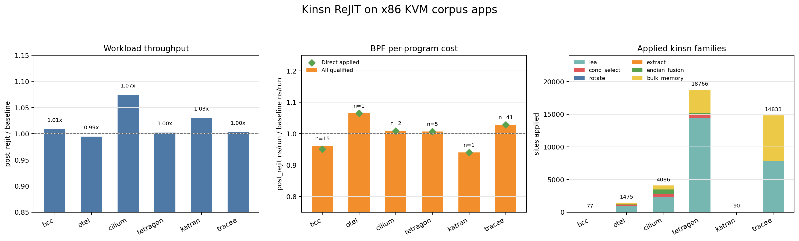
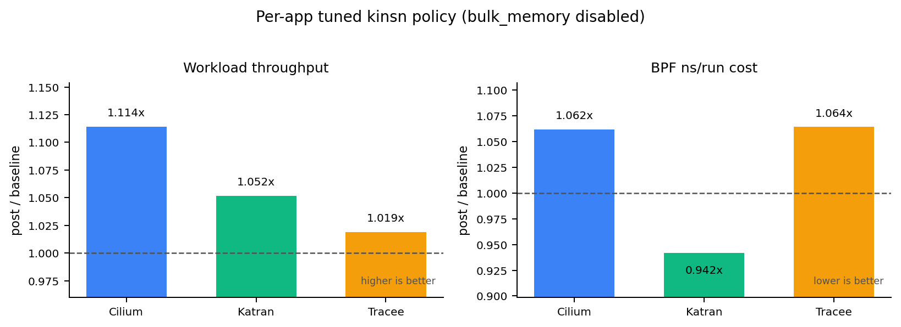

# Kinsn ReJIT Corpus Evaluation

Last updated: 2026-06-05

This is the paper-facing evaluation note for kinsn-based ReJIT on the x86 KVM
corpus. The benchmark framework records raw counters and workload payloads
only; all ratios, tables, figures, and interpretation below are post-hoc
analysis. Detailed commands, artifact paths, debugging history, and caveats
are preserved in the appendices.

## Paper Framing

Kinsn ReJIT replaces selected BPF bytecode patterns with calls to in-kernel
kfunc-like instruction modules. The evaluation is narrower than the native
execution evaluation: it asks whether the LLVM/bytecode selector can find real
corpus patterns, whether the transformed programs still pass ReJIT and run
the application workloads, and whether the extra kfunc call path pays for
itself in measured BPF and workload costs.

The current research questions are:

- **RQ1 Correctness:** does the kinsn umbrella pass preserve real corpus app
  startup, loadtime ReJIT, and measured workload execution?
- **RQ2 Apply coverage:** which kinsn families are actually applied on the
  x86 corpus, and are rotate/extract/endian/bulk-memory patterns still missing?
- **RQ3 BPF per-program cost:** among retained BPF counter rows, does kinsn
  reduce per-program `ns/run` relative to the baseline eBPF JIT?
- **RQ4 End-to-end workload impact:** does kinsn improve application workload
  throughput after BPF stats overhead is removed?

Headline result: **on x86 KVM, the expanded kinsn selector applies `39,327`
sites across all six corpus apps with zero loadtime skips or errors.**
Coverage now includes the previously missing families: rotate (`64` sites),
extract (`92`), endian_fusion (`1,112`), and bulk_memory (`11,343`). Workload
throughput is slightly positive (`1.019x` post/baseline geomean), while BPF
per-program cost is essentially neutral/slightly negative (`1.009x`
post/baseline all-qualified geomean; lower is faster).

The narrow claim supported by the current x86 KVM data is: the policy is not
filtering these kinsn families out, and the selector now reaches real corpus
bytecode shapes for rotate, extract, endian fusion, and bulk memory. The
current data does **not** support claiming a broad BPF-counter speedup from
all-force kinsn; the coverage fix is real, but the kfunc call path and selected
site mix are near neutral overall.

## Experimental Setup

All runs in this note use the repository `make` entrypoints on x86 KVM. The
kernel/runtime image is the repository default build used by `make corpus`.

Corpus runs cover six real applications: `bcc/set`,
`otelcol-ebpf-profiler/profiling`, `cilium/agent`, `tetragon/observer`,
`katran`, and `tracee/monitor`. Each corpus workload uses `SAMPLES=3`,
`WORKLOAD_DURATION=180`, and `WARMUPS=1`. The corpus apps were collected one
at a time to preserve app-specific artifacts and avoid a single long run
masking which app failed.

Two corpus datasets are used:

- **BPF stats on:** `BPFREJIT_CORPUS_BPF_STATS=1`, used for BPF per-program
  `ns/run` counters and loadtime kinsn apply reports.
- **BPF stats off:** `BPFREJIT_CORPUS_BPF_STATS=0`, used for workload
  throughput without BPF stats overhead.

The kinsn command template was:

```sh
BPFREJIT_CORPUS_APPS='<app>' \
BPFREJIT_BENCH_PASSES=kinsn \
BPFREJIT_CORPUS_BPF_STATS='<0-or-1>' \
SAMPLES=3 WORKLOAD_DURATION=180 WARMUPS=1 \
BPFREJIT_CORPUS_APP_TIMEOUT=3600 \
BPFREJIT_CORPUS_REJIT_TIMEOUT=1200 \
TIMEOUT=7200 KEEP_WORKDIRS=1 \
make corpus
```

Policy/gate status:

- `corpus/config/benchmark_config.yaml` maps `kinsn` to the single kinsn
  umbrella pass and keeps the kinsn-class pass names in the `full-x86` list.
- `runner/config/passes/kinsn/default.yaml` is the default full-kinsn
  entrypoint. It invokes `bpfopt --pass kinsn` without pass-local selector
  overrides, so the effective policy comes from the bpfopt umbrella default.
  The authoritative artifacts in this note did not use app-specific kinsn YAML
  disables or per-program overrides.
- `bpfopt/llvm/src/main.cpp` treats `kinsn`, `rotate`, `cond_select`,
  `extract`, `endian_fusion`, `bulk_memory`, `lea`, `prefetch`, and `ccmp` as
  kinsn passes. The `kinsn` umbrella default is
  `all=force,movbe-load=disable` for LLVM selector mode, while bytecode
  recovery is enabled for the umbrella bytecode families
  (`rotate`, `extract`, `endian_fusion`, `bulk_memory`, and `prefetch`). This
  is a selector-mode default, not a corpus/app filter. The remaining explicit
  x86 exception, `movbe-load=disable`, does not disable the observed endian
  `movbe-be` path; Katran still produced `bpf_x86_movbe32` sites.
- `ccmp` is arm64-only in this target set, so the x86 corpus is not expected
  to report ccmp sites. `prefetch` is enabled in the target list but had zero
  x86 corpus hits in this run.
- Current post-evaluation tooling also supports a pass-local
  `--bytecode-kinsn-mode` override for controlled ablations, and new
  per-program kinsn reports include a `kinsn_policy` provenance block with the
  effective LLVM selector arguments and bytecode-family enables. This is
  provenance/tuning infrastructure; it does not change the `kinsn` default.
  The older authoritative artifacts above predate `kinsn_policy`, so their
  effective policy is reconstructed from `loadtime-plans/*.json` plus the
  bpfopt default described here.

## Methodology

Corpus workload throughput is computed from raw per-app workload payloads.
For `stress-ng`, the analysis sums real-time `bogo ops/s` across configured
stressors in each sample. For kernel `pktgen`, it sums `pps` across
components or threads. For the OTEL mixed workload, it sums each worker's
`ops / elapsed_s` and includes the `stress-ng cpu` component's real-time
`bogo ops/s`. These units are app-local, so only ratios within the same app
are meaningful.

Corpus BPF per-program cost uses the kinsn paper-grade paired-row method:

```text
baseline_avg_ns_per_run = baseline_run_time_ns_delta / baseline_run_cnt_delta
post_avg_ns_per_run = post_run_time_ns_delta / post_run_cnt_delta
ratio = post_avg_ns_per_run / baseline_avg_ns_per_run
```

Rows with `min(baseline_runs, post_runs) < 100` are dropped. Programs are
paired by `(name, type, occurrence index)` after grouping each phase by BPF
program name and type. The reported BPF aggregate is the per-program geomean
of retained ratios; lower than `1.0x` means lower BPF cost after kinsn.

The "direct applied" BPF subset is a conservative automated subset: retained
counter rows whose truncated `bpftool` name matches a program with
`sites_applied > 0`. It does not fully implement the affected-population rule
for tail-call descendants. Tail-called programs can report zero own
`run_cnt_delta`; their work is charged to the directly attached caller.

Loadtime apply coverage is read from raw loadtime reports. The report's
`sites_applied`, `sites_matched`, `sites_skipped`,
`kinsn_calls_by_family`, and `kinsn_calls_by_name` fields are checked
post-hoc for consistency. Newer reports also include `kinsn_policy`, which is
used only to audit which selector policy produced a program's transformed
bytecode. No framework code computes these summaries.

## Main Results

Latest authoritative datasets are complete: six corpus apps with BPF stats
enabled and six corpus apps with BPF stats disabled. All app artifacts
completed with `status=ok` and empty app error strings.



*Figure 1: x86 KVM kinsn corpus result. Workload throughput uses
post/baseline ratios from stats-off artifacts, higher is better. BPF cost uses
per-program geomean post/baseline `ns/run` from stats-on artifacts, lower is
better. Apply coverage is decoded from loadtime reports and split by kinsn
family.*

Workload throughput. The `post/baseline` headline is the unweighted geomean
across the six app ratios (`1.019x`):

| App | baseline throughput | post-ReJIT throughput | post/baseline | sample ratios |
| --- | ---: | ---: | ---: | --- |
| `bcc` | 700402.34 | 706534.72 | 1.009x | 1.007x, 1.008x, 1.012x |
| `otel` | 107111792.00 | 106520721.92 | 0.994x | 0.994x, 0.995x, 1.002x |
| `cilium` | 1417663.00 | 1522942.00 | 1.074x | 1.074x, 1.053x, 1.163x |
| `tetragon` | 353658.27 | 354430.46 | 1.002x | 1.012x, 1.000x, 1.017x |
| `katran` | 2929650.00 | 3018390.00 | 1.030x | 1.041x, 1.032x, 1.016x |
| `tracee` | 453239.03 | 454716.87 | 1.003x | 1.002x, 1.006x, 1.002x |

Corpus BPF per-program counters. The global all-qualified BPF per-program
geomean is `1.009x` over `65` retained rows. The direct self-applied geomean
is `1.010x` over `61` retained rows:

| App | retained rows | all-qualified geomean | wins/losses/ties | direct applied rows | direct applied geomean |
| --- | ---: | ---: | ---: | ---: | ---: |
| `bcc` | 15 | 0.961x | 11/4/0 | 11 | 0.950x |
| `otel` | 1 | 1.065x | 0/1/0 | 1 | 1.065x |
| `cilium` | 2 | 1.009x | 1/1/0 | 2 | 1.009x |
| `tetragon` | 5 | 1.007x | 2/3/0 | 5 | 1.007x |
| `katran` | 1 | 0.940x | 1/0/0 | 1 | 0.940x |
| `tracee` | 41 | 1.028x | 14/27/0 | 41 | 1.028x |
| `total` | 65 | 1.009x | 29/36/0 | 61 | 1.010x |

Loadtime apply coverage:

| App | reports | applied programs | sites applied | sites matched | skipped | errors |
| --- | ---: | ---: | ---: | ---: | ---: | ---: |
| `bcc` | 77 | 25 | 77 | 77 | 0 | 0 |
| `otel` | 17 | 15 | 1475 | 1475 | 0 | 0 |
| `cilium` | 169 | 131 | 4086 | 4086 | 0 | 0 |
| `tetragon` | 308 | 290 | 18766 | 18766 | 0 | 0 |
| `katran` | 6 | 1 | 90 | 90 | 0 | 0 |
| `tracee` | 182 | 169 | 14833 | 14833 | 0 | 0 |
| `total` | 759 | 631 | 39327 | 39327 | 0 | 0 |

Applied kinsn families:

| App | LEA | cond_select | rotate | extract | endian_fusion | bulk_memory | prefetch | total |
| --- | ---: | ---: | ---: | ---: | ---: | ---: | ---: | ---: |
| `bcc` | 66 | 0 | 0 | 0 | 0 | 11 | 0 | 77 |
| `otel` | 983 | 166 | 0 | 45 | 99 | 182 | 0 | 1475 |
| `cilium` | 2346 | 385 | 0 | 2 | 766 | 587 | 0 | 4086 |
| `tetragon` | 14453 | 414 | 44 | 44 | 220 | 3591 | 0 | 18766 |
| `katran` | 39 | 0 | 20 | 1 | 11 | 19 | 0 | 90 |
| `tracee` | 7841 | 23 | 0 | 0 | 16 | 6953 | 0 | 14833 |
| `total` | 25728 | 988 | 64 | 92 | 1112 | 11343 | 0 | 39327 |

Representative x86 kinsn names by family:

| Family | Sites | Representative emitted kinsns |
| --- | ---: | --- |
| `lea` | 25728 | `bpf_x86_leaq`, `bpf_x86_leal` |
| `cond_select` | 988 | `bpf_x86_cmp_cmovb`, `bpf_x86_cmp_cmove`, `bpf_x86_cmp_cmovne` |
| `rotate` | 64 | `bpf_x86_rorxl` |
| `extract` | 92 | `bpf_x86_bextrq`, `bpf_x86_shrdq` |
| `endian_fusion` | 1112 | `bpf_x86_rolw`, `bpf_x86_bswapl`, `bpf_x86_bswapq`, `bpf_x86_movbe32` |
| `bulk_memory` | 11343 | `bpf_x86_movq`, `bpf_x86_movl`, `bpf_x86_movzbl`, `bpf_x86_movb`, `bpf_x86_movzwl` |
| `prefetch` | 0 | no x86 corpus hit |

## RQ Answers

**RQ1 Correctness.** The authoritative kinsn corpus completed all six x86 KVM
apps in both stats-on and stats-off modes with `status=ok`, empty app error
strings, and three measured workload samples per phase. Loadtime reports show
`39,327` matched/applied sites, `0` skipped sites, and `0` report errors.
Katran still records large raw `pktgen` workload-side `errors:` counts, as in
earlier corpus runs; these are preserved raw payload fields and did not
surface as app, loadtime, or ReJIT failures.

**RQ2 Apply coverage.** Rotate, extract, endian_fusion, and bulk_memory are no
longer zero in the real x86 corpus. Katran alone proves real rotate and endian
sites with `20` `bpf_x86_rorxl` sites plus `bpf_x86_movbe32`/`bswap` sites in
`balancer_ingres`. Tetragon contributes `44` more rotate sites and large bulk
memory coverage. OTEL, Cilium, Tetragon, Katran, and Tracee all contribute
non-LEA/non-cond-select coverage. `ccmp` remains arm64-only, and `prefetch`
had no x86 corpus hit in this run.

**RQ3 BPF per-program cost.** Kinsn is near neutral/slightly slower on the
current retained BPF counter population: `1.009x` all-qualified cost and
`1.010x` direct-self-applied cost. BCC and Katran improve (`0.961x`,
`0.940x` all-qualified), Cilium and Tetragon are neutral (`1.009x`,
`1.007x`), and OTEL/Tracee regress in the retained rows (`1.065x`,
`1.028x`). The coverage expansion therefore should not be represented as a
finished performance win; it exposes the next optimization targets.

**RQ4 End-to-end workload impact.** Workload throughput is slightly positive:
`1.019x` post/baseline geomean across six app workloads. Cilium (`1.074x`) and
Katran (`1.030x`) are the clear positive apps; BCC, Tetragon, and Tracee are
near neutral; OTEL is slightly lower (`0.994x`). The workload result is more
positive than the retained BPF counter geomean because application-level noise,
tail-call accounting, and non-BPF work can dominate small per-program counter
differences.

## Per-App Tuned Result

After the full-kinsn corpus run, the best workload-oriented policy among the
tested full versus no-bulk configurations was to keep the umbrella `kinsn`
pass but disable `bulk_memory` for Cilium, Katran, and Tracee only:

```sh
bpfopt --pass kinsn ... -- \
  --kinsn-mode all=force,wide-load=disable,indexed-load=disable,movbe-load=disable \
  --bytecode-kinsn-mode bulk_memory=disable
```

This is implemented as app-specific pass config under
`runner/config/passes/kinsn/{cilium,katran,tracee}.yaml`; the default
`runner/config/passes/kinsn/default.yaml` remains full-kinsn and is not changed
into no-bulk.

The tuned run used the same setup as the authoritative corpus runs:
`SAMPLES=3`, `WORKLOAD_DURATION=180`, `WARMUPS=1`,
`BPFREJIT_BENCH_PASSES=kinsn`, and the app subset
`tracee/monitor,cilium/agent,katran`. The stats-on artifact is
`corpus/results/x86_kvm_corpus_20260604_232313_992341`; the stats-off artifact
is `corpus/results/x86_kvm_corpus_20260605_004607_636479`.



*Figure 2: per-app tuned kinsn result for Cilium, Katran, and Tracee.
Workload ratios use stats-off artifacts, higher is better. BPF cost ratios use
stats-on artifacts, lower is better. This figure is not a full-corpus result;
it isolates the three app-specific no-bulk overrides.*

Workload throughput improved on all three tuned apps, with a `1.061x`
three-app geomean:

| App | full-kinsn workload ratio | tuned workload ratio | tuned sample ratios | workload note |
| --- | ---: | ---: | --- | --- |
| `cilium` | 1.074x | 1.114x | 1.102x, 1.128x, 1.112x | strongest tuned workload win, no pktgen errors |
| `katran` | 1.030x | 1.052x | 1.070x, 1.041x, 1.044x | stable packet-path win; raw pktgen errors remain workload payload fields |
| `tracee` | 1.003x | 1.019x | 1.016x, 1.023x, 1.017x | smaller but consistent stress-ng throughput win |

The same run confirms that all three overrides really disabled bulk-memory
while keeping the other families enabled:

| App | sites applied | LEA | cond_select | rotate | extract | endian_fusion | bulk_memory |
| --- | ---: | ---: | ---: | ---: | ---: | ---: | ---: |
| `cilium` | 3512 | 2359 | 385 | 0 | 2 | 766 | 0 |
| `katran` | 71 | 39 | 0 | 20 | 1 | 11 | 0 |
| `tracee` | 7898 | 7859 | 23 | 0 | 0 | 16 | 0 |

BPF counters do not support the same three-app claim. Katran remains a clear
BPF-counter win (`0.942x`, one retained hot XDP row), but Cilium and Tracee
were slower in the 2026-06-04 stats-on rerun (`1.062x` and `1.064x`). Tracee's
hash-based pairing confirms this is not an occurrence-index pairing artifact.
The useful claim from the tuned dataset is therefore workload-level for
Cilium/Katran/Tracee, plus a BPF-counter win for Katran.

## Discussion

The important corrective result is coverage, not headline speedup. Earlier
corpus artifacts reported zero rotate/extract/endian/bulk-memory sites because
the selector was too narrow for real BPF bytecode after round-trip through the
corpus loader path. The current run uses the kinsn umbrella pass plus bytecode
recovery, so patterns that do not survive as the narrow original MachineInstr
tree can still be recovered from final BPF bytecode. This is why Katran and
Tetragon now expose `rorxl`, why OTEL/Tetragon/Katran expose `bextrq`/`shrdq`,
why Cilium and Katran expose endian-fusion patterns, and why bulk-memory
`mov*` kinsns appear broadly.

This run also clarifies policy versus selector behavior. There is no
benchmark-level policy filter preventing these pass names from running under
`kinsn`, and the default kinsn pass remains full-kinsn. The remaining explicit
x86 selector default is `movbe-load=disable` in the umbrella mode; this does
not disable the observed endian `movbe-be` path. `prefetch=0` should be read
as "enabled but no matched corpus shape," not as a corpus gate.

A follow-up no-bulk ablation was used only to guide selector tuning. It added
a controlled way to disable `bulk_memory` while keeping the single umbrella
kinsn pass, and it confirmed that `bulk_memory` can dominate regressions in
some apps. On the five apps that completed under that ablation, BPF
per-program geomean improved from `1.009x` full-kinsn to `0.966x` no-bulk
over the matched retained rows; Tracee improved from `1.028x` to `0.920x`,
Cilium from `1.009x` to `0.935x`, and Katran from `0.940x` to `0.936x`.
However, Tetragon failed under no-bulk with a load-time `EINVAL`, and BCC/OTEL
regressed. This is not a replacement default policy; it motivates per-app or
per-program tuning with full-kinsn as the fallback.

The later per-app tuned rerun above keeps that fallback model: full-kinsn stays
the default, while Cilium, Katran, and Tracee use an app-specific no-bulk
override because it is the best workload policy among the tested full versus
no-bulk configurations. The BPF-counter repeatability is weaker than the
workload signal for Cilium and Tracee, so those apps should be reported as
workload wins, not BPF-counter wins.

The BPF counter result should be read with the tail-call accounting caveat from
`AGENTS.md`: many tail-called programs report zero own runtime counters, so
savings or regressions in tail-call descendants are charged to the directly
attached caller. The direct-self-applied subset here is conservative and does
not fully reconstruct call-tree affected populations.

The next performance work is therefore site selection and cost modeling, not
more benchmark policy. The selector can now find real corpus sites; the
question is which site families should be forced by default, which should be
profile- or cost-gated, and which kfunc bodies need lower call/setup overhead.

## Artifacts

Post-hoc script and generated data:

- Script: `docs/tmp/kinsn_eval_20260604.py`
- Summary: `docs/tmp/kinsn_eval_20260604_summary.md`
- Figure: `docs/figures/eval-kinsn-corpus-20260604.png`
- Tuned 3-app figure:
  `docs/figures/eval-kinsn-tuned-3app-20260605.png`

Authoritative stats-on/stats-off artifacts:

| App | stats-on artifact | stats-off artifact |
| --- | --- | --- |
| `bcc` | `corpus/results/x86_kvm_corpus_20260604_060059_192193` | `corpus/results/x86_kvm_corpus_20260604_090456_427289` |
| `otel` | `corpus/results/x86_kvm_corpus_20260604_063237_481303` | `corpus/results/x86_kvm_corpus_20260604_093627_878868` |
| `cilium` | `corpus/results/x86_kvm_corpus_20260604_070210_639497` | `corpus/results/x86_kvm_corpus_20260604_100557_313063` |
| `tetragon` | `corpus/results/x86_kvm_corpus_20260604_073221_306100` | `corpus/results/x86_kvm_corpus_20260604_103609_366182` |
| `katran` | `corpus/results/x86_kvm_corpus_20260604_080246_742228` | `corpus/results/x86_kvm_corpus_20260604_110614_563901` |
| `tracee` | `corpus/results/x86_kvm_corpus_20260604_083301_316989` | `corpus/results/x86_kvm_corpus_20260604_113548_863406` |

Per-app tuned artifacts:

| Scope | stats-on artifact | stats-off artifact |
| --- | --- | --- |
| `cilium,katran,tracee` no-bulk overrides | `corpus/results/x86_kvm_corpus_20260604_232313_992341` | `corpus/results/x86_kvm_corpus_20260605_004607_636479` |

## Previous Results

These older results are retained for history and for explaining why the
selector expansion mattered. They are not the current authoritative kinsn
result because they predate the full bytecode recovery coverage measured
above.

**2026-06-03 all-force result.** Artifact
`corpus/results/x86_kvm_corpus_20260603_175429_964295`; smoke alias artifact
`corpus/results/x86_kvm_corpus_20260603_185015_116803`; post-hoc script
`docs/tmp/kinsn_all_force_eval_20260603.py`; figure
`docs/figures/eval-kinsn-all-force-corpus-20260603.png`. It completed all six
apps with `status=ok`, applied `27,085` sites across `631` applied loadtime
rows, and reported `1.081x` workload geomean, `0.938x` all-qualified BPF
geomean, and `0.933x` direct-self-applied BPF geomean. Its family split was
LEA plus cond_select only (`26,097` LEA, `988` cond_select); rotate, extract,
endian_fusion, bulk_memory, and prefetch were zero because the selector was
still too narrow for real corpus bytecode shapes.

**2026-06-02 LEA result.** Artifact
`corpus/results/x86_kvm_corpus_20260602_141656_778399`; post-hoc script
`docs/tmp/kinsn_eval_20260602.py`; figure
`docs/figures/eval-kinsn-lea-corpus-20260602.png`. This SAMPLES=1 LEA-only
run completed all six apps with `status=ok`, applied `22,476` LEA sites, and
reported `1.187x` workload geomean, `0.860x` all-qualified BPF geomean, and
`0.873x` direct-self-applied BPF geomean. It proved the x86 LEA policy path
was no longer a no-op, but it did not test the broader selector families.

**2026-05-31 kinsn-6 result.** Command:
`BPFREJIT_BENCH_PASSES=kinsn-6 SAMPLES=3 WORKLOAD_DURATION=180 TIMEOUT=7200 make corpus`.
This run completed all six apps with `status=ok`; its key result was fused
x86 `cond_select` coverage (`320` sites across `82` programs) and a
direct-self-applied BPF geomean of `0.944x`. The all-qualified BPF geomean was
`1.010x`, so it was a correctness and targeted-direct-row result rather than
a broad corpus speedup.
