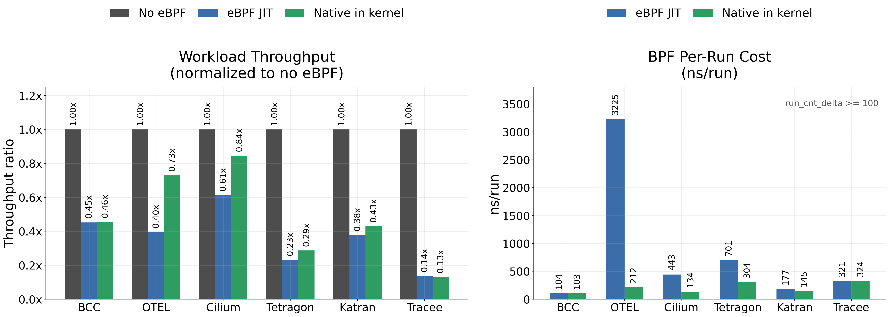
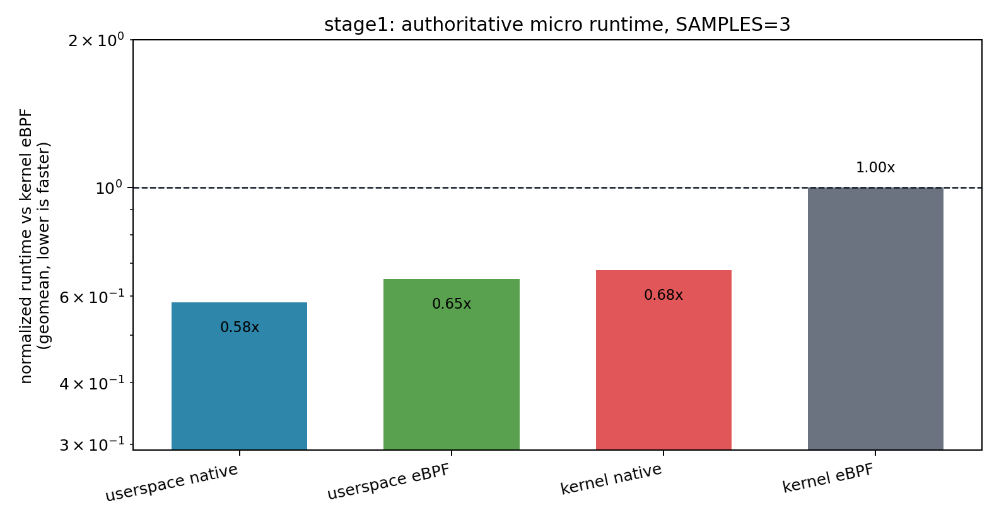
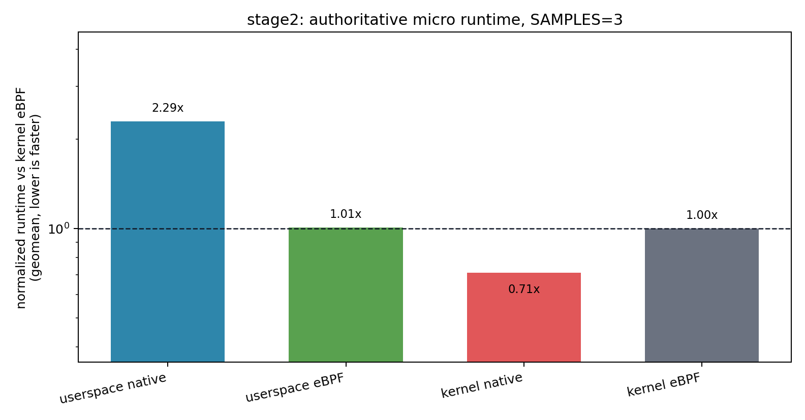

# Native Kernel Execution Evaluation

Last updated: 2026-05-27

This is the paper-facing evaluation note for the native-in-kernel execution
path. The benchmark framework records raw counters and workload payloads only;
all ratios, tables, figures, and interpretation below are post-hoc analysis.
Detailed commands, artifact paths, debugging history, and caveats are preserved
in the appendices.

## Paper Framing

Native execution is evaluated at two levels. Microbenchmarks isolate BPF
instruction execution and helper/map boundary costs under controlled test-run
workloads. Corpus benchmarks measure end-to-end application impact after real
production eBPF applications load their own programs through their normal
startup paths.

The current research questions are:

- **RQ1 Correctness:** does native execution preserve microbenchmark outputs
  and load real corpus applications without startup or workload failures?
- **RQ2 Micro execution cost:** how do userspace native, userspace eBPF,
  kernel native, and kernel eBPF compare on the stage1/stage2 micro suites?
- **RQ3 BPF per-run cost in real apps:** once real apps are running, does
  kernel native reduce measured BPF `ns/run` relative to the kernel eBPF JIT?
- **RQ4 End-to-end workload impact:** does lower BPF execution cost translate
  into higher application workload throughput?

Headline result: **on x86 KVM, kernel-native execution improves workload
throughput by `1.23x` unweighted geomean over eBPF JIT across six real-app
workloads, with four wins, one neutral result, and one slight regression.** It
also reduces aggregate BPF `ns/run` in five of the six retained counter
populations.

The narrow claim supported by the current x86 KVM data is: native kernel
execution is consistently positive on controlled microbenchmarks, and it fixes
the previous Tetragon native-path slowdown at the BPF counter level. The
end-to-end workload result is app-dependent because BPF instruction execution
is only one part of tracing/security/networking application cost.

## Experimental Setup

All runs in this note use the repository `make` entrypoints on x86 KVM. The
kernel/runtime image is the repository default build used by `make micro` and
`make corpus`.

Micro runs use `SAMPLES=3`, `WARMUPS=0`, and `INNER_REPEAT=100000`. The tested
runtimes are `kernel` (kernel eBPF JIT), `native_kernel` (native object loaded
into the kernel native path), `llvmbpf` (userspace eBPF), and `native`
(userspace native).

Corpus runs cover six real applications: `bcc/set`,
`otelcol-ebpf-profiler/profiling`, `cilium/agent`, `tetragon/observer`,
`katran`, and `tracee/monitor`. Each corpus workload uses `SAMPLES=3` and
`WORKLOAD_DURATION=180`. The default corpus warmup is one uncounted workload
pass per phase.

Three corpus datasets are used:

- **BPF stats on:** native-post runs with BPF runtime counters enabled, used
  for per-run `ns/run`.
- **BPF stats off:** native-post six-app run with BPF runtime counters
  disabled, used for workload throughput without BPF stats overhead.
- **Workload-only:** six-app no-agent/no-eBPF baseline, used as the workload
  throughput denominator.

The Cilium corpus result is a steady-state datapath measurement. The runner
disables runtime reload/regeneration controllers and pauses `cilium-agent`
during measured workload samples after endpoint setup; it is not a Cilium
control-plane throughput benchmark.

## Methodology

Micro analysis follows the same method as `docs/micro-bench-status.md`: each
benchmark/runtime pair records three samples, correctness is gated by exact
expected-result checks, and aggregate runtime ratios are geomeans normalized to
kernel eBPF (`kernel = 1.0`; lower is faster).

Corpus workload throughput is computed only from raw per-app workload payloads.
For `stress-ng`, the analysis sums real-time `bogo ops/s` across configured
stressors in each sample. For kernel `pktgen`, it sums `pps` across components
or threads. For the OTEL mixed workload, it sums each worker's
`ops / elapsed_s` and includes the `stress-ng cpu` component's real-time
`bogo ops/s`. These units are app-local, so only ratios within the same app
are meaningful.

Workload intent and limits:

| App | Domain | Generator | Intended hot path | Interpretation limit |
| --- | --- | --- | --- | --- |
| `bcc/set` | tracing tools | `stress-ng` fast syscalls, cap, set, sockfd | syscall tracepoint/kprobe dispatch | synthetic high-rate syscall mix |
| `otel` | continuous profiling | language interpreter loops plus `stress-ng cpu` | perf-event sampling and unwind tail-call chain | CPU-loop profiler workload, not a full service |
| `cilium` | Kubernetes datapath | bidirectional endpoint `pktgen` | steady-state endpoint datapath | control plane paused during measured phase |
| `tetragon` | runtime security | `stress-ng` eventfd, mmap, UDP, sock, sockfd, sockpair | generic tracepoint/kprobe event path | synthetic policy-hot syscall/socket mix |
| `katran` | L4 XDP load balancer | kernel `pktgen` UDP to VIP | standalone XDP balancer ingress | datapath-only packet generator |
| `tracee` | runtime security | `stress-ng` cap, set, sigfd, eventfd, kill, futex, prctl | syscall tracing/security hooks | synthetic syscall mix |

Corpus BPF per-run cost is computed from the BPF-stats-on artifacts. The
analysis keeps records with `run_cnt_delta >= 100`, then computes aggregate
`ns/run` per phase as:

```text
ns_per_run = sum(run_time_ns_delta) / sum(run_cnt_delta)
```

The BPF table also reports `native/eBPF cost` and `speedup =
eBPF_ns_per_run / native_ns_per_run`, but the main corpus figure plots raw
`ns/run` bars for direct inspection. This is a run-weighted aggregate over the
retained counter population, not a per-program paired geomean and not a claim
that every retained BPF program improved.

## Main Results

Latest authoritative datasets are all complete: micro stage1, micro stage2,
six-app corpus with BPF stats enabled, six-app corpus with BPF stats disabled,
and six-app workload-only no-agent/no-eBPF baseline.



*Figure 1: Corpus end-to-end workload throughput and aggregate BPF per-run
cost. The left subplot normalizes workload throughput to the no-agent/no-eBPF
baseline for each app. The right subplot reports raw aggregate BPF `ns/run`
for the retained counter population (`run_cnt_delta >= 100`). For workload
throughput, higher is better. For BPF `ns/run`, lower is better.*





*Figures 2-3: Micro runtime normalized to kernel eBPF. Lower is faster.*

Micro four-runtime result:

| Suite | userspace native | userspace eBPF | kernel native | kernel eBPF |
| --- | ---: | ---: | ---: | ---: |
| Stage1 normalized runtime | 0.58x | 0.65x | 0.68x | 1.00x |
| Stage2 normalized runtime | 2.29x | 1.01x | 0.71x | 1.00x |

Corpus workload throughput. The `native/eBPF` headline is the unweighted
geomean across the six per-app ratios (`1.23x`):

| App | no-agent/no-eBPF throughput | eBPF/no-eBPF | native/no-eBPF | native/eBPF |
| --- | ---: | ---: | ---: | ---: |
| `bcc` | 1574097 | 0.45x | 0.46x | 1.01x |
| `otel` | 110063016 | 0.40x | 0.73x | 1.84x |
| `cilium` | 2373714 | 0.61x | 0.84x | 1.38x |
| `tetragon` | 1559214 | 0.23x | 0.29x | 1.24x |
| `katran` | 7507097 | 0.38x | 0.43x | 1.14x |
| `tracee` | 3327639 | 0.14x | 0.13x | 0.95x |

Native/eBPF workload sample spread:

| App | native/eBPF samples | Mean | CV |
| --- | --- | ---: | ---: |
| `bcc` | 1.006x, 1.008x, 1.005x | 1.007x | 0.1% |
| `otel` | 1.791x, 1.877x, 1.865x | 1.844x | 2.5% |
| `cilium` | 1.374x, 1.387x, 1.379x | 1.380x | 0.5% |
| `tetragon` | 1.211x, 1.216x, 1.285x | 1.237x | 3.3% |
| `katran` | 1.133x, 1.136x, 1.137x | 1.135x | 0.1% |
| `tracee` | 0.961x, 0.957x, 0.942x | 0.954x | 1.0% |

Corpus BPF per-run counters, reported as run-weighted aggregate `ns/run` over
retained records:

| App | eBPF ns/run | native ns/run | native/eBPF cost | speedup | retained eBPF/native |
| --- | ---: | ---: | ---: | ---: | ---: |
| `bcc` | 103.8 | 102.9 | 0.99x | 1.01x | 15/16 |
| `otel` | 3224.9 | 212.1 | 0.07x | 15.21x | 2/1 |
| `cilium` | 443.5 | 133.5 | 0.30x | 3.32x | 2/4 |
| `tetragon` | 701.2 | 304.1 | 0.43x | 2.31x | 21/23 |
| `katran` | 177.3 | 144.9 | 0.82x | 1.22x | 1/1 |
| `tracee` | 321.4 | 324.4 | 1.01x | 0.99x | 41/41 |

## RQ Answers

**RQ1 Correctness.** The authoritative micro artifacts have zero expected
result mismatches across all tested runtimes. The authoritative corpus
artifacts complete for all six apps with status `ok`, empty app error strings,
three measured workload samples per app, and no final-artifact `panic`,
`phase_error`, `load program: no such file`, or incompatible map-spec failures.

**RQ2 Micro execution cost.** Kernel native is faster than kernel eBPF on both
current micro suites: `0.68x` normalized runtime on stage1 and `0.71x` on
stage2. Userspace native is faster than kernel eBPF on stage1 but slower on
stage2 because stage2 includes helper/map-heavy paths where userspace-native
emulation is not a kernel ABI comparison.

**RQ3 BPF per-run cost in real apps.** Native reduces run-weighted aggregate
BPF `ns/run` on five of six retained counter populations and is
neutral/slightly slower on Tracee. Tetragon's previous native slowdown is
fixed: aggregate BPF per-run cost is now `304.1 ns/run` versus `701.2 ns/run`
for eBPF (`0.43x` cost, `2.31x` speedup).

**RQ4 End-to-end workload impact.** Native improves workload throughput by
`1.23x` unweighted geomean across the six app workloads. It improves over eBPF
on OTEL (`1.84x`), steady-state Cilium datapath (`1.38x`), Tetragon (`1.24x`),
and Katran (`1.14x`), is neutral on BCC (`1.01x`), and is slightly lower on
Tracee (`0.95x`). The no-agent/no-eBPF baseline remains much faster for several
tracing/security workloads, showing that hook frequency, event construction,
map traffic, perf/ring-buffer traffic, and application-side processing remain
major costs outside BPF instruction execution.

## Discussion

The results do not support the blanket claim that native-in-kernel execution is
always faster end to end. They do support a narrower and more defensible claim:
the native path lowers BPF execution cost in the controlled micro suites and in
most real-app retained counter populations, but the amount visible at workload
level depends on how much of the app's critical path is actually BPF
instruction execution.

The Tetragon investigation is the most important corrective result. The earlier
slowdown was not explained by helper indirect calls alone; current hot helper
calls are patched to direct calls. The real blockers exposed by the corpus run
were startup correctness and native-loader/app metadata mismatches: manifest
no-match handling, native replacement fd semantics, app-visible program-info
queries, stale fd reuse, and Tetragon map-id assumptions.

OTEL's `15.21x` aggregate BPF `ns/run` speedup is dominated by the directly
attached `native_tracer_entry` perf-event program. In the BPF-stats artifact,
baseline `native_tracer_e` ran 420.7M times at 3224.9 ns/run, while the native
replacement ran 432.1M times at 212.1 ns/run. The tail-called
`perf_unwind_*` programs still report zero own `run_cnt`, so their work is
charged to this caller. Inspection of the saved BPF bytecode and native object
shows a concrete hot-path cause: `get_pristine_per_cpu_record()` expands in
eBPF into many per-field stores, including the unrolled custom-label clear,
while the native object lowers the same contiguous clear to one kernel
`memset(..., 0x29c)` call. This is a real native-code advantage for this
profiler workload, but it is a caller-accounted OTEL-chain result rather than a
per-tail-target counter result. The tail call itself still matters, but mostly
as accounting and control-flow structure here: the link-time x86 native path
does not leave `bpf_tail_call` as an ordinary helper call; it lowers the
placeholder into an inline prog-array bounds check, tail-call-count check,
native cleanup, and `jmp` to `bpf_prog->bpf_func + X86_TAIL_CALL_OFFSET`.
That cost is real on deep unwind chains, but it is not the dominant explanation
for the observed OTEL entry speedup.

BCC is neutral because its hottest retained programs are already tiny and
kernel-JIT efficient. The dominant `sys_enter`/`sys_exit` tracepoints run about
3.5B times each and stay essentially unchanged (`79.9 -> 80.7 ns/run` and
`85.8 -> 85.1 ns/run`); the expensive `tracepoint__sys` instance is also
unchanged (`1212 -> 1220 ns/run`). Native shrinks translated bytecode for many
programs, but the remaining cost is hook dispatch, helper/map work, and fixed
entry/exit overhead that native code does not remove.

Tracee is a slight regression for the same reason plus cancellation among hot
raw-tracepoint dispatchers. The four hottest raw tracepoint entries run about
1.6B times each: two improve (`198.9 -> 168.9 ns/run`, `421.1 -> 404.0
ns/run`) and two regress (`356.2 -> 374.6 ns/run`, `358.1 -> 381.2 ns/run`).
Tracee's workload path also includes event construction, tail-call dispatch,
map traffic, and userspace event processing, so a near-neutral BPF `ns/run`
result can still appear as a small workload throughput loss.

Cilium also needs careful interpretation. The measured result is steady-state
datapath throughput after endpoint setup. The runner disables drift checker,
dynamic config, dynamic lifecycle manager, endpoint BPF watchdog, and endpoint
regen interval, and stops `cilium-agent` during measured workload samples.
Those controls suppress runtime reload/regeneration during measurement. They
do not suppress required initial endpoint BPF build/regeneration during
startup, so the earlier repeated post-native loads were fixed as startup-path
and native-loader matching bugs, not as a missing autoreload flag.

## Threats To Validity

- Corpus results here are x86 KVM only; arm64 corpus remains a separate
  portability question.
- Workload throughput units differ by app. Cross-app absolute throughput is
  not a single physical unit; compare no-eBPF, eBPF, and native only within the
  same app.
- Native replacement programs are named `native_lab_stub`, so current corpus
  BPF results are app-level aggregates rather than strict program-name paired
  geomeans.
- BPF `ns/run` is a run-weighted aggregate over retained records, not a
  per-program distribution. It can be dominated by the hottest directly
  attached programs.
- Tail-called BPF programs do not increment their own `run_cnt`/`run_time` in
  normal kernel accounting. Their cost is accounted at the directly attached
  caller, so retained counter coverage must be interpreted through the call
  tree.
- Workload throughput uses the BPF-stats-off artifact to avoid stats overhead;
  BPF per-run uses the BPF-stats-on artifact. These answer different questions
  and should not be mixed as a single run. The artifacts were collected
  sequentially on the same x86 KVM setup and kernel image during the
  2026-05-26 to 2026-05-27 evaluation window, so time drift remains a possible
  source of variance even though the three-sample workload CVs are small.
- `SAMPLES=3` is sufficient for the current benchmark contract but is not a
  substitute for a full confidence-interval study over independent machine
  restarts. The table reports sample spread to make this limitation explicit.

## Appendix A: Artifact Manifest

| Dataset | Status | Generated at (UTC) | Mode | Artifact |
| --- | --- | --- | --- | --- |
| Micro stage1, 4 runtimes | complete | 2026-05-26T21:09:52 | micro | `micro/results/x86_kvm_micro_20260526_210952_650695/metadata.json` |
| Micro stage2, 4 runtimes | complete | 2026-05-26T21:04:34 | micro | `micro/results/x86_kvm_micro_20260526_210434_440390/metadata.json` |
| `bcc/set`, BPF stats on | complete | 2026-05-26T21:42:45 | stats on | `corpus/results/x86_kvm_corpus_20260526_211758_813406/metadata.json` |
| `otelcol-ebpf-profiler/profiling`, BPF stats on | complete | 2026-05-26T22:12:22 | stats on | `corpus/results/x86_kvm_corpus_20260526_214808_410996/metadata.json` |
| `cilium/agent`, BPF stats on | complete | 2026-05-26T23:27:22 | stats on | `corpus/results/x86_kvm_corpus_20260526_230251_020975/metadata.json` |
| `tetragon/observer`, BPF stats on | complete | 2026-05-27T00:50:35 | stats on | `corpus/results/x86_kvm_corpus_20260527_002557_893190/metadata.json` |
| `katran`, BPF stats on | complete | 2026-05-27T01:20:29 | stats on | `corpus/results/x86_kvm_corpus_20260527_005602_704153/metadata.json` |
| `tracee/monitor`, BPF stats on | complete | 2026-05-27T01:51:22 | stats on | `corpus/results/x86_kvm_corpus_20260527_012602_194852/metadata.json` |
| Six-app native, BPF stats off | complete | 2026-05-27T04:25:20 | stats off | `corpus/results/x86_kvm_corpus_20260527_015711_134639/metadata.json` |
| Six-app workload-only no-agent/no-eBPF | complete | 2026-05-27T05:44:16 | workload-only | `corpus/results/x86_kvm_corpus_20260527_043130_139245/metadata.json` |

## Appendix B: Reproduction Commands

Micro stage1:

```sh
RUNTIMES="native llvmbpf native_kernel kernel" \
SAMPLES=3 WARMUPS=0 INNER_REPEAT=100000 TIMEOUT=2400 \
make micro
```

Micro stage2:

```sh
SUITE=micro/config/micro_stage2.yaml \
RUNTIMES="native llvmbpf native_kernel kernel" \
SAMPLES=3 WARMUPS=0 INNER_REPEAT=100000 TIMEOUT=2400 \
make micro
```

Corpus native with BPF runtime counters enabled:

```sh
BPFREJIT_CORPUS_APPS="<one of the six apps listed above>" \
BPFREJIT_SHIM_NATIVE_LOADER=post SKIP_REJIT=norejit \
BPFREJIT_CORPUS_BPF_STATS=1 \
SAMPLES=3 WORKLOAD_DURATION=180 BPFREJIT_CORPUS_APP_TIMEOUT=3600 \
TIMEOUT=14400 \
make corpus
```

The BPF-stats-on run was collected one app at a time so any loader/startup
failure would surface with a small artifact and could be fixed before moving
to the next app. The stats-off and workload-only runs below were collected as
six-app suite runs.

Corpus native with BPF runtime counters disabled:

```sh
BPFREJIT_CORPUS_APPS="bcc/set,otelcol-ebpf-profiler/profiling,cilium/agent,tetragon/observer,katran,tracee/monitor" \
BPFREJIT_SHIM_NATIVE_LOADER=post SKIP_REJIT=norejit \
BPFREJIT_CORPUS_BPF_STATS=0 \
SAMPLES=3 WORKLOAD_DURATION=180 BPFREJIT_CORPUS_APP_TIMEOUT=3600 \
TIMEOUT=14400 \
make corpus
```

Corpus workload-only no-agent/no-eBPF baseline:

```sh
BPFREJIT_CORPUS_APPS="bcc/set,otelcol-ebpf-profiler/profiling,cilium/agent,tetragon/observer,katran,tracee/monitor" \
BPFREJIT_CORPUS_WORKLOAD_ONLY=1 BPFREJIT_CORPUS_BPF_STATS=0 \
SAMPLES=3 WORKLOAD_DURATION=180 BPFREJIT_CORPUS_APP_TIMEOUT=3600 \
TIMEOUT=14400 \
make corpus
```

## Appendix C: Implementation Fixes In This Evaluation

- Native-loader manifest no-match handling now passes through the original
  `BPF_PROG_LOAD` fd when a manifest exists but has no matching native entry.
  This fixed Cilium short/special program variants that were previously turned
  into post-startup endpoint regeneration failures.
- The shim preserves the original program fd for native replacements and
  redirects app-visible `BPF_OBJ_GET_INFO_BY_FD` queries for replacement fds
  back to the original program metadata. This fixed Tetragon observing
  native-loader stub map ids instead of original BPF program map ids.
- The shim validates current fd type and kernel program id before redirecting
  info queries, and forgets stale loader-fd associations on fd reuse while
  preserving historical program records for runner discovery.
- Tetragon's loader now tolerates map ids that are absent from `coll.Maps` by
  falling back to map-id based metadata lookup, with a nil guard in the map
  helper path.

## Appendix D: Progress Log

- 2026-05-27: Added OSDI-reviewer-facing clarifications: a precise workload
  headline (`1.23x` unweighted geomean across six apps), workload intent and
  limitation table, native/eBPF three-sample spread, run-weighted aggregate
  wording for BPF `ns/run`, explicit no-agent/no-eBPF baseline terminology,
  Cilium steady-state datapath scope, and artifact timing/mode metadata.
- 2026-05-27: Added the OTEL native-speedup interpretation: the `15.21x`
  aggregate BPF `ns/run` speedup is dominated by directly attached
  `native_tracer_entry`; tail-call descendants are charged to that caller; and
  the native object compacts the hot-path per-CPU record clear from unrolled
  eBPF stores into a `memset(..., 0x29c)` call. Clarified that x86 native
  tail calls are lowered inline at link time, so tail-call accounting/chain
  cost matters but does not explain the OTEL speedup by itself.
- 2026-05-27: Added the BCC/Tracee neutral-regression interpretation. BCC's
  hottest tracepoints remain around the same `ns/run`, while Tracee's hottest
  raw tracepoint dispatchers contain both wins and losses that cancel at the
  aggregate counter level and leave workload throughput slightly lower.
- 2026-05-27: Reorganized this document into a paper-facing structure modeled
  after `docs/micro-bench-status.md`: framing, research questions,
  methodology, main results, RQ answers, discussion, and threats to validity.
  The previous status tables, commands, implementation fixes, caveats, and
  detailed debug history were preserved as appendices rather than removed.
- 2026-05-26: Micro stage2 completed for 13 benchmarks across
  `native`, `llvmbpf`, `native_kernel`, and `kernel`; all runtimes returned
  matching results. Geomean normalized runtime vs kernel eBPF:
  userspace native `2.29x`, userspace eBPF `1.01x`, kernel native `0.71x`,
  kernel eBPF `1.00x`.
- 2026-05-26: Micro stage1 completed for 29 benchmarks across
  `native`, `llvmbpf`, `native_kernel`, and `kernel`; all runtimes returned
  matching results. Geomean normalized runtime vs kernel eBPF:
  userspace native `0.58x`, userspace eBPF `0.65x`, kernel native `0.68x`,
  kernel eBPF `1.00x`.
- 2026-05-26: `bcc/set` corpus native-post run with BPF stats enabled
  completed successfully. Artifact:
  `corpus/results/x86_kvm_corpus_20260526_211758_813406/metadata.json`.
  The app payload has status `ok`, empty error string, 3 baseline workloads,
  3 post-native workloads, and 25 BPF counter records in each phase.
- 2026-05-26: `otelcol-ebpf-profiler/profiling` corpus native-post run with
  BPF stats enabled completed successfully. Artifact:
  `corpus/results/x86_kvm_corpus_20260526_214808_410996/metadata.json`.
  The app payload has status `ok`, empty error string, 3 baseline workloads,
  and 3 post-native workloads. Baseline has 13 BPF counter records; post-native
  has 12 because the zero-run `custom__generic` kprobe record is absent in the
  post app instance.
- 2026-05-26: `cilium/agent` corpus native-post run with BPF stats enabled
  failed during post-native endpoint setup, before workload measurement.
  Artifact:
  `corpus/results/x86_kvm_corpus_20260526_221732_763158/metadata.json`.
  The baseline phase completed; the post phase returned HTTP 500 from
  `PUT /v1/endpoint/0` with `timeout while waiting for initial endpoint
  generation to complete`. Shim logs show baseline loading 179 programs over
  9.1 seconds, while post-native attempted 287 program loads and 163 native
  replacements over 315.8 seconds. No individual shimmed `BPF_PROG_LOAD` call
  took seconds, so the immediate debug target is Cilium endpoint regeneration
  behavior and native object/config matching rather than one slow syscall.
- 2026-05-26: Short `cilium/agent` debug run reproduced the post-native
  endpoint timeout and captured cilium-agent logs. Artifact:
  `corpus/results/x86_kvm_corpus_20260526_224438_925300/metadata.json`.
  The agent repeatedly failed endpoint regeneration with
  `program tail_drop_notify: load program: no such file or directory`,
  `program cil_host_policy: load program: no such file or directory`, and
  `program cil_lxc_policy_egress: load program: no such file or directory`.
  The shim logged `native-loader enabled but no manifest object` for the same
  programs even though the symbols exist in the native objects; the miss came
  from `source_map_prefix` disambiguation on short/special Cilium variants.
  Fixed the shim so a present manifest with no matching entry keeps the
  original `BPF_PROG_LOAD` fd, while true manifest/object/native-loader errors
  still fail.
- 2026-05-26: Short `cilium/agent` verification run after the shim fix
  completed successfully. Artifact:
  `corpus/results/x86_kvm_corpus_20260526_225719_943967/metadata.json`.
  The app payload has status `ok`, empty error string, one baseline workload,
  one post-native workload, 53 baseline BPF counter records, and 50 post-native
  BPF counter records. The post shim log shows 113 native replacements and
  22 explicit `no manifest match` pass-throughs for the short/special Cilium
  variants; the previous `load program: no such file or directory` endpoint
  failures are gone.
- 2026-05-26: Checked the Cilium reload controls in the corpus runner.
  `CiliumRunner` already starts `cilium-agent` with
  `--enable-drift-checker=false`, `--enable-dynamic-config=false`,
  `--enable-dynamic-lifecycle-manager=false`,
  `--endpoint-bpf-prog-watchdog-interval=0`, and
  `--endpoint-regen-interval=0`; it also sends `SIGSTOP` to the agent during
  workload samples after endpoint setup. These controls suppress continuous
  userspace reload/regeneration during measurement. They do not suppress the
  required initial endpoint BPF build/regeneration that happens while creating
  endpoints in baseline and post-native startup, so the earlier post-native
  repeated loads are being treated as startup-path failures or manifest
  mismatches, not as a missing autoreload flag.
- 2026-05-26: Authoritative `cilium/agent` corpus native-post run with BPF
  stats enabled completed successfully after the shim manifest no-match fix.
  Artifact:
  `corpus/results/x86_kvm_corpus_20260526_230251_020975/metadata.json`.
  The app payload has status `ok`, empty error string, 3 baseline workloads,
  3 post-native workloads, 62 baseline BPF counter records, and 62 post-native
  BPF counter records. The post shim log shows 201 `BPF_PROG_LOAD` calls,
  113 native replacements, and 22 explicit manifest no-match pass-throughs.
  No `load program: no such file`, `phase_error`, or endpoint regeneration
  failure string was found in the app payload or post shim log.
- 2026-05-26: Authoritative `tetragon/observer` corpus native-post run with
  BPF stats enabled failed during post-native startup, before workload
  measurement. Artifact:
  `corpus/results/x86_kvm_corpus_20260526_233252_573223/metadata.json`.
  The baseline phase completed with 3 workload samples and 171 BPF counter
  records. The post phase exited after 31 `BPF_PROG_LOAD` calls, 6 native
  replacements, and 4 manifest no-match pass-throughs. Tetragon panicked in
  `ExtendedInfoFromMap(collMaps[id])` because `Program.Info().MapIDs()`
  returned a map id not present in the libbpf collection map table. Root cause:
  the shim returned the native-loader stub fd to the app, so app-visible
  `BPF_OBJ_GET_INFO_BY_FD` observed native-loader program metadata instead of
  original BPF program metadata. Fix target: preserve the original loaded BPF
  prog fd inside the shim and redirect app-visible prog info queries for the
  replacement fd back to that original fd.
- 2026-05-26: Short `tetragon/observer` verification run after adding the
  shim program-info redirect still failed with the same loader panic. Artifact:
  `corpus/results/x86_kvm_corpus_20260526_235351_389554/metadata.json`.
  The shim log confirms `BPF_OBJ_GET_INFO_BY_FD` redirects were active for
  replaced program fds, so the remaining bug is Tetragon's loader assuming
  every `ProgramInfo.MapIDs()` entry has a non-nil entry in `coll.Maps`.
  That assumption is not valid for all loaded program/map combinations. Fixed
  Tetragon's loader to fall back to `ExtendedInfoFromMapID(id)` when the map id
  is absent from `coll.Maps`, and added a nil guard in
  `ExtendedInfoFromMap()`.
- 2026-05-27: Short `tetragon/observer` verification run progressed past the
  previous nil dereference and loaded the base sensor, then failed while loading
  the generic kprobe sensor. Artifact:
  `corpus/results/x86_kvm_corpus_20260527_000124_646747/metadata.json`.
  The error showed `tg_stats_map` map metadata as impossible values
  (`Hash` with random key/value sizes instead of the expected `PerCPUArray`).
  Shim log confirmed fd reuse: a closed native program fd was later reused by a
  map, but stale program state still caused the map's
  `BPF_OBJ_GET_INFO_BY_FD` query to be redirected to the old original program
  fd. Fixed the shim to remove stale same-fd state whenever a new BPF/perf fd
  is recorded, and to redirect object-info queries only when the current fd is
  still a BPF program with the expected kernel program id.
- 2026-05-27: The first smoke after that fd-reuse fix was interrupted because
  baseline `tetragon/observer` stayed in runner-side `list_progs` polling.
  Artifact directory:
  `corpus/results/x86_kvm_corpus_20260527_000825_189724/`.
  The bug was an over-fix in the shim: when a new map/link/perf/raw-tracepoint
  fd reused a closed program fd, the shim deleted the old `prog_entry`
  entirely. That prevents bad app-visible info redirects, but it also removes
  the historical program record that the corpus runner needs from
  `list_progs`. Fixed forward by changing the fd-reuse handling to call
  `prog_forget_loader_fd()`: the current fd is no longer treated as that
  program for future fd-based lookups, while the kernel program id,
  bytecode path, and map snapshot remain available for runner discovery.
- 2026-05-27: Short `tetragon/observer` smoke after preserving historical
  program records completed successfully. Artifact:
  `corpus/results/x86_kvm_corpus_20260527_001857_499465/metadata.json`.
  The app payload has status `ok`, empty error string, one baseline workload,
  one post-native workload, 111 baseline BPF counter records, and 101
  post-native BPF counter records. The post shim log shows 316
  `BPF_PROG_LOAD` calls, 288 native replacements, 5 manifest no-match
  pass-throughs, and 864 program-info redirects. No `panic`,
  `map spec is incompatible`, `load program: no such file`, or `phase_error`
  string was found in the artifact. This verifies the startup correctness
  chain: native replacement keeps original program info visible to the app,
  Tetragon handles map ids absent from `coll.Maps`, and fd reuse no longer
  redirects map info queries to stale program fds.
- 2026-05-27: Authoritative `tetragon/observer` corpus native-post run with
  BPF stats enabled completed successfully after the startup correctness
  fixes. Artifact:
  `corpus/results/x86_kvm_corpus_20260527_002557_893190/metadata.json`.
  The metadata status is `completed`, with `samples=3`,
  `workload_seconds=180.0`, `bpf_stats=true`, and `workload_only=false`.
  The app payload has status `ok`, empty error string, 3 baseline workloads,
  3 post-native workloads, 287 baseline BPF counter records, and 287
  post-native BPF counter records. The post shim log shows 316
  `BPF_PROG_LOAD` calls, 288 native replacements, 5 manifest no-match
  pass-throughs, and 864 program-info redirects. No `panic`,
  `map spec is incompatible`, `load program: no such file`,
  `native-loader enabled but no manifest object`, or `phase_error` string was
  found in the artifact.
- 2026-05-27: Authoritative `katran` corpus native-post run with BPF stats
  enabled completed successfully. Artifact:
  `corpus/results/x86_kvm_corpus_20260527_005602_704153/metadata.json`.
  The metadata status is `completed`, with `samples=3`,
  `workload_seconds=180.0`, `bpf_stats=true`, and `workload_only=false`.
  The app payload has status `ok`, empty error string, 3 baseline workloads,
  3 post-native workloads, 1 baseline BPF counter record, and 1 post-native
  BPF counter record. The post shim log shows the expected replacement of the
  standalone XDP program `balancer_ingres` with native symbol
  `balancer_ingress`; feature-probe programs were skipped. No `panic`,
  `map spec is incompatible`, `load program: no such file`,
  `native-loader enabled but no manifest object`, `phase_error`, or endpoint
  regeneration failure string was found in the artifact.
- 2026-05-27: Authoritative `tracee/monitor` corpus native-post run with BPF
  stats enabled completed successfully. Artifact:
  `corpus/results/x86_kvm_corpus_20260527_012602_194852/metadata.json`.
  The metadata status is `completed`, with `samples=3`,
  `workload_seconds=180.0`, `bpf_stats=true`, and `workload_only=false`.
  The app payload has status `ok`, empty error string, 3 baseline workloads,
  3 post-native workloads, 167 baseline BPF counter records, and 167
  post-native BPF counter records. The post shim log shows 183
  `BPF_PROG_LOAD` calls and 169 native replacements. No `panic`,
  `map spec is incompatible`, `load program: no such file`,
  `native-loader enabled but no manifest object`, `phase_error`, or endpoint
  regeneration failure string was found in the artifact.
- 2026-05-27: Authoritative six-app corpus native-post run with BPF stats
  disabled completed successfully. Artifact:
  `corpus/results/x86_kvm_corpus_20260527_015711_134639/metadata.json`.
  Command knobs: `BPFREJIT_CORPUS_BPF_STATS=0`,
  `BPFREJIT_SHIM_NATIVE_LOADER=post`, `SKIP_REJIT=norejit`, `SAMPLES=3`,
  and `WORKLOAD_DURATION=180`. Metadata status is `completed`, with
  `bpf_stats=false` and `workload_only=false`. All six app payloads have
  status `ok`, empty error strings, and 3 baseline plus 3 post-native stored
  workload samples. Program metadata lists are still present in app JSON, but
  all BPF `run_cnt_delta` and `run_time_ns_delta` values sum to zero, so this
  artifact is for workload raw-metric comparison only. No `panic`,
  `map spec is incompatible`, `load program: no such file`,
  `native-loader enabled but no manifest object`, `phase_error`, or endpoint
  regeneration failure string was found in the artifact.
- 2026-05-27: Authoritative six-app corpus workload-only no-eBPF run
  completed successfully. Artifact:
  `corpus/results/x86_kvm_corpus_20260527_043130_139245/metadata.json`.
  Command knobs: `BPFREJIT_CORPUS_WORKLOAD_ONLY=1`,
  `BPFREJIT_CORPUS_BPF_STATS=0`, `SAMPLES=3`, and
  `WORKLOAD_DURATION=180`. Metadata status is `completed`, with
  `bpf_stats=false` and `workload_only=true`. All six app payloads have
  status `ok`, empty error strings, and 3 stored workload samples. In
  workload-only mode those samples are stored under `.baseline.workloads[]`;
  `.post_rejit.workloads[]` is empty, `rejit_result.mode` is
  `workload_only`, and no BPF program counter records are present. This
  artifact is the no-eBPF workload baseline.
- 2026-05-27: Generated the combined corpus figure requested for result
  inspection:
  `docs/figures/eval-native-corpus-combined-side-by-side-ns-bars.png`. The
  left subplot is workload throughput normalized to no eBPF with three
  vertical bars per app; the right subplot is raw BPF per-run cost in ns/run
  with two vertical bars per app, eBPF JIT and native-in-kernel. Older corpus
  figure files were kept in place.
