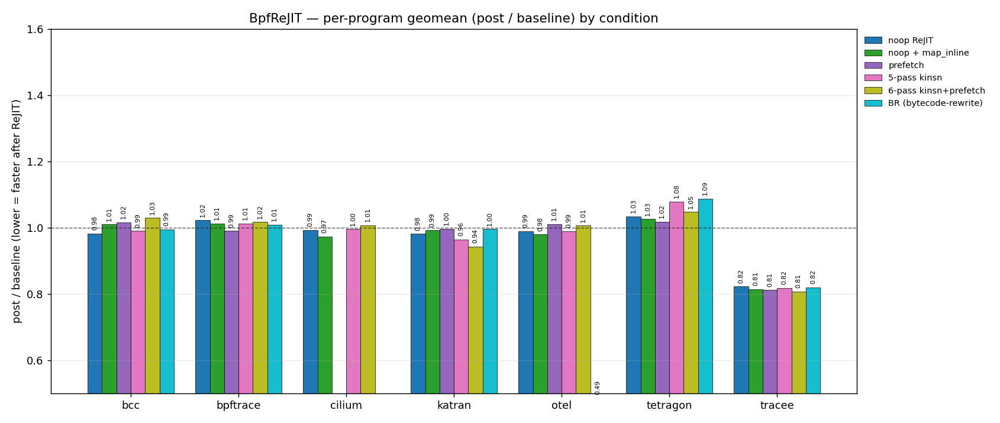
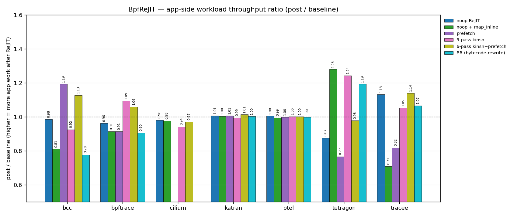
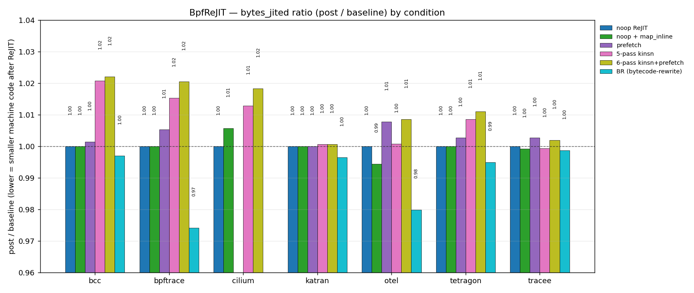

# BpfReJIT Evaluation — Methodology and Infrastructure

Current status (2026-07-10): the active speculative-optimization path is the
stock-kernel `LD_PRELOAD` shim plus the standalone `bpfopt` CLI. The corpus
currently compares a baseline application start against a second start of the
same upstream application with a shim load-time plan. The shim also implements
running-process reload/reattach, but a result is a live-swap result only when
its lifecycle explicitly records that path.

The older daemon, `BPF_PROG_REJIT`, kop, seven-app, and 20-app measurements
retained later in this document are historical experiment records. They do not
describe the current speculative paper's architecture or supported corpus.

## 1. System Under Test

- **What it does**: optimize programs loaded by real upstream applications
  without replacing their loaders. The shim captures each normal
  `BPF_PROG_LOAD`, runs runner-selected `bpfopt` passes, and submits accepted
  candidates through the stock verifier/JIT path.
- **Kernel boundary**: ordinary `BPF_PROG_LOAD` plus existing attachment APIs.
  The speculative bytecode path has no `BPF_PROG_REJIT`,
  `BPF_PROG_GET_ORIGINAL`, or daemon dependency.
- **Current measured path**: baseline application start/stop followed by an
  optimized application start using `BPFREJIT_SHIM_LOADTIME_PLAN`.
- **Implemented but separately gated path**: per-process `execute_plan` runs
  against an already-started application and uses `shim_reload.h` to reload and
  reattach accepted candidates. Its attachment-specific success/partial-failure
  status must be recorded before it supports a live-swap claim.
- **Out of scope here**: kop-backed native operations and their kernel
  modules belong to the KOperation paper line.

```
   runner ──plan JSON──▶ upstream application + LD_PRELOAD shim
   (policy)                           │
                                      ├──exec──▶ bpfopt --pass <name>
                                      │          (pure bytecode CLI)
                                      ▼
                              stock BPF_PROG_LOAD
                              verifier + JIT
```

- **Shim** (C) — application-local syscall, loader-state, plan-execution, and
  reload/reattach boundary.
- **`bpfopt`** (C++/LLVM) — pure-bytecode CLI.
  - raw `bpf_insn[]` input/output and JSON report files.
  - One invocation = one named pass.
  - Zero kernel dependency.
- **Per-pass loop** (per program):
  1. shim writes bytecode and required side inputs to a workdir
  2. `bpfopt --pass <name>` rewrites bytecode
  3. shim submits the candidate through `BPF_PROG_LOAD`; the kernel re-verifies
     and JIT-compiles it
  4. on failure → record the error and artifacts; do not filter the program or
     substitute a weaker pass

## 2. Optimization Passes

Three classes; every benchmark run selects an explicit subset via
`BPFREJIT_BENCH_PASSES`.

### 2.1 kop-class — replace bytecode with a kfunc, lowered by an in-kernel kop module via `KFUNC_INLINE_EMIT`

- **`rotate`** — shift+or pair → native rotate (`bpf_rotate{32,64}`)
- **`cond_select`** — branch+select → `cmov` (`bpf_select64`)
- **`ccmp`** *(arm64-only)* — same-target zero-test AND chain → conditional-compare (`bpf_ccmp`)
- **`extract`** — bit-field extract → BMI `BEXTR` (`bpf_extract64`)
- **`endian_fusion`** — load+`bswap` → `MOVBE` (`bpf_endian_load{16,32}`)
- **`bulk_memory`** — scalarized `memcpy`/`memset` → SIMD or `REP MOVS`
  (`bpf_memcpy` / `bpf_memset`)
- **`prefetch`** — insert `prefetch` ahead of pointer-chasing loads
  (`bpf_prefetch`)

### 2.2 Bytecode-rewriting — pure BPF→BPF, no kfunc; kernel JIT lowers as usual

- **`noop`** — no transform pass
- **`wide_mem`** — collapse byte-by-byte ladder into one wide `LDX_MEM`
  (size `H` / `W` / `DW`)
- **`map_inline`** — speculate constant `bpf_map_lookup_elem` results from
  captured map values
- **`const_prop`** — propagate verifier-known constants, fold uses
- **`dce`** — drop instructions dead under verifier liveness
- **`bounds_check_merge`** — merge redundant bounds checks on the same range
- **`skb_load_bytes_spec`** — specialize `bpf_skb_load_bytes` to fixed-width
  loads

## 3. Historical Workload Snapshot — 7 Applications

This section preserves the May 2026 seven-app measurement for provenance.
The active production corpus contains six applications: BCC, Cilium, Katran,
the OTel eBPF profiler, Tetragon, and Tracee. `bpftrace/set` has been removed,
so the counts below are not the current paper population.

Selection criteria:

- real, deployed eBPF — no synthetic micro-loops, no test programs
- diverse program types: `kprobe`, `tracepoint`, `raw_tp`, `socket_filter`,
  `tc`, `xdp`, `LSM`
- spanning the four large eBPF use-case classes (tracing, security,
  networking, profiling)
- launched through the upstream binary; the framework loads no `.bpf.o`
  files of its own

"Programs" columns from the most recent paper-grade 7-app baseline (Q1
`noop` ReJIT, 2026-05-07 19:05Z, 30 s `stress_ng_os_io_network` /
workload-specific):

- **loaded** — `bpftool prog show` count after agent startup
- **triggered** — programs with `run_cnt_delta > 0` in baseline phase
  (dispatched at least once during the 30 s workload)
- **retained** — `run_cnt_delta ≥ 100`; the population that enters the
  per-program geomean per §5
- **median run_cnt** — median per-program dispatch count over 30 s in
  the retained population (per-program distributions are heavy-tailed,
  so median is more representative than mean)

| App | Domain | loaded | triggered | retained | median run_cnt | Workload | Why triggered ≪ loaded |
| --- | --- | ---: | ---: | ---: | ---: | --- | --- |
| `bcc/set` | tracing tools | 21 | 20 | 20 | 6.4 M | `stress_ng_os_io_network` | full coverage; the one un-triggered probe is a rare-syscall hook the stressor does not exercise |
| `bpftrace/set` | tracing scripts | 9 | 9 | 8 | 18 M | `stress_ng_os_io_network` | full coverage |
| `tracee/monitor` | runtime security | 158 | 92 | 81 | 1.8 M | `stress_ng_os_io_network` | ≈ 40 % of programs are tail targets (`vfs_*_tail`, `lkm_seeker_*`) and read `run_cnt = 0` (§5.6); the rest are syscalls the stressor does not invoke |
| `tetragon/observer` | runtime security | 287 | 34 | 30 | 0.7 M | `stress_ng_os_io_network` | 253 of 287 are tail-called helpers (`process_event` / `filter_arg` / `actions` / `output` chain) — hidden by `run_cnt = 0` accounting (§5.6) |
| `cilium/agent` | k8s data-plane | 53 | 8 | 6 | 1.6 M | `network_lossy_multi` | most policy / NodePort / CT programs are tail targets (`run_cnt = 0`); without a Kubernetes pod model many `cil_lxc` / `cil_from_container` slots also stay idle |
| `katran` | L4 XDP load balancer | 1 | 1 | 1 | 3.2 M | `xdp_traffic` | standalone-attach exposes only `balancer_ingress`; tail targets reachable through `xdp_root` are bypassed by design |
| `otelcol-ebpf-profiler/profiling` | continuous profiler | 13 | 2 | 1 | **0.14 M** | `otel_mixed_workload` | only `native_tracer_entry` is directly attached; `perf_unwind_<lang>` × 8 are tail targets and read `run_cnt = 0` even though the workload provably dispatches them (verified via OTEL debug exporter) |

### 3.1 Workload specifications

Every workload runs for `WORKLOAD_DURATION` seconds (default 30 s) per phase
and is replayed identically in `baseline` and `post_rejit`.

| Workload | Generator | Composition | What it exercises |
| --- | --- | --- | --- |
| `stress_ng_os_io_network` | `stress-ng` | `--os` + `--io` + `--network` + `--memory` + `--filesystem` stressors run concurrently (`syscall`, `epoll`, `udp`, `sock*`, `mmap`, `aio`, `iomix`, `dentry`, `file-ioctl`, …) | High-rate kprobe / tracepoint dispatch on syscalls, VFS, sockets, scheduler — the dominant load for tracing and security agents |
| `network_lossy_multi` | `netem` + `wrk` + `ping` | 20 % loss + 50 ms delay on the iface; `wrk -t4 -c50` HTTP load (≈10 K connect events/s); concurrent high-rate ICMP probes | Multi-protocol datapath: ICMP, TCP, retransmits, conntrack — drives cilium tc/xdp policy slots beyond plain HTTP |
| `xdp_traffic` | `wrk` | `wrk -t2 -c10` HTTP keep-alive (≈30 K – 100 K req/s) with steady packet flow through the iface | Sustained packet ingress for `XDP` programs; goal is throughput, not connect-rate |
| `otel_mixed_workload` | 5 language interpreters + `stress-ng` | Concurrent SHA-256(1 KiB) loops in Python / Ruby / Node.js / Perl / PHP using only stdlib + `stress-ng --cpu` for native frames | Drives `perf_event` samples into interpreter PC ranges so `perf_unwind_<lang>` tail programs dispatch; native loop drives `perf_unwind_native` |

## 4. Experimental Setup

- **Primary platform — virtme-ng KVM**, x86_64
  - Host: 16 vCPU, 64 GiB RAM, Intel Core Ultra 9 285K
  - Guest: Docker-in-VM for app stack
- **Secondary platform — AWS** (cross-architecture validation only)
  - x86: `t3.small` ; arm64: `t4g.small` ; kernel test: `t3.micro`/`t4g.micro`
- **Kernel used by these historical runs**: forked Linux 7.0-rc2
  (`vendor/linux-framework`), with the same build on KVM and AWS. The current
  speculative bytecode mechanism uses stock BPF load and attachment UAPI even
  when the benchmark image contains unrelated KOperation kernel support.

### 4.1 Per-run protocol

The active corpus uses two independent upstream-application starts per app:

```
   ┌──────────────┐    ┌──────────────────────────┐    ┌──────────────┐
   │ baseline app │ →  │ stop + quiesce + build   │ →  │ optimized app│
   │ start        │    │ shim load-time plan      │    │ start        │
   │ run workload │    │                          │    │ shim intercepts
   │ collect raw  │    │ runner selects ordered   │    │ BPF_PROG_LOAD,
   │ counters     │    │ bpfopt passes            │    │ runs workload,
   │ stop app     │    │                          │    │ collects raw data
   └──────┬───────┘    └─────────┬────────────────┘    └──────┬───────┘
          │                      │                            │
          ▼                      ▼                            ▼
     run_cnt_delta,         result.json                  run_cnt_delta,
     run_time_ns_delta      per-program record           run_time_ns_delta
     per BPF program                                     per BPF program
```

- `bpf_enable_stats(BPF_STATS_RUN_TIME)` is enabled for the whole run;
  per-phase deltas are computed from `bpftool prog show` snapshots taken
  at phase boundaries
- `BPFREJIT_BENCH_PASSES` selects the pass list applied by the shim during the
  optimized application's normal load operations
- Default knobs: `SAMPLES=3`, `WORKLOAD_DURATION=30 s`, `min_runs ≥ 100`
  filter applied at analysis time

## 5. Measurement Methodology

The framework writes only raw counters; every paper number is computed
post-hoc from `result.json` by `analysis/corpus_analyze.py`.

### 5.1 Per-program ratio

For each BPF program with `run_cnt_delta > 0` in both phases:

```
b_avg = baseline.run_time_ns_delta   /  baseline.run_cnt_delta
p_avg = post_rejit.run_time_ns_delta /  post_rejit.run_cnt_delta
ratio = p_avg / b_avg                          # < 1.0 ⇒ ReJIT faster
```

### 5.2 Threshold filter (mandatory)

- Drop programs where `min(baseline.run_cnt, post_rejit.run_cnt) < 100`.
- Empirical noise floor on the corpus drops sharply at this cutoff
  (CV 29.6 % unfiltered → 17.7 % at ≥ 100). Above 100 the CV stays flat
  through ≥ 100 K, so 100 captures the noise-reduction inflection point
  while retaining maximum program coverage (127 vs 90 programs at ≥ 10 K).
- Any change to this threshold requires re-measuring CV on the new
  dataset; ad-hoc thresholds are forbidden.

### 5.3 Headline metric — per-program geometric mean

```
geomean = exp( mean( log(ratio_i) ) )    over all retained programs
```

- Units: `< 1.0` is speedup, `> 1.0` is slowdown.
- Reason for geometric mean: ratio data; arithmetic mean is mathematically
  wrong, log/sqrt-weighted variants have no physical justification.

### 5.4 Supplemental — wins / losses / ties

- `wins`  : programs with `ratio < 1.0`
- `losses`: programs with `ratio > 1.0`
- `ties`  : programs with `ratio == 1.0`

Reported alongside the geomean as a sanity check on direction.

### 5.5 Confidence

Bootstrap CIs are taken over per-program ratios across the retained
population, not across cross-suite-run replication. Both `SAMPLES=1` and
`SAMPLES=3` produce paper-quotable numbers as long as retained-program
coverage is non-trivial.

### 5.6 Tail-call accounting caveat

Programs entered through `bpf_tail_call(ctx, &progs, key)` are jumped to
at `bpf_func + X86_TAIL_CALL_OFFSET` (and the equivalent on arm64). This
**skips the prologue** that increments `bpf_prog->stats.cnt` and
`stats.nsecs`. Consequences for measurement:

- `bpftool prog show` reports `run_cnt = 0` and `run_time_ns = 0` for
  every tail-called program, even when it executes on every dispatch.
- The `min_runs ≥ 100` filter therefore drops every tail target;
  per-program ratios are computed only for the **directly attached
  caller**.
- The caller's `run_time_ns` already includes time spent in every
  tail-called descendant, because the tail call jumps inline (control
  does not return). Optimizations applied to a tail target therefore
  show up at the caller's ratio.
- Concrete chains in this suite:
  - tetragon: `generic_kprobe_event` → `process_event` / `filter_arg`
    / `actions` / `output`
  - tracee: `lkm_seeker_*`, `vfs_*_tail`
  - cilium: NodePort / CT / policy `tail_*`
  - otel: `native_tracer_entry` → `perf_unwind_<lang>` (×8)
  - katran (pre-fix): `xdp_root` → `balancer_ingress`; bypassed by
    standalone-attach mode
- When evaluating coverage of tail-called programs, verify execution via
  profiler-side telemetry (e.g. OTEL debug exporter sample dump showing
  interpreter frame names) or by re-attaching the program directly so it
  becomes the entry point.

## 6. Research Questions and Datasets

Two RQs drive the evaluation. All runs below: KVM x86, `SAMPLES=3`,
`WORKLOAD_DURATION=30 s`, 7-app set unless noted.

### 6.1 RQ1 — Functional: does in-place ReJIT actually transform loaded programs and keep agents running?

The metric is the per-program ReJIT success rate plus
the agent-side `app.status` outcome — not performance.


Per-condition pass-chain outcomes. A program counts as "all-ok" only if
every pass in the chain returned `ok`; "any-fail" means at least one
pass returned a non-ok status (kernel verifier rejection, bpfopt-level
error, or pass-internal failure). Conditions match §6.2.1.

| Condition | apps | progs | all-ok | any-fail | success rate | dominant failure mode |
| --- | ---: | ---: | ---: | ---: | ---: | --- |
| `noop` ReJIT | 7 | 542 | 408 | 134 | **75.3 %** | kernel `failed_rejit` ×134 (≈124 are tetragon tail-call subprograms) |
| `noop` + `map_inline` | 7 | 542 | 396 | 146 | **73.1 %** | kernel `failed_rejit` ×146 |
| `prefetch` isolated | 7 | 545 | 530 | 15 | **97.2 %** | kernel `failed_rejit` ×15 |
| 5-pass kop: `rotate, cond_select, extract, endian_fusion, bulk_memory` | 7 | 542 | 513 | 29 | **94.6 %** | kernel `failed_rejit` ×29 |
| 6-pass kop + prefetch: above + `prefetch` | 7 | 542 | 510 | 32 | **94.1 %** | kernel `failed_rejit` ×32 |
| All bytecode-rewriting: `noop, wide_mem, const_prop, dce, bounds_check_merge, skb_load_bytes_spec` *(partial — 4 / 7 apps)* | 4 | 44 | 0 | 44 | **0.0 %** | `bpfopt_failed[const_prop]` ×44 — bpfopt-level bug, kernel ReJIT not reached for that pass |

Findings:

- Every app payload completed its workload with `status=ok`; agents
  stayed up across all conditions. RQ1's "keep agents running" answer
  is yes.
- The 25 % failure floor on the three `noop` rows is **not pass-driven** —
  it is dominated by tetragon's tail-call subprograms (≈124 of 287
  loaded) whose kernel re-verification fails even when the bytecode is
  unchanged. This sets a per-program success ceiling of ~75 % that is
  independent of which transform is run.
- Optimization conditions with non-trivial transforms (5-pass kop,
  6-pass kop + prefetch, prefetch) report **higher** all-passes-ok
  rates (94–97 %) than the `noop` controls (75 %). The reason: when a
  transform pass returns `skipped_missing_states` (no candidate found
  / verifier state absent), that is counted as `ok`, which absorbs
  many programs that the noop baseline would mark as `failed_rejit`
  once a real pass is attempted.
- **All bytecode-rewriting** breaks at the bpfopt CLI layer:
  `const_prop` errors out (`failed_bpfopt`) on every program tested so
  far in the BR queue, before the kernel is ever asked. Earlier passes
  in the chain (`noop`, `wide_mem`) succeed and apply real sites
  (e.g. otel: 132 `wide_mem` sites applied). This is a bpfopt bug, not
  a ReJIT functional regression.
- The earlier `wide_mem` isolated 7-app run separately triggered a
  kernel panic on tetragon (post-swap refresh handling in
  `kernel/bpf/syscall.c:3937`); see
  `docs/tmp/q5_widemem_kernel_panic_20260507.md`. Not reproduced in
  the current 5-pass / 6-pass conditions.

#### 6.1.1 Bytecode-pass apply rate (per app × condition)

`bpfopt` reports `sites_matched` (candidates the pass found) and
`sites_applied` (candidates actually rewritten — the rest fail safety
filters such as live-out registers, alignment, BTF-pointer rules). Each
cell below shows `applied / matched`.

Sources: `map_inline` from the merged 7-app dataset; `wide_mem`,
`cond_select`, `bulk_memory`, `endian_fusion`, `extract`,
`skb_load_bytes_spec`, `rotate` from a multi-pass 7-app run; `prefetch`
from the prefetch-only 7-app run at 2026-05-07 22:44Z (suite-status
`error` because cilium's wrk client timed out; per-app payloads are
intact for all 7 apps).

| Pass | bcc | bpftrace | cilium | katran | otel | tetragon | tracee |
| --- | ---: | ---: | ---: | ---: | ---: | ---: | ---: |
| `map_inline` | 0 / 13 | 0 / 22 | 1 454 / 1 824 | 13 / 80 | 1 192 / 1 264 | 0 / 765 | 5 / 1 725 |
| `wide_mem` | 0 / 0 | 10 / 18 | 0 / 0 | 4 / 4 | 132 / 137 | 2 826 / 2 826 | 179 / 229 |
| `cond_select` | 8 / 8 | 4 / 4 | 278 / 288 | 7 / 7 | 45 / 47 | 1 695 / 2 003 | 408 / 418 |
| `bulk_memory` | 0 / 0 | 0 / 0 | 6 / 6 | 0 / 0 | 1 / 1 | 171 / 171 | 216 / 216 |
| `endian_fusion` | 1 / 1 | 1 / 1 | 45 / 45 | 6 / 6 | 4 / 4 | 220 / 220 | 4 / 4 |
| `extract` | 1 / 1 | 0 / 0 | 0 / 0 | 0 / 0 | 36 / 36 | 114 / 114 | 37 / 47 |
| `prefetch` | 3 / 3 | 9 / 9 | 430 / 430 | 44 / 44 | 415 / 415 | 1 526 / 1 526 | 1 770 / 1 770 |
| `skb_load_bytes_spec` | 0 / 0 | 0 / 0 | 4 / 166 | 0 / 0 | 0 / 0 | 0 / 0 | 0 / 0 |
| `rotate` | 0 / 0 | 0 / 0 | 0 / 0 | 0 / 0 | 0 / 0 | 44 / 44 | 0 / 0 |

Passes omitted (no useful data in any 30 s 7-app run): `noop` (producer
pass, always 0 / 0), `const_prop`, `dce`, `bounds_check_merge` (no
isolated 30 s run), `ccmp` (arm64-only).

Observations:

- `map_inline` finds candidates almost everywhere (1 824 in cilium,
  1 725 in tracee, 1 264 in otel, 765 in tetragon) but **applies only
  where captured map values are constant or supplied via `--inline-hint`**:
  cilium 80 %, otel 94 %, katran 16 % (driven entirely by 6
  `--inline-hint` directives in `runner/config/passes/map_inline/katran.yaml`),
  but 0 % on bcc / bpftrace / tetragon and 0.3 % on tracee. Needs further investigation.
- `cond_select` apply rate on tetragon is 1 695 / 2 003 ≈ 85 % after
  the diamond-validator relaxation that lets external-predecessor joins
  rewrite instead of bail.
- `rotate` finds 44 sites on tetragon (high32-masked shift+or patterns)
  and zero on the other six apps in this corpus.
- `skb_load_bytes_spec` matches 166 cilium sites but applies only 4
  (≈ 2.4 %) — almost all cilium `bpf_skb_load_bytes` calls fail the
  fixed-width specialization safety check.

### 6.2 RQ2 — Speedup: does ReJIT deliver per-program speedup above the noise floor?

Per-program geomean of `post / baseline` with `min_runs ≥ 100`
retention; `< 1.0` is speedup.

#### 6.2.1 Per-app geomean × condition

Single unified table: rows are conditions (noise-floor at top, then pass
coverage), columns are per-app and suite geomean. `< 1.0` is speedup.
Every cell that *should* be 1.0 (the noise-floor rows) is the empirical
phase-variance reference; everything below the noise rows is what a
pass coverage run produces.



| Condition | bcc | bpftrace | cilium | katran | otel | tetragon | tracee | suite | retained |
| --- | ---: | ---: | ---: | ---: | ---: | ---: | ---: | ---: | ---: |
| `noop` ReJIT | 0.9818 | 1.0217 | 0.9921 | 0.9811 | 0.9887 | 1.0336 | 0.8218 | **0.9019** | 147 |
| `noop` SKIP_REJIT | 0.9836 | 1.0281 | 0.9783 | 0.9957 | 1.1023 | 0.9042 | 0.7888 | **0.8587** | 147 |
| `noop` + `map_inline` | 1.0097 | 1.0118 | 0.9728 | 0.9915 | **0.6567** | 1.0256 | 0.8150 | 0.8943 | 148 |
| `prefetch` | 1.0154 | 0.9895 | — (wrk timed out) | 0.9963 | **0.7186** | 1.0175 | 0.8112 | 0.8880 | 142 |
| 5-pass kop: `rotate, cond_select, extract, endian_fusion, bulk_memory` | 0.9896 | 1.0117 | 0.9951 | 0.9639 | 0.9891 | 1.0783 | 0.8171 | 0.9074 | 147 |
| 6-pass kop + prefetch: above + `prefetch` | 1.0289 | 1.0165 | 1.0066 | 0.9423 | 1.0056 | 1.0468 | 0.8067 | 0.9009 | 147 |
| All bytecode-rewriting: `noop, wide_mem, const_prop, dce, bounds_check_merge, skb_load_bytes_spec` | 1.0659 | 1.0155 | 0.9813 | 0.9807 | **0.4713** | 1.0064 | 0.8115 | *pending* | 148 |

### Findings

- **bcc, bpftrace, cilium, katran, tetragon** — every condition lands
  within ±1–3 % of the per-app noise bracket. No condition exceeds the
  per-app noise floor on these 5 apps.
- **otel — retained set is split between one stable program and one
  unstable tracepoint.** `native_tracer_entry` (perf_event, ~140 M
  runs) is high-frequency and balanced across phases. The remaining slot is
  filled — only when it clears `min_runs ≥ 100` — by a low-frequency
  tracepoint, `sched_process_free`, whose own per-phase trigger count
  is workload-driven and not stable: in the `map_inline` 0.6567 cell
  it fired 163 vs 1 422 times across baseline / post (8.7× asymmetry).
  6 `map_inline` sites on it actually fired. Whether its 0.42 per-
  program ratio reflects the optimization, the trigger asymmetry, or
  some mix is unknown and not resolvable from this run. The "clear-
  low" otel cells (0.6258 – 0.7186) ride on this single low-runs
  outlier; they are not interpretable at the current threshold.
- **tracee — phase bias dominates the geomean.** Every condition,
  including the pure-phase-variance controls, lands in 0.79 – 0.84.
  A systematic drift below 1.0 under no bytecode change implies a
  baseline-vs-post phase bias on tracee's 81 retained programs that
  is independent of any pass; per-pass speedup on tracee cannot be
  separated from this drift.

### What we cannot conclude

- No condition produces an app-level row that clears its own noise
  bracket by more than 1–3 %.
- The suite geomean below 1.0 in every condition is consistent with
  tracee's phase bias and otel's structural fragility, not with a
  demonstrable per-pass speedup.
- For paper-grade quotes: report otel on `native_tracer_entry` only,
  or raise the retention threshold to ≥10 K to drop the `sched_process_
  free` outlier; report tracee with an explicit phase-bias caveat or
  exclude it from suite-level claims.

### 6.2.2 App-side workload throughput

Per-app throughput recorded in `baseline.workloads[]` /
`post_rejit.workloads[]`. Each cell is `post / baseline`, mean over 3
samples (same `SAMPLES=3` runs as §6.2.1). Values >1.0 = app went
faster after ReJIT.



Per-app throughput metric:

- `bcc, bpftrace, tetragon, tracee` — `stress-ng` total bogo ops
  (sum of 63 stressors per 30 s sample)
- `katran` — `wrk Requests/sec`
- `cilium` — `wrk Requests/sec`
- `otel` — total SHA-256 ops across 5 interpreters + `stress-ng --cpu`
  bogo ops per 30 s

| Condition | bcc | bpftrace | cilium | katran | otel | tetragon | tracee |
| --- | ---: | ---: | ---: | ---: | ---: | ---: | ---: |
| `noop` ReJIT | 0.985 | 0.961 | 0.980 | 1.007 | 1.004 | 0.874 | 1.132 |
| `noop` SKIP_REJIT | 1.043 | 1.040 | 1.071 | 1.001 | 0.992 | 1.268 | 0.919 |
| `noop` + `map_inline` | 0.809 | 0.913 | 1.040 | 1.004 | 0.997 | 1.279 | 1.144 |
| `prefetch` | 1.191 | 0.913 | — | 1.006 | 0.989 | 0.766 | 0.818 |
| 5-pass kop: `rotate, cond_select, extract, endian_fusion, bulk_memory` | 0.925 | 1.093 | 0.940 | 0.995 | 1.001 | 1.242 | 1.051 |
| 6-pass kop + prefetch: above + `prefetch` | 1.126 | 1.058 | 0.969 | 1.013 | 1.001 | 0.977 | 1.139 |
| All bytecode-rewriting: `noop, wide_mem, const_prop, dce, bounds_check_merge, skb_load_bytes_spec` | 0.949 | 1.048 | 1.046 | 0.986 | 0.995 | 1.028 | 0.982 |

How to read this:

- The `noop` rows are app-side phase noise. stress-ng-driven apps
  (bcc / bpftrace / tetragon / tracee) swing 0.80 – 1.27 across the
  three controls — about **±27 %**. `katran` / `otel` / `cilium` swing
  ±2 – 7 %.
- **No optimization-condition cell exceeds its own per-app noise band
  on stress-ng-driven apps.** Reading bcc 1.19 in `prefetch`,
  tetragon 1.28 in `noop+map_inline`, or tracee 1.14 in
  `noop+map_inline` as ReJIT speedup is not separable from the noise
  envelope visible in the three `noop` rows.
- `katran` and `otel` are within ±1 % of 1.0 in every condition,
  including controls — consistent with their generators (`wrk` /
  fixed-iteration SHA-256 loops) being far less phase-sensitive than
  stress-ng. App-side throughput has no detectable signal on these
  two apps either.

### 6.3 Binary size impact

`bpftool prog show` reports `bytes_jited` (post-JIT machine code) and
`bytes_xlated` (verifier-translated BPF bytecode) per program. We sum
across all programs in each app and report `post / baseline`. `< 1.0`
means ReJIT shrunk total program size; `> 1.0` means ReJIT added code
(e.g., `prefetch` inserts extra `bpf_prefetch` calls; kop passes
replace inlined sequences with kfunc calls that are slightly larger
in raw bytecode but lower at the machine-code level).



| Condition | bcc | bpftrace | cilium | katran | otel | tetragon | tracee |
| --- | ---: | ---: | ---: | ---: | ---: | ---: | ---: |
| `noop` ReJIT | 1.000 | 1.000 | 1.000 | 1.000 | 1.000 | 1.000 | 1.000 |
| `noop` + `map_inline` | 1.000 | 1.000 | 1.006 | 1.000 | 0.994 | 1.000 | 0.999 |
| `prefetch` | 1.001 | 1.005 | — | 1.000 | 1.008 | 1.003 | 1.003 |
| 5-pass kop: `rotate, cond_select, extract, endian_fusion, bulk_memory` | 1.021 | 1.015 | 1.013 | 1.001 | 1.001 | 1.009 | 0.999 |
| 6-pass kop + prefetch: above + `prefetch` | 1.022 | 1.020 | 1.018 | 1.001 | 1.008 | 1.011 | 1.002 |
| All bytecode-rewriting: `noop, wide_mem, const_prop, dce, bounds_check_merge, skb_load_bytes_spec` | 0.997 | 0.974 | 0.966 | 0.951 | 0.985 | 0.995 | 0.999 |

Reading the table:

- `noop` ReJIT: 1.000 everywhere by definition (no transform). Acts as
  the integrity check.
- `prefetch` and kop rows sit slightly **above** 1.0: every applied
  prefetch adds a `bpf_prefetch` call site; kop passes replace 2-4
  inlined BPF instructions with one kfunc call (BTF-typed). The kfunc
  call is larger in `bytes_jited` even though the in-kernel emitter
  (`KFUNC_INLINE_EMIT`) lowers it back to a single x86 `MOVBE` /
  `cmov` / `BEXTR` at run time. This row reports the kernel's view
  before the inline emitter runs.
- BR (bytecode-rewrite) is the only condition that **shrinks**
  programs: `bpftrace -2.6 %`, `otel -2.0 %`, `bcc -0.3 %`,
  `katran -0.4 %`, `tetragon -0.5 %`, `tracee -0.1 %`. The shrinkage
  is dominated by `dce` removing instructions that `wide_mem` and
  `const_prop` made dead, plus `wide_mem` itself collapsing byte-by-
  byte ladders.
- Largest per-program shrink in the entire corpus is otel's
  `perf_unwind_python` (tail-target): xlated 33 264 → 29 048
  (-12.7 %), jited 19 909 → 17 499 (-12.1 %). This is the source of
  otel's 0.4864 per-program ratio in §6.2.1.

### TODO

- improve map inline to make it actaully inline more; fix the 0 % apply rate in 5 of 7 apps (e.g. katran). We can fix it by allowing user provide map content and does not require the map key is const.
- check more details about otel and tracee's improvement. Is it benchmark framework issue or actual improvement?
- Why kop does not work well? Need futher investigation.
   - analysis each prog, check source code and disasm.
- Sometimes kernel panic still exists.


## Appendix: Katran 4-pass measurement matrix (2026-05-17)

### Per-pass apply counts (corpus/build/x86_64/katran/balancer.bpf.o, framework 7.0-rc2 kernel)

| path | map_inline applied/matched | const_prop applied/matched | dce applied/matched | insn 2542 → final |
|---|---:|---:|---:|---:|
| loader test (no `reals` hint) | 10 / 67 | 26 / 168 | 61 / 61 | 2542 → 2454 |
| **loader test + `--inline-hint=reals:!01000000`** | **16 / 67** | **30 / 150** | **65 / 65** | **2542 → 2391** |
| **historical corpus path** | **16 / 67** | **30 / 150** | **65 / 65** | **2542 → 2391** |

Loader's six previously-skipped sites (PC 1041, 1311, 1524, 1702, 1746, 2018) all
target `reals` lookups; adding `--inline-hint=reals:!01000000` aligns loader to
corpus byte-for-byte.

### Per-iteration timing (stats counter = `bpf_prog_stats.nsecs / cnt`)

| run | bytecode (final insn) | method | stats | bl ns | po ns | ratio | improvement |
|---|---|---|---|---:|---:|---:|---:|
| host loader, host 6.15 | 2454 (no reals hint) | PROG_TEST_RUN | 0 | 115 | 28 | 0.243 | +75.7 % |
| VM loader, framework 7.0-rc2 | 2454 (no reals hint) | PROG_TEST_RUN | 0 | 79 | 28 | 0.354 | +64.6 % |
| VM loader, framework 7.0-rc2 | 2454 (no reals hint) | PROG_TEST_RUN | 1 | 125 | 82 | 0.656 | +34.4 % |
| VM loader, framework 7.0-rc2 | 2391 (reals hint) | PROG_TEST_RUN | 1 | 125 | 82 | 0.656 | +34.4 % |
| VM loader, framework 7.0-rc2 | 2391 (reals hint) | pktgen UDP + TCP VIP (mismatch → early-return XDP_PASS) on v0↔v1 veth | 1 | — | 52 | — | — |
| VM loader, framework 7.0-rc2 | 2391 (reals hint) | pktgen UDP + TCP VIP (mismatch) on corpus-replicated katran topology (3 netns chain) | 1 | — | 52 | — | — |
| **VM loader, framework 7.0-rc2** | **2391 (reals hint)** | **pktgen UDP + UDP VIP (full LB path) on v0↔v1 veth** | **1** | — | **98–101** | — | — |
| **corpus pktgen** | **2391** | pktgen UDP + UDP VIP (full LB path) on katran real iface | 1 | 121 | **107** | **0.882** | **+11.8 %** |

### BPF stats accounting overhead (kernel 7.0-rc2, idle 64-byte VIP packet)

| program | bytecode size | stats=0 ns/iter | stats=1 ns/iter | overhead |
|---|---:|---:|---:|---:|
| trivial XDP_DROP (5 insn) | 40 B | — | — | — |
| trivial XDP_DROP (PROG_TEST_RUN) | 40 B | — | 23 | — |
| trivial XDP_DROP (pktgen veth native XDP) | 40 B | — | 24 | — |
| katran balancer_ingress (final 2391 insn) | 8488 B jited | 31 | 75 | +44 ns |
| katran balancer_ingress (final 2391 insn, 4 CPU concurrent) | 8488 B jited | 31 | ~100 | +69 ns |

### Pre-loaded BPF program ns/run distribution (corpus 0517_034332, 145 progs ≥100 runs)

| bucket | progs | share |
|---|---:|---:|
| < 50 ns | 5 | 3.4 % |
| 50–100 ns | 13 | 9.0 % |
| 100–200 ns | 20 | 13.8 % |
| 200–500 ns | 43 | 29.7 % |
| 500–1000 ns | 44 | 30.3 % |
| 1000–5000 ns | 18 | 12.4 % |
| 5000+ ns | 2 | 1.4 % |

min 25.7 ns / median 438.5 ns / mean 693.7 ns / max 7816 ns.

### Historical pass YAML log level

| pass yaml | log_level | meaning |
|---|---:|---|
| `noop/default.yaml` | 1 | output verifier log fed to next pass |
| `map_inline/default.yaml` | 2 | output verifier log fed to const_prop |
| `const_prop/default.yaml` | 2 | output verifier log fed to dce |
| `dce/default.yaml` | 1 | terminal, no downstream consumer |

Loader test uses log_level=2 throughout (`prepare_workdir(initial_log_level=2)` and
`verify_workdir_with_log_level(_, _, _, _, _, 2)`).
