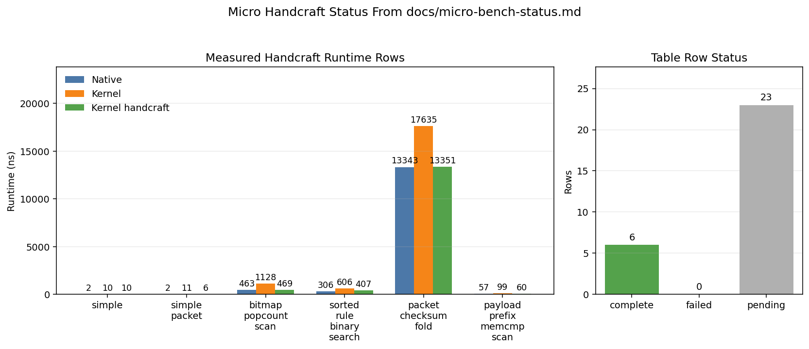

# Micro Benchmark Evaluation Status

Last updated: 2026-05-15

This document is the current evaluation note for the micro benchmark suite. It is written as an evaluation-section draft: what was measured, how it was measured, what the result says, and where the remaining native-code gap comes from.

All figures were generated with Python/matplotlib from the raw result file `micro/results/x86_kvm_micro_20260514_205607_714679/metadata.json`. The benchmark framework does not write ratios, geomeans, win/loss counts, or summaries into result payloads; those numbers here are post-hoc analysis.

## Headline

On the current x86 KVM micro suite, full-pass ReJIT is correct across all cases and gives a modest but real local-codegen improvement:

| Metric | Result |
|---|---:|
| Benchmarks completed | 29 / 29 |
| `kernel_rejit` samples with ReJIT status `ok` | 87 / 87 |
| Expected-result mismatches | 0 |
| Verifier errors | 0 |
| `kernel_rejit / kernel` runtime geomean | 0.933 |
| `kernel_rejit / kernel` runtime wins / losses / ties, +/-2% tie band | 14 / 8 / 7 |
| `kernel_rejit / kernel` code-size geomean | 0.879 |
| Smaller / larger / tie code size vs kernel, +/-2% tie band | 27 / 0 / 2 |
| `kernel / native` runtime geomean | 2.058 |
| `kernel_rejit / native` runtime geomean | 1.920 |

The main conclusion is not "LEA fixed everything." LEA is now verifier-facing safe on this micro suite and applies broadly, but the remaining gap to native/LLVM code is mostly in non-local codegen: dense switch lowering, loop-level transformations, local-call ABI/inlining, scheduling/register allocation, and broader packet hot-path cleanup.

## Experimental Setup

Command:

```sh
BPFREJIT_BENCH_PASSES=default WARMUPS=0 make micro
```

Result:

- Result path: `micro/results/x86_kvm_micro_20260514_205607_714679/metadata.json`
- `SAMPLES=3`
- `INNER_REPEAT=1000`
- `WARMUPS=0`
- Runtimes: `native`, `llvmbpf`, `kernel`, `kernel_rejit`
- Machine mode: x86 KVM benchmark run through `make micro`

Environment caveat from runner warnings:

- CPU governor reported as `unknown`
- turbo boost enabled
- no CPU affinity set
- PMU unavailable except software events

This is a correctness and performance-direction run, not the final publication environment. The data is still useful because it catches verifier failures, pass regressions, result mismatches, large code-size shifts, and large runtime direction changes.

The win/loss/tie counts in this document use a +/-2% tie band. Exact ratios and geomeans are still computed from the raw medians without rounding the inputs.

## Benchmark Scope

Config: `micro/config/micro_pure_jit.yaml`

The suite currently has 29 workload-pattern micro cases:

| Category | Workload Patterns |
|---|---|
| baseline | `simple`, `simple_packet` |
| packet/load-balancer/hash | `flow_5tuple_rss_hash`, `katran_lb_consistent_hash_select`, `packet_toeplitz_rss_hash`, `cgroup_skb_hash_chain` |
| tracing/security filters | `bcc_runqlat_log2_histogram_bucket`, `bcc_tcpconnect_ipv4_tuple_filter`, `bpftrace_comm_key_fnv_hash`, `bpftrace_string_search_prefix_scan`, `tracee_syscall_name_table_lookup`, `tracee_http_method_prefix_detect`, `tetragon_process_event_arg_filter` |
| cilium-shaped paths | `cilium_policy_guard_tree_filter`, `cilium_socket_lb_service_select`, `cilium_ct_nat_tuple_rewrite` |
| parser/bounds/memory | `packet_vlan_tcpopt_parser`, `packet_record_bounds_window`, `payload_prefix_memcmp_scan`, `flow_record_field_scan`, `packed_header_bitfield_decode`, `otel_stack_frame_unwind_scan` |
| scalar algorithms | `bitmap_popcount_scan`, `sorted_rule_binary_search`, `trace_event_type_switch_dispatch`, `packet_checksum_fold`, `siphash_rotate64_mixer`, `tc_packet_checksum_fold` |
| subprogram/local call | `bpf_local_call_fanout_dispatch` |

The suite is closer to workload patterns than unit tests: cases are named after app families where possible and avoid helper/map dependencies so the same input can run through native, llvmbpf, kernel, and ReJIT. This does not replace corpus. It deliberately omits helper-heavy map paths, full tail-call chains, app startup, and realistic service workload behavior.

## ReJIT Runtime Effect


Figure 1 sorts all 29 benchmarks by median `kernel_rejit / kernel` runtime. The strongest wins are packet/parser/hash cases where current passes directly remove local overhead:

- `packet_vlan_tcpopt_parser`: `28 ns -> 16 ns`, ratio `0.571`
- `katran_lb_consistent_hash_select`: `43 ns -> 29 ns`, ratio `0.674`
- `packet_record_bounds_window`: `146 ns -> 103 ns`, ratio `0.705`
- `siphash_rotate64_mixer`: `75 ns -> 54 ns`, ratio `0.720`
- `flow_5tuple_rss_hash`: `26 ns -> 20 ns`, ratio `0.769`

The regressions are mostly control-flow or string/field-filter cases where code shrinks but layout and critical path do not improve:

- `cilium_policy_guard_tree_filter`: `96 ns -> 114 ns`, ratio `1.188`
- `tracee_http_method_prefix_detect`: `26 ns -> 30 ns`, ratio `1.154`
- `tetragon_process_event_arg_filter`: `188 ns -> 211 ns`, ratio `1.122`
- `cilium_ct_nat_tuple_rewrite`: `191 ns -> 203 ns`, ratio `1.063`
- `payload_prefix_memcmp_scan`: `116 ns -> 123 ns`, ratio `1.060`

The important shape is mixed but positive: 14 wins, 8 losses, 7 ties. This says the pass stack is already useful as a local optimizer, but it is not a general native-code optimizer.

## Pass Coverage


Figure 2 shows site coverage across 29 benchmarks x 3 samples. LEA and rotate are the broadest current transforms:

| Pass | Applied | Matched | Skipped |
|---|---:|---:|---:|
| `lea` | 552 | 552 | 0 |
| `rotate` | 492 | 492 | 0 |
| `wide_mem` | 186 | 255 | 69 |
| `dce` | 126 | 126 | 0 |
| `cond_select` | 33 | 33 | 0 |
| `extract` | 33 | 33 | 0 |
| `prefetch` | 9 | 9 | 0 |
| `ccmp` | 0 | 87 | 87 |
| `const_prop` | 0 | 567 | 567 |

Per full-suite sample, divide by 3: `lea=184`, `rotate=164`, `wide_mem=62`, `dce=42`, `cond_select=11`, `extract=11`, and `prefetch=3`.

This validates the verifier-facing LEA fix on micro: LEA has `552/552` applied sites and no skipped sites in the full-pass run. The earlier verifier-facing concern was that pointer-derived address arithmetic could be lowered into a shape the verifier cannot prove. That failure mode does not reproduce here: all ReJIT syscalls succeeded and all post-ReJIT executions matched expected results.

## Native Gap


Figure 3 compares each runtime to the native C entry code. The current pass stack narrows the gap (`kernel/native = 2.058`, `kernel_rejit/native = 1.920`), but does not close it. The gap remains large in several representative classes:

- `trace_event_type_switch_dispatch`: native `55 ns`, llvmbpf `255 ns`, kernel `289 ns`, ReJIT `296 ns`
- `katran_lb_consistent_hash_select`: native `12 ns`, llvmbpf `12 ns`, kernel `43 ns`, ReJIT `29 ns`
- `otel_stack_frame_unwind_scan`: native `44 ns`, llvmbpf `91 ns`, kernel `171 ns`, ReJIT `165 ns`
- `cilium_socket_lb_service_select`: native `172 ns`, kernel `447 ns`, ReJIT `416 ns`

Native is a reference point, not an absolute optimum. `packet_toeplitz_rss_hash` shows this: native is `245 ns`, llvmbpf is `117 ns`, kernel is `266 ns`, and ReJIT is `239 ns`. The LLVM JIT finds a better loop/key-table lowering than both native-entry Clang output and the kernel/ReJIT path for this specific case.

The main gap pattern is therefore not just "kernel JIT emits too many bytes." It is that current bytecode-level rewrites do not reconstruct higher-level control/loop structure once Clang has already lowered C into verifier-friendly BPF.

## Code Size vs Runtime


Figure 4 plots code-size ratio against runtime ratio for ReJIT vs kernel. Almost every point is left of `1.0x` on the x-axis: code size shrinks. But several points are above `1.0x` on the y-axis: smaller code is slower.

That means code shrink is a necessary but insufficient signal. Examples:

- `cilium_policy_guard_tree_filter` shrinks `659 B -> 610 B`, but slows `96 ns -> 114 ns`.
- `trace_event_type_switch_dispatch` shrinks `1621 B -> 1531 B`, but moves `289 ns -> 296 ns`.
- `packet_checksum_fold` shrinks `424 B -> 340 B`, but runtime stays flat (`17656 ns -> 17633 ns`).
- `packet_toeplitz_rss_hash` improves runtime (`266 ns -> 239 ns`) even though size slightly grows (`1086 B -> 1098 B`).

This is the key evaluation point for future pass work: a pass can improve instruction count while leaving the critical path unchanged, or even make branch layout/register pressure worse. The next evaluation should therefore keep reporting both runtime and code size, and case-study the native/rejit machine code when they disagree.

## Native-Code Inspection

To avoid treating `native` as an opaque baseline, I rebuilt the micro artifacts under `/tmp/bpf-benchmark-micro-codegen-analysis` and inspected the selected `.native.so` and `.bpf.o` files with `llvm-objdump`, `llvm-nm`, and `llvm-readelf`.

One evidence boundary matters: the current micro result artifact records runtimes, sizes, and ReJIT pass reports, but it does not retain a post-ReJIT `bpftool prog dump jited` listing. The direct instruction-level evidence below is therefore native x86 plus pre-ReJIT BPF object shape. ReJIT-side conclusions use the recorded `jited_prog_len`, pass application counts, and the fact that the pass stack operates on that BPF shape. A selected-case post-ReJIT dump mode would let us replace the remaining inferred kernel/ReJIT instruction comparisons with exact final JIT diffs.

The inspected code shows seven distinct missing optimization classes:

| Case | Native Code Shape | BPF/ReJIT-Visible Shape | Missing Optimization |
|---|---|---|---|
| Katran hot path | Many real x86 rotates (`roll`, `rolw`), carry/selection with `cmovb*`, compact packet/hash arithmetic | BPF starts from shift/or rotate idioms, byte-load recomposition, verifier-friendly address arithmetic | Better endian/wide-load cleanup, carry/select lowering, scheduling, register allocation |
| Bounds window | Direct 32-bit and 16-bit field loads such as `movl -0x13(%rsi), %ebx` and `movzwl -0x3(%rsi), %r11d` | BPF has byte-ladder field reconstruction and repeated bounds-window arithmetic | More complete wide-load canonicalization across same-window packet records |
| Toeplitz RSS | Key material is in `.rodata`; loop uses indexed table loads such as `movl (%r10,%rdx,4), %ebp` plus `bswapl` | BPF synthesizes key words through branch trees and immediates | Constant-table reconstruction, loop scheduling, key-byte/key-word lowering |
| Dense switch | Dense dispatch becomes a bounds check plus indexed table load | BPF contains a large compare tree over switch cases | Switch/table lowering from BPF control-flow shape |
| Checksum fold | Inner loop consumes two 16-bit words per iteration with two `movzwl` loads and `addq $0x4` | BPF consumes one 16-bit word via two byte loads, shift/or, and fold | Loop-level combine/unroll or checksum-specific recognition |
| Cilium policy tree | Native uses direct wide payload reads such as `movq -0x7(%rdi), %rax`, but still has nested guard branches | BPF keeps byte guards plus branch-heavy early exits | Branch-layout/critical-path work, not just shrinking |
| Local-call fanout | Entry dispatch still calls local functions, but local callees use compact native wide loads/rotates | BPF retains bpf2bpf calls and byte-load recomposition in subprograms | Interprocedural inlining/layout plus subprogram wide-load cleanup |

Two examples make the structural nature clear. In `trace_event_type_switch_dispatch`, native emits a table lookup:

```asm
cmpl  $0x3f, %r8d
ja    <default>
movl  %r8d, %edx
movq  (%rdi,%rdx,8), %rdx
```

The BPF object has a compare tree instead:

```asm
if r4 s> 0x2b goto ...
if r4 s> 0x29 goto ...
if r4 == 0x28 goto ...
if r4 == 0x29 goto ...
```

In `packet_checksum_fold`, native processes two 16-bit words per loop trip:

```asm
movzwl -0x3(%rdx,%rcx), %r8d
...
movzwl -0x1(%rdx,%rcx), %edi
...
addq   $0x4, %rcx
cmpq   $0x413, %rcx
jne    <loop>
```

The BPF object reads a 16-bit word as two bytes and advances by two:

```asm
r7 = *(u8 *)(r0 + 0x10)
r0 = *(u8 *)(r0 + 0x11)
r0 <<= 0x8
r0 |= r7
...
r5 += 0x2
```

These are not LEA problems. They are cases where native code benefits from structure that is either absent from BPF bytecode or no longer obvious after verifier-friendly lowering.

## x86 Instruction and Transform Gap

The gap should now be read with two mechanisms in mind:

- Normal bpfopt passes rewrite verifier-facing BPF into better verifier-facing BPF. The kernel verifier and the normal kernel JIT see the rewritten instruction stream.
- Machine-level kinsns are a separate path. The verifier sees the module's `instantiate_insn()` BPF expansion; the final x86 emitter lowers the same kinsn to one named x86 instruction form. This is the path used to test whether "native C asm converted to machine-kinsn BPF" can converge to the same final kernel JIT code.

The current handcraft conversion path is intentionally outside the benchmark result schema. `make micro` compiles any `micro/programs/<bench>.handcraft.c` into `<bench>.handcraft.so`; `micro/catalog.py` auto-attaches that object as an extra `kernel_handcraft` runtime for the existing benchmark. There is no separate `_handcraft` benchmark entry. After a successful micro run, `micro/driver.py` writes `micro/programs/<bench>.md` with:

- original C
- native C asm
- original kernel JIT asm
- llvmbpf JIT asm
- handcraft C
- handcraft kernel JIT asm

The native-to-handcraft converter can read that generated markdown directly:

```sh
analysis/native_asm_to_handcraft.py \
  --input micro/programs/siphash_rotate64_mixer.md \
  --output micro/programs/siphash_rotate64_mixer.handcraft.c
```

Using a temporary `.native.so` disassembly is only useful when the markdown does not exist yet or is stale. Once `micro/programs/<bench>.md` exists, the generated `## Native ASM` section is the right source of truth for the converter.

Current converter inventory after regenerating all 29 checked-in handcraft sources from the generated markdown files:

| Metric | Count |
|---|---:|
| Native instructions parsed | 3657 |
| Exact machine-kinsn translations | 934 |
| Ordinary BPF translations expected to JIT acceptably | 918 |
| Verifier-visible BPF branches | 385 |
| Padding/nop instructions dropped | 45 |
| Unsupported / warning instructions kept as comments | 1375 |

The converter is now mechanical again: it does not replace a native instruction cluster with a semantic hand-written BPF state machine. A native instruction is either emitted as a single named machine kinsn, emitted as ordinary BPF when the kernel JIT is expected to produce an acceptable branch/load/store form, or left as an inline warning comment in the generated `.handcraft.c`. Manual edits are allowed only to repair generated source while preserving one native instruction to one handcraft instruction as closely as possible.

The main remaining warning classes are native ABI/prologue/spill code, unsupported host registers (`r10/r11/r12/rbp/rsp`), RIP-relative table/data references, missing carry/sign-flag proof, and application context ABI mismatches. Register remapping is still allowed for the handcraft experiment because the goal is final machine-code shape, not strict host-register identity. Control-flow is the least one-to-one part today: `cmp/test` instructions can be emitted as exact kinsns, but a following `jcc` is still usually represented as verifier-visible BPF branch unless and until a branch kinsn with relocation/current-PC support exists.

The regenerated sources currently include these flag-related exact kinsn sites:

| Kinsn selector family | Generated sites |
|---|---:|
| `cmpq reg,reg` | 103 |
| `cmpl reg,reg` | 1 |
| `cmpq imm32` | 34 |
| `cmpl imm32` | 62 |
| `sete` / `setge` | 2 |
| `cmove` / `cmovne` | 0 |

The zero `cmov` count is expected from the current markdown corpus: the visible `cmov` sites either lack an adjacent cmp/test proof after intervening native instructions, use carry condition (`cmovb`), or use operands not currently representable by the converter. Those should be fixed by adding machine-instruction kinsns and proof payloads where possible, not by reintroducing cluster-level semantic handcraft.

The current per-case handcraft smoke uses:

```sh
SAMPLES=1 WARMUPS=0 INNER_REPEAT=1000 BENCH=<case> make micro
```




| Benchmark | Native | Kernel | Kernel Handcraft | Handcraft Result | Native-vs-Handcraft JIT Body |
|---|---:|---:|---:|---:|---|
| `simple` | 2 ns | 10 ns | 10 ns | `12345678` | ok; fresh per-case smoke, JIT size 107 B -> 73 B |
| `simple_packet` | 2 ns | 11 ns | 6 ns | `12345678` | ok; fresh per-case smoke, JIT size 95 B -> 64 B |
| `bitmap_popcount_scan` | 463 ns | 1128 ns | 469 ns | `12830754992348206170` | ok; native now emits `popcntq`, handcraft emits `popcntq`, `andb imm8`, and `incq`; JIT size 504 B -> 128 B; remaining body mismatch is the native memory-compare branch shape (`cmp DWORD PTR [rsi],0x100`) vs verifier-visible load+compare (`mov ebx,[rsi]`; `cmp rbx,0x100`) |
| `sorted_rule_binary_search` | 306 ns | 606 ns | 407 ns | `126` | ok; converter fixed the previous 116-vs-126 mismatch by coalescing native `sete/cmov/or/test/cmov` found-update logic into verifier-visible BPF; JIT size 786 B -> 176 B; remaining mismatch is native scratch-reg `r10/r11` flag code that cannot be one-to-one represented by the current BPF register file |
| `bcc_runqlat_log2_histogram_bucket` | pending | - | - | - | full-suite rerun in progress | has `cmovb` carry-select warning |
| `trace_event_type_switch_dispatch` | pending | - | - | - | full-suite rerun in progress | native uses RIP-relative jump/table data |
| `packet_checksum_fold` | 13343 ns | 17635 ns | 13351 ns | `0` | ok; handcraft kernel body closely matches the native fold loop (`movzx`, `add`, `shr`, `jne`) and cuts JIT size 424 B -> 180 B, xlated 784 B -> 416 B; no new carry kinsn was needed for this workload because the compiler expressed the fold as explicit high/low adds rather than `adc` |
| `payload_prefix_memcmp_scan` | 57 ns | 99 ns | 60 ns | `9377358970524074984` | ok; converter now maps native byte prefix-loop operations to exact `xorb rr`, `xorb imm8`, and `addb imm8` kinsns, and remaps native `r10` scratch state into verifier-visible BPF; JIT size 565 B -> 525 B, xlated 1112 B -> 1456 B; remaining mismatch is register allocation (`r10` becomes BPF `r6`/`rbx`, `r9` becomes BPF `r9`/`r15`) plus verifier-visible byte compares emitted as register compares |
| `packet_vlan_tcpopt_parser` | pending | - | - | - | full-suite rerun in progress | pending |
| `bpf_local_call_fanout_dispatch` | pending | - | - | - | full-suite rerun in progress | local-call layout remains a structural gap |
| `flow_5tuple_rss_hash` | pending | - | - | - | full-suite rerun in progress | pending |
| `katran_lb_consistent_hash_select` | pending | - | - | - | full-suite rerun in progress | has `cmovb` carry-select warnings |
| `cilium_policy_guard_tree_filter` | pending | - | - | - | full-suite rerun in progress | pending |
| `siphash_rotate64_mixer` | pending | - | - | - | full-suite rerun in progress | expected rotate coverage |
| `packet_record_bounds_window` | pending | - | - | - | full-suite rerun in progress | pending |
| `flow_record_field_scan` | pending | - | - | - | full-suite rerun in progress | pending |
| `packed_header_bitfield_decode` | pending | - | - | - | full-suite rerun in progress | pending |
| `bpftrace_string_search_prefix_scan` | pending | - | - | - | full-suite rerun in progress | pending |
| `tracee_syscall_name_table_lookup` | pending | - | - | - | full-suite rerun in progress | pending |
| `tracee_http_method_prefix_detect` | pending | - | - | - | full-suite rerun in progress | pending |
| `cilium_socket_lb_service_select` | pending | - | - | - | full-suite rerun in progress | has unsupported `cmove` |
| `bcc_tcpconnect_ipv4_tuple_filter` | pending | - | - | - | full-suite rerun in progress | has one `setge` exact site and one unsupported `cmove` |
| `tetragon_process_event_arg_filter` | pending | - | - | - | full-suite rerun in progress | has `sete` exact site and unsupported `cmovne` |
| `otel_stack_frame_unwind_scan` | pending | - | - | - | full-suite rerun in progress | has unsupported `cmove/cmovne` sites |
| `cilium_ct_nat_tuple_rewrite` | pending | - | - | - | full-suite rerun in progress | has unsupported `cmovne` sites |
| `packet_toeplitz_rss_hash` | pending | - | - | - | full-suite rerun in progress | has RIP-relative table and endian/rotate warnings |
| `bpftrace_comm_key_fnv_hash` | pending | - | - | - | full-suite rerun in progress | has unsupported `cmove` and host-register remaps |
| `tc_packet_checksum_fold` | pending | - | - | - | full-suite rerun in progress | expected checksum/fold coverage under sched_cls context |
| `cgroup_skb_hash_chain` | pending | - | - | - | full-suite rerun in progress | pending |

The instruction counts compare normalized function bodies: kernel wrapper/prologue/epilogue differences are removed, and the expected BPF-JIT register naming difference (`r15` for BPF `r9`) is normalized. The direct handcraft cases show the positive result for the machine-kinsn hypothesis: converted kinsn/BPF input verifies, executes correctly, and can dump final x86 code matching native body instruction-for-instruction after mechanical normalization. The semantic handcraft rows are deliberately separate: they prove verifier-facing reloadability and isolate which remaining gaps are instruction-level versus ABI/layout/register-pressure problems.

The table intentionally keeps all micro cases in one place. Rows with `pending` do not mean the benchmark is unsupported; they mean there is no fresh generated markdown and no handcraft parity run yet. Current generated markdown coverage in `micro/programs/` exists for cases from completed or earlier selected runs, including the direct parity cases, checksum/string/packet parser cases, and the latest local-call fanout run. The driver writes these files after the selected micro run completes; failed or not-yet-run benchmarks will not have fresh markdown.

The concrete x86 instruction/form matrix is now:

| x86 Insn/Form | Existing bpfopt Pass Path | Machine-Kinsn Path | Verifier-Facing Instantiation | Current Test Status | Remaining Gap |
|---|---|---|---|---|---|
| `leaq` / `leal` | `lea` rewrites BPF address idioms; full run applied `552/552` | `bpf_x86_leaq`, `bpf_x86_leal` | verifier-native `dst = base + index * scale + disp` BPF sequence | used by `simple`, `simple_packet`, `siphash_rotate64_mixer`; JIT body parity passes | scaled add-chain recovery in automatic pass is still narrower than native addressing forms |
| `rolq imm` | `rotate` recovered `492/492` sites in the full run | `bpf_x86_rolq_imm` | shift/or rotate expansion using a temp register | heavily used by `siphash_rotate64_mixer`; JIT body parity passes | automatic pass still does not solve scheduling/register allocation around rotate-heavy code |
| `rolw imm`, `rorxl imm` | `rotate` / `endian_fusion` adjacent | `bpf_x86_rolw_imm`, `bpf_x86_rorxl_imm` | width-specific rotate-equivalent BPF | selector exists; needs current handcraft micro coverage | Katran/Toeplitz-style endian+rotate patterns need more conversion coverage |
| `movzbl/movzwl/movl/movq disp(base), reg` | `wide_mem` applied `186/255` in full run | `bpf_x86_movzbl_mem`, `bpf_x86_movzwl_mem`, `bpf_x86_movl_mem`, `bpf_x86_movq_mem` | direct verifier-safe `LDX_MEM` from the same base/disp | `movq` path used in `siphash_rotate64_mixer`; parity passes | whole-record packet clusters and some unaligned cases still need automatic `wide_mem` work |
| `movzwl/movl/movq disp(base,index,scale), reg` | partially reachable through `lea` + `wide_mem` | `bpf_x86_movzwl_sib`, `bpf_x86_movl_sib`, `bpf_x86_movq_sib` | temp = index shift; ptr = base + temp; `LDX_MEM` | selectors exist; full current handcraft coverage still pending | Toeplitz table loads and dense-switch table loads are the main targets |
| `movbe16/movbe32/movbe64 disp(base,index,scale), reg` | intended neighbor of `endian_fusion`; full run had no matched sites | `bpf_x86_movbe16_sib`, `bpf_x86_movbe32_sib`, `bpf_x86_movbe64_sib` | indexed load plus endian conversion | selector exists; needs Toeplitz/packet endian handcraft run | byte-composed network-endian fields are not normalized often enough today |
| `movb/movw/movl/movq reg, disp(base)` | ordinary BPF stores already map well in many cases | `bpf_x86_movb_mem_reg`, `bpf_x86_movw_mem_reg`, `bpf_x86_movl_mem_reg`, `bpf_x86_movq_mem_reg` | direct verifier-safe `STX_MEM` | selectors exist; direct stores need broader handcraft coverage | packet write paths should be checked against native output case by case |
| `movb imm, disp(base)` | ordinary BPF immediate stores cover semantics | `bpf_x86_movb_imm_mem` | verifier-safe `ST_MEM` byte store | used by `simple`/`simple_packet`; parity passes | wider immediate stores currently stay ordinary BPF when kernel output is already equivalent |
| `movq reg, reg` | ordinary BPF move often suffices | `bpf_x86_movq_rr` | verifier-safe register move; module also constrains invalid register overlap cases | selector exists; used by handcraft infrastructure | use only when exact native register move matters after dump comparison |
| `bswapl` / `bswapq` | `endian_fusion` is the automatic pass path | `bpf_x86_bswapl`, `bpf_x86_bswapq` | byte-order-equivalent BPF operations | selector exists; needs current handcraft micro coverage | key packet-endian cases still need conversion and JIT parity checks |
| `notb/notw/notl/notq reg` | no automatic pass yet | `bpf_x86_notb_r`, `bpf_x86_notw_r`, `bpf_x86_notl_r`, `bpf_x86_notq_r` | narrow forms preserve upper bits with temp-register BPF; 32/64-bit forms use XOR-all-ones | module builds; unit tests compile | automatic pass should only use this after native-vs-kernel dump shows ordinary BPF does not already match |
| `movswl reg,reg` and `movsxd disp(base,index,scale),reg` | no automatic pass yet | `bpf_x86_movswl_rr`, `bpf_x86_movsxd_sib` | sign-extension BPF sequence (`load/move + lsh + arsh`) | module builds; unit tests compile; converter now maps current `movsx/movsxd` opportunities when registers are representable | unsupported native registers still block some table/dispatch cases |
| `addl/xorl/xorw reg, disp(base)` and `xorb reg, disp(base,index,scale)` | ordinary BPF needs separate load + ALU | `bpf_x86_addl_mem`, `bpf_x86_xorl_mem`, `bpf_x86_xorw_mem`, `bpf_x86_xorb_sib` | verifier sees load + ALU, with upper-bit preservation for byte/word forms | module builds; unit tests compile; converter now covers Toeplitz/Katran/Cilium/string-scan memory-source ALU forms when registers are representable | 64-bit stack-spill ABI forms and unsupported host registers remain outside BPF-level parity |
| `shldl/shldq/shrdl/shrdq imm` | ordinary BPF expands to shift/or | `bpf_x86_shldl_imm`, `bpf_x86_shldq_imm`, `bpf_x86_shrdl_imm`, `bpf_x86_shrdq_imm` | temp-register shift/or BPF sequence | module builds; unit tests compile; converter maps representable `shld/shrd` forms | current residual `shrd` markdown sites use unsupported native registers |
| `testq/testb` + `cmoveq/cmovneq` | `cond_select` is the automatic branchless-select path | `bpf_x86_testq_rr`, `bpf_x86_testb_imm`, `bpf_x86_cmoveq_rr`, `bpf_x86_cmovneq_rr` | verifier sees explicit boolean/select BPF sequence; final x86 keeps flags-dependent instruction pair | covered by `sorted_rule_binary_search` outer select; previous wrong-cond bug is fixed | automatic pass still needs proof that no flags/condition dependency is broken |
| `setne/sete/setge`, `cmovbl/cmovbq`, `sbbl imm0` | no automatic pass yet | `bpf_x86_setne_r`, `bpf_x86_sete_r`, `bpf_x86_setge_r`, `bpf_x86_cmovbl_rr`, `bpf_x86_cmovbq_rr`, `bpf_x86_sbbl_imm0` | verifier uses an explicit condition/carry register in payload; final x86 consumes adjacent flags | modules build; unit tests compile; sorted-rule `sete/cmov` scratch-reg chain is intentionally coalesced to BPF rather than emitted as unsafe exact kinsns | needs a cmp/test proof graph before automatic conversion, otherwise handcraft can silently miscompile carry/flag semantics |
| `popcntq` | no automatic pass yet | `bpf_x86_popcntq` | scalar popcount fallback sequence | covered by `bitmap_popcount_scan`; handcraft verifies, returns the native result, and dumps `popcnt rdi,rdi` | add automatic scalar-pattern pass only after workload evidence says it matters |
| `blsiq` / `blsrq` | no automatic pass yet | `bpf_x86_blsiq`, `bpf_x86_blsrq` | `x & -x` / `x & (x - 1)` BPF sequence | selector exists; needs bitmap traversal coverage | same as `popcntq`: useful for bitmap cases, not yet broad |
| `andb/xorb/addb imm8`, `xorb r8,r8`, `incq` | ordinary BPF emits wider ALU or `add imm 1` forms | `bpf_x86_andb_imm`, `bpf_x86_xorb_imm`, `bpf_x86_addb_imm`, `bpf_x86_xorb_rr`, `bpf_x86_incq` | byte ops preserve upper bits through temp-register verifier BPF; `xorb imm8` is direct XOR of low mask; `incq` is direct `ADD 1` | `andb`/`incq` covered by `bitmap_popcount_scan`; `xorb`/`addb` covered by `payload_prefix_memcmp_scan`, which now verifies and returns the native result | these are parity-only machine-instruction gaps, not independent high-level transforms |
| `shrq imm`, `andl imm32`, `sar imm` | ordinary BPF ALU often maps acceptably | `bpf_x86_shrq_imm`, `bpf_x86_andl_imm32`; `sar imm` currently stays ordinary BPF | direct BPF ALU operation | selector exists where needed; converter no longer treats `sar imm` as a missing kinsn | not a high-level transform by itself |
| `prefetcht0` | `prefetch` pass applied `9/9` in full run | `bpf_x86_prefetcht0` | verifier-safe no-value prefetch semantics | selector exists | not a dominant native-code gap in the inspected cases |
| `cmp/test + jcc` | ordinary BPF branches already lower to x86 compare/test plus jump | no standalone branch kinsn today | verifier-native BPF branch | used by handcraft converter for bounds and control-flow edges | a branch kinsn would need relocation/current-PC context in the kinsn emit API; do not add unless ordinary BPF cannot dump the same x86 |
| dense switch jump/table load | no automatic pass | no complete kinsn path yet | compare tree today | `trace_event_type_switch_dispatch` markdown exists, but handcraft parity is not current | needs table recovery or an explicit table-load/jump-table design |
| local `callq` / bpf2bpf call layout | no automatic local-inline pass | no machine-call kinsn path | bpf2bpf call ABI | not covered by handcraft parity | requires interprocedural transform, not only single-instruction kinsns |

Viewed from pass ownership:

| Existing Pass | Current Role After Machine-Kinsn Work | Still Missing |
|---|---|---|
| `lea` | verifier-facing automatic address cleanup; handcraft has exact `leaq/leal` selectors for parity tests | broader scaled-index/add-chain recognition |
| `wide_mem` | automatic wide-load cleanup; handcraft has direct and SIB load selectors | record-cluster and loop-carried memory patterns |
| `rotate` | automatic rotate idiom recovery; handcraft has `rolq/rolw/rorxl` selectors | endian+rotate combinations and scheduling |
| `endian_fusion` | automatic byte-order cleanup path | current micro shapes did not trigger it; handcraft selectors exist for targeted tests |
| `cond_select` | automatic branchless-select recovery | machine selectors for `cmovb*`, `setcc`, and `sbb` now exist, but automatic use needs adjacent cmp/test/carry proof |
| `extract` | automatic bitfield idiom cleanup | BMI-style x86 bit extraction is not covered |
| `prefetch` | automatic prefetch kinsn path | already covered where explicit prefetch sites exist |
| `ccmp` | arm64-oriented; not an x86 solution | no x86 condition-code equivalent today |
| `dce` | cleanup after other passes | does not create native x86 forms itself |
| `bounds_check_merge`, `bulk_memory`, `map_inline`, `const_prop`, `skb_load_bytes_spec`, `branch_flip` | relevant for other suite shapes, but not the new handcraft parity result | not single x86-instruction parity mechanisms |

This changes the next-step priority. The immediate handcraft work is no longer "invent an indexed-load kinsn" in the abstract; those selectors now exist. The next work is to regenerate markdown from successful selected `make micro` runs, feed those markdown files into the converter, and make the final `Handcraft Kernel JIT ASM` match `Native ASM` for more workload-pattern cases. When the ordinary BPF branch/load/store already dumps the same x86, keep it ordinary BPF. When it does not, add the smallest one-instruction x86 kinsn with a verifier-native instantiate sequence.

## Case Studies

### Katran-Style Load Balancer Hot Path

`katran_lb_consistent_hash_select` is the clearest positive networking case:

| Runtime | Exec Median | Code Size | Compile/Load Median |
|---|---:|---:|---:|
| native | 12 ns | 1945 B | 0.041 ms |
| llvmbpf | 12 ns | 1824 B | 30.074 ms |
| kernel | 43 ns | 3463 B | 0.641 ms |
| kernel_rejit | 29 ns | 2969 B | 0.621 ms |

Across 3 samples, this benchmark applied `dce=90`, `rotate=69`, `lea=42`, `wide_mem=6`, and `extract=3`. Per sample, that is roughly 30 dead-code eliminations, 23 rotates, 14 LEAs, 2 wide-memory rewrites, and 1 extract rewrite.

The native disassembly confirms why this is a strong ReJIT case and why it still does not reach native. Native has many real `roll`/`rolw` instructions for hash mixing and `cmovb*` for carry/select behavior. The BPF object starts from shift/or rotate idioms, byte-load field reconstruction, and explicit verifier-friendly pointer arithmetic. ReJIT recovers part of that through `rotate`, `lea`, `wide_mem`, and `extract`, which explains the `43 ns -> 29 ns` improvement.

The residual gap is also concrete: native/llvmbpf are still `12 ns`, so post-ReJIT is about `2.4x` slower. The remaining work is not another single LEA peephole; it is packet hot-path cleanup that combines endian/wide-load lowering, carry/select idiom lowering, better scheduling, and register allocation.

### Bounds Window Packet Parser

`packet_record_bounds_window` is a good example of bounds/load cleanup:

| Runtime | Exec Median | Code Size |
|---|---:|---:|
| native | 64 ns | 248 B |
| llvmbpf | 62 ns | 280 B |
| kernel | 146 ns | 716 B |
| kernel_rejit | 103 ns | 511 B |

The pass stack applies `wide_mem=24` and `lea=6` across 3 samples. This matches the benchmark shape: many same-window packet loads and repeated address computations. ReJIT cuts code size by `205 B` and runtime by `43 ns`.

The native code performs direct field loads once bounds have been established, for example `movl -0x13(%rsi), %ebx`, `movl -0xf(%rsi), %r14d`, and `movzwl -0x3(%rsi), %r11d`. The BPF object has more byte-level reconstruction around the same record window. This is exactly the pattern `wide_mem` helps, but the inspection shows it is not yet complete across the whole record cluster.

The remaining gap is still large (`103 ns` vs native `64 ns`). That points to verifier-friendly packet access shape and branch/check scheduling that survives after local load/address rewrites.

### Toeplitz RSS Hash

`packet_toeplitz_rss_hash` exposes a different failure mode:

| Runtime | Exec Median | Code Size |
|---|---:|---:|
| native | 245 ns | 321 B |
| llvmbpf | 117 ns | 846 B |
| kernel | 266 ns | 1086 B |
| kernel_rejit | 239 ns | 1098 B |

Runtime improves by about 10%, but code size grows slightly. The applied transforms are mostly `lea=18` and `cond_select=15` across 3 samples. This is not a simple code-size win; it is a case where control/data dependency shape matters more than byte count.

The native object has a `.rodata` key table and uses indexed loads inside the loop, for example `movl (%r10,%rdx,4), %ebp`, `orl (%r9,%rdx,4), %ebp`, and `movl (%r11,%rdx,4), %r14d`; it also uses native endian operations such as `bswapl`. The BPF object instead synthesizes key material through branches and immediates. ReJIT can clean local address/select idioms, but it does not rebuild the constant table representation.

The llvmbpf result is the useful clue: LLVM spends more bytes than native but gets much faster code. That suggests the missing class is loop/key-table lowering plus scheduling/register allocation, not just compact instruction selection.

### Dense Switch Dispatch

`trace_event_type_switch_dispatch` is the clearest "native lowering is different" case:

| Runtime | Exec Median | Code Size |
|---|---:|---:|
| native | 55 ns | 170 B |
| llvmbpf | 255 ns | 1261 B |
| kernel | 289 ns | 1621 B |
| kernel_rejit | 296 ns | 1531 B |

ReJIT shrinks the code but does not speed it up. Native Clang lowers the dense switch into an indexed table load; the BPF/ReJIT path still carries a much larger branch/data-movement shape. This is a structural gap: once the source-level switch has become verifier-friendly BPF branches, local peepholes do not recover the table-dispatch form.

The direct native sequence is a range check and `movq (%rdi,%rdx,8), %rdx` from a 512 B `.rodata` table. The BPF object has hundreds of compare-tree instructions. This should be one of the first next pass investigations because the gap is specific, visible, and tied to a common tracing/event-dispatch pattern.

### Checksum Fold

`packet_checksum_fold` shows why loop-heavy workloads need a different optimization class:

| Runtime | Exec Median | Code Size |
|---|---:|---:|
| native | 13369 ns | 170 B |
| llvmbpf | 13332 ns | 161 B |
| kernel | 17656 ns | 424 B |
| kernel_rejit | 17633 ns | 340 B |

ReJIT removes bytes but runtime does not move. That means the removed instructions were not on the dominant loop-carried critical path, or the remaining loop structure still controls throughput. A useful pass here would need loop-level transformation, unrolling, vector-like recognition, or checksum-specific recognition. More LEA/wide-load cleanup alone is unlikely to matter.

The native inner loop reads two 16-bit words per trip with two `movzwl` instructions and increments by four bytes. The BPF object reads one 16-bit word as two byte loads, shift/or, then increments by two bytes. ReJIT's size reduction (`424 B -> 340 B`) does not change that loop-carried structure, so the runtime stays flat.

### Cilium Policy Guard Tree

`cilium_policy_guard_tree_filter` is a useful regression case:

| Runtime | Exec Median | Code Size |
|---|---:|---:|
| native | 41 ns | 374 B |
| llvmbpf | 52 ns | 395 B |
| kernel | 96 ns | 659 B |
| kernel_rejit | 114 ns | 610 B |

The code shrinks by `49 B`, but runtime regresses by `18 ns`. The benchmark is dominated by nested guards and early exits; local address/load rewrites can perturb layout or dependency shape without reducing the executed branch path. This case should be kept as a guardrail when adding passes: smaller output is not enough if it worsens branch-heavy policy filters.

The native disassembly does recover some wide operations, including a direct `movq -0x7(%rdi), %rax` payload load, but it still has a nested policy tree. That is why the case is valuable: it separates "we recovered a local load idiom" from "the hot branch path got faster." The missing work is branch-layout and critical-path-aware transformation, not more byte shrink alone.

### Local Call Fanout

`bpf_local_call_fanout_dispatch` shows that local-call cleanup helps but does not solve interprocedural overhead:

| Runtime | Exec Median | Code Size |
|---|---:|---:|
| native | 69 ns | 269 B entry symbol |
| llvmbpf | 73 ns | 869 B |
| kernel | 144 ns | 2173 B |
| kernel_rejit | 130 ns | 1786 B |

ReJIT applies `lea=87`, `wide_mem=33`, and `rotate=30` across 3 samples. The improvement is real (`144 ns -> 130 ns`, `2173 B -> 1786 B`), but the remaining gap is still mostly local-call ABI/prologue/register-save overhead and missed interprocedural layout/inlining.

The native size number needs care: `269 B` is only the entry symbol. The rebuilt native object contains reachable local symbols `local_call_linear` (`72 B`), `local_call_pressure` (`74 B`), `local_call_crossload` (`134 B`), and `local_call_bytes` (`203 B`), with a total `.text` section of `971 B`. The native entry still uses real `callq` instructions, but the callees are compact and use direct wide loads/rotates. For local-call benchmarks, entry-symbol size is not total executable native footprint.

The BPF object still has bpf2bpf calls and subprogram byte-load recomposition. This benchmark therefore points at an interprocedural pass class: inline or lay out small local callees, then run the same wide-load/rotate cleanup inside the merged body.

## Binary Size Methodology

Recorded size sources:

- `native`: entry symbol size from `.native.so`
- `llvmbpf`: compiled-code size
- `kernel` / `kernel_rejit`: kernel `jited_prog_len`

Summary:

| Comparison | Code-Size Geomean | Avg Delta | Smaller / Larger / Tie, +/-2% tie band |
|---|---:|---:|---:|
| `kernel_rejit / kernel` | 0.879 | -143 B | 27 / 0 / 2 |
| `kernel / native` | 2.361 | +589 B | 0 / 29 / 0 |
| `kernel_rejit / native` | 2.077 | +446 B | 0 / 28 / 1 |
| `llvmbpf / native` | 1.325 | +147 B | 3 / 23 / 3 |

Native entry-symbol size is useful for single-function cases, but it undercounts total reachable code for static subprograms. Using full native `.text` instead gives:

- `kernel / native_text`: 1.376 code-size geomean
- `kernel_rejit / native_text`: 1.210 code-size geomean
- `llvmbpf / native_text`: 0.772 code-size geomean

The next analysis tool should report both entry-symbol and reachable-symbol/`.text` size for native.

## Additional Validation Runs

LEA-only correctness smoke:

```sh
BPFREJIT_BENCH_PASSES=lea SAMPLES=1 WARMUPS=0 make micro
```

Result:

- Result path: `micro/results/x86_kvm_micro_20260514_203603_510400/metadata.json`
- `29/29` benchmarks completed
- `native`, `llvmbpf`, `kernel`, and `kernel_rejit` all matched expected results
- LEA applied `184/184` per full-suite sample, skipped `0`
- No verifier error

Native symbol-size smoke:

```sh
BPFREJIT_BENCH_PASSES=lea BENCH="simple" SAMPLES=1 WARMUPS=0 make micro
```

Result:

- Result path: `micro/results/x86_kvm_micro_20260514_204331_406449/metadata.json`
- `simple` code size: native `58 B`, llvmbpf `59 B`, kernel `107 B`, kernel_rejit `101 B`

This validates that native code size is now recording entry symbol size rather than the whole `.native.so` file size.

## What To Do Next

The next pass work should be driven by the mismatches above:

1. Wide-load and endian clustering: start with `packet_record_bounds_window`, `katran_lb_consistent_hash_select`, and `cilium_policy_guard_tree_filter`.
2. Local-call inlining/specialization: start with `bpf_local_call_fanout_dispatch`, then rerun `wide_mem`, `rotate`, `lea`, and `dce` on the merged body.
3. Toeplitz/key-table reconstruction: `packet_toeplitz_rss_hash` shows llvmbpf can be much faster despite larger code.
4. Loop-level transforms: start with `packet_checksum_fold`, where code shrinks but runtime is unchanged.
5. Dense switch/table lowering: start with `trace_event_type_switch_dispatch`, where native has an indexed table form and ReJIT does not.
6. Branch-heavy regression analysis: keep `cilium_policy_guard_tree_filter` as a negative case so future size wins do not silently hurt policy filters.
7. Add an analysis-side script, outside the framework result writer, to reproduce these figures/tables from `metadata.json`.
8. Add analysis-only reachable native code-size extraction for `.native.so`.
9. Add a controlled selected-case artifact mode for post-ReJIT `bpftool prog dump jited`, without changing benchmark result payloads.

## Reference Artifacts

| Artifact | Purpose |
|---|---|
| `docs/figures/micro-rejit-runtime-ratio.png` | Figure 1, ReJIT/kernel runtime ratios |
| `docs/figures/micro-pass-coverage.png` | Figure 2, pass site coverage |
| `docs/figures/micro-native-gap-ratio.png` | Figure 3, runtime gap to native |
| `docs/figures/micro-size-runtime-scatter.png` | Figure 4, code-size/runtime relationship |
| `docs/tmp/micro_native_runtime_report_20260514.md` | Detailed post-hoc report |
| `micro/results/x86_kvm_micro_20260514_205607_714679/metadata.json` | Full-pass micro correctness/performance source |
| `micro/results/x86_kvm_micro_20260514_203603_510400/metadata.json` | LEA-only full micro correctness source |
| `micro/results/x86_kvm_micro_20260514_204331_406449/metadata.json` | Native symbol-size smoke source |
