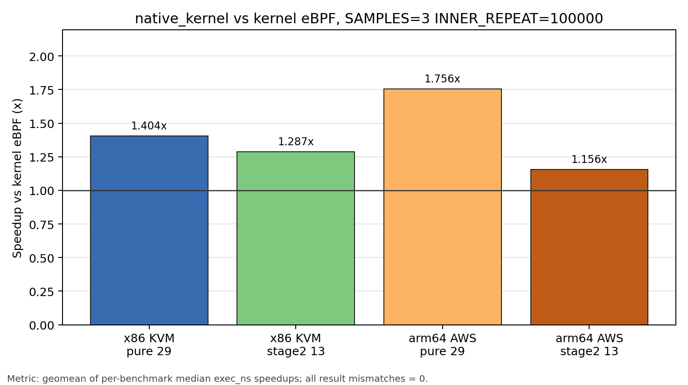
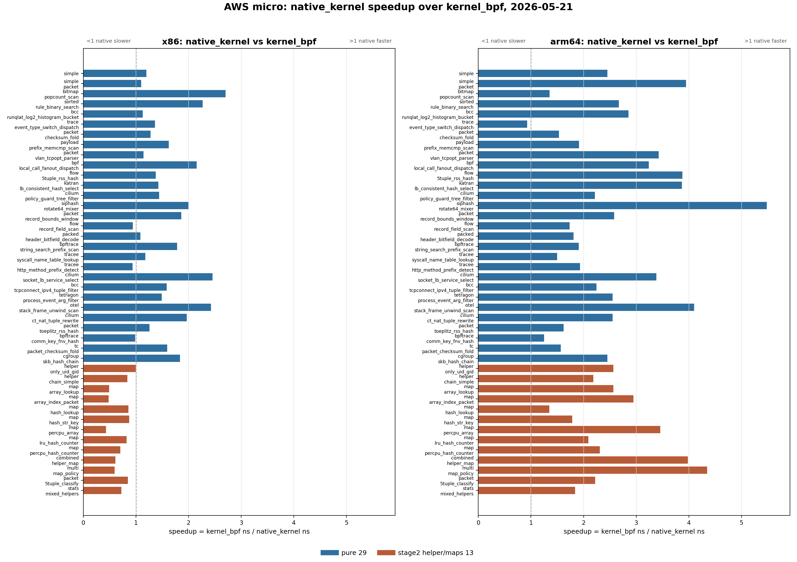
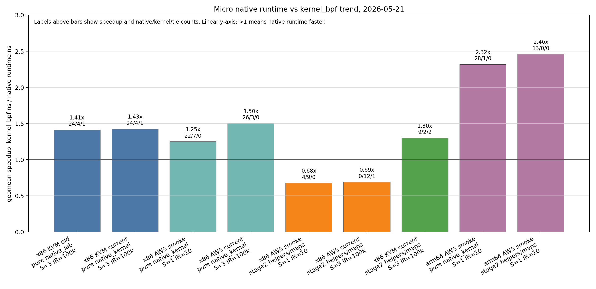

# Micro Benchmark Status

Last updated: 2026-05-22

This is the current short status page for micro benchmark data. The previous
long evaluation note is archived at
`docs/tmp/micro-bench-status-20260520-archive.md`.

All ratios, speedups, and win/loss counts below are post-hoc analysis from raw
`metadata.json` files. The benchmark framework still records raw measurements
only.

## Headline Table

### x86 KVM

Source: `micro/results/x86_kvm_micro_20260520_044439_120822/metadata.json`

| Metric | Result |
|---|---:|
| Benchmarks completed | 29 / 29 |
| Runtimes | native userspace, kernel eBPF, native kernel |
| Expected-result mismatches | 0 |
| native userspace / kernel runtime geomean | 0.588 |
| native userspace speedup vs kernel | 1.70x |
| native userspace / kernel wins / losses / ties, +/-2% | 25 / 1 / 3 |
| native kernel / kernel runtime geomean | 0.707 |
| native kernel speedup vs kernel | 1.41x |
| native kernel / kernel wins / losses / ties, +/-2% | 23 / 3 / 3 |

### arm64 AWS

Source: `micro/results/aws_arm64_micro_20260520_052452_727433/metadata.json`

| Metric | Result |
|---|---:|
| Benchmarks completed | 29 / 29 |
| Runtimes | native userspace, LLVM-BPF, kernel eBPF |
| Expected-result mismatches | 0 |
| native userspace / kernel runtime geomean | 0.488 |
| native userspace speedup vs kernel | 2.05x |
| native userspace / kernel wins / losses / ties, +/-2% | 29 / 0 / 0 |
| LLVM-BPF / kernel runtime geomean | 0.521 |
| LLVM-BPF speedup vs kernel | 1.92x |
| native userspace / LLVM-BPF runtime geomean | 0.935 |

## Setup

### x86 KVM

Command:

```sh
make micro RUNTIMES="native kernel native_lab" \
  SAMPLES=3 WARMUPS=1 INNER_REPEAT=100000
```

This run uses the current x86 native ABI work, including the native kernel
result-channel fix for TC/cgroup skb programs. It is the current full x86
native userspace / kernel eBPF / native kernel dataset. The command uses raw
runtime ids: `native` means native userspace and `native_lab` means native
kernel.

### arm64 AWS

Command:

```sh
PLATFORM=aws ARCH=arm64 SAMPLES=1 WARMUPS=0 INNER_REPEAT=10000 make micro
```

This is an arm64 smoke run on one `t4g.small`. It validates the arm64 micro
runtime path and gives directional native userspace / LLVM-BPF / kernel eBPF
data. It is not a paper-grade arm64 run.

## Kernel vs Native Performance

2026-05-22 current native-kernel validation:

- x86 uses KVM; arm64 uses AWS `t4g.small`.
- Commands use `SAMPLES=3 WARMUPS=0 INNER_REPEAT=100000`.
- Runtimes are `native_kernel kernel`.
- Metric is post-hoc geomean of per-benchmark median `exec_ns` speedups
  (`kernel eBPF ns / native_kernel ns`).
- All four runs completed with zero `retval` / result mismatches.



| Arch / platform | Suite | Result source | Benchmarks | Samples | native/kernel geomean | Speedup vs kernel eBPF | Wins / losses / ties, +/-2% |
|---|---|---|---:|---:|---:|---:|---:|
| x86 KVM | pure 29 | `micro/results/x86_kvm_micro_20260522_201404_601577` | 29 / 29 | 174 | 0.712 | 1.404x | 22 / 0 / 7 |
| x86 KVM | stage2 helpers/maps | `micro/results/x86_kvm_micro_20260522_201850_232073` | 13 / 13 | 78 | 0.777 | 1.287x | 6 / 2 / 5 |
| arm64 AWS | pure 29 | `micro/results/aws_arm64_micro_20260522_202706_798878` | 29 / 29 | 174 | 0.569 | 1.756x | 27 / 0 / 2 |
| arm64 AWS | stage2 helpers/maps | `micro/results/aws_arm64_micro_20260522_200701_786527` | 13 / 13 | 78 | 0.865 | 1.156x | 12 / 0 / 1 |

Earlier arm64 stage2 smoke speedups used `SAMPLES=1 INNER_REPEAT=10` and are
not comparable with the current authoritative-parameter row. The current arm64
stage2 number above is the passing native-kernel/helper-map result.

### Current Trend Check

The 2026-05-22 graph is not a monotonic slowdown. With
`SAMPLES=3 WARMUPS=0 INNER_REPEAT=100000`, the pure suites are stable and the
visible dip is concentrated in stage2 helper/map programs.

| Arch / platform | Suite | Recent comparable speedups | Current speedup | Note |
|---|---|---:|---:|---|
| x86 KVM | pure 29 | 1.425x, 1.468x, 1.338x, 1.316x | 1.404x | Within recent KVM range. |
| x86 KVM | stage2 helpers/maps | 1.300x, 1.344x, 1.289x, 1.344x | 1.287x | Mostly pulled down by `map_hash_lookup`. |
| arm64 AWS | pure 29 | 1.754x, 1.764x, 1.794x, 1.771x | 1.756x | Stable. |
| arm64 AWS | stage2 helpers/maps | 1.162x | 1.156x | Stable; most hash/helper cases are near parity. |

For current x86 KVM stage2, removing only `map_hash_lookup` changes the
post-hoc geomean speedup from 1.287x to 1.424x. That benchmark is unstable at
this scale: the full stage2 run recorded native/kernel medians of 81/31 ns,
while an immediate single-benchmark rerun
`micro/results/x86_kvm_micro_20260522_205257_986766` recorded 32/32/32 ns for
both `native_kernel` and `kernel`. The xlated/JIT dump sizes stayed the same
(`416` BPF bytes, `235` kernel-JIT bytes, `154` native-kernel bytes), so the
current evidence points to `bpf_prog_test_run` duration sensitivity on a tiny
hash-map benchmark rather than a native-code regression.

`native_proof` is also wired through the micro runner for the helper/map suite:
x86 KVM smoke `micro/results/x86_kvm_micro_20260522_204037_190084` and arm64
AWS smoke `micro/results/aws_arm64_micro_20260522_204804_171708` both loaded
and ran `helper_chain_simple` with the expected result and retval.

### x86 KVM Current Detail

| Suite | Benchmark | Native kernel ns | Kernel eBPF ns | Speedup |
|---|---|---:|---:|---:|
| pure 29 | `simple` | 6 | 6 | 1.000x |
| pure 29 | `simple_packet` | 6 | 6 | 1.000x |
| pure 29 | `bitmap_popcount_scan` | 468 | 1113 | 2.378x |
| pure 29 | `sorted_rule_binary_search` | 308 | 527 | 1.711x |
| pure 29 | `bcc_runqlat_log2_histogram_bucket` | 1141 | 1151 | 1.009x |
| pure 29 | `trace_event_type_switch_dispatch` | 279 | 283 | 1.014x |
| pure 29 | `packet_checksum_fold` | 13341 | 17623 | 1.321x |
| pure 29 | `payload_prefix_memcmp_scan` | 51 | 86 | 1.686x |
| pure 29 | `packet_vlan_tcpopt_parser` | 11 | 12 | 1.091x |
| pure 29 | `bpf_local_call_fanout_dispatch` | 70 | 124 | 1.771x |
| pure 29 | `flow_5tuple_rss_hash` | 10 | 16 | 1.600x |
| pure 29 | `katran_lb_consistent_hash_select` | 14 | 22 | 1.571x |
| pure 29 | `cilium_policy_guard_tree_filter` | 63 | 75 | 1.190x |
| pure 29 | `siphash_rotate64_mixer` | 28 | 54 | 1.929x |
| pure 29 | `packet_record_bounds_window` | 64 | 118 | 1.844x |
| pure 29 | `flow_record_field_scan` | 52 | 63 | 1.212x |
| pure 29 | `packed_header_bitfield_decode` | 201 | 276 | 1.373x |
| pure 29 | `bpftrace_string_search_prefix_scan` | 147 | 189 | 1.286x |
| pure 29 | `tracee_syscall_name_table_lookup` | 103 | 117 | 1.136x |
| pure 29 | `tracee_http_method_prefix_detect` | 18 | 18 | 1.000x |
| pure 29 | `cilium_socket_lb_service_select` | 172 | 372 | 2.163x |
| pure 29 | `bcc_tcpconnect_ipv4_tuple_filter` | 64 | 106 | 1.656x |
| pure 29 | `tetragon_process_event_arg_filter` | 109 | 155 | 1.422x |
| pure 29 | `otel_stack_frame_unwind_scan` | 43 | 112 | 2.605x |
| pure 29 | `cilium_ct_nat_tuple_rewrite` | 79 | 147 | 1.861x |
| pure 29 | `packet_toeplitz_rss_hash` | 208 | 266 | 1.279x |
| pure 29 | `bpftrace_comm_key_fnv_hash` | 437 | 435 | 0.995x |
| pure 29 | `tc_packet_checksum_fold` | 13332 | 17628 | 1.322x |
| pure 29 | `cgroup_skb_hash_chain` | 291 | 286 | 0.983x |
| stage2 13 | `helper_only_uid_gid` | 10 | 8 | 0.800x |
| stage2 13 | `helper_chain_simple` | 186 | 185 | 0.995x |
| stage2 13 | `map_array_lookup` | 7 | 17 | 2.429x |
| stage2 13 | `map_array_index_packet` | 7 | 17 | 2.429x |
| stage2 13 | `map_hash_lookup` | 81 | 31 | 0.383x |
| stage2 13 | `map_hash_str_key` | 84 | 85 | 1.012x |
| stage2 13 | `map_percpu_array` | 7 | 17 | 2.429x |
| stage2 13 | `map_lru_hash_counter` | 228 | 228 | 1.000x |
| stage2 13 | `map_percpu_hash_counter` | 75 | 75 | 1.000x |
| stage2 13 | `combined_helper_map` | 13 | 24 | 1.846x |
| stage2 13 | `multi_map_policy` | 80 | 103 | 1.288x |
| stage2 13 | `packet_5tuple_classify` | 36 | 92 | 2.556x |
| stage2 13 | `stats_mixed_helpers` | 157 | 156 | 0.994x |

### arm64 AWS Current Detail

| Suite | Benchmark | Native kernel ns | Kernel eBPF ns | Speedup |
|---|---|---:|---:|---:|
| pure 29 | `simple` | 14 | 14 | 1.000x |
| pure 29 | `simple_packet` | 14 | 14 | 1.000x |
| pure 29 | `bitmap_popcount_scan` | 1649 | 2186 | 1.326x |
| pure 29 | `sorted_rule_binary_search` | 746 | 1933 | 2.591x |
| pure 29 | `bcc_runqlat_log2_histogram_bucket` | 2378 | 4452 | 1.872x |
| pure 29 | `trace_event_type_switch_dispatch` | 625 | 666 | 1.066x |
| pure 29 | `packet_checksum_fold` | 26073 | 39543 | 1.517x |
| pure 29 | `payload_prefix_memcmp_scan` | 179 | 303 | 1.693x |
| pure 29 | `packet_vlan_tcpopt_parser` | 28 | 43 | 1.536x |
| pure 29 | `bpf_local_call_fanout_dispatch` | 151 | 359 | 2.377x |
| pure 29 | `flow_5tuple_rss_hash` | 28 | 52 | 1.857x |
| pure 29 | `katran_lb_consistent_hash_select` | 38 | 68 | 1.789x |
| pure 29 | `cilium_policy_guard_tree_filter` | 145 | 251 | 1.731x |
| pure 29 | `siphash_rotate64_mixer` | 54 | 159 | 2.944x |
| pure 29 | `packet_record_bounds_window` | 161 | 354 | 2.199x |
| pure 29 | `flow_record_field_scan` | 127 | 195 | 1.535x |
| pure 29 | `packed_header_bitfield_decode` | 508 | 857 | 1.687x |
| pure 29 | `bpftrace_string_search_prefix_scan` | 373 | 641 | 1.718x |
| pure 29 | `tracee_syscall_name_table_lookup` | 319 | 394 | 1.235x |
| pure 29 | `tracee_http_method_prefix_detect` | 47 | 59 | 1.255x |
| pure 29 | `cilium_socket_lb_service_select` | 339 | 1124 | 3.316x |
| pure 29 | `bcc_tcpconnect_ipv4_tuple_filter` | 161 | 341 | 2.118x |
| pure 29 | `tetragon_process_event_arg_filter` | 287 | 572 | 1.993x |
| pure 29 | `otel_stack_frame_unwind_scan` | 112 | 407 | 3.634x |
| pure 29 | `cilium_ct_nat_tuple_rewrite` | 207 | 495 | 2.391x |
| pure 29 | `packet_toeplitz_rss_hash` | 376 | 489 | 1.301x |
| pure 29 | `bpftrace_comm_key_fnv_hash` | 1301 | 1578 | 1.213x |
| pure 29 | `tc_packet_checksum_fold` | 26074 | 39538 | 1.516x |
| pure 29 | `cgroup_skb_hash_chain` | 375 | 964 | 2.571x |
| stage2 13 | `helper_only_uid_gid` | 30 | 32 | 1.067x |
| stage2 13 | `helper_chain_simple` | 242 | 247 | 1.021x |
| stage2 13 | `map_array_lookup` | 18 | 28 | 1.556x |
| stage2 13 | `map_array_index_packet` | 19 | 29 | 1.526x |
| stage2 13 | `map_hash_lookup` | 97 | 100 | 1.031x |
| stage2 13 | `map_hash_str_key` | 107 | 110 | 1.028x |
| stage2 13 | `map_percpu_array` | 20 | 31 | 1.550x |
| stage2 13 | `map_lru_hash_counter` | 216 | 221 | 1.023x |
| stage2 13 | `map_percpu_hash_counter` | 90 | 92 | 1.022x |
| stage2 13 | `combined_helper_map` | 38 | 46 | 1.211x |
| stage2 13 | `multi_map_policy` | 110 | 126 | 1.145x |
| stage2 13 | `packet_5tuple_classify` | 107 | 113 | 1.056x |
| stage2 13 | `stats_mixed_helpers` | 188 | 190 | 1.011x |


2026-05-21 AWS native-kernel snapshot:
`docs/tmp/aws_micro_native_kernel_vs_kernel_bpf_20260521.md` covers x86 and
arm64 `native_kernel` vs kernel eBPF across the 29 pure micro programs plus the
13 stage2 helper/map programs.



2026-05-21 KVM/AWS trend cross-check:
the current x86 KVM pure run is consistent with the previous x86 KVM native
kernel baseline, while x86 AWS stage2 helper/map results are the outlier.



| Result | Suite | Runtime | Speedup vs kernel eBPF |
|---|---|---|---:|
| x86 KVM previous | pure | native kernel (`native_lab`) | 1.414x |
| x86 KVM current | pure | `native_kernel` | 1.425x |
| x86 AWS current | pure | `native_kernel` | 1.503x |
| x86 AWS current | stage2 helpers/maps | `native_kernel` | 0.690x |
| x86 KVM current | stage2 helpers/maps | `native_kernel` | 1.300x |
| arm64 AWS smoke | pure | `native_kernel` | 2.318x |
| arm64 AWS smoke | stage2 helpers/maps | `native_kernel` | 2.460x |

### x86 KVM

The x86 run compares kernel eBPF JIT against native userspace timing and
in-kernel direct native execution through the native kernel path.

| Case | Native userspace ns | Native kernel ns | Kernel eBPF ns |
|---|---:|---:|---:|
| `bitmap_popcount_scan` | 464 | 466 | 1113 |
| `packet_checksum_fold` | 13358 | 13337 | 17635 |
| `bpf_local_call_fanout_dispatch` | 68 | 70 | 123 |
| `cgroup_skb_hash_chain` | 288 | 291 | 285 |

### arm64 AWS

The arm64 run compares kernel BPF JIT against userspace native code and the
LLVM-BPF runtime.

| Case | Native userspace ns | LLVM-BPF ns | Kernel eBPF ns |
|---|---:|---:|---:|
| `bitmap_popcount_scan` | 1614 | 1633 | 2226 |
| `packet_checksum_fold` | 26085 | 26162 | 39543 |
| `bpf_local_call_fanout_dispatch` | 164 | 121 | 358 |
| `cgroup_skb_hash_chain` | 368 | 372 | 964 |

## Size Compare


The size comparison uses median `code_size.native_code_bytes`. This is machine
code size, not BPF bytecode size.

### x86 KVM

| Comparison | Programs | Geomean size ratio vs kernel | Smaller / larger / tie, +/-2% |
|---|---:|---:|---:|
| native userspace / kernel | 29 | 0.491 | 28 / 0 / 1 |
| native kernel / kernel | 29 | 0.500 | 28 / 0 / 1 |

### arm64 AWS

| Comparison | Programs | Geomean size ratio vs kernel | Smaller / larger / tie, +/-2% |
|---|---:|---:|---:|
| native userspace / kernel | 29 | 0.445 | 28 / 1 / 0 |
| LLVM-BPF / kernel | 29 | 0.452 | 29 / 0 / 0 |
