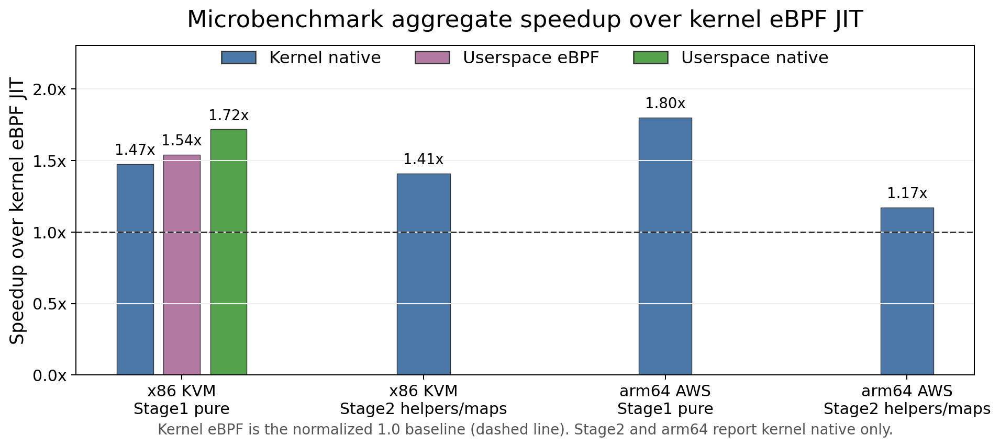
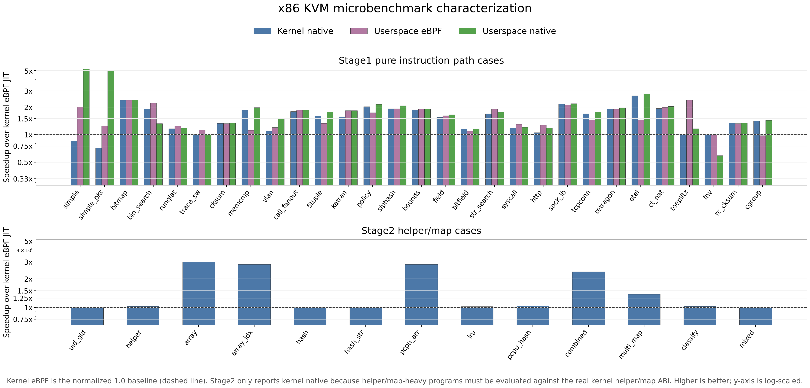
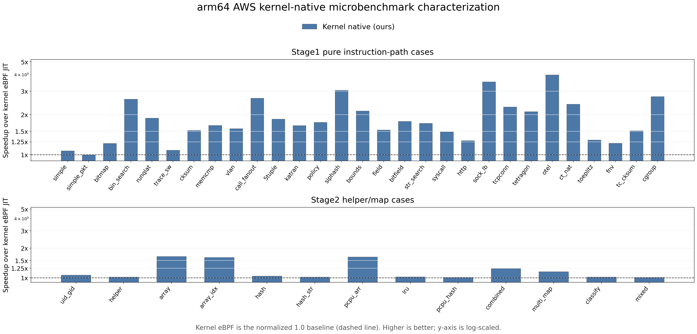
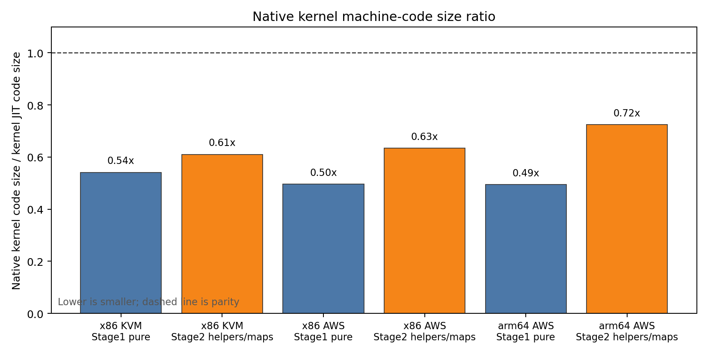
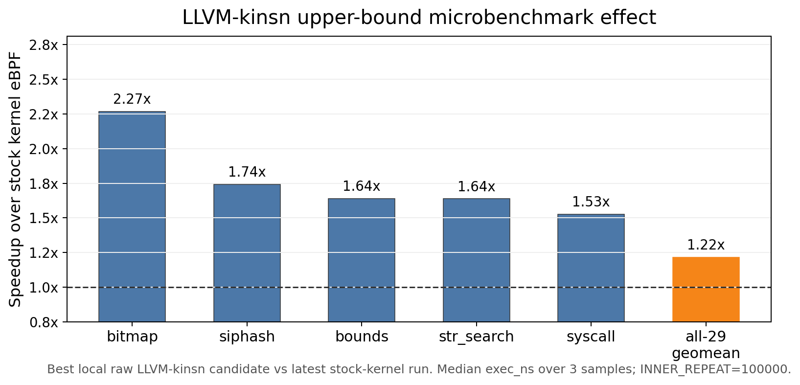
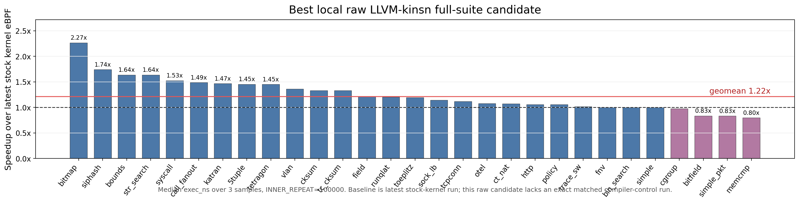
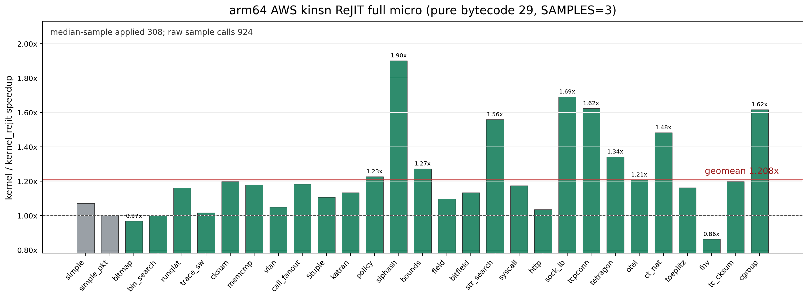

# Micro Benchmark Status

Last updated: 2026-06-06

This is the current paper-facing status page for microbenchmark data. The
previous long evaluation note is archived at
`docs/tmp/micro-bench-status-20260520-archive.md`.

All ratios, speedups, and win/loss counts below are post-hoc analysis from raw
`result.json` files. The benchmark framework still records raw measurements
only.

## Paper Framing

This section should read like a characterization study, not like an
implementation status log. The microbenchmark claim is intentionally narrow:
native kernel execution changes the cost of BPF instruction execution and
helper/map access patterns under controlled `BPF_PROG_TEST_RUN` workloads.
Corpus/app results are required separately for end-to-end application claims.

The current research questions are:

- **RQ1 Correctness:** do all tested execution configurations preserve the
  expected result and retval on the microbenchmark suites?
- **RQ2 Four-way execution cost:** on x86 KVM, how do userspace eBPF,
  userspace native, kernel eBPF, and kernel native compare on pure
  instruction-path workloads?
- **RQ3 Helper/map boundary cost:** on x86 KVM, does kernel native still improve
  helper/map-heavy programs when evaluated against the real kernel helper/map
  ABI?
- **RQ4 Kernel-native portability:** does the kernel-native result also hold on
  arm64 when compared against arm64 kernel eBPF?
- **RQ5 Machine-code footprint:** how does generated machine-code size compare
  against kernel eBPF JIT output?
- **RQ6 kinsn opportunity and coverage:** what speedups are visible in the best
  local full-suite LLVM-kinsn candidate, and do matched arm64 kinsn ReJIT runs
  apply sites on the full micro suites?

The full four-way comparison is available in the latest x86 KVM artifacts:
`llvmbpf` is userspace eBPF, `native` is userspace native, `kernel` is kernel
eBPF, and `native_kernel` is kernel native. The with-helpers/maps suite excludes
userspace runtimes from the main comparison because their helper/map paths are
runner-local emulation, not the kernel helper/map ABI. The arm64 AWS artifacts
are a two-way portability check for kernel eBPF versus kernel native.

## Experimental Setup

The authoritative micro runs use:

```sh
SAMPLES=3 WARMUPS=0 INNER_REPEAT=100000 make micro

PLATFORM=aws ARCH=arm64 SAMPLES=3 WARMUPS=0 INNER_REPEAT=100000 make micro

PLATFORM=aws ARCH=arm64 SAMPLES=3 WARMUPS=0 INNER_REPEAT=100000 \
  RUNTIMES="kernel kernel_rejit" BPFREJIT_BENCH_PASSES=kinsn make micro

PLATFORM=aws ARCH=arm64 SAMPLES=3 WARMUPS=0 INNER_REPEAT=100000 \
  RUNTIMES="kernel kernel_rejit" BPFREJIT_BENCH_PASSES=kinsn \
  SUITE=micro/config/micro_stage2.yaml make micro
```

The measured suites are:

- **Pure bytecode 29:** compute, branch, local-call, parser, checksum, string, and
  packet microbenchmarks with no external map/helper bottleneck as the dominant
  cost.
- **With helpers/maps 13:** deterministic helper and map-access benchmarks
  covering arrays, hash maps, percpu maps, LRU maps, mixed helper/map paths, and
  packet classification.

The measured runtimes are:

- **kernel:** baseline kernel eBPF JIT.
- **native_kernel:** native object linked and loaded into the kernel native
  execution path.
- **native:** userspace native runtime, available in the latest x86 KVM
  four-way run.
- **llvmbpf:** userspace eBPF through the LLVM-BPF runtime, available in the
  latest x86 KVM four-way run.
- **kernel_rejit:** kernel eBPF after the requested ReJIT pass list. It is used
  only for the arm64 kinsn follow-up in Appendix D.

The platform details recorded in the artifacts are:

| Platform | Executor | CPU recorded by artifact | Kernel | AWS bench instance default |
|---|---|---|---|---|
| x86 KVM | virtme-ng VM | Intel Core Ultra 9 285K | 7.0.0-rc2+ | N/A |
| arm64 AWS | EC2 instance | aarch64 | 7.0.0-rc2+ | `t4g.small` |

## Methodology

Each benchmark/runtime pair records three samples after zero warmups. Each
sample runs the benchmark body `INNER_REPEAT=100000` times. Correctness is
gated by exact expected result and retval checks for every recorded sample.
Runtime figures measure steady-state `BPF_PROG_TEST_RUN` execution time only;
load, link, and compile phases are recorded separately and excluded from runtime
ratios.

For each benchmark and runtime, the analysis uses the median `exec_ns` across
the three samples. For each suite, the reported aggregate is the geomean of
per-benchmark ratios:

```text
ratio = median_runtime_exec_ns / median_kernel_exec_ns
speedup = 1 / ratio
```

A ratio below 1.0 means the runtime is faster than the kernel eBPF JIT.
Wins/losses/ties use a +/-2% band around the kernel baseline. No benchmark is
filtered out of these micro aggregates.

## Main Results

Latest representative full runs:

| Platform | Suite | Result source | Runtimes | Samples | Expected-result mismatches |
|---|---|---|---|---:|---:|
| x86 KVM | pure bytecode 29 | `micro/results/x86_kvm_micro_20260526_210952_650695` | kernel, llvmbpf, native, native_kernel | 348 | 0 |
| x86 KVM | with helpers/maps 13 | `micro/results/x86_kvm_micro_20260526_210434_440390` | kernel, llvmbpf, native, native_kernel | 156 | 0 |
| arm64 AWS | pure bytecode 29 | `micro/results/aws_arm64_micro_20260523_091516_610343` | kernel, native_kernel | 174 | 0 |
| arm64 AWS | with helpers/maps 13 | `micro/results/aws_arm64_micro_20260523_092823_183684` | kernel, native_kernel | 78 | 0 |

Aggregate runtime ratios:

| Platform | Suite | Runtime vs kernel eBPF | Runtime/kernel geomean | Speedup vs kernel eBPF | Wins / losses / ties |
|---|---|---|---:|---:|---:|
| x86 KVM | pure bytecode 29 | native userspace | 0.583 | 1.716x | 27 / 1 / 1 |
| x86 KVM | pure bytecode 29 | LLVM-BPF userspace | 0.650 | 1.538x | 27 / 1 / 1 |
| x86 KVM | pure bytecode 29 | native kernel | 0.678 | 1.474x | 24 / 2 / 3 |
| x86 KVM | with helpers/maps 13 | native kernel | 0.710 | 1.409x | 9 / 0 / 4 |
| arm64 AWS | pure bytecode 29 | native kernel | 0.556 | 1.800x | 28 / 0 / 1 |
| arm64 AWS | with helpers/maps 13 | native kernel | 0.855 | 1.170x | 9 / 0 / 4 |



*Figure 1: Aggregate microbenchmark speedup over kernel eBPF JIT for the
authoritative pure-bytecode and with-helpers/maps artifacts. x86 KVM pure
bytecode includes kernel native, userspace eBPF, and userspace native; x86 KVM
with helpers/maps reports kernel native only. arm64 AWS reports kernel native
only because the current authoritative arm64 artifacts contain kernel eBPF and
kernel native. Higher is better; the dashed line is parity.*



*Figure 2: x86 KVM per-case runtime comparison normalized to kernel eBPF JIT.
Pure bytecode includes userspace eBPF, userspace native, and kernel native.
With helpers/maps only reports kernel native because helper/map-heavy programs
must be evaluated against the real kernel helper/map ABI; userspace helper/map
models are not comparable for this RQ.*



*Figure 3: arm64 AWS per-case kernel-native portability result. Bars report
kernel native speedup over arm64 kernel eBPF JIT, using the same pure-bytecode
and with-helpers/maps case structure as Figure 2. Higher is better; the dashed
line is parity.*

## RQ Answers

**RQ1 Correctness.** All current full micro artifacts have zero expected-result
or retval mismatches. On x86 KVM this covers all four execution configurations
over 29/29 pure-bytecode benchmarks and 13/13 with-helpers/maps benchmarks. On
arm64 AWS this covers kernel eBPF and kernel native over the same suites.

**RQ2 Four-way execution cost.** On x86 KVM pure bytecode, all non-kernel-eBPF
execution configurations are faster than kernel eBPF: userspace native is
1.716x, userspace eBPF is 1.538x, and kernel native is 1.474x. This shows that
the pure instruction path benefits from native code even after paying the
kernel-native execution path.

**RQ3 Helper/map boundary cost.** On x86 KVM with helpers/maps, kernel native
remains faster than kernel eBPF at 1.409x. This suite only reports kernel native
because helper/map-heavy programs must be evaluated against the real kernel
helper/map ABI. Userspace runtimes use runner-local helper/map models, so they
are not comparable for this RQ.

**RQ4 Kernel-native portability.** On arm64 AWS, kernel native is also faster
than arm64 kernel eBPF: 1.800x on pure bytecode and 1.170x with helpers/maps.
The helper/map gain is smaller than the pure-bytecode gain, consistent with
helper/map boundary costs.

**RQ5 Machine-code footprint.** The generated machine code is consistently
smaller than kernel eBPF JIT output. On x86 KVM pure bytecode, code-size ratios
are 0.541x for kernel native, 0.565x for userspace eBPF, and 0.539x for
userspace native. Kernel native is also smaller on x86 with helpers/maps
(0.610x), arm64 pure bytecode (0.495x), and arm64 with helpers/maps (0.724x).

**RQ6 kinsn opportunity and coverage.** The best local raw LLVM-kinsn candidate
shows a 1.216x all-29 geomean speedup over the latest stock-kernel baseline,
with top individual cases reaching 2.267x. This remains an exploratory
upper-bound datapoint because the artifact does not record an exact matched
compiler-control run. The selector-fixed matched arm64 AWS pure-bytecode kinsn
ReJIT full-suite run is now an actual coverage/performance datapoint: it
applies 308/308 matched sites in the median sample, 924/924 raw calls across
three samples, and reports a 1.208x geomean speedup with zero correctness
mismatches. The with-helpers/maps kinsn run listed below is still the
pre-selector-fix artifact and remains a parity/noise check until rerun.

The concise paper claim supported by these data is:

- x86 KVM pure bytecode remains strong at 1.474x and with helpers/maps is
  positive at 1.409x.
- arm64 AWS is positive on both suites, with a larger pure-bytecode gain.
- Generated machine-code size is 0.49-0.72x of kernel eBPF JIT size across the
  measured authoritative kernel-native suites.
- Matched arm64 kinsn ReJIT now has full-suite pure-bytecode coverage and
  speedup, but helper/map kinsn coverage still needs a post-selector-fix rerun.

## Threats To Validity

- The microbenchmark suite isolates native execution costs; it does not replace
  corpus/app-level workload measurements.
- AWS CPU governor and turbo state are recorded as unknown in the artifacts.
  Cross-platform comparisons should therefore focus on ratios within the same
  platform, not absolute nanoseconds across platforms.
- AWS full authoritative artifacts currently cover `kernel` and
  `native_kernel`; userspace native and LLVM-BPF baselines are only available in
  the latest x86 KVM full run.
- Userspace runtime data for the with-helpers/maps suite exists in the raw
  artifact but is not a kernel-helper/map-path comparison, so it is
  intentionally excluded from the main helper/map claim.
- The x86 LLVM-kinsn result is reported as an upper-bound opportunity only. It
  uses a real full-suite raw artifact but lacks an exact matched
  compiler-control artifact in metadata. The arm64 pure-bytecode kinsn ReJIT
  artifact is matched `kernel` versus `kernel_rejit` and applies sites after
  the selector fix. The helper/map kinsn artifact in this note is still the
  older zero-apply run and should not be generalized to helper/map coverage.
- Some very small x86 helper/map kernel baselines show high per-sample CV
  because one of three samples can be an outlier at tens-of-nanoseconds scale.
  The reported aggregate therefore uses per-case medians and the outliers are
  documented in Appendix E.

## Appendix A: Artifact Manifest

| Platform | Suite | Generated at | Result source |
|---|---|---|---|
| x86 KVM | pure bytecode 29 | 2026-05-26T21:09:52Z | `micro/results/x86_kvm_micro_20260526_210952_650695/details/result.json` |
| x86 KVM | with helpers/maps 13 | 2026-05-26T21:04:34Z | `micro/results/x86_kvm_micro_20260526_210434_440390/details/result.json` |
| arm64 AWS | pure bytecode 29 | 2026-05-23T09:15:16Z | `micro/results/aws_arm64_micro_20260523_091516_610343/details/result.json` |
| arm64 AWS | with helpers/maps 13 | 2026-05-23T09:28:23Z | `micro/results/aws_arm64_micro_20260523_092823_183684/details/result.json` |

## Appendix B: Native Kernel Helper/Map Detail

The with-helpers/maps suite is the most sensitive current native-kernel micro
workload. Values are median `exec_ns`; speedup is
`kernel_ns / native_kernel_ns`.

| Platform | Benchmark | Native kernel ns | Kernel eBPF ns | Speedup |
|---|---|---:|---:|---:|
| x86 KVM | `helper_only_uid_gid` | 7 | 7 | 1.000x |
| x86 KVM | `helper_chain_simple` | 72 | 74 | 1.028x |
| x86 KVM | `map_array_lookup` | 6 | 18 | 3.000x |
| x86 KVM | `map_array_index_packet` | 6 | 17 | 2.833x |
| x86 KVM | `map_hash_lookup` | 32 | 32 | 1.000x |
| x86 KVM | `map_hash_str_key` | 33 | 33 | 1.000x |
| x86 KVM | `map_percpu_array` | 6 | 17 | 2.833x |
| x86 KVM | `map_lru_hash_counter` | 84 | 86 | 1.024x |
| x86 KVM | `map_percpu_hash_counter` | 27 | 28 | 1.037x |
| x86 KVM | `combined_helper_map` | 8 | 19 | 2.375x |
| x86 KVM | `multi_map_policy` | 32 | 44 | 1.375x |
| x86 KVM | `packet_5tuple_classify` | 40 | 41 | 1.025x |
| x86 KVM | `stats_mixed_helpers` | 60 | 59 | 0.983x |
| arm64 AWS | `helper_only_uid_gid` | 30 | 32 | 1.067x |
| arm64 AWS | `helper_chain_simple` | 242 | 247 | 1.021x |
| arm64 AWS | `map_array_lookup` | 17 | 28 | 1.647x |
| arm64 AWS | `map_array_index_packet` | 18 | 29 | 1.611x |
| arm64 AWS | `map_hash_lookup` | 96 | 100 | 1.042x |
| arm64 AWS | `map_hash_str_key` | 107 | 109 | 1.019x |
| arm64 AWS | `map_percpu_array` | 19 | 31 | 1.632x |
| arm64 AWS | `map_lru_hash_counter` | 215 | 220 | 1.023x |
| arm64 AWS | `map_percpu_hash_counter` | 90 | 91 | 1.011x |
| arm64 AWS | `combined_helper_map` | 37 | 46 | 1.243x |
| arm64 AWS | `multi_map_policy` | 108 | 125 | 1.157x |
| arm64 AWS | `packet_5tuple_classify` | 107 | 109 | 1.019x |
| arm64 AWS | `stats_mixed_helpers` | 188 | 190 | 1.011x |

## Appendix C: Code Size

The code-size comparison uses median `code_size.native_code_bytes` from the
same authoritative artifacts. This is machine-code size, not BPF bytecode size.
The ratio is runtime machine-code bytes divided by kernel eBPF JIT machine-code
bytes, so lower means the generated image is smaller than the kernel eBPF JIT
image.



*Figure 4: Machine-code size relative to kernel eBPF JIT code size for the same
pure-bytecode and with-helpers/maps artifacts used in the runtime figures. x86
KVM pure bytecode includes kernel native, userspace eBPF, and userspace native;
with helpers/maps and arm64 report kernel native only to match the runtime
comparison scope. Lower is smaller; the dashed line is parity.*

| Platform | Suite | Runtime | runtime/kernel code-size geomean |
|---|---|---|---:|
| x86 KVM | pure bytecode 29 | kernel native | 0.541 |
| x86 KVM | pure bytecode 29 | userspace eBPF | 0.565 |
| x86 KVM | pure bytecode 29 | userspace native | 0.539 |
| x86 KVM | with helpers/maps 13 | kernel native | 0.610 |
| arm64 AWS | pure bytecode 29 | kernel native | 0.495 |
| arm64 AWS | with helpers/maps 13 | kernel native | 0.724 |

## Appendix D: LLVM Kinsn Micro

These LLVM-kinsn micro results are separate from the kernel-native result above.
This is an upper-bound engineering datapoint from the best local full-suite raw
candidate. It uses the latest stock-kernel eBPF run as the baseline and does not
record an exact matched compiler-control run in metadata.



*Figure 5: LLVM-kinsn upper-bound top cases. Bars show the five largest
per-case speedups plus the all-29 geomean, using median `exec_ns` across three
samples with `INNER_REPEAT=100000`. Higher is better; the dashed line is
parity.*

| Case | Stock kernel median ns | Kinsn candidate median ns | Speedup |
|---|---:|---:|---:|
| `bitmap_popcount_scan` | 1113 | 491 | 2.267x |
| `siphash_rotate64_mixer` | 54 | 31 | 1.742x |
| `packet_record_bounds_window` | 118 | 72 | 1.639x |
| `bpftrace_string_search_prefix_scan` | 244 | 149 | 1.638x |
| `tracee_syscall_name_table_lookup` | 168 | 110 | 1.527x |
| all-29 geomean | - | - | 1.216x |



*Figure 6: Full per-case view for the same best local raw LLVM-kinsn candidate
relative to the latest stock kernel eBPF baseline. Values use median `exec_ns`
across three samples with `INNER_REPEAT=100000`. The geomean speedup is 1.216x
over 29 cases with zero correctness mismatches, but this is not a matched
compiler-control comparison.*

### arm64 AWS Matched Kinsn ReJIT

The 2026-06-06 arm64 pure-bytecode follow-up is a matched `kernel` versus
`kernel_rejit` artifact using `BPFREJIT_BENCH_PASSES=kinsn`. Unlike the x86
upper-bound artifact above, it has an exact same-run compiler control. After
the selector fixes, the full pure-bytecode suite is no longer a zero-apply
parity check: 27/29 benchmarks apply kinsn sites, with 308/308 matched/applied
sites in the median sample and 924/924 raw matched/applied calls across the
three samples.



*Figure 7: arm64 AWS matched kinsn ReJIT microbenchmark follow-up for the
selector-fixed pure-bytecode full suite. Bars report `kernel / kernel_rejit`
speedup from median `exec_ns` across three samples. Green bars applied kinsn
sites; gray bars applied none. The all-29 geomean is 1.208x, and the
kinsn-bearing geomean is 1.222x over 27 benchmarks.*

| Suite | Result source | Benchmarks | Expected-result mismatches | Speedup geomean | Kinsn-bearing geomean | Wins / losses / ties | Matched/applied sites | Code-size ratio |
|---|---|---:|---:|---:|---:|---:|---:|---:|
| arm64 AWS pure bytecode 29, selector-fixed | `micro/results/aws_arm64_micro_20260606_001225_821028/details/result.json` | 29 | 0 | 1.208x | 1.222x over 27 | 24 / 2 / 3 | 308 / 308 median sample; 924 / 924 raw | 0.879x |
| arm64 AWS with helpers/maps 13, pre-selector-fix | `micro/results/aws_arm64_micro_20260605_201826_257732/details/result.json` | 13 | 0 | 1.000x | N/A | 2 / 2 / 9 | 0 / 0 | 1.000x |

The newly applied arm64 sites are not only rotates. Across the three samples,
the pass reports `bpf_arm64_extr_x=387`, `bpf_arm64_ldr_w=198`,
`bpf_arm64_ubfm_x=144`, `bpf_arm64_ldrh=114`, `bpf_arm64_rev16_w=39`,
`bpf_arm64_stp_x=21`, `bpf_arm64_rev_w=15`, and `bpf_arm64_ldp_x=6`. The
biggest practical change versus the 2026-06-05 zero-apply run is byte-ladder
load/endian fusion: checksum, Toeplitz, Cilium socket load-balancing, Cilium CT
rewrite, and cgroup hash cases now match the same wide-load shapes visible in
the native arm64 dumps.

| Case | Kernel ns | Kernel ReJIT ns | Speedup | Applied sites, median sample | Dominant kinsn shape |
|---|---:|---:|---:|---:|---|
| `siphash_rotate64_mixer` | 194 | 102 | 1.902x | 124 | `extr_x` rotate |
| `cilium_socket_lb_service_select` | 1126 | 666 | 1.691x | 7 | `ldr_w` / `ldrh` |
| `bcc_tcpconnect_ipv4_tuple_filter` | 341 | 210 | 1.624x | 8 | `ldr_w` / `ldrh` / `stp_x` |
| `cgroup_skb_hash_chain` | 965 | 597 | 1.616x | 2 | `ldr_w` |
| `bpftrace_string_search_prefix_scan` | 642 | 412 | 1.558x | 2 | `extr_x` / `ldr_w` |
| `cilium_ct_nat_tuple_rewrite` | 495 | 334 | 1.482x | 10 | `ldr_w` / `ldrh` / `stp_x` |
| `packet_checksum_fold` | 39569 | 33024 | 1.198x | 3 | `ldr_w` / `ldrh` |
| `packet_toeplitz_rss_hash` | 479 | 412 | 1.163x | 6 | `ldr_w` / `rev_w` |

The earlier zero-apply diagnosis was still useful: `siphash_rotate64_mixer`'s
xlated bytecode had split-copy rotate-like windows, while the old report
recorded `sites_matched=0` and `sites_applied=0`. The fixed selector now applies
124 median-sample sites to that benchmark. Remaining negative cases are small:
`bpftrace_comm_key_fnv_hash` slows to 0.862x with three median-sample sites, and
`bitmap_popcount_scan` slows to 0.966x with two sites. Those cases should not be
used as positive report examples without more targeted gating.

## Appendix E: Artifact And Noise Checks

The LLVM-kinsn upper-bound figures use these raw artifacts:

| Role | Result source | Generated at | Runtimes | Benchmarks | Samples | Expected-result mismatches |
|---|---|---|---|---:|---:|---:|
| LLVM-kinsn upper-bound candidate | `micro/results/x86_kvm_micro_20260519_114214_364050` | 2026-05-19T11:42:14Z | kernel | 29 | 87 | 0 |
| Stock-kernel baseline | `micro/results/x86_kvm_micro_20260526_210351_224315` | 2026-05-26T21:03:51Z | kernel, llvmbpf, native, native_kernel | 29 | 348 | 0 |

The arm64 matched kinsn ReJIT figure uses the selector-fixed pure-bytecode raw
artifact. The older pre-selector-fix artifacts are kept here as provenance for
the zero-apply diagnosis and for the still-unrerun helpers/maps suite.

| Role | Result source | Generated at | Runtimes | Benchmarks | Samples | Expected-result mismatches |
|---|---|---|---|---:|---:|---:|
| arm64 kinsn ReJIT pure bytecode, selector-fixed | `micro/results/aws_arm64_micro_20260606_001225_821028` | 2026-06-06T00:12:25Z | kernel, kernel_rejit | 29 | 174 | 0 |
| arm64 kinsn ReJIT pure bytecode, pre-selector-fix | `micro/results/aws_arm64_micro_20260605_195615_598255` | 2026-06-05T19:56:15Z | kernel, kernel_rejit | 29 | 174 | 0 |
| arm64 kinsn ReJIT with helpers/maps, pre-selector-fix | `micro/results/aws_arm64_micro_20260605_201826_257732` | 2026-06-05T20:18:26Z | kernel, kernel_rejit | 13 | 78 | 0 |

Per-run variability check. For each benchmark/runtime pair, this computes the
CV of the three `exec_ns` samples; runtime aggregates use the median sample.

| Platform | Suite | Benchmark/runtime pairs | Median CV | p95 CV | Max CV | Pairs within 2% of median |
|---|---|---:|---:|---:|---:|---:|
| x86 KVM | pure bytecode 29 | 116 | 0.57% | 19.54% | 28.37% | 75 / 116 |
| x86 KVM | with helpers/maps 13 | 26 | 0.40% | 60.91% | 61.02% | 16 / 26 |
| arm64 AWS | pure bytecode 29 | 58 | 1.55% | 8.86% | 23.40% | 26 / 58 |
| arm64 AWS | with helpers/maps 13 | 26 | 0.54% | 4.03% | 6.13% | 17 / 26 |

The high x86 helper/map p95/max CV comes from tiny absolute-time kernel
baselines with one outlier sample, for example `map_lru_hash_counter` kernel
`[225, 85, 86]`, `stats_mixed_helpers` kernel `[59, 59, 155]`, and
`map_hash_str_key` kernel `[33, 86, 33]`. Median aggregation is used to avoid
letting these one-sample outliers dominate per-case ratios.

## Appendix F: Figure Generation

The plotting script for Figures 1-4 is
`docs/tmp/plot_micro_characterization_20260527.py`. It is an analysis-side
script that reads the raw `result.json` artifacts listed in Appendix A and
writes the PNG files under `docs/figures`.

```sh
python3 docs/tmp/plot_micro_characterization_20260527.py
```

The plotting script for Figures 5-6 is
`docs/tmp/plot_kinsn_micro_20260527.py`.

```sh
python3 docs/tmp/plot_kinsn_micro_20260527.py
```

The plotting script for Figure 7 is
`docs/tmp/plot_arm64_kinsn_micro_20260606.py`. It also writes the detailed
post-hoc table at `docs/tmp/arm64_kinsn_micro_20260606_summary.md`.

```sh
python3 docs/tmp/plot_arm64_kinsn_micro_20260606.py
```

The older zero-apply arm64 kinsn script is
`docs/tmp/plot_arm64_kinsn_micro_20260605.py`.
