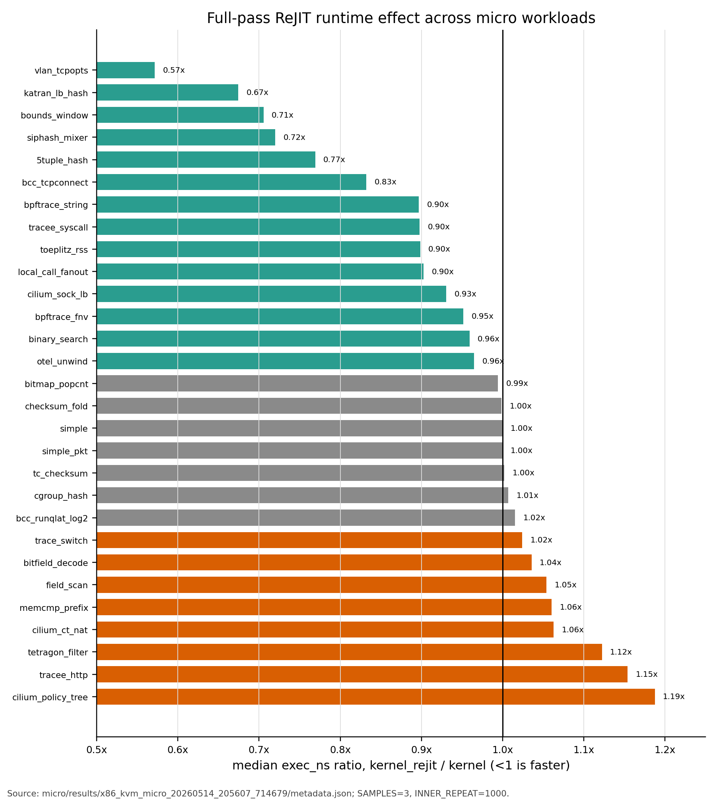
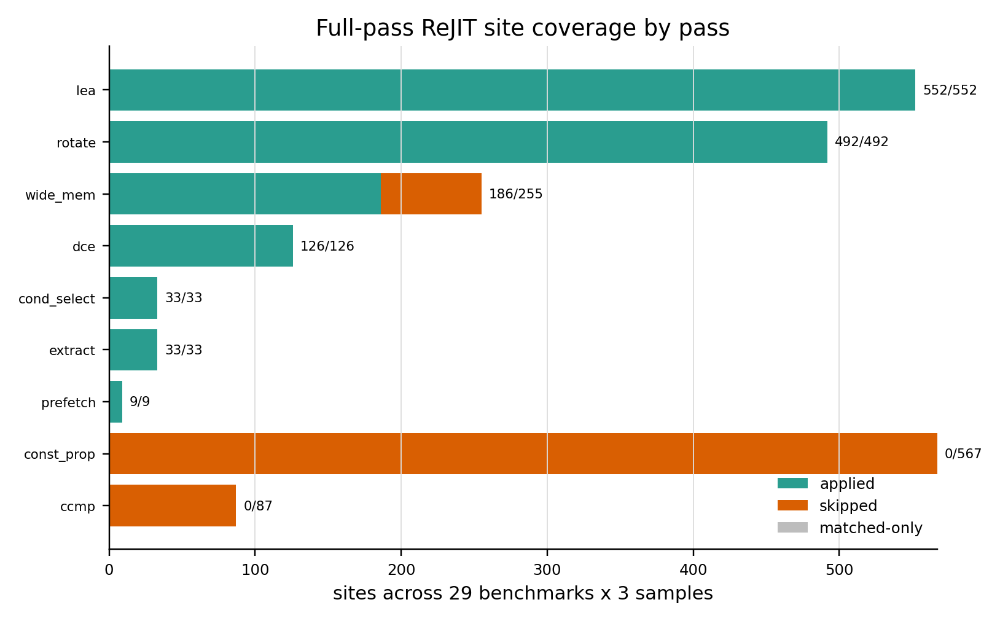
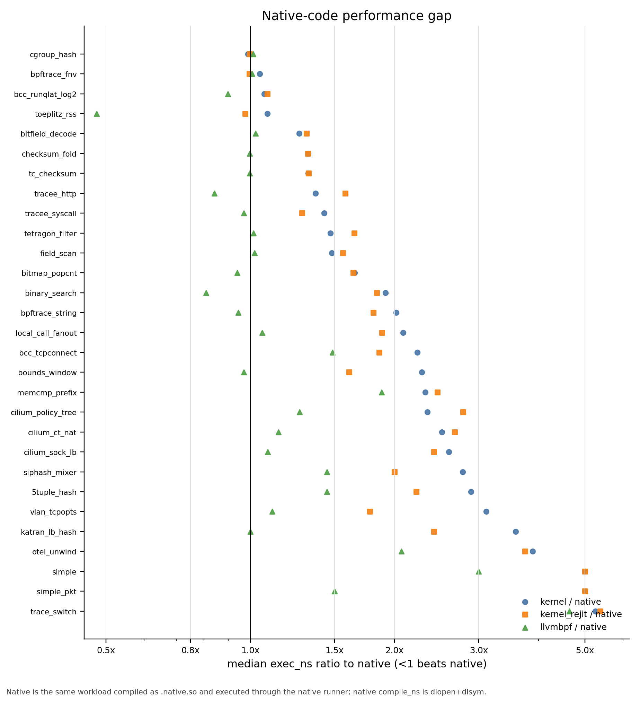
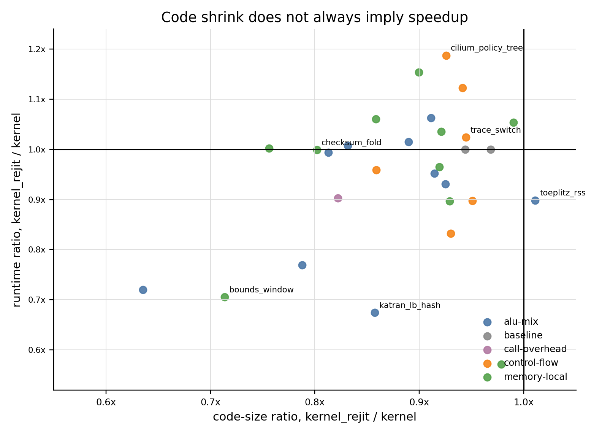

# Micro Benchmark Evaluation Status

Last updated: 2026-05-14

This document is the current evaluation note for the micro benchmark suite. It is written as an evaluation-section draft: what was measured, how it was measured, what the result says, and where the remaining native-code gap comes from.

All figures were generated with Python/matplotlib from the raw result file `micro/results/x86_kvm_micro_20260514_205607_714679/metadata.json`. The benchmark framework does not write ratios, geomeans, win/loss counts, or summaries into result payloads; those numbers here are post-hoc analysis.

## Headline

On the current x86 KVM micro suite, full-pass ReJIT is correct across all cases and gives a modest but real local-codegen improvement:

| Metric | Result |
|---|---:|
| Benchmarks completed | 29 / 29 |
| `kernel_rejit` samples with ReJIT status `ok` | 87 / 87 |
| Expected-result mismatches | 0 |
| Verifier errors | 0 |
| `kernel_rejit / kernel` runtime geomean | 0.933 |
| `kernel_rejit / kernel` runtime wins / losses / ties, +/-2% tie band | 14 / 8 / 7 |
| `kernel_rejit / kernel` code-size geomean | 0.879 |
| Smaller / larger / tie code size vs kernel, +/-2% tie band | 27 / 0 / 2 |
| `kernel / native` runtime geomean | 2.058 |
| `kernel_rejit / native` runtime geomean | 1.920 |

The main conclusion is not "LEA fixed everything." LEA is now verifier-facing safe on this micro suite and applies broadly, but the remaining gap to native/LLVM code is mostly in non-local codegen: dense switch lowering, loop-level transformations, local-call ABI/inlining, scheduling/register allocation, and broader packet hot-path cleanup.

## Experimental Setup

Command:

```sh
BPFREJIT_BENCH_PASSES=default WARMUPS=0 make micro
```

Result:

- Result path: `micro/results/x86_kvm_micro_20260514_205607_714679/metadata.json`
- `SAMPLES=3`
- `INNER_REPEAT=1000`
- `WARMUPS=0`
- Runtimes: `native`, `llvmbpf`, `kernel`, `kernel_rejit`
- Machine mode: x86 KVM benchmark run through `make micro`

Environment caveat from runner warnings:

- CPU governor reported as `unknown`
- turbo boost enabled
- no CPU affinity set
- PMU unavailable except software events

This is a correctness and performance-direction run, not the final publication environment. The data is still useful because it catches verifier failures, pass regressions, result mismatches, large code-size shifts, and large runtime direction changes.

The win/loss/tie counts in this document use a +/-2% tie band. Exact ratios and geomeans are still computed from the raw medians without rounding the inputs.

## Benchmark Scope

Config: `micro/config/micro_pure_jit.yaml`

The suite currently has 29 workload-pattern micro cases:

| Category | Workload Patterns |
|---|---|
| baseline | `simple`, `simple_packet` |
| packet/load-balancer/hash | `flow_5tuple_rss_hash`, `katran_lb_consistent_hash_select`, `packet_toeplitz_rss_hash`, `cgroup_skb_hash_chain` |
| tracing/security filters | `bcc_runqlat_log2_histogram_bucket`, `bcc_tcpconnect_ipv4_tuple_filter`, `bpftrace_comm_key_fnv_hash`, `bpftrace_string_search_prefix_scan`, `tracee_syscall_name_table_lookup`, `tracee_http_method_prefix_detect`, `tetragon_process_event_arg_filter` |
| cilium-shaped paths | `cilium_policy_guard_tree_filter`, `cilium_socket_lb_service_select`, `cilium_ct_nat_tuple_rewrite` |
| parser/bounds/memory | `packet_vlan_tcpopt_parser`, `packet_record_bounds_window`, `payload_prefix_memcmp_scan`, `flow_record_field_scan`, `packed_header_bitfield_decode`, `otel_stack_frame_unwind_scan` |
| scalar algorithms | `bitmap_popcount_scan`, `sorted_rule_binary_search`, `trace_event_type_switch_dispatch`, `packet_checksum_fold`, `siphash_rotate64_mixer`, `tc_packet_checksum_fold` |
| subprogram/local call | `bpf_local_call_fanout_dispatch` |

The suite is closer to workload patterns than unit tests: cases are named after app families where possible and avoid helper/map dependencies so the same input can run through native, llvmbpf, kernel, and ReJIT. This does not replace corpus. It deliberately omits helper-heavy map paths, full tail-call chains, app startup, and realistic service workload behavior.

## ReJIT Runtime Effect



Figure 1 sorts all 29 benchmarks by median `kernel_rejit / kernel` runtime. The strongest wins are packet/parser/hash cases where current passes directly remove local overhead:

- `packet_vlan_tcpopt_parser`: `28 ns -> 16 ns`, ratio `0.571`
- `katran_lb_consistent_hash_select`: `43 ns -> 29 ns`, ratio `0.674`
- `packet_record_bounds_window`: `146 ns -> 103 ns`, ratio `0.705`
- `siphash_rotate64_mixer`: `75 ns -> 54 ns`, ratio `0.720`
- `flow_5tuple_rss_hash`: `26 ns -> 20 ns`, ratio `0.769`

The regressions are mostly control-flow or string/field-filter cases where code shrinks but layout and critical path do not improve:

- `cilium_policy_guard_tree_filter`: `96 ns -> 114 ns`, ratio `1.188`
- `tracee_http_method_prefix_detect`: `26 ns -> 30 ns`, ratio `1.154`
- `tetragon_process_event_arg_filter`: `188 ns -> 211 ns`, ratio `1.122`
- `cilium_ct_nat_tuple_rewrite`: `191 ns -> 203 ns`, ratio `1.063`
- `payload_prefix_memcmp_scan`: `116 ns -> 123 ns`, ratio `1.060`

The important shape is mixed but positive: 14 wins, 8 losses, 7 ties. This says the pass stack is already useful as a local optimizer, but it is not a general native-code optimizer.

## Pass Coverage



Figure 2 shows site coverage across 29 benchmarks x 3 samples. LEA and rotate are the broadest current transforms:

| Pass | Applied | Matched | Skipped |
|---|---:|---:|---:|
| `lea` | 552 | 552 | 0 |
| `rotate` | 492 | 492 | 0 |
| `wide_mem` | 186 | 255 | 69 |
| `dce` | 126 | 126 | 0 |
| `cond_select` | 33 | 33 | 0 |
| `extract` | 33 | 33 | 0 |
| `prefetch` | 9 | 9 | 0 |
| `ccmp` | 0 | 87 | 87 |
| `const_prop` | 0 | 567 | 567 |

Per full-suite sample, divide by 3: `lea=184`, `rotate=164`, `wide_mem=62`, `dce=42`, `cond_select=11`, `extract=11`, and `prefetch=3`.

This validates the verifier-facing LEA fix on micro: LEA has `552/552` applied sites and no skipped sites in the full-pass run. The earlier verifier-facing concern was that pointer-derived address arithmetic could be lowered into a shape the verifier cannot prove. That failure mode does not reproduce here: all ReJIT syscalls succeeded and all post-ReJIT executions matched expected results.

## Native Gap



Figure 3 compares each runtime to the native C entry code. The current pass stack narrows the gap (`kernel/native = 2.058`, `kernel_rejit/native = 1.920`), but does not close it. The gap remains large in several representative classes:

- `trace_event_type_switch_dispatch`: native `55 ns`, llvmbpf `255 ns`, kernel `289 ns`, ReJIT `296 ns`
- `katran_lb_consistent_hash_select`: native `12 ns`, llvmbpf `12 ns`, kernel `43 ns`, ReJIT `29 ns`
- `otel_stack_frame_unwind_scan`: native `44 ns`, llvmbpf `91 ns`, kernel `171 ns`, ReJIT `165 ns`
- `cilium_socket_lb_service_select`: native `172 ns`, kernel `447 ns`, ReJIT `416 ns`

Native is a reference point, not an absolute optimum. `packet_toeplitz_rss_hash` shows this: native is `245 ns`, llvmbpf is `117 ns`, kernel is `266 ns`, and ReJIT is `239 ns`. The LLVM JIT finds a better loop/key-table lowering than both native-entry Clang output and the kernel/ReJIT path for this specific case.

The main gap pattern is therefore not just "kernel JIT emits too many bytes." It is that current bytecode-level rewrites do not reconstruct higher-level control/loop structure once Clang has already lowered C into verifier-friendly BPF.

## Code Size vs Runtime



Figure 4 plots code-size ratio against runtime ratio for ReJIT vs kernel. Almost every point is left of `1.0x` on the x-axis: code size shrinks. But several points are above `1.0x` on the y-axis: smaller code is slower.

That means code shrink is a necessary but insufficient signal. Examples:

- `cilium_policy_guard_tree_filter` shrinks `659 B -> 610 B`, but slows `96 ns -> 114 ns`.
- `trace_event_type_switch_dispatch` shrinks `1621 B -> 1531 B`, but moves `289 ns -> 296 ns`.
- `packet_checksum_fold` shrinks `424 B -> 340 B`, but runtime stays flat (`17656 ns -> 17633 ns`).
- `packet_toeplitz_rss_hash` improves runtime (`266 ns -> 239 ns`) even though size slightly grows (`1086 B -> 1098 B`).

This is the key evaluation point for future pass work: a pass can improve instruction count while leaving the critical path unchanged, or even make branch layout/register pressure worse. The next evaluation should therefore keep reporting both runtime and code size, and case-study the native/rejit machine code when they disagree.

## Native-Code Inspection

To avoid treating `native` as an opaque baseline, I rebuilt the micro artifacts under `/tmp/bpf-benchmark-micro-codegen-analysis` and inspected the selected `.native.so` and `.bpf.o` files with `llvm-objdump`, `llvm-nm`, and `llvm-readelf`.

One evidence boundary matters: the current micro result artifact records runtimes, sizes, and ReJIT pass reports, but it does not retain a post-ReJIT `bpftool prog dump jited` listing. The direct instruction-level evidence below is therefore native x86 plus pre-ReJIT BPF object shape. ReJIT-side conclusions use the recorded `jited_prog_len`, pass application counts, and the fact that the pass stack operates on that BPF shape. A selected-case post-ReJIT dump mode would let us replace the remaining inferred kernel/ReJIT instruction comparisons with exact final JIT diffs.

The inspected code shows seven distinct missing optimization classes:

| Case | Native Code Shape | BPF/ReJIT-Visible Shape | Missing Optimization |
|---|---|---|---|
| Katran hot path | Many real x86 rotates (`roll`, `rolw`), carry/selection with `cmovb*`, compact packet/hash arithmetic | BPF starts from shift/or rotate idioms, byte-load recomposition, verifier-friendly address arithmetic | Better endian/wide-load cleanup, carry/select lowering, scheduling, register allocation |
| Bounds window | Direct 32-bit and 16-bit field loads such as `movl -0x13(%rsi), %ebx` and `movzwl -0x3(%rsi), %r11d` | BPF has byte-ladder field reconstruction and repeated bounds-window arithmetic | More complete wide-load canonicalization across same-window packet records |
| Toeplitz RSS | Key material is in `.rodata`; loop uses indexed table loads such as `movl (%r10,%rdx,4), %ebp` plus `bswapl` | BPF synthesizes key words through branch trees and immediates | Constant-table reconstruction, loop scheduling, key-byte/key-word lowering |
| Dense switch | Dense dispatch becomes a bounds check plus indexed table load | BPF contains a large compare tree over switch cases | Switch/table lowering from BPF control-flow shape |
| Checksum fold | Inner loop consumes two 16-bit words per iteration with two `movzwl` loads and `addq $0x4` | BPF consumes one 16-bit word via two byte loads, shift/or, and fold | Loop-level combine/unroll or checksum-specific recognition |
| Cilium policy tree | Native uses direct wide payload reads such as `movq -0x7(%rdi), %rax`, but still has nested guard branches | BPF keeps byte guards plus branch-heavy early exits | Branch-layout/critical-path work, not just shrinking |
| Local-call fanout | Entry dispatch still calls local functions, but local callees use compact native wide loads/rotates | BPF retains bpf2bpf calls and byte-load recomposition in subprograms | Interprocedural inlining/layout plus subprogram wide-load cleanup |

Two examples make the structural nature clear. In `trace_event_type_switch_dispatch`, native emits a table lookup:

```asm
cmpl  $0x3f, %r8d
ja    <default>
movl  %r8d, %edx
movq  (%rdi,%rdx,8), %rdx
```

The BPF object has a compare tree instead:

```asm
if r4 s> 0x2b goto ...
if r4 s> 0x29 goto ...
if r4 == 0x28 goto ...
if r4 == 0x29 goto ...
```

In `packet_checksum_fold`, native processes two 16-bit words per loop trip:

```asm
movzwl -0x3(%rdx,%rcx), %r8d
...
movzwl -0x1(%rdx,%rcx), %edi
...
addq   $0x4, %rcx
cmpq   $0x413, %rcx
jne    <loop>
```

The BPF object reads a 16-bit word as two bytes and advances by two:

```asm
r7 = *(u8 *)(r0 + 0x10)
r0 = *(u8 *)(r0 + 0x11)
r0 <<= 0x8
r0 |= r7
...
r5 += 0x2
```

These are not LEA problems. They are cases where native code benefits from structure that is either absent from BPF bytecode or no longer obvious after verifier-friendly lowering.

## x86 Instruction and Transform Gap

The remaining gap is best understood at two levels. The x86 backend has richer instruction forms than BPF exposes directly, but bpfopt runs before final x86 emission. A profitable transform therefore has to rewrite verifier-facing BPF into a shape that the kernel x86 JIT can already lower well, or it has to be implemented in a later x86-specific lowering path.

| x86 Codegen Gap | Native Shape Seen in Micro | Current BPF/ReJIT Shape | Transform Direction |
|---|---|---|---|
| Wide packet/record loads | `movzwl disp(base,index)`, `movl disp(base)`, `movq disp(base)` | byte-load ladder plus shift/or reconstruction | Expand `wide_mem` from local ladders to whole packet/record field clusters after one bounds proof |
| Scaled indexed addressing | memory operands using `disp(base,index,scale)` | explicit pointer add chains and partial LEA recovery | Canonicalize `base + i * stride + field_off` so x86 JIT can fold address arithmetic into loads/stores |
| Endian and rotate idioms | `bswapl`, `roll`, `rolw` | shifts, masks, ors, sometimes recovered by `rotate` | Broaden endian/rotate recognition across width variants and packet-load compositions |
| Carry/select lowering | `cmovb*` in Katran-style checksum/hash paths | branch or scalar compare/select idioms | Add BPF-level canonical forms where possible; true `cmov`/`adc`/`sbb` likely needs x86 JIT or kinsn lowering |
| Dense switch/table dispatch | range check plus indexed table load from `.rodata` | large compare tree | Recover switch/value-table structure or teach a later x86 lowering to emit table dispatch |
| Loop combine/unroll | checksum loop consumes two 16-bit words per trip | one logical word per trip, often byte-composed | Add loop-level combine/unroll recognition for checksum-like bounded loops |
| Local-call ABI | compact native callees and normal x86 calls | bpf2bpf calls plus BPF register/spill conventions | Inline/specialize small local subprograms, then rerun local cleanup passes |
| Scheduling/register allocation | native backend schedules across SSA values | BPF register model largely preserved | Only partly solvable in bytecode; deeper wins need final JIT scheduling/allocation work |

This separates near-term BPF transforms from lower-level x86 work:

- BPF-level transforms that should be practical first: wider packet/record load clustering, endian/rotate expansion, scaled-index canonicalization, local-call inlining, and selected bounded-loop combine.
- Structural transforms that need more analysis: dense switch/table recovery, Toeplitz key-table reconstruction, and branch-layout work for policy trees.
- x86-specific lowering that bytecode rewriting probably cannot fully express: `cmov`/`setcc`/`adc`/`sbb`, jump tables, `popcnt` or BMI-style scalar idioms, real register allocation, and final instruction scheduling.

This also explains why code size alone is a weak predictor. `packet_checksum_fold` gets smaller without changing the loop-carried dependence, while `packet_toeplitz_rss_hash` gets faster even with slightly larger code because dependency shape matters more than byte count.

## Case Studies

### Katran-Style Load Balancer Hot Path

`katran_lb_consistent_hash_select` is the clearest positive networking case:

| Runtime | Exec Median | Code Size | Compile/Load Median |
|---|---:|---:|---:|
| native | 12 ns | 1945 B | 0.041 ms |
| llvmbpf | 12 ns | 1824 B | 30.074 ms |
| kernel | 43 ns | 3463 B | 0.641 ms |
| kernel_rejit | 29 ns | 2969 B | 0.621 ms |

Across 3 samples, this benchmark applied `dce=90`, `rotate=69`, `lea=42`, `wide_mem=6`, and `extract=3`. Per sample, that is roughly 30 dead-code eliminations, 23 rotates, 14 LEAs, 2 wide-memory rewrites, and 1 extract rewrite.

The native disassembly confirms why this is a strong ReJIT case and why it still does not reach native. Native has many real `roll`/`rolw` instructions for hash mixing and `cmovb*` for carry/select behavior. The BPF object starts from shift/or rotate idioms, byte-load field reconstruction, and explicit verifier-friendly pointer arithmetic. ReJIT recovers part of that through `rotate`, `lea`, `wide_mem`, and `extract`, which explains the `43 ns -> 29 ns` improvement.

The residual gap is also concrete: native/llvmbpf are still `12 ns`, so post-ReJIT is about `2.4x` slower. The remaining work is not another single LEA peephole; it is packet hot-path cleanup that combines endian/wide-load lowering, carry/select idiom lowering, better scheduling, and register allocation.

### Bounds Window Packet Parser

`packet_record_bounds_window` is a good example of bounds/load cleanup:

| Runtime | Exec Median | Code Size |
|---|---:|---:|
| native | 64 ns | 248 B |
| llvmbpf | 62 ns | 280 B |
| kernel | 146 ns | 716 B |
| kernel_rejit | 103 ns | 511 B |

The pass stack applies `wide_mem=24` and `lea=6` across 3 samples. This matches the benchmark shape: many same-window packet loads and repeated address computations. ReJIT cuts code size by `205 B` and runtime by `43 ns`.

The native code performs direct field loads once bounds have been established, for example `movl -0x13(%rsi), %ebx`, `movl -0xf(%rsi), %r14d`, and `movzwl -0x3(%rsi), %r11d`. The BPF object has more byte-level reconstruction around the same record window. This is exactly the pattern `wide_mem` helps, but the inspection shows it is not yet complete across the whole record cluster.

The remaining gap is still large (`103 ns` vs native `64 ns`). That points to verifier-friendly packet access shape and branch/check scheduling that survives after local load/address rewrites.

### Toeplitz RSS Hash

`packet_toeplitz_rss_hash` exposes a different failure mode:

| Runtime | Exec Median | Code Size |
|---|---:|---:|
| native | 245 ns | 321 B |
| llvmbpf | 117 ns | 846 B |
| kernel | 266 ns | 1086 B |
| kernel_rejit | 239 ns | 1098 B |

Runtime improves by about 10%, but code size grows slightly. The applied transforms are mostly `lea=18` and `cond_select=15` across 3 samples. This is not a simple code-size win; it is a case where control/data dependency shape matters more than byte count.

The native object has a `.rodata` key table and uses indexed loads inside the loop, for example `movl (%r10,%rdx,4), %ebp`, `orl (%r9,%rdx,4), %ebp`, and `movl (%r11,%rdx,4), %r14d`; it also uses native endian operations such as `bswapl`. The BPF object instead synthesizes key material through branches and immediates. ReJIT can clean local address/select idioms, but it does not rebuild the constant table representation.

The llvmbpf result is the useful clue: LLVM spends more bytes than native but gets much faster code. That suggests the missing class is loop/key-table lowering plus scheduling/register allocation, not just compact instruction selection.

### Dense Switch Dispatch

`trace_event_type_switch_dispatch` is the clearest "native lowering is different" case:

| Runtime | Exec Median | Code Size |
|---|---:|---:|
| native | 55 ns | 170 B |
| llvmbpf | 255 ns | 1261 B |
| kernel | 289 ns | 1621 B |
| kernel_rejit | 296 ns | 1531 B |

ReJIT shrinks the code but does not speed it up. Native Clang lowers the dense switch into an indexed table load; the BPF/ReJIT path still carries a much larger branch/data-movement shape. This is a structural gap: once the source-level switch has become verifier-friendly BPF branches, local peepholes do not recover the table-dispatch form.

The direct native sequence is a range check and `movq (%rdi,%rdx,8), %rdx` from a 512 B `.rodata` table. The BPF object has hundreds of compare-tree instructions. This should be one of the first next pass investigations because the gap is specific, visible, and tied to a common tracing/event-dispatch pattern.

### Checksum Fold

`packet_checksum_fold` shows why loop-heavy workloads need a different optimization class:

| Runtime | Exec Median | Code Size |
|---|---:|---:|
| native | 13369 ns | 170 B |
| llvmbpf | 13332 ns | 161 B |
| kernel | 17656 ns | 424 B |
| kernel_rejit | 17633 ns | 340 B |

ReJIT removes bytes but runtime does not move. That means the removed instructions were not on the dominant loop-carried critical path, or the remaining loop structure still controls throughput. A useful pass here would need loop-level transformation, unrolling, vector-like recognition, or checksum-specific recognition. More LEA/wide-load cleanup alone is unlikely to matter.

The native inner loop reads two 16-bit words per trip with two `movzwl` instructions and increments by four bytes. The BPF object reads one 16-bit word as two byte loads, shift/or, then increments by two bytes. ReJIT's size reduction (`424 B -> 340 B`) does not change that loop-carried structure, so the runtime stays flat.

### Cilium Policy Guard Tree

`cilium_policy_guard_tree_filter` is a useful regression case:

| Runtime | Exec Median | Code Size |
|---|---:|---:|
| native | 41 ns | 374 B |
| llvmbpf | 52 ns | 395 B |
| kernel | 96 ns | 659 B |
| kernel_rejit | 114 ns | 610 B |

The code shrinks by `49 B`, but runtime regresses by `18 ns`. The benchmark is dominated by nested guards and early exits; local address/load rewrites can perturb layout or dependency shape without reducing the executed branch path. This case should be kept as a guardrail when adding passes: smaller output is not enough if it worsens branch-heavy policy filters.

The native disassembly does recover some wide operations, including a direct `movq -0x7(%rdi), %rax` payload load, but it still has a nested policy tree. That is why the case is valuable: it separates "we recovered a local load idiom" from "the hot branch path got faster." The missing work is branch-layout and critical-path-aware transformation, not more byte shrink alone.

### Local Call Fanout

`bpf_local_call_fanout_dispatch` shows that local-call cleanup helps but does not solve interprocedural overhead:

| Runtime | Exec Median | Code Size |
|---|---:|---:|
| native | 69 ns | 269 B entry symbol |
| llvmbpf | 73 ns | 869 B |
| kernel | 144 ns | 2173 B |
| kernel_rejit | 130 ns | 1786 B |

ReJIT applies `lea=87`, `wide_mem=33`, and `rotate=30` across 3 samples. The improvement is real (`144 ns -> 130 ns`, `2173 B -> 1786 B`), but the remaining gap is still mostly local-call ABI/prologue/register-save overhead and missed interprocedural layout/inlining.

The native size number needs care: `269 B` is only the entry symbol. The rebuilt native object contains reachable local symbols `local_call_linear` (`72 B`), `local_call_pressure` (`74 B`), `local_call_crossload` (`134 B`), and `local_call_bytes` (`203 B`), with a total `.text` section of `971 B`. The native entry still uses real `callq` instructions, but the callees are compact and use direct wide loads/rotates. For local-call benchmarks, entry-symbol size is not total executable native footprint.

The BPF object still has bpf2bpf calls and subprogram byte-load recomposition. This benchmark therefore points at an interprocedural pass class: inline or lay out small local callees, then run the same wide-load/rotate cleanup inside the merged body.

## Binary Size Methodology

Recorded size sources:

- `native`: entry symbol size from `.native.so`
- `llvmbpf`: compiled-code size
- `kernel` / `kernel_rejit`: kernel `jited_prog_len`

Summary:

| Comparison | Code-Size Geomean | Avg Delta | Smaller / Larger / Tie, +/-2% tie band |
|---|---:|---:|---:|
| `kernel_rejit / kernel` | 0.879 | -143 B | 27 / 0 / 2 |
| `kernel / native` | 2.361 | +589 B | 0 / 29 / 0 |
| `kernel_rejit / native` | 2.077 | +446 B | 0 / 28 / 1 |
| `llvmbpf / native` | 1.325 | +147 B | 3 / 23 / 3 |

Native entry-symbol size is useful for single-function cases, but it undercounts total reachable code for static subprograms. Using full native `.text` instead gives:

- `kernel / native_text`: 1.376 code-size geomean
- `kernel_rejit / native_text`: 1.210 code-size geomean
- `llvmbpf / native_text`: 0.772 code-size geomean

The next analysis tool should report both entry-symbol and reachable-symbol/`.text` size for native.

## Additional Validation Runs

LEA-only correctness smoke:

```sh
BPFREJIT_BENCH_PASSES=lea SAMPLES=1 WARMUPS=0 make micro
```

Result:

- Result path: `micro/results/x86_kvm_micro_20260514_203603_510400/metadata.json`
- `29/29` benchmarks completed
- `native`, `llvmbpf`, `kernel`, and `kernel_rejit` all matched expected results
- LEA applied `184/184` per full-suite sample, skipped `0`
- No verifier error

Native symbol-size smoke:

```sh
BPFREJIT_BENCH_PASSES=lea BENCH="simple" SAMPLES=1 WARMUPS=0 make micro
```

Result:

- Result path: `micro/results/x86_kvm_micro_20260514_204331_406449/metadata.json`
- `simple` code size: native `58 B`, llvmbpf `59 B`, kernel `107 B`, kernel_rejit `101 B`

This validates that native code size is now recording entry symbol size rather than the whole `.native.so` file size.

## What To Do Next

The next pass work should be driven by the mismatches above:

1. Wide-load and endian clustering: start with `packet_record_bounds_window`, `katran_lb_consistent_hash_select`, and `cilium_policy_guard_tree_filter`.
2. Local-call inlining/specialization: start with `bpf_local_call_fanout_dispatch`, then rerun `wide_mem`, `rotate`, `lea`, and `dce` on the merged body.
3. Toeplitz/key-table reconstruction: `packet_toeplitz_rss_hash` shows llvmbpf can be much faster despite larger code.
4. Loop-level transforms: start with `packet_checksum_fold`, where code shrinks but runtime is unchanged.
5. Dense switch/table lowering: start with `trace_event_type_switch_dispatch`, where native has an indexed table form and ReJIT does not.
6. Branch-heavy regression analysis: keep `cilium_policy_guard_tree_filter` as a negative case so future size wins do not silently hurt policy filters.
7. Add an analysis-side script, outside the framework result writer, to reproduce these figures/tables from `metadata.json`.
8. Add analysis-only reachable native code-size extraction for `.native.so`.
9. Add a controlled selected-case artifact mode for post-ReJIT `bpftool prog dump jited`, without changing benchmark result payloads.

## Reference Artifacts

| Artifact | Purpose |
|---|---|
| `docs/figures/micro-rejit-runtime-ratio.png` | Figure 1, ReJIT/kernel runtime ratios |
| `docs/figures/micro-pass-coverage.png` | Figure 2, pass site coverage |
| `docs/figures/micro-native-gap-ratio.png` | Figure 3, runtime gap to native |
| `docs/figures/micro-size-runtime-scatter.png` | Figure 4, code-size/runtime relationship |
| `docs/tmp/micro_native_runtime_report_20260514.md` | Detailed post-hoc report |
| `micro/results/x86_kvm_micro_20260514_205607_714679/metadata.json` | Full-pass micro correctness/performance source |
| `micro/results/x86_kvm_micro_20260514_203603_510400/metadata.json` | LEA-only full micro correctness source |
| `micro/results/x86_kvm_micro_20260514_204331_406449/metadata.json` | Native symbol-size smoke source |
