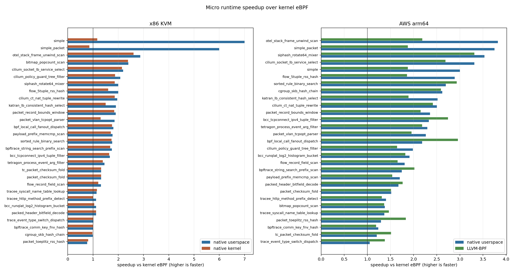
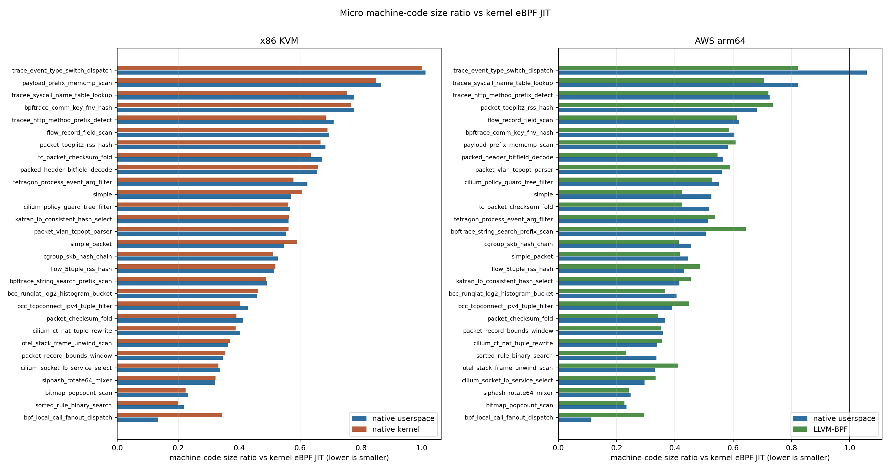

# Micro Benchmark Status

Last updated: 2026-05-20

This is the current short status page for micro benchmark data. The previous
long evaluation note is archived at
`docs/tmp/micro-bench-status-20260520-archive.md`.

All ratios, speedups, and win/loss counts below are post-hoc analysis from raw
`metadata.json` files. The benchmark framework still records raw measurements
only.

## Headline Table

### x86 KVM

Source: `micro/results/x86_kvm_micro_20260520_044439_120822/metadata.json`

| Metric | Result |
|---|---:|
| Benchmarks completed | 29 / 29 |
| Runtimes | native userspace, kernel eBPF, native kernel |
| Expected-result mismatches | 0 |
| native userspace / kernel runtime geomean | 0.588 |
| native userspace speedup vs kernel | 1.70x |
| native userspace / kernel wins / losses / ties, +/-2% | 25 / 1 / 3 |
| native kernel / kernel runtime geomean | 0.707 |
| native kernel speedup vs kernel | 1.41x |
| native kernel / kernel wins / losses / ties, +/-2% | 23 / 3 / 3 |

### arm64 AWS

Source: `micro/results/aws_arm64_micro_20260520_052452_727433/metadata.json`

| Metric | Result |
|---|---:|
| Benchmarks completed | 29 / 29 |
| Runtimes | native userspace, LLVM-BPF, kernel eBPF |
| Expected-result mismatches | 0 |
| native userspace / kernel runtime geomean | 0.488 |
| native userspace speedup vs kernel | 2.05x |
| native userspace / kernel wins / losses / ties, +/-2% | 29 / 0 / 0 |
| LLVM-BPF / kernel runtime geomean | 0.521 |
| LLVM-BPF speedup vs kernel | 1.92x |
| native userspace / LLVM-BPF runtime geomean | 0.935 |

## Setup

### x86 KVM

Command:

```sh
make micro RUNTIMES="native kernel native_lab" \
  SAMPLES=3 WARMUPS=1 INNER_REPEAT=100000
```

This run uses the current x86 native ABI work, including the native kernel
result-channel fix for TC/cgroup skb programs. It is the current full x86
native userspace / kernel eBPF / native kernel dataset. The command uses raw
runtime ids: `native` means native userspace and `native_lab` means native
kernel.

### arm64 AWS

Command:

```sh
PLATFORM=aws ARCH=arm64 SAMPLES=1 WARMUPS=0 INNER_REPEAT=10000 make micro
```

This is an arm64 smoke run on one `t4g.small`. It validates the arm64 micro
runtime path and gives directional native userspace / LLVM-BPF / kernel eBPF
data. It is not a paper-grade arm64 run.

## Kernel vs Native Performance



### x86 KVM

The x86 run compares kernel eBPF JIT against native userspace timing and
in-kernel direct native execution through the native kernel path.

| Case | Native userspace ns | Native kernel ns | Kernel eBPF ns |
|---|---:|---:|---:|
| `bitmap_popcount_scan` | 464 | 466 | 1113 |
| `packet_checksum_fold` | 13358 | 13337 | 17635 |
| `bpf_local_call_fanout_dispatch` | 68 | 70 | 123 |
| `cgroup_skb_hash_chain` | 288 | 291 | 285 |

### arm64 AWS

The arm64 run compares kernel BPF JIT against userspace native code and the
LLVM-BPF runtime.

| Case | Native userspace ns | LLVM-BPF ns | Kernel eBPF ns |
|---|---:|---:|---:|
| `bitmap_popcount_scan` | 1614 | 1633 | 2226 |
| `packet_checksum_fold` | 26085 | 26162 | 39543 |
| `bpf_local_call_fanout_dispatch` | 164 | 121 | 358 |
| `cgroup_skb_hash_chain` | 368 | 372 | 964 |

## Size Compare



The size comparison uses median `code_size.native_code_bytes`. This is machine
code size, not BPF bytecode size.

### x86 KVM

| Comparison | Programs | Geomean size ratio vs kernel | Smaller / larger / tie, +/-2% |
|---|---:|---:|---:|
| native userspace / kernel | 29 | 0.491 | 28 / 0 / 1 |
| native kernel / kernel | 29 | 0.500 | 28 / 0 / 1 |

### arm64 AWS

| Comparison | Programs | Geomean size ratio vs kernel | Smaller / larger / tie, +/-2% |
|---|---:|---:|---:|
| native userspace / kernel | 29 | 0.445 | 28 / 1 / 0 |
| LLVM-BPF / kernel | 29 | 0.452 | 29 / 0 / 0 |
