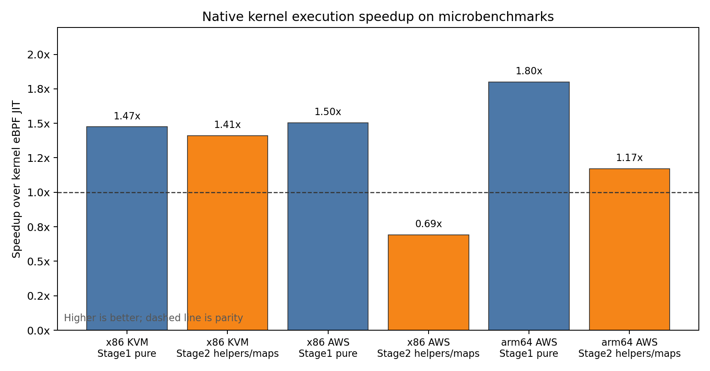
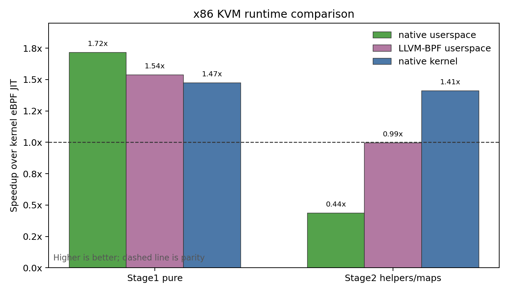
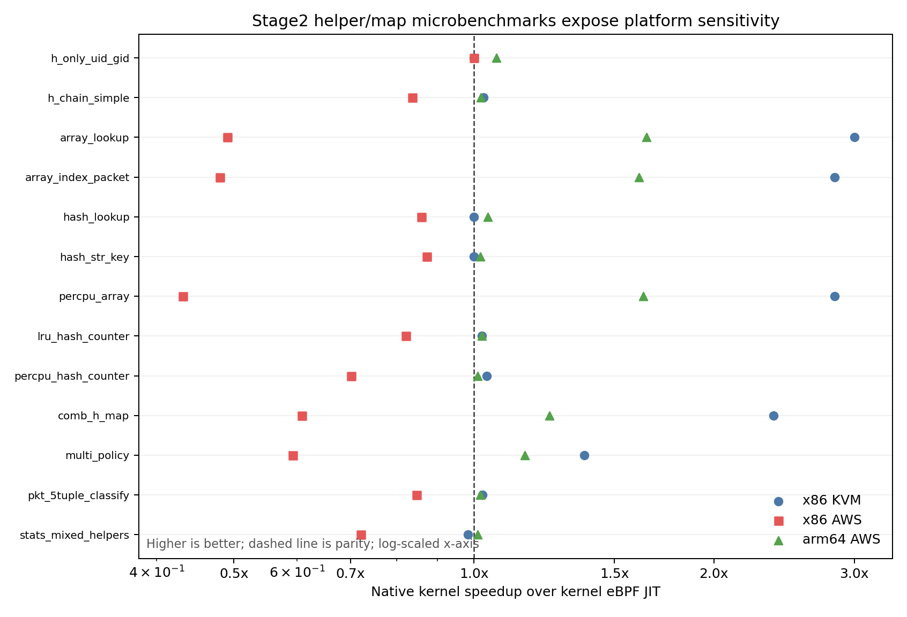

# Micro Benchmark Status

Last updated: 2026-05-27

This is the current paper-facing status page for microbenchmark data. The
previous long evaluation note is archived at
`docs/tmp/micro-bench-status-20260520-archive.md`.

All ratios, speedups, and win/loss counts below are post-hoc analysis from raw
`result.json` files. The benchmark framework still records raw measurements
only.

## Paper Framing

This section should read like a characterization study, not like an
implementation status log. The microbenchmark claim is intentionally narrow:
native kernel execution changes the cost of BPF instruction execution and
helper/map access patterns under controlled `BPF_PROG_TEST_RUN` workloads.
Corpus/app results are required separately for end-to-end application claims.

The current research questions are:

- **RQ1 Correctness:** does native kernel execution preserve the expected
  result and retval on the microbenchmark suites?
- **RQ2 Instruction-path performance:** how much does native kernel execution
  improve pure compute and packet-manipulation BPF programs relative to the
  kernel eBPF JIT?
- **RQ3 Helper/map sensitivity:** how does native kernel execution behave on
  helper-heavy and map-heavy programs?
- **RQ4 Platform sensitivity:** are the effects consistent across local x86
  KVM, x86 AWS, and arm64 AWS?

The x86 KVM run also reports userspace native and LLVM-BPF userspace runtimes as
secondary baselines. They are useful for understanding code-generation quality,
but they are not the primary kernel-native claim.

## Experimental Setup

The authoritative micro runs use:

```sh
SAMPLES=3 WARMUPS=0 INNER_REPEAT=100000 make micro

PLATFORM=aws ARCH=x86 SAMPLES=3 WARMUPS=0 INNER_REPEAT=100000 make micro

PLATFORM=aws ARCH=arm64 SAMPLES=3 WARMUPS=0 INNER_REPEAT=100000 make micro
```

The measured suites are:

- **Stage1 pure 29:** compute, branch, local-call, parser, checksum, string, and
  packet microbenchmarks with no external map/helper bottleneck as the dominant
  cost.
- **Stage2 helpers/maps 13:** deterministic helper and map-access benchmarks
  covering arrays, hash maps, percpu maps, LRU maps, mixed helper/map paths, and
  packet classification.

The measured runtimes are:

- **kernel:** baseline kernel eBPF JIT.
- **native_kernel:** native object linked and loaded into the kernel native
  execution path.
- **native:** userspace native runtime, available in the latest x86 KVM run.
- **llvmbpf:** LLVM-BPF userspace runtime, available in the latest x86 KVM run.

The platform details recorded in the artifacts are:

| Platform | Executor | CPU recorded by artifact | Kernel | AWS bench instance default |
|---|---|---|---|---|
| x86 KVM | virtme-ng VM | Intel Core Ultra 9 285K | 7.0.0-rc2+ | N/A |
| x86 AWS | EC2 VM | Intel Xeon Platinum 8259CL @ 2.50GHz | 7.0.0-rc2+ | `t3.small` |
| arm64 AWS | EC2 instance | aarch64 | 7.0.0-rc2+ | `t4g.small` |

## Methodology

Each benchmark/runtime pair records three samples after zero warmups. Each
sample runs the benchmark body `INNER_REPEAT=100000` times. Correctness is
gated by exact expected result and retval checks for every recorded sample.

For each benchmark and runtime, the analysis uses the median `exec_ns` across
the three samples. For each suite, the reported aggregate is the geomean of
per-benchmark ratios:

```text
ratio = median_runtime_exec_ns / median_kernel_exec_ns
speedup = 1 / ratio
```

A ratio below 1.0 means the runtime is faster than the kernel eBPF JIT.
Wins/losses/ties use a +/-2% band around the kernel baseline. No benchmark is
filtered out of these micro aggregates.

## Main Results

Latest representative full runs:

| Platform | Suite | Result source | Runtimes | Samples | Expected-result mismatches |
|---|---|---|---|---:|---:|
| x86 KVM | stage1 pure 29 | `micro/results/x86_kvm_micro_20260526_210952_650695` | kernel, llvmbpf, native, native_kernel | 348 | 0 |
| x86 KVM | stage2 helpers/maps | `micro/results/x86_kvm_micro_20260526_210434_440390` | kernel, llvmbpf, native, native_kernel | 156 | 0 |
| x86 AWS | stage1 pure 29 | `micro/results/aws_x86_micro_20260521_032223_857289` | kernel, native_kernel | 174 | 0 |
| x86 AWS | stage2 helpers/maps | `micro/results/aws_x86_micro_20260521_033443_371646` | kernel, native_kernel | 78 | 0 |
| arm64 AWS | stage1 pure 29 | `micro/results/aws_arm64_micro_20260523_091516_610343` | kernel, native_kernel | 174 | 0 |
| arm64 AWS | stage2 helpers/maps | `micro/results/aws_arm64_micro_20260523_092823_183684` | kernel, native_kernel | 78 | 0 |

Aggregate runtime ratios:

| Platform | Suite | Runtime vs kernel eBPF | Runtime/kernel geomean | Speedup vs kernel eBPF | Wins / losses / ties |
|---|---|---|---:|---:|---:|
| x86 KVM | stage1 pure 29 | native userspace | 0.583 | 1.716x | 27 / 1 / 1 |
| x86 KVM | stage1 pure 29 | LLVM-BPF userspace | 0.650 | 1.538x | 27 / 1 / 1 |
| x86 KVM | stage1 pure 29 | native kernel | 0.678 | 1.474x | 24 / 2 / 3 |
| x86 KVM | stage2 helpers/maps | native userspace | 2.291 | 0.436x | 1 / 12 / 0 |
| x86 KVM | stage2 helpers/maps | LLVM-BPF userspace | 1.006 | 0.994x | 6 / 7 / 0 |
| x86 KVM | stage2 helpers/maps | native kernel | 0.710 | 1.409x | 9 / 0 / 4 |
| x86 AWS | stage1 pure 29 | native kernel | 0.666 | 1.503x | 26 / 2 / 1 |
| x86 AWS | stage2 helpers/maps | native kernel | 1.449 | 0.690x | 0 / 12 / 1 |
| arm64 AWS | stage1 pure 29 | native kernel | 0.556 | 1.800x | 28 / 0 / 1 |
| arm64 AWS | stage2 helpers/maps | native kernel | 0.855 | 1.170x | 9 / 0 / 4 |



*Figure 1: Native kernel speedup over kernel eBPF JIT for the authoritative
stage1 and stage2 microbenchmark artifacts. Higher is better; the dashed line
is parity.*



*Figure 2: x86 KVM secondary runtime comparison. Userspace native and LLVM-BPF
are included to characterize code-generation quality, but the paper's primary
kernel execution claim is the native-kernel bar.*

## RQ Answers

**RQ1 Correctness.** All current full micro artifacts have zero expected-result
or retval mismatches. This covers 29/29 stage1 benchmarks and 13/13 stage2
benchmarks on x86 KVM, x86 AWS, and arm64 AWS.

**RQ2 Instruction-path performance.** Native kernel execution improves the
stage1 pure suite on all measured platforms: 1.474x on x86 KVM, 1.503x on x86
AWS, and 1.800x on arm64 AWS. The per-benchmark wins are broad, not isolated to
one benchmark: 24/29 wins on x86 KVM, 26/29 wins on x86 AWS, and 28/29 wins on
arm64 AWS.

**RQ3 Helper/map sensitivity.** Stage2 is mixed. x86 KVM remains positive at
1.409x and arm64 AWS remains positive at 1.170x, but x86 AWS regresses to
0.690x. The x86 AWS regression is concentrated across map/helper benchmarks,
not a single outlier, so it should be treated as a real current artifact until a
new full AWS run or lower-level profiling explains it.

**RQ4 Platform sensitivity.** The pure-instruction result is stable across all
three platforms. Helper/map behavior is platform-sensitive: x86 KVM and arm64
AWS are positive, while x86 AWS stage2 is negative. This is the main
microbenchmark caveat for a paper claim.

The concise paper claim supported by these data is:

- x86 KVM stage1 remains strong at 1.474x and stage2 is positive at 1.409x.
- x86 AWS stage1 is positive at 1.503x, but x86 AWS stage2 is a real regression
  in the latest full artifact.
- arm64 AWS is positive on both stage1 and stage2, with a larger stage1 gain.

## Threats To Validity

- The microbenchmark suite isolates native execution costs; it does not replace
  corpus/app-level workload measurements.
- AWS CPU governor and turbo state are recorded as unknown in the artifacts.
  Cross-platform comparisons should therefore focus on ratios within the same
  platform, not absolute nanoseconds across platforms.
- AWS full authoritative artifacts currently cover `kernel` and
  `native_kernel`; userspace native and LLVM-BPF baselines are only available in
  the latest x86 KVM full run.
- The x86 AWS stage2 regression needs follow-up profiling before a root cause is
  claimed.

## Appendix A: Artifact Manifest

| Platform | Suite | Generated at | Result source |
|---|---|---|---|
| x86 KVM | stage1 pure 29 | 2026-05-26T21:09:52Z | `micro/results/x86_kvm_micro_20260526_210952_650695/details/result.json` |
| x86 KVM | stage2 helpers/maps | 2026-05-26T21:04:34Z | `micro/results/x86_kvm_micro_20260526_210434_440390/details/result.json` |
| x86 AWS | stage1 pure 29 | 2026-05-21T03:22:23Z | `micro/results/aws_x86_micro_20260521_032223_857289/details/result.json` |
| x86 AWS | stage2 helpers/maps | 2026-05-21T03:34:43Z | `micro/results/aws_x86_micro_20260521_033443_371646/details/result.json` |
| arm64 AWS | stage1 pure 29 | 2026-05-23T09:15:16Z | `micro/results/aws_arm64_micro_20260523_091516_610343/details/result.json` |
| arm64 AWS | stage2 helpers/maps | 2026-05-23T09:28:23Z | `micro/results/aws_arm64_micro_20260523_092823_183684/details/result.json` |

## Appendix B: Native Kernel Stage2 Detail

Stage2 is the helper/map suite and is the most sensitive current native-kernel
micro workload. Values are median `exec_ns`; speedup is
`kernel_ns / native_kernel_ns`.



*Figure 3: Per-benchmark stage2 native-kernel speedup. The log-scaled x-axis
shows that x86 AWS regresses broadly on helper/map benchmarks, while x86 KVM and
arm64 AWS are mostly at or above parity.*

| Platform | Benchmark | Native kernel ns | Kernel eBPF ns | Speedup |
|---|---|---:|---:|---:|
| x86 KVM | `helper_only_uid_gid` | 7 | 7 | 1.000x |
| x86 KVM | `helper_chain_simple` | 72 | 74 | 1.028x |
| x86 KVM | `map_array_lookup` | 6 | 18 | 3.000x |
| x86 KVM | `map_array_index_packet` | 6 | 17 | 2.833x |
| x86 KVM | `map_hash_lookup` | 32 | 32 | 1.000x |
| x86 KVM | `map_hash_str_key` | 33 | 33 | 1.000x |
| x86 KVM | `map_percpu_array` | 6 | 17 | 2.833x |
| x86 KVM | `map_lru_hash_counter` | 84 | 86 | 1.024x |
| x86 KVM | `map_percpu_hash_counter` | 27 | 28 | 1.037x |
| x86 KVM | `combined_helper_map` | 8 | 19 | 2.375x |
| x86 KVM | `multi_map_policy` | 32 | 44 | 1.375x |
| x86 KVM | `packet_5tuple_classify` | 40 | 41 | 1.025x |
| x86 KVM | `stats_mixed_helpers` | 60 | 59 | 0.983x |
| x86 AWS | `helper_only_uid_gid` | 23 | 23 | 1.000x |
| x86 AWS | `helper_chain_simple` | 159 | 133 | 0.836x |
| x86 AWS | `map_array_lookup` | 51 | 25 | 0.490x |
| x86 AWS | `map_array_index_packet` | 50 | 24 | 0.480x |
| x86 AWS | `map_hash_lookup` | 85 | 73 | 0.859x |
| x86 AWS | `map_hash_str_key` | 86 | 75 | 0.872x |
| x86 AWS | `map_percpu_array` | 58 | 25 | 0.431x |
| x86 AWS | `map_lru_hash_counter` | 174 | 143 | 0.822x |
| x86 AWS | `map_percpu_hash_counter` | 97 | 68 | 0.701x |
| x86 AWS | `combined_helper_map` | 69 | 42 | 0.609x |
| x86 AWS | `multi_map_policy` | 162 | 96 | 0.593x |
| x86 AWS | `packet_5tuple_classify` | 92 | 78 | 0.848x |
| x86 AWS | `stats_mixed_helpers` | 197 | 142 | 0.721x |
| arm64 AWS | `helper_only_uid_gid` | 30 | 32 | 1.067x |
| arm64 AWS | `helper_chain_simple` | 242 | 247 | 1.021x |
| arm64 AWS | `map_array_lookup` | 17 | 28 | 1.647x |
| arm64 AWS | `map_array_index_packet` | 18 | 29 | 1.611x |
| arm64 AWS | `map_hash_lookup` | 96 | 100 | 1.042x |
| arm64 AWS | `map_hash_str_key` | 107 | 109 | 1.019x |
| arm64 AWS | `map_percpu_array` | 19 | 31 | 1.632x |
| arm64 AWS | `map_lru_hash_counter` | 215 | 220 | 1.023x |
| arm64 AWS | `map_percpu_hash_counter` | 90 | 91 | 1.011x |
| arm64 AWS | `combined_helper_map` | 37 | 46 | 1.243x |
| arm64 AWS | `multi_map_policy` | 108 | 125 | 1.157x |
| arm64 AWS | `packet_5tuple_classify` | 107 | 109 | 1.019x |
| arm64 AWS | `stats_mixed_helpers` | 188 | 190 | 1.011x |

## Appendix C: Code Size

The code-size comparison uses median `code_size.native_code_bytes` from the
same authoritative artifacts. This is machine-code size, not BPF bytecode size.
The ratio is `native_kernel_code_bytes / kernel_jit_code_bytes`, so lower means
the native-kernel image is smaller than the kernel eBPF JIT image.


*Figure 4: Native-kernel machine-code size relative to kernel eBPF JIT code size
for the same stage1/stage2 artifacts used in the runtime figures.*

| Platform | Suite | native_kernel/kernel code-size geomean |
|---|---|---:|
| x86 KVM | stage1 pure 29 | 0.541 |
| x86 KVM | stage2 helpers/maps | 0.610 |
| x86 AWS | stage1 pure 29 | 0.497 |
| x86 AWS | stage2 helpers/maps | 0.634 |
| arm64 AWS | stage1 pure 29 | 0.495 |
| arm64 AWS | stage2 helpers/maps | 0.724 |
