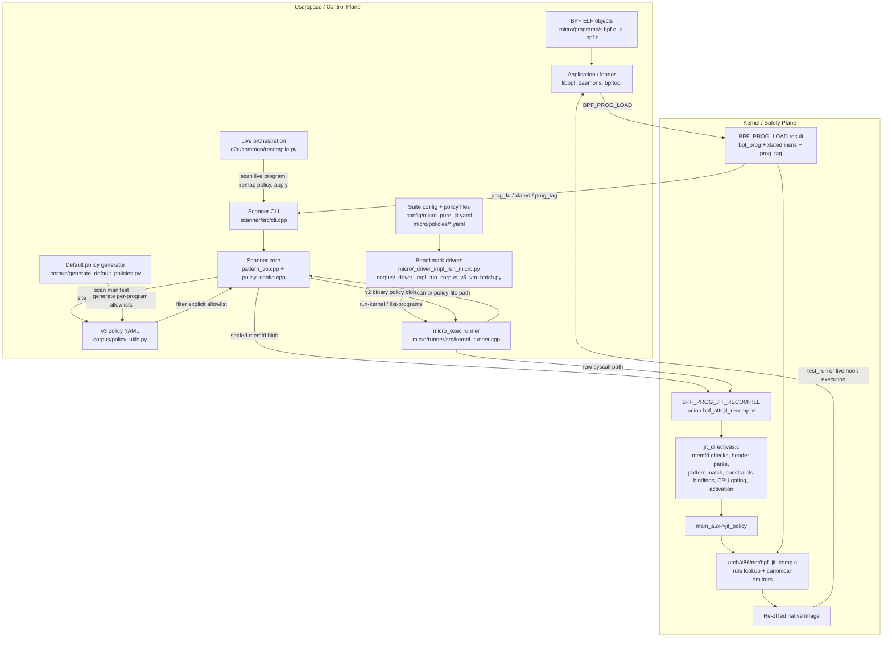
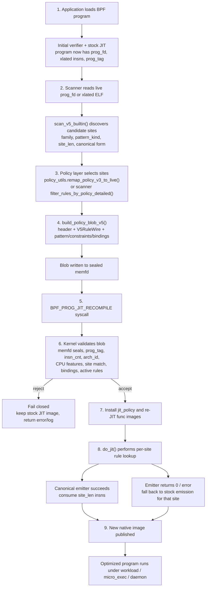

# BpfReJIT Architecture Review and Diagrams

Static review only. I read `docs/kernel-jit-optimization-plan.md`, `CLAUDE.md`, and the requested kernel/scanner/orchestration/micro paths, but I did not run tests or benchmarks during this pass.

The overall split is directionally right: userspace discovers candidate sites and selects policy, while the kernel owns final validation and emission. The main remaining work is making that boundary airtight and paper-grade. Today the biggest issues are:

- Kernel safety/lifetime gaps in live re-JIT: missing exact validators for several canonical forms, weak rollback semantics, and likely concurrency/lifetime problems around `jit_policy` and re-JIT image replacement.
- Scanner/policy identity drift: `pattern_kind` is part of the v3 policy schema, but filtering ignores it, and the current scanner is greedy/order-dependent.
- Orchestration/evaluation gaps: no batch recompile path, no rollback controller, incomplete per-family experiment knobs, and limited observability in the benchmark path.
- Paper-readiness gaps: x86-only end-to-end implementation, no kernel selftests for re-JIT, and incomplete evidence for zero-ext/endian/ARM64-style claims.

## 1. Architecture Diagram

## 2. Flow Diagram

## 3. Component-by-Component Code Review Findings

### 3.1 Kernel side (`vendor/linux-framework/`)

- `High`: exact kernel-owned site validation is missing for `WIDE_MEM`, `ROTATE`, and `ADDR_CALC`. Dedicated validators exist at `vendor/linux-framework/kernel/bpf/jit_directives.c:665-678`, `vendor/linux-framework/kernel/bpf/jit_directives.c:1134-1163`, and `vendor/linux-framework/kernel/bpf/jit_directives.c:1292-1334`, but `bpf_jit_validate_canonical_site()` only dispatches `COND_SELECT`, `BITFIELD_EXTRACT`, `ZERO_EXT_ELIDE`, `ENDIAN_FUSION`, and `BRANCH_FLIP` at `vendor/linux-framework/kernel/bpf/jit_directives.c:2129-2177`. That weakens the paper’s “kernel defines the safe rewrite menu” claim for three important families.
- `High`: `bpf_prog_jit_recompile()` drops the last known-good policy too early. The stock path clears and frees the old policy before re-JIT at `vendor/linux-framework/kernel/bpf/jit_directives.c:2885-2891`; the policy path swaps in the new policy and frees the old one before re-JIT at `vendor/linux-framework/kernel/bpf/jit_directives.c:2918-2922`, then clears the new policy on failure at `vendor/linux-framework/kernel/bpf/jit_directives.c:2925-2931`. A failed recompile leaves the program with no preserved “known-good” optimized policy.
- `High`: concurrent `BPF_PROG_JIT_RECOMPILE` calls appear unsynchronized. The shared fields are `jit_policy` and `jit_recompile_log` in `vendor/linux-framework/include/linux/bpf.h:1712-1713`; the syscall stores/frees them at `vendor/linux-framework/kernel/bpf/jit_directives.c:2860` and `vendor/linux-framework/kernel/bpf/jit_directives.c:2918-2922`, while `do_jit()` dereferences `main_aux->jit_policy` at `vendor/linux-framework/arch/x86/net/bpf_jit_comp.c:4124-4143` and the log helpers dereference `jit_recompile_log` at `vendor/linux-framework/kernel/bpf/jit_directives.c:33-42` and `vendor/linux-framework/kernel/bpf/jit_directives.c:67-108`. I do not see locking/RCU around those lifetimes.
- `High`: there is still a likely re-JIT/extable lifetime bug on the `BPF_PROBE_MEM` path. The MEM32 path was explicitly guarded for non-final passes at `vendor/linux-framework/arch/x86/net/bpf_jit_comp.c:4641-4648`, but the regular `BPF_PROBE_MEM` path still rewrites extable/image state at `vendor/linux-framework/arch/x86/net/bpf_jit_comp.c:4764-4788` without the same final-pass protection.
- `High-risk audit item`: repeated re-JIT does not show an explicit old-image retirement path. New packed image/extable state is allocated and installed at `vendor/linux-framework/arch/x86/net/bpf_jit_comp.c:6258-6316`, and the visible free path is regular program teardown at `vendor/linux-framework/arch/x86/net/bpf_jit_comp.c:6364-6385`. The recompile path itself (`vendor/linux-framework/kernel/bpf/jit_directives.c:2761-2833`) does not obviously free the previous image, so executable-memory and stale-extable lifetime should be stress-tested.
- `Medium`: rule lookup does not fully implement its own comment. Rules are sorted by `(site_start, -priority)` at `vendor/linux-framework/kernel/bpf/jit_directives.c:315-329`, but `bpf_jit_rule_lookup()` returns only the first matching entry and immediately returns `NULL` if that entry is inactive or the binary search lands on an overlapping earlier site at `vendor/linux-framework/kernel/bpf/jit_directives.c:2714-2750`. That can suppress lower-priority active fallbacks.
- `Medium`: reserved UAPI fields are not validated fail-closed. `bpf_jit_policy_hdr.flags` and `bpf_jit_rewrite_rule_v2.reserved` are reserved in `vendor/linux-framework/include/uapi/linux/bpf.h:1479-1483` and `vendor/linux-framework/include/uapi/linux/bpf.h:1695-1697`, but the parser does not reject non-zero values in `vendor/linux-framework/kernel/bpf/jit_directives.c:2504-2511` and `vendor/linux-framework/kernel/bpf/jit_directives.c:2604-2679`.
- `Medium`: the implementation is still effectively x86-only. The parser rejects non-x86 policy blobs at `vendor/linux-framework/kernel/bpf/jit_directives.c:2650-2663`, and the scanner emits `arch_id = BPF_JIT_ARCH_X86_64` at `scanner/src/pattern_v5.cpp:1828`.
- `Medium`: attached `struct_ops` programs and blinded programs are explicitly unsupported in the live recompile path at `vendor/linux-framework/kernel/bpf/jit_directives.c:2875-2881` and `vendor/linux-framework/kernel/bpf/jit_directives.c:2895-2900`. That is a material deployment limitation, not just a cleanup item.
- `Medium`: the x86 emitter intentionally lowers only the original compact/diamond `COND_SELECT` forms. `emit_canonical_select()` supports only 3- and 4-insn forms at `vendor/linux-framework/arch/x86/net/bpf_jit_comp.c:1471-1499`, while the scanner already recognizes broadened guarded-update and switch-chain forms at `scanner/src/pattern_v5.cpp:721-1032` and `scanner/tests/test_scanner.cpp:166-205`. Those sites will fail closed, which is safe, but the end-to-end capability story is currently asymmetric.
- `Observability gap`: the kernel has string logs but no structured counters/tracepoints/per-rule stats. The log buffer plumbing is in `vendor/linux-framework/kernel/bpf/jit_directives.c:51-64` and `vendor/linux-framework/kernel/bpf/jit_directives.c:117-137`, but `log_level` is effectively boolean and nothing exports machine-readable outcomes.
- `Coverage gap`: I did not find dedicated kselftests for `BPF_PROG_JIT_RECOMPILE`, policy parsing, overlap resolution, concurrency, rollback, or repeated re-JIT stress under `vendor/linux-framework/tools/testing/selftests/bpf/`.

### 3.2 Scanner (`scanner/`)

- `High`: `pattern_kind` is parsed and stored, but ignored when filtering rules. `rule_pattern_kind()` / `policy_site_key()` treat it as part of site identity at `scanner/src/policy_config.cpp:104-205`, but `filter_rules_by_policy_detailed()` builds its key from only `(insn, family)` at `scanner/src/policy_config.cpp:446-476`. This means a mistyped or different `pattern_kind` still matches.
- `High`: the current test suite encodes that bug as expected behavior. `scanner/tests/test_scanner.cpp:542-551` expects a policy with `pattern_kind: mismatch-pattern` to still match the discovered rotate rule. This should be inverted once the filter is fixed.
- `Medium`: scan results are greedy and order-dependent. `scan_v5_builtin()` builds one descriptor list and takes the first matching descriptor, then skips the matched span at `scanner/src/pattern_v5.cpp:1700-1784`. Cond-select descriptor synthesis is large and fixed-order at `scanner/src/pattern_v5.cpp:1011-1032`, so adding new patterns can silently change which rule is emitted for the same bytecode.
- `Medium`: offline ELF scanning is environment-dependent and only loosely surfaced. The CLI first tries to load the ELF to recover verified xlated instructions at `scanner/src/cli.cpp:277-300`, but silently falls back to raw object bytes at `scanner/src/cli.cpp:395-409`. That can change discovered sites, `prog_tag`, and counts across machines.
- `Medium`: CLI numeric/hex parsing is too permissive. `--prog-tag` uses `strtoul()` per byte without validating both hex chars at `scanner/src/cli.cpp:537-543`; `--prog-fd` uses `atoi()` at `scanner/src/cli.cpp:593`; `--insn-cnt` uses `strtoul()` without rejecting trailing garbage at `scanner/src/cli.cpp:615`.
- `Medium`: the scanner CLI `apply` path uses the full log-buffer UAPI correctly at `scanner/src/cli.cpp:443-496`, but the benchmark path does not. This split is a real source of “works in scanner, opaque in micro” debugging pain.
- `Low`: versioning/compatibility is underspecified. The YAML policy is `version: 3` in `scanner/include/bpf_jit_scanner/policy_config.hpp:14-19`, the scanner code is “v5”, and the binary policy header uses `BPF_JIT_POLICY_VERSION_2` in `scanner/include/bpf_jit_scanner/pattern_v5.hpp:9-12` and `scanner/src/pattern_v5.cpp:1820-1828`. That can be explained, but it is not self-describing today.
- `Low`: `build_policy_blob_v5()` hardcodes `hdr.arch_id = BPF_JIT_ARCH_X86_64` at `scanner/src/pattern_v5.cpp:1828`, so cross-arch support cannot be layered later without touching the userspace policy format path.
- `Low`: malformed xlated buffers become “no matches” instead of a scanner-library error in `scanner/src/pattern_v5.cpp:1696`. The CLI does some input validation at `scanner/src/cli.cpp:421`, but library-level diagnostics are still weak.
- `Coverage gap`: scanner tests are strong on unit pattern coverage, but weak on CLI/apply/integration coverage. `scanner/tests/test_scanner.cpp` covers pattern families and golden YAMLs, but there is no coverage for `parse_args()`, ELF fallback, live `apply_policy_blob()`, or malformed CLI input. Python-side policy tests only cover parser goldens in `corpus/tests/test_policy_utils.py:13-64`.

### 3.3 Python orchestration (`corpus/`, `e2e/`, `micro/`)

- `High`: filtered policy generation can delete unrelated policies. `generate_default_policies.py` allows scoped runs via `--filter` / `--max-objects` at `corpus/generate_default_policies.py:467-471`, but it deletes every policy file not in the current output set at `corpus/generate_default_policies.py:535-545`. A partial run can wipe large parts of `corpus/policies/`.
- `High`: live policy remapping is not site-stable. `remap_policy_v3_to_live()` groups only by `(family, pattern_kind)` and reassigns by encounter order at `corpus/policy_utils.py:321-369`, ignoring the original instruction index after parse time. If multiple same-kind sites exist, small scanner ordering changes can retarget the policy.
- `Medium`: the policy document’s `program` field is advisory only. It is parsed at `corpus/policy_utils.py:298-304`, but remap/application do not hard-bind it at `corpus/policy_utils.py:307-409` and `e2e/common/recompile.py:184-242`. A misplaced policy file can be remapped onto the wrong live program.
- `Medium`: per-program policy paths can collide across corpus roots. `object_relative_path()` strips the top-level root name and `program_policy_dir()` uses only the relative suffix at `corpus/policy_utils.py:116-149`, so similarly named objects from different roots can overwrite each other’s policies.
- `Medium`: the live orchestration path is still one-program-at-a-time. `apply_recompile()` iterates program IDs serially at `e2e/common/recompile.py:349-459`, and the corpus VM driver is also serial per target at `corpus/_driver_impl_run_corpus_v5_vm_batch.py:1358-1396`. There is no batch policy push or multi-program transaction model yet.
- `Medium`: family-level reporting in the corpus VM batch driver over-attributes “applied” coverage. `effective_applied_families()` treats a family as applied if the requested family set overlaps with the eligible family set at `corpus/_driver_impl_run_corpus_v5_vm_batch.py:450-460`, and `applied_sites` then sums all eligible family sites at `corpus/_driver_impl_run_corpus_v5_vm_batch.py:955-970`.
- `Low`: partial policy-generation failures are warnings, not hard failures. Per-program scan failures are accumulated at `corpus/generate_default_policies.py:316-330`, `corpus/generate_default_policies.py:496-500`, and `corpus/generate_default_policies.py:557-567`, so an authoritative policy set can still be incomplete.
- `Coverage gap`: `corpus/tests/test_policy_utils.py:13-64` only verifies parser goldens. I did not find tests for remap stability, destructive stale-file pruning, or VM batch family aggregation.

### 3.4 Micro benchmarks and runner (`micro/`, `config/`)

- `High`: the micro runner’s raw `BPF_PROG_JIT_RECOMPILE` wrapper omits the kernel log buffer even though the UAPI supports it. The raw struct in `micro/runner/src/kernel_runner.cpp:1117-1145` only sends `prog_fd`, `policy_fd`, and `flags`, while the scanner CLI uses `log_level`, `log_size`, and `log_buf` at `scanner/src/cli.cpp:443-496`, matching the UAPI in `vendor/linux-framework/include/uapi/linux/bpf.h:2163-2170`.
- `Medium`: per-family experiment support is incomplete. `micro/orchestrator/commands.py:43-50` and `micro/orchestrator/commands.py:87-95` expose only `cmov`, `wide`, `rotate`, and `lea`; they do not expose dedicated knobs for `extract`, `zero-ext`, `endian`, or `branch-flip`. In the kernel runner, `zero-ext`, `endian`, and `branch-flip` are enabled only under `--recompile-all` at `micro/runner/src/kernel_runner.cpp:842-858`.
- `Medium`: the `kernel-recompile` runtime can silently degrade to stock behavior. The suite driver only passes a policy for that runtime when the benchmark declares `policy_file` at `micro/_driver_impl_run_micro.py:203-205` and `micro/_driver_impl_run_micro.py:379-401`. Some policy-sensitive benchmarks still have no policy file in the suite, for example `branch_layout` at `config/micro_pure_jit.yaml:149-169` and `rotate64_hash` / `packet_redundant_bounds` at `config/micro_pure_jit.yaml:649-670`.
- `Medium`: “authoritative” output detection is too loose. The run is still treated as authoritative whenever the default runtimes are a subset of the selected runtimes at `micro/_driver_impl_run_micro.py:300-306`, so augmented runtime mixes can overwrite the canonical output path.
- `Medium`: there is no per-run timeout and the final JSON is written only once at the end. `run_command()` uses plain `subprocess.run()` with no timeout at `micro/_driver_impl_run_micro.py:122-135`, and results are serialized only after the full run at `micro/_driver_impl_run_micro.py:481-494`.
- `Medium`: PMU methodology is not yet strong enough for paper-grade microarchitectural claims. Perf events are opened independently and read without `time_enabled/time_running` scaling at `micro/runner/src/perf_counters.cpp:40-52` and `micro/runner/src/perf_counters.cpp:145-157`, and the Python layer derives IPC/branch/cache ratios from medians rather than paired per-sample ratios at `micro/orchestrator/results.py:391-417`.
- `Low`: warmups are not counterbalanced. Warmups are run runtime-by-runtime before the alternating measured order at `micro/_driver_impl_run_micro.py:375-425`, which leaves preconditioning asymmetry.
- `Micro-program observation`: the benchmark `.bpf.c` programs themselves mostly look purposeful and aligned with the 8-family story. The more urgent problem is coverage: several programs that appear designed to stress recompile-relevant families still lack policy artifacts or direct per-family toggles in the harness.

## 4. Prioritized Improvements / TODOs

1. `P0`: close the kernel safety holes first.
   Evidence: missing exact validators for `WIDE_MEM` / `ROTATE` / `ADDR_CALC` (`vendor/linux-framework/kernel/bpf/jit_directives.c:665-678`, `1134-1163`, `1292-1334`, `2129-2177`), rollback loss (`2885-2891`, `2918-2931`), and unsynchronized `jit_policy` lifetime (`include/linux/bpf.h:1712-1713`, `arch/x86/net/bpf_jit_comp.c:4124-4143`).
   Action: wire all canonical validators into `bpf_jit_validate_canonical_site()`, add per-program serialization, and preserve the last-known-good policy/image until the new image is fully published.

2. `P0`: fix policy-site identity.
   Evidence: scanner filter ignores `pattern_kind` (`scanner/src/policy_config.cpp:446-476`), remap is only stable by `(family, pattern_kind)` order (`corpus/policy_utils.py:321-369`), and tests currently encode the broken behavior (`scanner/tests/test_scanner.cpp:542-551`).
   Action: make filtering/remap key off a stable site identifier, not just `(insn, family)` or list order. A good starting point is `site_id` plus `pattern_kind`, with an explicit remap report when identities drift.

3. `P0`: add kernel selftests and stress tests for the recompile path.
   Missing today: malformed policy rejection, overlapping/priority resolution, repeated re-JIT memory growth, concurrent recompiles, stock rollback, extable handling, and blinded/unsupported-program behavior.

4. `P1`: unify observability between scanner CLI, micro runner, and kernel.
   Evidence: scanner CLI captures kernel logs (`scanner/src/cli.cpp:443-496`) but micro runner does not (`micro/runner/src/kernel_runner.cpp:1117-1145`), and kernel output is only string logs (`vendor/linux-framework/kernel/bpf/jit_directives.c:51-64`, `117-137`).
   Action: always pass log buffers, emit structured per-rule outcomes, and add counters/tracepoints for parsed rules, activated rules, rejected rules, emitted fallbacks, and re-JIT duration.

5. `P1`: make the policy format more deployment-ready.
   The current v3 schema is selection-only: `insn`, `family`, `pattern_kind` (`corpus/policy_utils.py:90-95`, `190-304`).
   Missing likely fields: stable `site_id`, explicit `program` binding enforcement, optional `arch`, optional CPU feature predicates, rollout metadata, policy priority, budget/size guardrails, and rollback thresholds.

6. `P1`: expose all eight families end to end in the benchmark harness.
   Evidence: orchestration only exposes 4 dedicated per-family toggles (`micro/orchestrator/commands.py:43-50`, `87-95`), while `zero-ext`, `endian`, and `branch-flip` hide under `--recompile-all` (`micro/runner/src/kernel_runner.cpp:842-858`).
   Action: add dedicated CLI/orchestrator modes for `extract`, `zero-ext`, `endian`, and `branch-flip`, then regenerate authoritative per-family ablations.

7. `P1`: remove destructive behavior from policy generation.
   Evidence: partial `generate_default_policies.py` runs can delete unrelated policies (`corpus/generate_default_policies.py:535-545`).
   Action: only prune stale files in an explicit full-scan mode with a manifest checksum or “authoritative generation” flag.

8. `P2`: make scanner outputs deterministic and ambiguity-aware.
   Evidence: greedy first-match-wins scan (`scanner/src/pattern_v5.cpp:1700-1784`) plus large fixed descriptor order (`scanner/src/pattern_v5.cpp:1011-1032`).
   Action: either enforce a stable explicit priority scheme or emit ambiguity diagnostics when multiple descriptors match the same span.

9. `P2`: tighten micro/corpus evaluation plumbing.
   Evidence: authoritative output detection is weak (`micro/_driver_impl_run_micro.py:300-306`), no timeouts (`122-135`), no incremental checkpointing (`481-494`), and family attribution is optimistic (`corpus/_driver_impl_run_corpus_v5_vm_batch.py:450-460`, `955-970`).

## 5. What Is Still Missing for the OSDI '26 Paper

- `Safety claim hardening`: the paper will likely claim that userspace only chooses among kernel-defined safe variants. That claim is not yet fully true while `WIDE_MEM`, `ROTATE`, and `ADDR_CALC` bypass exact canonical-site validation in the kernel (`vendor/linux-framework/kernel/bpf/jit_directives.c:2129-2177`).
- `Concurrency + rollback story`: reviewers will ask what happens when an operator pushes multiple policies or a recompile regresses performance. Right now there is no robust rollback-to-last-good policy/image and no automatic revert controller (`vendor/linux-framework/kernel/bpf/jit_directives.c:2885-2931`, `e2e/common/recompile.py:349-459`).
- `Cross-arch completeness`: the master plan still lists Phase 3 and ARM64 backend work as incomplete in `docs/kernel-jit-optimization-plan.md:115` and `docs/kernel-jit-optimization-plan.md:374`, and the code path remains x86-only (`scanner/src/pattern_v5.cpp:1828`, `vendor/linux-framework/kernel/bpf/jit_directives.c:2650-2663`).
- `Zero-ext / endian evidence`: the plan notes that the current 56-benchmark per-family ablation has zero eligible `zero-ext` and `endian` sites on x86 in `docs/kernel-jit-optimization-plan.md:447`. Those families need either a non-x86 evaluation or a narrower claim.
- `Struct_ops / non-network deployment`: the plan highlights `scx_rusty` / `scx_lavd` as part of the non-network story (`docs/kernel-jit-optimization-plan.md:381`), but attached `struct_ops` programs are explicitly rejected by the kernel recompile path at `vendor/linux-framework/kernel/bpf/jit_directives.c:2875-2881`.
- `Multi-program and fleet policy`: the system story still looks one-program-at-a-time. That is fine for a prototype, but OSDI reviewers will ask for either batched policy push, multi-program transactions, or a principled explanation of why per-program recompile is enough.
- `Capability mismatch between scanner and backend`: broadened cond-select detection exists (`scanner/src/pattern_v5.cpp:721-1032`, `scanner/tests/test_scanner.cpp:166-205`), but the x86 emitter only lowers the original forms (`vendor/linux-framework/arch/x86/net/bpf_jit_comp.c:1471-1499`). Reviewers will ask whether the system is discovering sites it cannot truly exploit.
- `Observability and debugging`: string logs are not enough for a deployment paper. There are no structured kernel counters, no tracepoints, and the benchmark path loses the kernel log entirely (`micro/runner/src/kernel_runner.cpp:1117-1145`).
- `Methodology hygiene`: PMU methodology needs tightening before making strong microarchitectural claims (`micro/runner/src/perf_counters.cpp:40-52`, `145-157`; `micro/orchestrator/results.py:391-417`).
- `Kernel testability`: there is no convincing test suite yet for parser/validator/emitter convergence, malformed policy rejection, repeated live re-JIT, or concurrency.

## 6. Suggested Next Steps

1. Land a kernel correctness tranche:
   add missing canonical-site validators, add a per-program recompile lock, preserve last-known-good policy/image across failures, and audit/fix the extable and old-image lifetime path.

2. Fix the scanner/policy identity contract:
   make `pattern_kind` mandatory in filtering, add a stable `site_id`, update remap logic to preserve site identity, and rewrite the incorrect scanner test that currently expects mismatched `pattern_kind` to succeed.

3. Make the benchmark path debuggable:
   pass `log_level/log_size/log_buf` in `micro_exec`, surface the kernel log in result JSON, and record per-site rejection/fallback summaries.

4. Add kernel and end-to-end tests:
   kselftests for malformed blobs, overlap/priority, rollback, repeated re-JIT, concurrency, and unsupported program classes; integration tests for scanner `apply`, policy remap stability, and destructive policy-generation behavior.

5. Expand evaluation to match the paper thesis:
   per-family ablations for all 8 families, explicit compile-time/re-JIT latency overheads, repeated re-JIT stress, a rollback experiment, a multi-program deployment experiment, and a clear arm64 plan or a narrowed x86-only claim.

6. Clean up evaluation plumbing:
   strict authoritative-output rules, timeouts/checkpointed writes, PMU grouping/scaling, and less optimistic applied-family accounting.

7. Decide how strong the policy format needs to be for submission:
   if the paper wants a real deployment story, v3 likely needs stable site IDs, rollout metadata, and budget/rollback hooks rather than just an explicit site allowlist.
