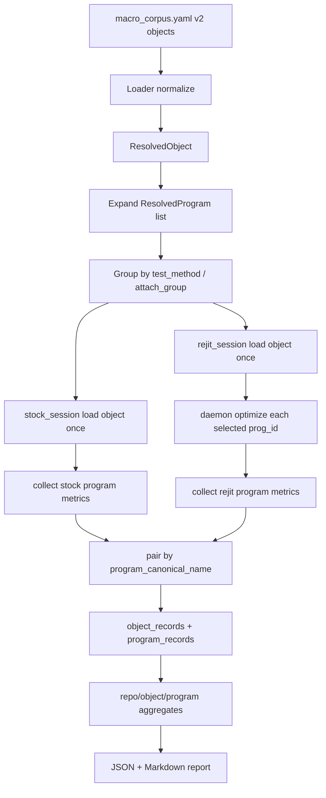

# Corpus YAML 重构与测量流水线设计

日期：2026-03-26

## 1. 摘要

当前 `macro_corpus.yaml` 是 764 条扁平 entry，但实际上只覆盖 477 个唯一 `.bpf.o` 对象，其中 106 个对象被拆成多条 entry，38 个对象同时混用了 `bpf_prog_test_run`、`attach_trigger`、`compile_only` 多种语义。现有严格 VM 路径在 `corpus/modes.py` 中把每条 manifest entry 归一化成一个“target”，然后只保留第一个 `program_name` 用于执行；`runner` 侧的 `prepare_kernel()`、`run_kernel()`、`run_kernel_attach()` 也都只支持单个 `program_name`。结果是：

1. manifest 已经在描述“对象里有多个 program”，但执行流水线仍然按“一个 target = 一个 program”思维工作。
2. `program_names`、`trigger`、`trigger_timeout_seconds`、`compile_loader` 等字段在严格路径里没有被完整保留。
3. daemon 优化天然是按 `prog_id` 执行，而对象加载天然是按 `.bpf.o` 执行，当前设计没有把这两个粒度清晰衔接起来。

本文给出的设计结论是：

1. `macro_corpus.yaml` 升级为 object-centric v2：顶层 entry 改为一个 `.bpf.o` 对象，内部 `programs:` 子列表永远是一条 program 一个节点。
2. 测量流水线改成“一次 object session，产出多个 program record”：stock 与 rejit 各自使用一个新的 object session；program 仍然是结果和聚合的基本单位。
3. daemon 保持按 `prog_id` 优化，不增加 object 级 API；object 级 runner 只是在同一个已加载对象内顺序/分组地对多个 `prog_id` 调用 optimize。
4. 结果输出分成两层：`program_records` 是主输出，`object_records` 是共享编译时间和 object-only compile 结果的辅输出。
5. `modes.py` 在过渡期同时兼容 v1 flat schema 与 v2 object schema，但内部统一归一化成同一套 `ResolvedObject` / `ResolvedProgram` 模型。

## 2. 设计目标

### 2.1 目标

1. manifest 结构必须忠实表达 “一个对象包含多个 entry program”。
2. `.bpf.o` 的 `open + load` 必须尽量按对象复用，而不是为每个 program 重新做一次。
3. 结果必须回到 program 粒度，避免 object/program 混合命名和混合聚合。
4. 必须支持同一个对象内不同 program 使用不同测量方式：
   - 一个 program 走 `bpf_prog_test_run`
   - 另一个 program 走 `attach_trigger`
   - 还有一批 program 只做 `compile_only`
5. 必须给出清晰的迁移路径，并允许 `modes.py` 兼容旧 schema。

### 2.2 非目标

1. 不改变 `benchmark_config.yaml` 的 profile/pass 选择职责。
2. 不改变 daemon 的核心语义：优化入口仍然是 live kernel 中的单个 `prog_id`。
3. 不要求 v2 第一版就解决所有共享 map 状态问题；但 schema 和 pipeline 必须把隔离策略显式化。

## 3. 现状观察

### 3.1 来自 `corpus/modes.py`

1. `manifest_program_names()` 会返回 `program_name` 或 `program_names`。
2. 但 `load_targets_from_yaml()` 最终只保留 `program_name = program_names[0] if program_names else ""`。
3. `build_target_batch_plan()` 仍然为每个 target 生成单 program job。
4. 严格 VM 路径保留的字段只有 `program_name`、`io_mode`、`input_size`、`test_input`、`can_test_run` 等少数字段，`trigger`、`trigger_timeout_seconds`、`compile_loader`、`program_names[1:]` 等信息没有进入执行模型。

结论：当前严格路径不是“多 program object 测量”，而是“多 program manifest 被压扁成第一个 program 测量”。

### 3.2 来自 C++ runner

1. `configure_autoload(object, program_name)` 在指定 `program_name` 时会关闭其它 program 的 autoload。
2. `prepare_kernel()`、`run_kernel()`、`run_kernel_attach()` 都只维护一个 `program_fd` / `prog`。
3. `run_kernel_attach()` 也是先 `find_program(object, options.program_name)`，再 attach 这一个 program。
4. `list_programs()` 虽然能枚举对象里的所有 libbpf-visible program，但测量路径并没有消费这份多 program inventory。

结论：runner 目前只支持“单次加载对象、选一个 program 测量”，不支持“加载一个对象、测量多个 program”。

### 3.3 来自 daemon

1. `daemon/src/server.rs` 的 `serve` 模式只接受：
   - `{"cmd":"optimize","prog_id":...,"passes":[...]}`
   - `{"cmd":"optimize-all",...}`
2. `daemon/src/commands.rs::try_apply_one()` 的基本单位是单个 `prog_id`。
3. map invalidation tracker 也是按 `prog_id` 记录。

结论：daemon 的自然粒度是 program，不是 object。v2 设计不应该强行把 daemon 改成 object API。

### 3.4 当前命名问题

用户提出的候选 canonical name 是 `repo:object_basename:program_name`。这在当前 corpus 中不安全：仅按 basename 会出现碰撞。当前 manifest 已能找到至少 8 个碰撞，例如：

1. `linux-selftests:xdp_synproxy_kern.bpf.o:syncookie_xdp`
2. `xdp-tutorial:xdp_prog_kern.bpf.o:xdp_pass_func`
3. `systemd:bind-iface.bpf.o:sd_bind_interface`

它们在同一 repo 下可能来自不同子目录，但 basename 相同。

结论：basename 可以作为显示名，不能作为唯一 canonical id。

## 4. v2 YAML 结构

### 4.1 顶层结构

v2 保留当前顶层的大部分外形，最小化无关 churn：

```yaml
schema_version: 2
suite_name: macro_corpus

defaults:
  iterations: 3
  warmups: 1
  repeat: 1
  output: corpus/results/dev/macro_corpus.json

build:
  runner_binary: runner/build/micro_exec
  daemon_binary: daemon/target/release/bpfrejit-daemon
  bpftool_binary: bpftool

runtimes:
  - name: kernel
    label: kernel eBPF
    mode: kernel
  - name: kernel-rejit
    label: kernel eBPF rejit v2
    mode: kernel-rejit

objects:
  - ...
```

只有一处结构性变化：

1. v1 的顶层 `programs:` 扁平列表改为 v2 的顶层 `objects:` 列表。

### 4.2 顶层字段定义

| 路径 | 类型 | 必需 | 说明 |
| --- | --- | --- | --- |
| `schema_version` | int | 是 | 固定为 `2` |
| `suite_name` | string | 是 | 套件名称 |
| `defaults` | mapping | 否 | 保留现有 benchmark fallback 字段，主要用于兼容和文档展示 |
| `build` | mapping | 否 | 保留现有 runner/daemon/bpftool 路径字段 |
| `runtimes` | sequence | 否 | 保留现有 runtime 元数据 |
| `objects` | sequence | 是 | object-centric corpus entry 列表 |

### 4.3 Object entry 字段定义

object entry 既承担“对象元数据”，也承担“program 默认值容器”。

| 字段 | 类型 | 必需 | 作用域 | 说明 |
| --- | --- | --- | --- | --- |
| `source` | string | 是 | object | `.bpf.o` 路径 |
| `repo` | string | 否 | object | 覆盖从 `source` 推导出的 repo 名 |
| `object_key` | string | 否 | object | 覆盖默认 object key；必须在 repo 内唯一 |
| `description` | string | 否 | object/program 默认 | 对象或默认 program 描述 |
| `category` | string | 否 | object/program 默认 | 分类 |
| `family` | string | 否 | object/program 默认 | 家族/项目名 |
| `level` | string | 否 | object/program 默认 | `production` / `support` / ... |
| `hypothesis` | string | 否 | object/program 默认 | 实验假设 |
| `tags` | sequence[string] | 否 | object/program 默认 | 标签 |
| `compile_loader` | string | 否 | object | `micro_exec` 或 `bpftool_loadall` |
| `shared_state_policy` | string | 否 | object | `reset_maps` / `shared_session` / `reload_per_program` |
| `auto_discover_programs` | bool | 否 | object | 允许迁移工具或预检阶段用 `list-programs` 补全 inventory |
| `allow_object_only_result` | bool | 否 | object | 允许 `programs: []`，只产出 object record |
| `test_method` | string | 否 | object/program 默认 | `bpf_prog_test_run` / `attach_trigger` / `compile_only` / `skip` |
| `prog_type` | string | 否 | object/program 默认 | BPF prog type 名称 |
| `section` | string | 否 | object/program 默认 | section 名称 |
| `io_mode` | string | 否 | object/program 默认 | `map` / `staged` / `packet` / `context` |
| `test_input` | string | 否 | object/program 默认 | test_run 输入文件 |
| `input_size` | int | 否 | object/program 默认 | test_run 输入大小 |
| `trigger` | string | 否 | object/program 默认 | attach 路径触发命令 |
| `trigger_timeout_seconds` | int | 否 | object/program 默认 | attach 触发超时 |
| `attach_group` | string | 否 | object/program 默认 | 同一 attach trigger pipeline 的分组键 |
| `workload_type` | string | 否 | object/program 默认 | attach workload 类型 |
| `workload_iterations` | int | 否 | object/program 默认 | attach workload 参数 |
| `rejit_enabled` | bool | 否 | object/program 默认 | 是否参与 REJIT 相位 |
| `programs` | sequence | 条件必需 | object | program 列表；除非 `allow_object_only_result: true` |

### 4.4 Program entry 字段定义

v2 中 `programs:` 子项永远是一条 program 一个节点，不再允许在 program 节点里出现 `program_names`。

| 字段 | 类型 | 必需 | 说明 |
| --- | --- | --- | --- |
| `name` | string | 是 | libbpf program name |
| `description` | string | 否 | 覆盖 object 默认描述 |
| `category` | string | 否 | 覆盖 object 默认分类 |
| `family` | string | 否 | 覆盖 object 默认 family |
| `level` | string | 否 | 覆盖 object 默认 level |
| `hypothesis` | string | 否 | 覆盖 object 默认 hypothesis |
| `tags` | sequence[string] | 否 | 追加或覆盖 object 默认 tags，建议 loader 采用 union 去重 |
| `test_method` | string | 否 | 覆盖 object 默认值 |
| `prog_type` | string | 否 | 覆盖 object 默认值 |
| `section` | string | 否 | 覆盖 object 默认值 |
| `io_mode` | string | 否 | 覆盖 object 默认值 |
| `test_input` | string | 否 | 覆盖 object 默认值 |
| `input_size` | int | 否 | 覆盖 object 默认值 |
| `trigger` | string | 否 | 覆盖 object 默认值 |
| `trigger_timeout_seconds` | int | 否 | 覆盖 object 默认值 |
| `attach_group` | string | 否 | 覆盖 object 默认值 |
| `workload_type` | string | 否 | 覆盖 object 默认值 |
| `workload_iterations` | int | 否 | 覆盖 object 默认值 |
| `rejit_enabled` | bool | 否 | 覆盖 object 默认值 |

### 4.5 继承与覆盖规则

解析后的 program 配置按以下优先级求值：

1. 顶层 benchmark/profile 默认值来自 `benchmark_config.yaml` 和 CLI。
2. object entry 上的继承字段为该对象下所有 program 提供默认值。
3. program entry 上同名字段覆盖 object 默认值。
4. 最终解析后的 `ResolvedProgram` 是冻结对象，不再带“隐式继承”。

规则补充：

1. `compile_loader` 是 object-only 字段，不能在 program 级覆盖。
2. `shared_state_policy` 是 object-only 字段，不能在 program 级覆盖。
3. `test_method: bpf_prog_test_run` 必须能解析出 `io_mode`，且通常需要 `test_input` / `input_size`。
4. `test_method: attach_trigger` 必须能解析出 `trigger`；如果多个 program 想共享一次 attach+trigger，则它们必须有相同的 `attach_group`。
5. `test_method: compile_only` 不产生 exec 指标，但仍可产生 code size 与 REJIT 代码大小指标。
6. `test_method: skip` 只做 inventory，不参与任何 stock/rejit 测量。
7. `compile_loader: bpftool_loadall` 是 object 级选择；同一个对象如果包含 `bpf_prog_test_run` program，则该对象应拆分或统一改用 `micro_exec`，不允许在共享 object session 内混用 loader 语义。
8. 若 `test_method: attach_trigger` 且未显式给出 `attach_group`，默认 `attach_group = name`，即每个 program 独占一个 attach+trigger 组。

### 4.6 Canonical Name 规范

#### 4.6.1 结论

不采用 `repo:object_basename:program_name` 作为唯一 canonical name。

#### 4.6.2 建议格式

1. `object_relpath`：`source` 相对 `corpus/build/<repo>/` 的路径。
2. `object_canonical_name`：`repo:object_relpath`
3. `program_canonical_name`：`repo:object_relpath:program_name`
4. `short_name`：`repo:basename(source):program_name`

示例：

```text
source = corpus/build/linux-selftests/tools/testing/selftests/bpf/progs/xdp_synproxy_kern.bpf.o
repo = linux-selftests
object_relpath = tools/testing/selftests/bpf/progs/xdp_synproxy_kern.bpf.o
object_canonical_name = linux-selftests:tools/testing/selftests/bpf/progs/xdp_synproxy_kern.bpf.o
program_canonical_name = linux-selftests:tools/testing/selftests/bpf/progs/xdp_synproxy_kern.bpf.o:syncookie_xdp
short_name = linux-selftests:xdp_synproxy_kern.bpf.o:syncookie_xdp
```

#### 4.6.3 为什么不能只用 basename

当前 corpus 已经存在 basename 冲突。若仍坚持 basename 作为唯一 id，则必须再引入一个显式 `object_key` 来人工去重。既然如此，更合理的做法是直接把 repo 内相对路径作为 canonical key，把 basename 退化成显示名。

### 4.7 YAML 示例

#### 示例 A：纯 test_run 多 program 对象

```yaml
schema_version: 2
suite_name: macro_corpus

objects:
  - source: corpus/build/xdp-tools/xdp_basic.bpf.o
    family: xdp-tools
    category: networking
    level: support
    tags: [xdp, packet, support]
    test_method: bpf_prog_test_run
    io_mode: packet
    test_input: corpus/inputs/macro_dummy_packet_64.bin
    input_size: 64
    compile_loader: micro_exec
    shared_state_policy: reset_maps
    programs:
      - name: xdp_basic_prog
        section: xdp
        prog_type: xdp
        description: XDP basic parser baseline.
      - name: xdp_parse_prog
        section: xdp
        prog_type: xdp
        description: XDP parse-only variant.
      - name: xdp_read_data_prog
        section: xdp
        prog_type: xdp
        description: XDP data access variant.
```

#### 示例 B：同一对象中混合 test_run / attach_trigger / compile_only

```yaml
schema_version: 2
suite_name: macro_corpus

objects:
  - source: corpus/build/tracee/tracee.bpf.o
    family: tracee
    category: security
    level: production
    tags: [security, observability, production]
    compile_loader: micro_exec
    shared_state_policy: reset_maps
    programs:
      - name: cgroup_skb_egress
        description: Tracee cgroup skb egress filter.
        test_method: bpf_prog_test_run
        prog_type: cgroup_skb
        io_mode: packet
        test_input: corpus/inputs/macro_dummy_packet_64.bin
        input_size: 64

      - name: tracepoint__raw_syscalls__sys_enter
        description: Tracee syscall enter tracepoint.
        test_method: attach_trigger
        prog_type: tracepoint
        attach_group: syscall-enter-pipeline
        trigger: "for i in $(seq 200); do /bin/true; done"
        trigger_timeout_seconds: 30

      - name: sys_enter_init
        test_method: attach_trigger
        prog_type: tracepoint
        attach_group: syscall-enter-pipeline

      - name: trace_sys_enter
        description: Very large helper-heavy program, only track compile/code size.
        test_method: compile_only
        prog_type: tracing
```

#### 示例 C：纯 compile_only 对象

推荐形式仍然显式列出 program inventory：

```yaml
schema_version: 2
suite_name: macro_corpus

objects:
  - source: corpus/build/linux-selftests/tools/testing/selftests/bpf/progs/bpf_gotox.bpf.o
    family: linux-selftests
    category: selftests
    level: support
    tags: [selftests, syscall, compile-only]
    test_method: compile_only
    prog_type: syscall
    compile_loader: micro_exec
    programs:
      - name: one_switch
        section: syscall
      - name: one_switch_non_zero_sec_off
        section: syscall
      - name: simple_test_other_sec
        section: syscall
      - name: two_switches
        section: syscall
```

如果某些对象暂时无法维护 program inventory，也允许 object-only fallback：

```yaml
objects:
  - source: corpus/build/some-project/huge_compile_only.bpf.o
    family: some-project
    test_method: compile_only
    compile_loader: micro_exec
    allow_object_only_result: true
    auto_discover_programs: true
    programs: []
```

但这类对象只会产出 `object_record`，不会进入 program 级聚合。

## 5. 加载与执行流水线

### 5.1 归一化阶段

v2 loader 不再直接产出“target 列表”，而是先产出两个内部模型：

1. `ResolvedObject`
2. `ResolvedProgram`

`ResolvedObject` 至少包含：

1. `source`
2. `repo`
3. `object_key`
4. `object_canonical_name`
5. `compile_loader`
6. `shared_state_policy`
7. `programs: list[ResolvedProgram]`

`ResolvedProgram` 至少包含：

1. `program_name`
2. `program_canonical_name`
3. `test_method`
4. `prog_type`
5. `section`
6. `io_mode`
7. `test_input`
8. `input_size`
9. `trigger`
10. `trigger_timeout_seconds`
11. `attach_group`
12. `rejit_enabled`

### 5.2 运行模型

核心改动：从“每个 target 生成 4 个 job”改成“每个 object 生成 1 个 object job”。

建议在 batch runner 里新增 object-centric job 类型，例如：

```yaml
jobs:
  - id: object-0001
    type: measure_object
    runtime: kernel-v2
    object: corpus/build/tracee/tracee.bpf.o
    compile_loader: micro_exec
    shared_state_policy: reset_maps
    programs:
      - name: cgroup_skb_egress
        test_method: bpf_prog_test_run
        io_mode: packet
        input_size: 64
        memory: corpus/inputs/macro_dummy_packet_64.bin
      - name: tracepoint__raw_syscalls__sys_enter
        test_method: attach_trigger
        attach_group: syscall-enter-pipeline
        trigger: "for i in $(seq 200); do /bin/true; done"
        trigger_timeout_seconds: 30
      - name: sys_enter_init
        test_method: attach_trigger
        attach_group: syscall-enter-pipeline
      - name: trace_sys_enter
        test_method: compile_only
    daemon_socket: /tmp/bpfrejit.sock
    passes: [map_inline, const_prop, dce]
```

### 5.3 Stock / REJIT 的 object session

对每个 `ResolvedObject`，runner 建立两个独立 session：

1. `stock_session`
2. `rejit_session`

原因：

1. stock 与 rejit 的 live `prog_id` 不同，不能靠同一个 live program 回退。
2. daemon REJIT 会原地改写 live program，最稳妥的配对方式是 stock/rejit 分离加载。
3. compile 时间天然是 object 级，而不是 program 级。

### 5.4 Object session 的详细流程

#### 5.4.1 stock_session

1. `bpf_object__open_file()`
2. 加载对象内所有被选中的 top-level program
3. 建立 `program_name -> {program_fd, prog_id, prog_info}` 映射
4. 记录 object 级 compile 指标：
   - `object_open_ns`
   - `object_load_ns`
   - `compile_total_ns`
5. 初始化 object fixture / map fixture
6. 采集每个 selected program 的 stock 代码大小信息
7. 按 program 或 attach_group 执行 stock 测量

#### 5.4.2 rejit_session

1. 再次 fresh load 同一个对象
2. 重新建立 `program_name -> {program_fd, prog_id, prog_info}` 映射
3. 对所有 `rejit_enabled=true` 的 selected program，逐个调用 daemon `optimize(prog_id, passes)`
4. 记录：
   - object 级 compile/load 时间
   - object 级 optimize 总时间
   - program 级 optimize 结果：`applied`、`passes_applied`、`insn_delta`、`error`
5. 采集每个 selected program 的 REJIT 代码大小信息
6. 按 program 或 attach_group 执行 REJIT 测量

### 5.5 为什么 daemon 仍然是 per-program

v2 不建议引入 object 级 daemon API。原因：

1. live kernel 中真正可优化的实体是 `prog_id`。
2. 一个 `.bpf.o` load 后会得到多个 `prog_id`，并不存在 kernel-visible 的“object optimize”原语。
3. map invalidation tracking、PGO、rollback、verifier retry 都天然是单 program 语义。

因此 object 级流程只是：

1. 先一次性加载 object
2. 再在该对象的 selected program 集合上循环发出多次 `optimize(prog_id)` 请求

### 5.6 数据流图



## 6. 不同测量方式的设计

### 6.1 `bpf_prog_test_run`

对于 `test_method: bpf_prog_test_run` 的 program：

1. 对象只 load 一次。
2. 每个 program 使用自己对应的 `program_fd` 进行 `BPF_PROG_TEST_RUN`。
3. 若 `shared_state_policy = reset_maps`，则每个 program 测量前都恢复到对象初始 map snapshot。
4. 若 `shared_state_policy = shared_session`，则多个 program 顺序复用同一对象状态。

### 6.2 `attach_trigger`

对于 `test_method: attach_trigger` 的 program：

1. attach 的基本单位不是 object，而是 `attach_group`。
2. 同一 `attach_group` 内的所有 program：
   - 一起 attach
   - 一起执行一次 trigger
   - 用 `bpf_stats` 逐个读取每个 program 的 `run_cnt` / `run_time_ns` 增量
3. 不同 `attach_group` 之间，如果对象声明 `reset_maps`，则在 group 之间恢复状态。

这样可以正确表达类似：

1. tracepoint pipeline
2. 多个 tracepoint 共享同一次工作负载
3. object 内部分 program 需要同时 attach 才有意义

### 6.3 `compile_only`

对于 `test_method: compile_only` 的 program：

1. 不做 exec 测量
2. 记录 stock 与 rejit 的代码大小
3. 如对象允许 program inventory，则为每个 program 产出 `program_record`
4. 如对象是 `allow_object_only_result: true` 且 `programs: []`，则只产出一个 `object_record`

### 6.4 Stock / REJIT 配对

配对键必须是 `program_canonical_name`，而不是 live `prog_id`。

原因：

1. stock/rejit 是两个不同 session
2. 同名 program 在不同 session 中会得到不同 `prog_id`
3. 真正稳定的是 `(repo, object_key, program_name)`

配对结果：

1. `stock.code_size` 对 `rejit.code_size`
2. `stock.exec_ns` 对 `rejit.exec_ns`
3. `stock.run_cnt` 对 `rejit.run_cnt`
4. `stock.program_id` 与 `rejit.program_id` 只作为调试元数据，不作为主键

## 7. 共享状态与隔离策略

### 7.1 为什么必须显式建模

如果一个对象里多个 program 共用 map、全局数据或 side effect，那么“load 一次后依次测每个 program”会引入顺序污染。

这在 v2 中必须变成显式策略，而不是隐含假设。

### 7.2 三种策略

#### `shared_state_policy: reset_maps`

推荐默认值。

语义：

1. object load 完成后执行一次 fixture 初始化
2. 在此时抓取可恢复 map 的基线快照
3. 每次单 program `test_run` 或每次 `attach_group` 测量前恢复快照

适用：

1. 大多数 packet test_run 程序
2. 有输入/结果 map 的对象
3. attach 程序共享 map 但可通过 restore 回到基线的对象

#### `shared_state_policy: shared_session`

语义：

1. 同一个 session 内不做恢复
2. 多个 program 或 group 顺序测量

适用：

1. 明确知道状态无关或只读
2. pipeline 必须共享同一 live state

#### `shared_state_policy: reload_per_program`

逃生阀。

语义：

1. 对该对象放弃“load 一次”
2. 每个 program 或每个 attach_group 用新的 object session

适用：

1. 状态无法可靠 snapshot/restore
2. 某些对象存在复杂 pinned map、ringbuf、timer、struct_ops side effect

这是例外路径，不应成为默认路径。

## 8. C++ runner / batch runner 需要的结构变化

### 8.1 当前行为

当前单 program 模型的关键限制：

1. `prepare_kernel_state` 只保存一个 `program_fd`
2. `run_kernel()` / `run_kernel_attach()` 只返回单 program sample 列表
3. `batch_runner` 的 prepared object 复用只在“同一个 target 的 compile/run 两阶段”内有效

### 8.2 建议的新内部结构

建议新增：

```cpp
struct prepared_program_state {
    std::string name;
    std::string section_name;
    uint32_t prog_id;
    int program_fd;
    bpf_prog_info info;
};

struct prepared_object_state {
    std::filesystem::path object_path;
    bpf_object_ptr object;
    std::vector<prepared_program_state> programs;
    std::unordered_map<std::string, size_t> program_index_by_name;
    object_compile_metrics compile_metrics;
    map_snapshot baseline_snapshot;
};
```

以及新的 batch payload：

1. `object_measure_result`
2. `program_measure_result`

### 8.3 batch runner 新 job 类型

建议新增 `type: measure_object`，由 batch runner 一次执行完整 object 生命周期并返回 nested JSON。理由：

1. 现有 `static_verify_object` 已经证明 batch runner 可以返回 object 级 nested payload。
2. 如果继续沿用“每个 program 一个 job”，就无法在 C++ 层真正共享 object load。
3. object-centric job 更适合表达 attach_group、共享状态恢复、统一 error handling。

### 8.4 daemon 侧需要的改动

daemon 核心语义不需要改。

建议只做两类很小的接口增强：

1. 在 socket optimize 响应中显式保留 `timings_ns`
2. 把当前已经有的 `passes_applied`、`insn_delta`、`verifier_retries`、`final_disabled_passes` 原样向上透传到 object job payload

## 9. 结果格式设计

### 9.1 设计原则

1. 主结果是 per-program。
2. 编译时间是 per-object。
3. 报告和聚合必须把 program 级指标与 object 级指标分开。

### 9.2 JSON 顶层格式

```json
{
  "schema_version": 2,
  "generated_at": "2026-03-26T...",
  "macro_corpus_yaml": "corpus/config/macro_corpus.yaml",
  "benchmark_config": "corpus/config/benchmark_config.yaml",
  "requested_passes": ["map_inline", "const_prop", "dce"],
  "summary": { "...": "..." },
  "object_records": [ ... ],
  "program_records": [ ... ]
}
```

### 9.3 `object_record` 格式

```json
{
  "canonical_object_name": "tracee:tracee.bpf.o",
  "repo": "tracee",
  "object_key": "tracee.bpf.o",
  "object_basename": "tracee.bpf.o",
  "source": "corpus/build/tracee/tracee.bpf.o",
  "compile_loader": "micro_exec",
  "shared_state_policy": "reset_maps",
  "program_count": 4,
  "measured_program_count": 3,
  "stock_compile": {
    "ok": true,
    "object_open_ns": 123,
    "object_load_ns": 456,
    "total_ns": 579
  },
  "rejit_compile": {
    "ok": true,
    "object_open_ns": 120,
    "object_load_ns": 455,
    "optimize_total_ns": 900,
    "total_ns": 1475
  },
  "optimize_programs": [
    {
      "program_name": "tracepoint__raw_syscalls__sys_enter",
      "rejit_program_id": 1234,
      "applied": true,
      "passes_applied": ["map_inline", "dce"],
      "insn_delta": -4,
      "verifier_retries": 0,
      "error": null
    }
  ],
  "status": "ok",
  "error": null
}
```

### 9.4 `program_record` 格式

```json
{
  "canonical_name": "tracee:tracee.bpf.o:cgroup_skb_egress",
  "short_name": "tracee:tracee.bpf.o:cgroup_skb_egress",
  "canonical_object_name": "tracee:tracee.bpf.o",
  "repo": "tracee",
  "object_key": "tracee.bpf.o",
  "object_basename": "tracee.bpf.o",
  "program_name": "cgroup_skb_egress",
  "section": "cgroup_skb/egress",
  "prog_type": "cgroup_skb",
  "test_method": "bpf_prog_test_run",
  "attach_group": null,
  "compile_scope": "object",
  "compile_ref": "tracee:tracee.bpf.o",
  "stock": {
    "ok": true,
    "program_id": 2001,
    "jited_prog_len": 1024,
    "xlated_prog_len": 2048,
    "exec_ns": 12345,
    "run_cnt": 200,
    "retval": 0
  },
  "rejit": {
    "ok": true,
    "program_id": 2101,
    "applied": true,
    "passes_applied": ["map_inline", "dce"],
    "jited_prog_len": 960,
    "xlated_prog_len": 1984,
    "exec_ns": 11900,
    "run_cnt": 200,
    "retval": 0
  },
  "ratios": {
    "code_size_ratio": 1.0667,
    "exec_ratio": 1.0378
  },
  "status": "ok",
  "error": null
}
```

### 9.5 聚合指标

#### object 级聚合

编译时间必须按 object 聚合：

1. `compile_total_ratio_geomean`
2. `compile_total_ratio_median`
3. `compile_total_ratio_min`
4. `compile_total_ratio_max`

分组：

1. overall by object
2. by repo

#### program 级聚合

程序效果必须按 program 聚合：

1. `code_size_ratio_geomean`
2. `exec_ratio_geomean`
3. `exec_ratio_median`
4. `applied_programs`

分组：

1. by object
2. by repo
3. overall

#### compile-only program 的处理

1. 进入 `code_size_ratio_*` 聚合
2. 不进入 `exec_ratio_*` 聚合
3. 不把 object compile time 平均摊到 program 上

#### object-only compile 记录的处理

1. 进入 object 级 compile 聚合
2. 不进入任何 per-program 聚合

### 9.6 Markdown 报告格式

建议 report 结构如下：

1. Summary
2. Compile By Repo
3. Compile By Object
4. Program Effects By Repo
5. Program Effects By Object
6. Per-Program Results
7. Object-Only Compile Results
8. Failures / Partials

建议的表：

#### Summary

1. Objects attempted
2. Programs inventoried
3. Programs measured
4. Compile-only programs
5. Object-only compile records
6. REJIT applied programs
7. Object compile geomean
8. Program code-size geomean
9. Program exec geomean

#### Compile By Object

| Object | Repo | Programs | Stock Compile ns | REJIT Compile ns | Compile Ratio | Status |

#### Program Effects By Object

| Object | Repo | Programs | Measured Programs | Code Ratio Geomean | Exec Ratio Geomean | Applied Programs |

#### Per-Program Results

| Program | Object | Type | Method | Applied Passes | Stock JIT | REJIT JIT | Code Ratio | Stock ns | REJIT ns | Exec Ratio | Note |

## 10. 迁移计划

### 10.1 v1 -> v2 自动转换

建议提供离线转换器，而不是在运行时做隐式魔法迁移。

转换算法：

1. 按 `source` 对 v1 flat entries 分组。
2. 每个 group 生成一个 v2 object entry。
3. 对于 `program_name`：
   - 生成一个 `programs` 子项
4. 对于 `program_names`：
   - 按位置展开成多个 `programs` 子项
   - 若存在 `sections` 且长度一致，则按位置 zip 成每个 program 的 `section`
5. 所有在 group 内完全相同的字段上提到 object 级：
   - `family`
   - `category`
   - `level`
   - `tags`
   - `compile_loader`
   - `trigger` / `trigger_timeout_seconds`
   - `io_mode` / `test_input` / `input_size`
6. group 内不一致的字段保留在 program 级。
7. 若同一个 object 下出现同名 program 但配置冲突，则输出冲突报告，要求人工确认。

### 10.2 对 compile_only 多 program entry 的迁移

当前很多 `compile_only` entry 已经用 `program_names` 表示一个对象里的多 program。v2 迁移时不应保留这种 grouped node，而应直接展开为：

```yaml
programs:
  - name: prog_a
    test_method: compile_only
  - name: prog_b
    test_method: compile_only
```

这样结果才能真正回到 per-program。

### 10.3 `modes.py` 的向后兼容

建议兼容策略：

1. 若根节点有 `schema_version >= 2` 或存在 `objects`，走 v2 parser。
2. 否则若存在 v1 `programs` flat list，先在内存中转换成 `ResolvedObject` / `ResolvedProgram`，再走统一流水线。
3. 对 v1 manifest 输出 deprecation warning，但不立刻拒绝。

这样可以做到：

1. 新流水线先落地
2. manifest 可以分批迁移
3. 结果格式先统一

### 10.4 `list-programs` 自动补全

可以，但只建议作为迁移工具或 lint/preflight 工具，不建议作为运行时的唯一真相来源。

原因：

1. `runner` 已经有 `list_programs()` / `list-programs` 能力。
2. 但并不是所有对象都能稳定被 `list-programs` 枚举成功，尤其是部分 upstream selftest/negative object。
3. 因此运行时不应该依赖自动发现来决定 program identity。

建议策略：

1. `auto_discover_programs: true` 只在以下场景启用：
   - 迁移脚本生成初稿
   - CI lint 检查 manifest 与真实 object inventory 是否漂移
2. 一旦发现成功，应把 program inventory materialize 回 YAML，而不是每次运行临时发现。
3. 对发现失败的对象：
   - 如果 YAML 已显式声明 `programs`，以 YAML 为准，继续运行
   - 如果 `programs: []` 且 `allow_object_only_result: true`，降级为 object-only compile 记录
   - 否则报错

## 11. 与其他组件的交互

### 11.1 `benchmark_config.yaml`

结论：pass 选择保持 per-request 已经足够，不需要引入 per-program pass list。

原因：

1. daemon socket 请求已经是 `passes` 数组，天然适合“本次 benchmark 请求统一 pass 集”。
2. 不同 program 使用不同 pass list 会破坏 corpus aggregate 的可比性。
3. 真正需要的例外不是“程序 A 用 pass 集 X，程序 B 用 pass 集 Y”，而是“程序 A 不参与 REJIT”。

因此建议：

1. `benchmark_config.yaml` 继续控制本次 run 的统一 pass profile。
2. v2 corpus YAML 只保留 `rejit_enabled: false` 这种 opt-out 开关，不做 per-program pass profile。

### 11.2 Map fixtures

结论：采用“两层模型”。

1. object-level fixture：
   - 初始化共享 map
   - 建立 baseline snapshot
2. program-level fixture overlay：
   - 在某个 program 或 attach_group 测量前追加写入特定 map 值
   - 例如单个 program 的输入 map、特定 key/value、特定 cgroup/task 环境

原因：

1. map 是 object 内共享资源，初始化应当 object 级。
2. 但具体某个 program 的输入通常是 program 级。

### 11.3 E2E map capture

结论：capture 结果按 program 归档，但底层 map inventory 按 object 去重。

建议数据模型：

1. `object_record.maps`
   - 列出该 object session 中观测到的 map inventory
2. `program_record.map_capture`
   - 只记录这个 program 实际读写/捕获到的 map 子集
   - 用 map id 或 map name 引用 `object_record.maps`

这样可以避免：

1. 同一 object 下每个 program 重复拷贝整份 map inventory
2. shared map 的重复序列化

## 12. 推荐落地顺序

1. 先在 `modes.py` 中引入统一的 `ResolvedObject` / `ResolvedProgram` 归一化层，并兼容 v1/v2。
2. 在 `batch_runner` 中新增 `measure_object` job 与 nested payload。
3. 在 `kernel_runner` 中新增 multi-program object session。
4. 让严格 VM 路径改为 “一个 object 一个 batch job”。
5. 结果 JSON 改为 `object_records + program_records` 双层输出。
6. 最后再把 `macro_corpus.yaml` 从 v1 flat schema 批量迁移到 v2。

## 13. 最终结论

这次重构的核心不是“把 YAML 从 flat 改成嵌套”这么简单，而是把整个测量模型从“target-centric”改成“object-load + program-result”。

最关键的设计决策有四个：

1. manifest 以 object 为 entry，`programs:` 永远一 program 一节点。
2. daemon 仍按 `prog_id` 优化；object 只是 runner 的装载与编排单位。
3. primary result 改为 per-program；compile time 作为 per-object 指标单独保留。
4. canonical name 不能只用 basename，必须使用 repo 内 object 相对路径。

如果按这个方案实现，最终会得到三个直接收益：

1. manifest 语义和实际执行语义一致。
2. `.bpf.o` load 成本可以真正按对象复用。
3. 最终结果、聚合和报告都能稳定回到 program 粒度，不再出现 object/program 混用的命名和统计歧义。
